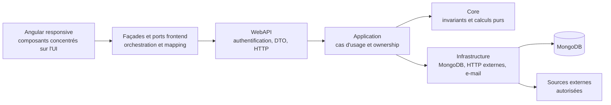
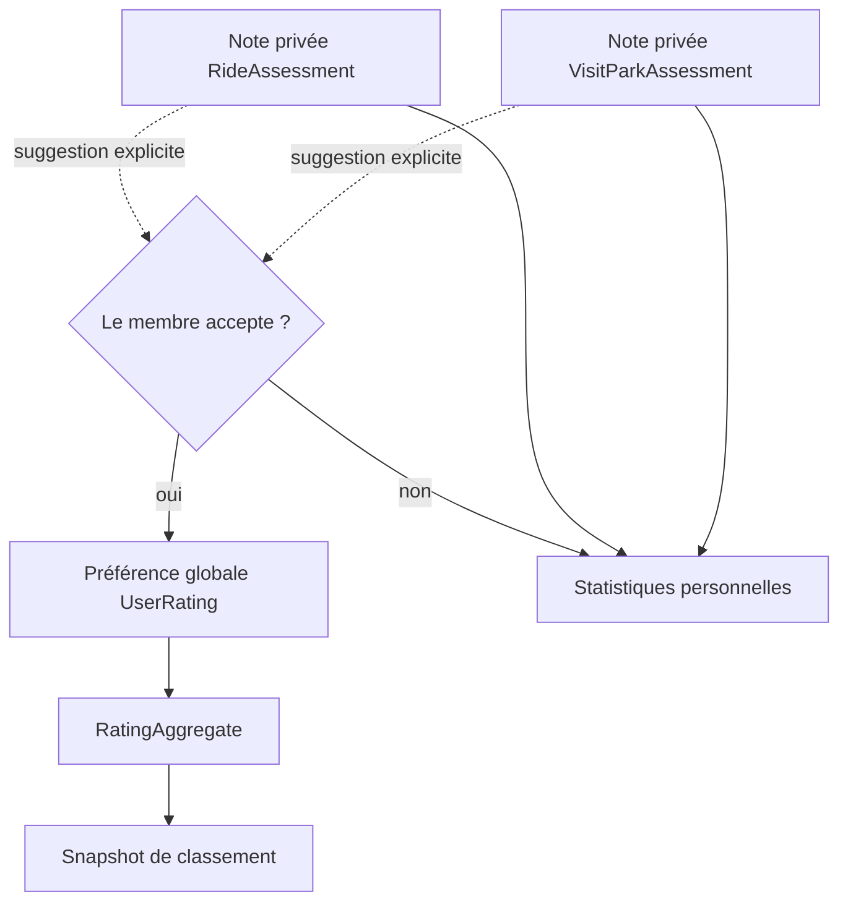
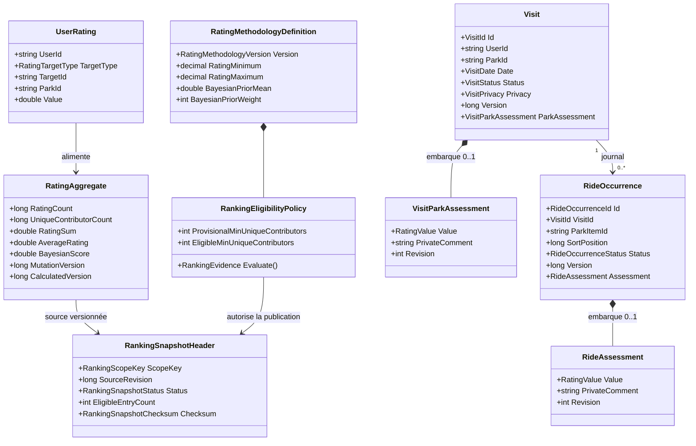
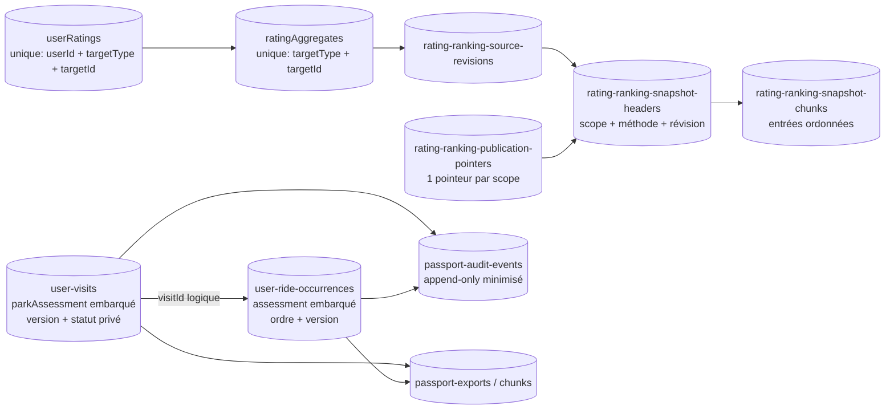
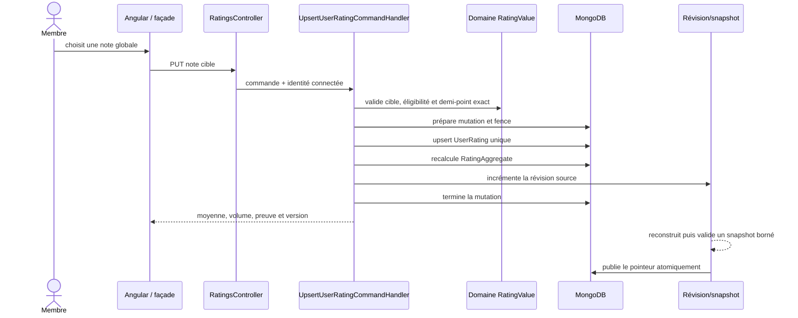
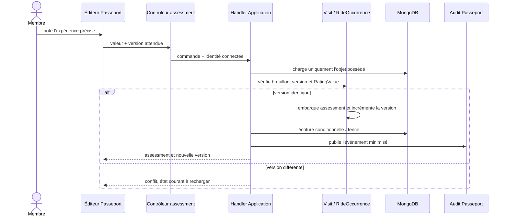
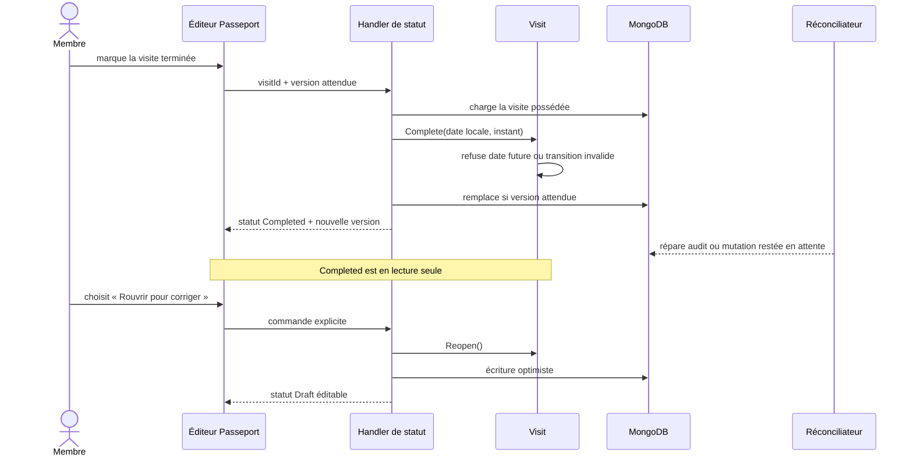
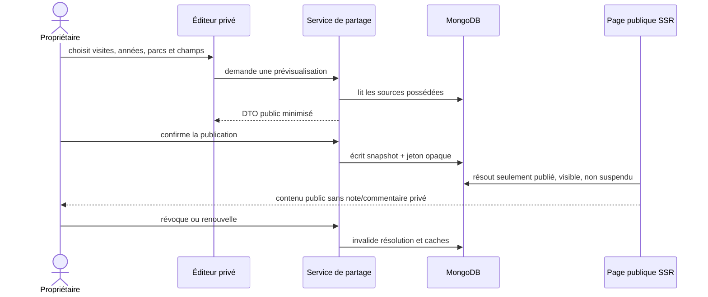

# Guide métier et architecture du programme Product Growth

> État au 30 septembre 2026 — référence finale de la livraison technique.
>
> Ce document explique ce qui existe, pourquoi les modèles sont séparés, comment
> les données circulent et quelles preuves permettent de le vérifier. Les
> résultats de recherche terrain restent des observations à acquérir : ils ne
> sont ni inventés ni requis pour constater la livraison du système.

## 1. Résumé métier

Le programme transforme le site en produit personnel sans sacrifier la confiance :

- les classements n'affichent un rang que si la preuve est suffisante ;
- le Passeport conserve les visites et chaque tour d'attraction dans le temps ;
- une visite ou cent tours ne donnent jamais cent voix dans le classement public ;
- le membre choisit précisément ce qu'il publie et peut révoquer son partage ;
- Park Fit explique pourquoi un parc convient ou non à un groupe ;
- les favoris, projets, suivis et alertes restent des intentions distinctes ;
- le planificateur de voyage organise un séjour seul ou à plusieurs ;
- l'histoire du parc conserve les incertitudes au lieu d'inventer des continuités ;
- le live expose la source, l'âge et l'incertitude, avec arrêt immédiat possible ;
- la qualité transverse couvre confidentialité, accessibilité, langues,
  performance, sécurité, exploitation et recherche produit.

La distinction la plus importante est celle des trois formes de notation :

| Question posée au membre | Objet métier | Visibilité par défaut | Effet communautaire |
|---|---|---|---|
| « Quelle est ton opinion globale aujourd'hui ? » | `UserRating` | Personnelle, agrégée publiquement | Une voix au maximum par personne et cible |
| « Comment était ce parc lors de cette visite ? » | `VisitParkAssessment` | Privée | Aucun |
| « Comment était ce tour précis ? » | `RideAssessment` | Privée | Aucun |

Les deux dernières notes alimentent uniquement le carnet et les statistiques
personnelles. Une suggestion peut proposer de rapprocher la préférence globale de
l'expérience récente, mais seul un choix explicite du membre modifie `UserRating`.

## 2. Carte des capacités livrées

| Programme | Valeur métier livrée | Surfaces principales | État technique |
|---|---|---|---|
| FOUNDATION | Identifiants compatibles, notes exactes, dates partielles, écritures idempotentes, jobs bornés, snapshots atomiques | Core, Application, MongoDB, workers | Livré |
| RANK | Moyennes, score fiabilisé, niveaux de preuve, rangs éligibles, méthode publique versionnée, pilotage admin | Classements, méthode, diagnostic admin | Livré |
| PASS | Visites, tours, notes temporelles, frise, statistiques, graphiques, export, suppression et brouillons locaux sans compte | Profil, Passeport, fiches parc/attraction | Livré |
| SHARE | Visite, année, profil et comparaison partageables par snapshot contrôlé, modération et révocation | Éditeurs privés et pages publiques SSR | Livré |
| FIT | Recherche explicable selon les contraintes d'une personne ou d'un groupe, comparaison de 2 à 4 parcs | Parc idéal, résultats et comparaison | Livré |
| WATCH | Favoris, parcs à visiter, surveillances, centre de notifications, résumés et e-mails opt-in | Collections et notifications | Livré |
| TRIP | Voyage individuel/collaboratif, invitations, rôles, jours, préférences, arbitrages, export et transition vers le Passeport | Espace voyages | Livré |
| HIST | Frises, parc à une date, comparaisons, lignées, contexte des anciennes visites, SEO et atelier éditorial | Fiches historiques et administration | Livré |
| LIVE | Provenance, mapping humain, collecte bornée, dernier état, quarantaine, historique autorisé, tendances et prévision conditionnelle | Fiches, alertes et administration | Livré, activation soumise aux gates opérationnelles |
| QUAL | Feature flags, mesure typée, privacy, sécurité cross-user, accessibilité/i18n, budgets, runbooks et protocoles de recherche | CI, exploitation et administration | Livré |

« Livré » signifie que le code, les contrats, les tests et les mécanismes
d'exploitation existent. Cela ne transforme pas une absence d'usage réel en preuve
produit. Les protocoles QUAL conservent donc séparément l'état `protocol-ready` et
les futures observations de terrain.

## 3. Architecture générale



Les règles de score, d'éligibilité, de dates, de confidentialité, d'ordre et de
cohérence restent dans Core. Application orchestre l'identité connectée, les
versions attendues, les leases et les audits. Infrastructure persiste et appelle
les fournisseurs derrière des ports. WebAPI ne contient pas la règle métier et
Angular ne recalcule pas une vérité différente dans ses templates.

## 4. Le système de notation, pas à pas

### 4.1 Valeur exacte

Une note publique ou temporelle est acceptée de `0,5` à `5`, par pas de `0,5`.
`RatingValue` représente la valeur en demi-points entiers de 1 à 10. Ainsi `4,5`
devient `9` demi-points et ne subit pas de dérive d'arrondi dans les nouveaux
agrégats. Le document historique `userRatings` conserve son champ `value` en
`double` pour compatibilité, mais chaque mutation traverse la validation exacte de
`RatingValue`. Les assessments embarqués sont persistés en `valueHalfSteps`.

Preuves :

- `API/AmusementPark.Core/Domain/Ratings/RatingValue.cs` ;
- `API/AmusementPark.Core.Tests/Domain/Ratings/RatingValueTests.cs` ;
- `API/AmusementPark.Infrastructure/Persistence/Mongo/Documents/Visits/UserVisitParkAssessmentDocument.cs` ;
- `API/AmusementPark.Infrastructure/Persistence/Mongo/Documents/Visits/UserRideAssessmentDocument.cs`.

### 4.2 Moyenne brute et score bayésien

La moyenne brute reste lisible :

```text
moyenne = somme des notes / nombre de notes
```

Le classement emploie un score bayésien qui ramène les petits volumes vers une
référence neutre de `3,5`, pondérée comme dix notes :

```text
score bayésien = (somme des notes + 3,5 × 10) / (nombre de notes + 10)
```

Exemple : une cible notée une seule fois `5/5` affiche bien cette moyenne brute,
mais son score de classement vaut `(5 + 35) / 11 = 3,636…`. Elle ne peut donc pas
dépasser artificiellement une cible solidement documentée, et elle ne reçoit de
toute façon aucun rang principal avant le seuil d'éligibilité.

Preuves : `RatingScoreCalculator.CalculateAverage` et
`RatingScoreCalculator.CalculateBayesianScore` dans
`API/AmusementPark.Core/Domain/Ratings/RatingScoreCalculator.cs`, couverts par
`API/AmusementPark.Core.Tests/Domain/Ratings/RatingScoreCalculatorTests.cs`.

### 4.3 Niveaux de preuve

La méthodologie `ratings-2026-01`, effective depuis le 31 août 2026, fixe :

| Contributeurs uniques | Niveau | Rang principal |
|---:|---|---|
| 0 | `NoEvidence` — aucune preuve | Non |
| 1 à 2 | `Insufficient` — preuve insuffisante | Non |
| 3 à 9 | `Provisional` — provisoire | Non |
| 10 à 29 | `Eligible` — éligible | Oui, si le scope contient au moins 3 entrées éligibles |
| 30 à 99 | `Established` — établi | Oui |
| 100 et plus | `StrongEvidence` — preuve forte | Oui |

Une moyenne peut donc être affichée avant son rang, avec son volume et sa limite.
L'interface n'a pas le droit de transformer « pas encore classé » en rang implicite.

Pour le composant « attractions du parc », la politique exige aussi :

- au moins 5 éléments éligibles ;
- au moins 2 éléments éligibles par catégorie couverte ;
- au moins 2 catégories couvertes, sauf parc réellement mono-catégorie ;
- au moins 10 contributeurs uniques dans le composant.

Preuves : `RatingMethodologyCatalog.cs`, `RankingEligibilityPolicy.cs` et
`RankingEligibilityPolicyTests.cs`.

### 4.4 Score d'un parc

Lorsque les deux composantes disposent d'une preuve suffisante :

```text
score parc = 70 % × score direct du parc
           + 30 % × score équilibré de ses éléments
```

Le score des éléments commence par calculer un score par catégorie, puis fait la
moyenne des catégories. Une catégorie très fournie ne peut donc pas écraser seule
les autres. Si une seule composante est disponible, elle est affichée comme telle ;
les métadonnées de preuve indiquent ce qui manque.

La quantité de notes d'éléments ne devient jamais un faux nombre de visiteurs. Les
réponses distinguent `ratingCount`, `uniqueContributorCount`, couverture des
éléments et couverture des catégories.

### 4.5 Égalités et stabilité

Deux scores séparés d'au plus `0,0001` sont ex æquo. Le classement suit la
convention de compétition : `1, 1, 3`, et non `1, 2, 3`. Les positions et rangs
sont construits dans un snapshot versionné ; un pointeur atomique rend le nouveau
snapshot visible seulement après validation du nombre d'entrées, des chunks et du
checksum.

Preuves : `CompetitionRankCalculator.cs`, `RankingScopeDefinition.cs`,
`RankingSnapshotHeader.cs`, `RankingSnapshotChecksum.cs` et leurs tests Core et
Application.

### 4.6 Pourquoi une visite ne gonfle pas le classement

Il n'existe aucun chemin de persistance de `VisitParkAssessment` ou
`RideAssessment` vers `ratingAggregates`. Les handlers temporels écrivent dans le
parent privé et publient un audit Passeport. Seul le handler de `UserRating`
modifie l'agrégat communautaire et la révision source du classement.



## 5. Modèle de classes principal



La flèche `Visit` vers `RideOccurrence` est une relation logique : MongoDB garde
les occurrences dans une collection séparée pour paginer et ordonner une grande
timeline. En revanche, chaque note temporelle active est embarquée dans son parent
afin qu'une mutation reste atomique sur une instance MongoDB autonome.

## 6. Schéma MongoDB

### 6.1 Collections de notation et Passeport



| Collection | Données structurantes | Protection principale |
|---|---|---|
| `userRatings` | utilisateur, type/cible, parc, valeur courante | index unique utilisateur/type/cible |
| `ratingAggregates` | compte, contributeurs uniques, somme, moyenne, score, versions | index unique type/cible et versions de cohérence |
| `rating-ranking-snapshot-headers` | scope, méthode, révision source, statut, checksum | unicité scope/méthode/révision |
| `rating-ranking-snapshot-chunks` | portions bornées d'entrées classées | unicité snapshot/chunk et checksum |
| `rating-ranking-publication-pointers` | snapshot publié pour un scope | bascule atomique versionnée |
| `user-visits` | date exacte ou partielle, parc, statut, confidentialité, note de visite | ownership utilisateur, version optimiste, idempotence |
| `user-ride-occurrences` | visite, attraction, ordre, état, historique, note du tour | ownership, fence de mutation, idempotence, soft delete |
| `passport-audit-events` | type d'action et métadonnées minimales | append-only et réconciliation |
| `passport-exports` / `passport-export-chunks` | export asynchrone versionné | lease, expiration et budget de taille |

Les identifiants techniques persistent pour les relations internes, mais les vues
et exports destinés au membre résolvent les noms publics. Une cible introuvable est
présentée comme contenu historique indisponible, pas comme UUID brut.

### 6.2 Exemple simplifié d'une visite

```json
{
  "_id": "visit-id",
  "userId": "owner-id",
  "parkId": "park-id",
  "date": { "precision": "Day", "year": 2026, "month": 7, "day": 26 },
  "status": "Completed",
  "privacy": "Private",
  "parkAssessment": {
    "valueHalfSteps": 9,
    "privateComment": "Commentaire privé facultatif",
    "revision": 1
  },
  "version": 12
}
```

Cet exemple décrit la forme, pas une donnée réelle. Les partages publics ne lisent
pas directement ce document : ils publient un snapshot sélectionné et minimisé.

### 6.3 Création et migration

`MongoDatabaseInitializer` crée les collections et indexes idempotents au démarrage.
Les migrations versionnées traitent les changements qui exigent une transformation,
notamment le remplacement de l'ancien partage de classement par le moteur commun.
Une livraison normale ne demande donc pas d'exécuter manuellement une commande
MongoDB. L'absence d'un index attendu doit faire échouer le diagnostic ou la CI,
pas être compensée par un second chemin applicatif.

Preuves :

- `API/AmusementPark.Infrastructure/Configuration/Mongo/MongoDbSettings.cs` ;
- `API/AmusementPark.Infrastructure/Persistence/Mongo/Initialization/MongoDatabaseInitializer.cs` ;
- `UserVisitMongoDefinitions.cs`, `UserRideOccurrenceMongoDefinitions.cs` et
  `RankingSnapshotMongoDefinitions.cs` ;
- tests d'initialisation et de migrations sous
  `API/AmusementPark.Infrastructure.Tests/Persistence/Mongo`.

## 7. Diagrammes de séquence

### 7.1 Modifier une préférence globale



Une relance ne crée pas une seconde note : la clé logique de `UserRating` remplace
la préférence précédente de la même personne pour la même cible.

### 7.2 Noter une visite ou un tour



Cette séquence ne touche ni `userRatings`, ni `ratingAggregates`, ni les snapshots.

### 7.3 Terminer puis rouvrir une visite



Les contrôles d'édition ne sont pas rendus lorsqu'une visite est terminée ; seule
l'action explicite de réouverture apparaît. Cela évite une interface encombrée de
boutons désactivés et rend l'état métier compréhensible sur mobile.

## 8. Parcours fonctionnels du Passeport

### 8.1 Avec compte

Le profil sépare « Ouvrir mon passeport » et « Ajouter une visite ». Le Passeport
liste les visites par curseur et donne accès :

- au détail d'une visite et à sa timeline ;
- aux statistiques globales, par année, parc ou attraction ;
- aux statistiques historiques ;
- à l'éditeur de partage du profil ;
- aux comparaisons consenties ;
- aux exports et à la suppression contrôlée.

Depuis une fiche attraction, un tour ne peut être ajouté que dans une visite
brouillon compatible du même parc. S'il n'en existe aucune, l'interface explique
qu'il faut d'abord créer ou rouvrir une visite ; elle n'invente jamais de visite.

### 8.2 Sans compte

`/passport/local` fournit des brouillons stockés dans IndexedDB sur l'appareil. Le
membre peut préparer un Passeport sans compte, revenir hors connexion sur le même
navigateur puis importer explicitement les brouillons après authentification.
L'import est idempotent. Ce dispositif n'est pas une synchronisation multi-appareil
ni une application native hors ligne.

### 8.3 Statistiques et graphiques

Les pages de statistiques montrent les visites, passages effectués, moyennes,
évolution temporelle et répartitions pertinentes. Chaque graphique possède une
alternative tabulaire accessible ; un faible volume affiche la limite au lieu de
fabriquer une tendance. Les notes globales actuelles restent séparées des moyennes
temporelles du Passeport.

Routes principales :

| Route localisée | Usage |
|---|---|
| `/:lang/profile/passport` | visites et entrée du Passeport |
| `/:lang/profile/visits/:visitId` | journal détaillé |
| `/:lang/profile/passport/statistics` | statistiques globales |
| `/:lang/profile/passport/statistics/history` | lecture historique |
| `/:lang/profile/passport/years/:year` | bilan d'une année |
| `/:lang/profile/passport/parks/:parkId` | bilan d'un parc |
| `/:lang/profile/passport/items/:parkItemId` | bilan d'une attraction |
| `/:lang/passport/local` | brouillons locaux sans compte |

## 9. Publication, confidentialité et comparaison

Le système commun `SharePublication` remplace les anciens partages spécialisés. Il
n'existe pas deux moteurs concurrents. Le propriétaire sélectionne le type, le
périmètre et les champs exposés ; une prévisualisation sûre montre le résultat
avant publication.

La publication crée un identifiant opaque et un snapshot immuable. La page publique
lit ce snapshot plutôt que les documents privés vivants. Une révocation ou une
rotation invalide les résolutions et caches. Une comparaison de profils exige le
consentement bilatéral ; chaque participant peut le retirer.



La valeur de `VisitPrivacy` reste privée dans la version actuelle du Passeport :
c'est le snapshot de partage, et non le document de visite, qui devient public.

## 10. Ce que livrent HIST et LIVE

### 10.1 HIST, en termes métier

HIST permet de répondre à « qu'est-ce qui existait à cette époque ? » sans traiter
une narration comme une base certaine. Il conserve précision de date, incertitude,
source et relations explicites. Les fiches proposent une frise, une vue par année,
une comparaison entre dates et les lignées de renommage/remplacement. Le Passeport
peut contextualiser une ancienne visite et signaler un élément historique à revoir
sans le publier comme vérité avant validation. L'administration mesure la
couverture, corrige les faits canoniques et prévisualise l'impact.

### 10.2 LIVE, en termes métier

LIVE répond à « quelle est la situation observée maintenant, avec quel niveau de
confiance ? ». Un mapping humain relie l'identifiant fournisseur à l'attraction.
La collecte est bornée par lease, délai minimal, backoff et circuit breaker. Les
anomalies partent en quarantaine. Le public distingue `0 minute`, attente inconnue,
fermé, périmé et absent, avec source et âge.

L'historique n'est conservé que si la licence l'autorise. Les tendances sont
descriptives. Une prévision n'apparaît qu'après un backtest favorable et affiche
intervalle, volume, méthode, date et erreur. Les flags et kill switches peuvent
arrêter collecte, exposition ou prévision sans casser les fiches principales.

## 11. Preuves de qualité

| Risque | Preuve automatisée représentative |
|---|---|
| Une note invalide ou imprécise passe | `RatingValueTests`, `RatingScoreCalculatorTests` |
| Un faible volume reçoit un rang | `RankingEligibilityPolicyTests`, `RatingRankingFactoryEvidenceTests` |
| Un snapshot incomplet est publié | `RatingRankingSnapshotBuilderTests`, `RankingSnapshotIntegrityValidatorTests` |
| Une note de visite modifie la communauté | `VisitParkAssessmentTests`, `VisitParkAssessmentCommandHandlersTests` |
| Une occurrence est dupliquée lors d'une relance | `RideOccurrenceHandlersTests`, indexes d'idempotence Mongo |
| Un autre compte lit ou modifie une donnée privée | matrice QUAL-08 et tests handlers/contrôleurs cross-user |
| Un jeton révoqué reste visible | tests de résolution Mongo des publications |
| Une page mobile déborde | spécifications responsive des pages et gates CSS/viewport |
| Un graphique est la seule source d'information | tests/composants avec tableau accessible |
| Une traduction ou action accessible régresse | scripts CI QUAL-07 |
| Une source live douteuse devient publique | tests mapping, quarantaine, fraîcheur et gates LIVE |
| Un incident n'a pas de procédure | catalogue et vérification des runbooks QUAL-09 |

Répertoires de preuve :

- `API/AmusementPark.Core.Tests/Domain/Ratings` ;
- `API/AmusementPark.Core.Tests/Domain/Visits` ;
- `API/AmusementPark.Application.Tests/Features/Ratings` ;
- `API/AmusementPark.Application.Tests/Features/Passport` ;
- `API/AmusementPark.Infrastructure.Tests/Persistence/Mongo` ;
- `API/AmusementPark.WebAPI.Tests` ;
- spécifications Angular voisines des façades, mappers et composants.

## 12. État final et travail continu

Les tranches techniques planifiées de FOUNDATION à QUAL-10 sont implémentées. Ce
guide clôt la documentation transverse de `QUAL-G`, sans transformer les écarts
recensés par QUAL-04 en capacités livrées.

Deux extensions substantielles du cycle de vie du compte restent explicitement à
concevoir dans de futurs jalons dédiés :

- un export fédéré unique réunissant identité, Passeport, voyages, Park Fit,
  contributions et support, sans identifiants internes ;
- un coordinateur global de suppression de compte couvrant identité, sessions et
  tous les participants métier, avec ordre de purge, idempotence, reprise après
  échec et règles de rétention validées.

Le Passeport, les voyages et Park Fit conservent leurs exports dédiés, tandis que
Partage et Alertes disposent déjà de participants de suppression. Cela ne suffit
pas à présenter au membre une promesse d'export ou d'effacement global. La matrice
[`QUAL-04`](product-growth-qual-04-privacy-export-deletion-matrix-2026-09-29.md)
reste l'autorité sur cette limite.

Les activités continues suivantes ne sont en revanche pas des fonctionnalités
manquantes des tranches livrées :

1. observer les cohortes réelles selon QUAL-10 et enregistrer honnêtement les
   succès, incompréhensions et abandons ;
2. activer progressivement LIVE uniquement pour les sources, mappings et cibles
   qui franchissent encore leurs gates au moment de l'ouverture ;
3. enrichir les faits éditoriaux et la couverture parc par parc sans confondre
   volume de contenu et qualité de preuve ;
4. surveiller budgets, erreurs, jobs, purges, exports et kill switches ;
5. faire évoluer la méthodologie de notation par une nouvelle version publiée,
   jamais par modification silencieuse de `ratings-2026-01`.

La seconde utilisation réelle du Passeport, la compréhension par des personnes
réelles et l'utilité répétée ne peuvent être prouvées par du code. Elles restent
des critères de succès produit, mais leur absence ne bloque pas la clôture de
l'implémentation demandée.

## 13. Documents d'autorité

- [Roadmap directrice](../roadmaps/product-growth/README.md) ;
- [Fondations d'architecture](../roadmaps/product-growth/00-technical-foundations-and-architecture-decisions-roadmap.md) ;
- [Méthode de classement](../roadmaps/product-growth/01-ranking-trust-and-methodology-roadmap.md) ;
- [Passeport et journal de rides](../roadmaps/product-growth/02-visit-passport-and-ride-log-roadmap.md) ;
- [Partages et comparaisons](../roadmaps/product-growth/03-shareable-recaps-and-comparisons-roadmap.md) ;
- [Park Fit](../roadmaps/product-growth/04-park-fit-recommendation-and-comparison-roadmap.md) ;
- [Collections et alertes](../roadmaps/product-growth/05-favorites-watchlists-and-factual-alerts-roadmap.md) ;
- [Voyages collaboratifs](../roadmaps/product-growth/06-collaborative-trip-planning-roadmap.md) ;
- [Explorateur historique](../roadmaps/product-growth/07-park-history-explorer-roadmap.md) ;
- [Données live](../roadmaps/product-growth/08-live-wait-times-and-crowd-intelligence-roadmap.md) ;
- [Qualité, confidentialité et rollout](../roadmaps/product-growth/09-product-quality-privacy-and-rollout-roadmap.md).
