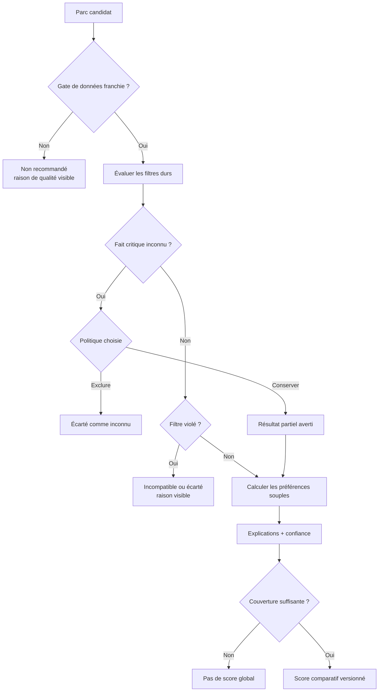
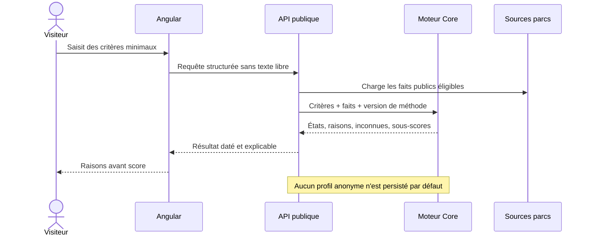
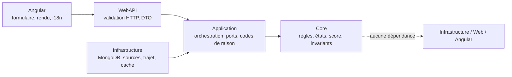

# FIT-01 — Contrat de décision du moteur « Quel parc pour nous ? »

> Statut : accepté le 14 septembre 2026
>
> Portée : sémantique métier, confidentialité et frontières d'architecture
>
> Version de décision : `park-fit-decision-2026-01`
>
> Implémentation concernée : `FIT-02` à `FIT-15`

## 1. Décision métier

Le moteur aide à comparer des parcs à partir de faits vérifiables et de préférences
déclarées. Il ne prédit pas qu'une personne aimera un parc et ne garantit jamais
l'accès à une attraction.

Chaque réponse doit permettre de comprendre :

- quels critères ont réellement pu être évalués ;
- quels critères bloquent le résultat ;
- quelles données manquent ou sont trop anciennes ;
- quelles préférences départagent les parcs encore admissibles ;
- quelle version de méthode et quelles sources ont produit le résultat.

Le premier résultat reste accessible sans compte. Une donnée inconnue n'est jamais
interprétée comme favorable, défavorable, nulle ou fausse.

## 2. Vocabulaire normatif

Les termes suivants ont une signification stable dans toutes les couches.

| Terme | Signification | Ce qu'il ne signifie pas |
|---|---|---|
| `CompatibleAlone` | Les faits décisionnels disponibles satisfont la règle sans accompagnateur. | Autorisation garantie par l'exploitant. |
| `CompatibleWithCompanion` | Les faits satisfont la règle seulement avec un accompagnateur qui répond lui-même aux conditions connues. | N'importe quel adulte peut accompagner n'importe combien de personnes. |
| `Incompatible` | Au moins une règle dure, applicable, fiable et actuelle est violée. | La personne ne peut pas apprécier le parc. |
| `Unknown` | Un fait nécessaire est absent, ambigu, contradictoire, non autorisé ou trop ancien. | Compatible par défaut, fermé, zéro ou non applicable. |
| `NotApplicable` | La règle ne concerne structurellement pas l'élément ou le critère évalué. | Une information pertinente qui n'a pas été trouvée. |

`Unknown` est un résultat métier de premier rang. Il est conservé du stockage
jusqu'à l'interface, dans les caches éventuels, les exports et l'observabilité.

## 3. Ordre de décision

Le moteur applique toujours le même ordre. Les préférences ne peuvent pas compenser
une incompatibilité dure.

### 3.1 Priorité des états individuels

Pour une personne et un élément :

1. déterminer les règles structurellement applicables ; si aucune ne s'applique, le
   résultat est `NotApplicable` ;
2. évaluer chaque règle applicable comme satisfaite, violée ou inconnue ; une
   incohérence ou une source inutilisable rend la règle concernée inconnue ;
3. si au moins une règle fiable est violée, le résultat est `Incompatible`, même si
   une autre règle reste inconnue : le refus est déjà démontré ;
4. sans violation, si au moins une règle critique reste inconnue, le résultat est
   `Unknown` ;
5. sans violation ni inconnue, une exigence d'accompagnement produit
   `CompatibleWithCompanion`, sinon le résultat est `CompatibleAlone`.

Quand plusieurs règles applicables existent, elles sont combinées par conjonction.
Une donnée critique inconnue empêche donc toute conclusion positive, mais elle
n'efface pas une incompatibilité déjà démontrée par une autre règle fiable.

### 3.2 Politique des inconnues

La requête choisit explicitement l'une de ces politiques :

| Politique | Effet sur un filtre dur non vérifiable | Usage attendu |
|---|---|---|
| `KeepWithWarning` | Le parc reste visible, séparé ou signalé comme résultat partiel. | Valeur par défaut, pour ne pas inventer un rejet. |
| `ExcludeUnknown` | Le parc n'entre pas dans les recommandations, avec raison visible. | Recherche prudente demandée par l'utilisateur. |
| `KnownOnly` | Le parc n'est comparé sur ce critère que si le fait est connu ; sinon le score global est suspendu. | Comparaison stricte et homogène. |

Cette politique agit sur la présentation et l'éligibilité de la recherche. Elle ne
réécrit jamais la donnée source et ne transforme jamais `Unknown` en un autre état.

## 4. Filtres durs et préférences souples

### 4.1 Filtres durs

Un filtre dur exprime une condition que l'utilisateur refuse de relâcher :

- parc ouvert à la date choisie ;
- durée ou rayon maximal ;
- pays ou région ;
- exclusion explicite d'une catégorie ou d'un type de parc ;
- présence obligatoire d'une catégorie ;
- minimum d'expériences utilisables par le groupe ;
- informations officielles d'accessibilité disponibles ;
- budget maximal seulement si prix, périmètre et date sont fiables.

Un filtre ne devient décisionnel que si son fait possède la qualité requise. Un
calendrier non publié reste inconnu ; il ne signifie ni ouvert ni fermé.

### 4.2 Préférences souples

Une préférence sert uniquement à départager les candidats non rejetés : sensations,
offre familiale, thématisation, intérieur, spectacles, animaux, attractions
aquatiques, restauration, histoire, distance ou budget indicatif.

Chaque préférence a un poids borné et explicite. La saturation empêche une catégorie
très abondante d'écraser toutes les autres. Une exclusion choisie est un filtre dur,
pas une préférence à poids négatif.

## 5. Profil minimal et privé

Le moteur accepte une liste bornée de membres. Chaque membre peut fournir :

- un alias local facultatif ;
- une taille en centimètres facultative ;
- une tranche d'âge facultative uniquement lorsqu'une règle officielle l'exige ;
- la possibilité déclarée d'être accompagné ;
- une tolérance aux sensations ;
- des catégories préférées ou exclues ;
- des besoins fonctionnels facultatifs et structurés ;
- une priorité de décision bornée.

Un champ omis reste inconnu. Le système ne le déduit ni de l'alias, ni d'une autre
personne, ni de l'historique de navigation.

Sont exclus du modèle V1 : nom civil obligatoire, date de naissance exacte,
diagnostic, dossier médical, carte d'invalidité, donnée biométrique, localisation
continue et profil public d'un mineur.

### 5.1 Cycle de vie des données

Avant connexion, l'état vit en mémoire de page ou de session. Un stockage local
nécessite une explication et une action explicite. L'API ne persiste pas la requête
anonyme et les journaux techniques n'enregistrent ni tailles, ni besoins, ni adresse
exacte avec un identifiant analytics stable.

Les profils sauvegardés de `FIT-11` seront privés, exportables et supprimables. Leur
partage dans un futur voyage exigera un consentement propre au voyage.

## 6. Sources et fraîcheur

Une restriction critique est décisionnelle seulement si elle possède :

- une portée non ambiguë ;
- une source `Official` ou `OperatorProvided` ;
- une référence ou URL ;
- une date de collecte et une date de dernière vérification ;
- la langue source ;
- un résumé fidèle ;
- un éventuel intervalle d'effet ;
- un statut non suspendu.

`VerifiedSecondary` peut informer l'utilisateur mais ne décide pas de l'accès en V1.
`CommunityUnverified` ne participe ni à l'éligibilité ni au calcul.

Si deux sources décisionnelles se contredisent sans résolution éditoriale, la règle
devient `Unknown`. Une source trop ancienne selon la politique versionnée produit
également `Unknown`. Le moteur ne choisit pas silencieusement la valeur la plus
favorable ou la plus récente.

Le modèle actuel `AttractionAccessCondition` stocke déjà une liste de conditions
et plusieurs types (`MinHeight`, `MinHeightAccompanied`, `MaxHeight`, âge,
accompagnement). Il ne porte toutefois pas encore toutes les preuves ci-dessus.
`FIT-02` fera évoluer ce modèle canonique et migrera les documents existants. Aucun
second modèle de restrictions, adaptateur permanent ou double système de lecture
ne sera conservé après la bascule.

## 7. Compatibilité d'un groupe

Le calcul individuel précède toujours le calcul du groupe.

| État groupe | Condition minimale |
|---|---|
| `EveryoneTogether` | Tous les membres peuvent participer dans une même configuration connue. |
| `PossibleWithSplit` | Tous peuvent participer, mais une séparation ou plusieurs configurations sont nécessaires et réalisables avec les accompagnateurs renseignés. |
| `Partial` | Au moins un membre est incompatible, tandis qu'un autre est compatible. |
| `None` | Aucun membre n'est compatible selon les faits connus. |
| `Unknown` | Une donnée critique empêche de conclure pour le groupe. |

Le moteur ne suppose ni capacité d'un véhicule, ni nombre d'enfants par
accompagnateur, ni échange d'accompagnateurs entre deux attractions. Sans fait
explicite, cette faisabilité reste inconnue.

L'ordre des membres et l'ordre des conditions ne changent jamais le résultat. Le
minimum individuel reste visible afin qu'une moyenne de groupe ne masque pas un
membre peu servi.

## 8. Score comparatif et confiance

Le score est calculé seulement après les filtres. Il compare les parcs de la même
requête ; ce n'est ni une note universelle, ni une probabilité d'aimer, ni une
garantie d'accès.

La méthode définit et versionne :

- les sous-scores et leurs normalisations ;
- les poids et saturations ;
- les seuils de complétude ;
- les règles de fraîcheur ;
- l'effet des inconnues ;
- les règles de départage stable ;
- les codes d'explication.

Les premiers sous-scores autorisés sont `GroupCompatibility`,
`PreferenceCoverage`, `TravelConvenience`, `DateAvailability`, `IndoorResilience`
et, uniquement lorsque la donnée est fiable, `BudgetFit`.

`DataConfidence` n'est pas une préférence et n'ajoute aucun point. Elle plafonne le
résultat ou suspend son affichage. Une inconnue critique suspend toujours le score
global avec la politique `KnownOnly`. Les interfaces affichent une formulation telle
que « correspondance élevée selon 8 critères renseignés », jamais « 84 % de chances
d'aimer ».

À score égal, l'ordre est déterministe : meilleure couverture connue, puis plus
faible part d'inconnues, puis identifiant opaque normalisé. Aucun partenariat,
affiliation ou paiement n'entre dans ce tri.

## 9. Matrice d'exemples de référence

| Situation | Résultat attendu | Preuve visible |
|---|---|---|
| Taille exactement égale au minimum officiel actuel | Compatible sur ce seuil | Valeur, unité, source et date. |
| Taille inférieure au minimum absolu | `Incompatible` | Seuil violé. |
| Taille suffisante seulement accompagnée et accompagnateur valide | `CompatibleWithCompanion` | Deux règles évaluées. |
| Taille du membre absente alors qu'un minimum existe | `Unknown` | Champ manquant, sans déduction. |
| Minimum supérieur au maximum | `Unknown` et anomalie admin | Incohérence de données. |
| Calendrier futur non publié | Ouverture `Unknown` | État « non publié », jamais « fermé ». |
| Source secondaire seule pour une restriction critique | `Unknown` en décision V1 | Source affichable mais non décisionnelle. |
| Catégorie expressément exclue | Filtre dur violé | Exclusion choisie. |
| Catégorie simplement peu appréciée | Préférence faible | Sous-score seulement. |
| Une personne incompatible, autres compatibles | Groupe `Partial` | Résultat par membre. |
| Capacité d'accompagnement non documentée | Groupe `Unknown` si elle est nécessaire | Hypothèse refusée. |

Ces cas deviennent des fixtures exécutables dans `FIT-02` à `FIT-06`.

## 10. Frontières d'architecture

- **Core** possède les états, la combinaison des règles, la compatibilité de groupe,
  les sous-scores et la méthode déterministe.
- **Application** collecte les faits via des ports, orchestre le calcul et produit des
  codes de raisons structurés.
- **Infrastructure** persiste et lit les sources, indexes, calendriers, estimations et
  caches sans décider de la compatibilité.
- **WebAPI** borne et valide les contrats, applique rate limiting et autorisation,
  puis mappe les résultats sans règle métier.
- **Angular** gère le parcours, les traductions et la présentation. Une façade parle
  à un port ; les composants ne recalculent pas le verdict.

La règle « une classe par fichier » s'applique à tous les types créés. Les codes de
raison sont stables et traduits côté front ; le Core ne renvoie aucune phrase
localisée.

## 11. Contrat UX, responsive et accessibilité

Les futurs écrans `FIT-08` à `FIT-10` sont conçus mobile d'abord :

- utilisables sans débordement horizontal dès 320 px ;
- contenus longs capables de se réduire avec `min-width: 0` et retour à la ligne ;
- comparaison transformée en cartes ou vues par critère sur petit écran, jamais en
  tableau imposant un viewport plus large ;
- commandes accessibles au clavier et zones tactiles d'au moins 44 px ;
- états lisibles sans dépendre seulement d'une couleur ou d'une icône ;
- inconnues visibles au même niveau que les points forts ;
- raisons présentées avant le score ;
- résumé des critères toujours modifiable sans perdre la saisie ;
- alternative textuelle à tout graphique ou matrice.

Les tests couvriront 320, 360, 390, 768 et 1024 px, les textes longs des huit
langues, le zoom à 200 %, la navigation clavier et l'absence de données sensibles
dans URL, analytics et HTML SSR public.

## 12. Versionnement, déploiement et retour arrière

La version publique de méthode est distincte de la version de schéma. Un résultat
conserve au minimum la version de méthode, la révision des faits, la date de calcul
et le niveau de couverture.

Toute évolution de formule ou de sémantique crée une nouvelle version ; elle ne
réinterprète pas silencieusement un ancien résultat sauvegardé. Les caches sont
indexés par versions et révisions.

FIT-01 ne crée ni collection MongoDB, ni endpoint, ni migration, ni interface et ne
modifie aucun résultat utilisateur. FIT-02 documentera sa migration idempotente, sa
validation, son ordre de déploiement et son retour arrière avant toute écriture de
données enrichies.

## 13. Options écartées

- **Booléen compatible/incompatible** : masque les absences et contradictions.
- **Un seul champ de taille minimale** : détruit les règles avec accompagnement,
  maximum, âge, véhicule ou période.
- **Score calculé avant les filtres** : permettrait à des préférences de compenser
  une contrainte impossible.
- **Profil médical détaillé** : collecte disproportionnée et conclusion trompeuse.
- **IA pour compléter les restrictions** : invente potentiellement un fait sensible.
- **Deux moteurs de restrictions en parallèle** : divergence et dette durable ; une
  migration vers le modèle canonique est obligatoire.
- **Cohorte réelle comme prérequis technique** : la décision produit demande de
  poursuivre sans dépendre de visites réelles ; les preuves automatisées restent
  obligatoires et aucun usage terrain n'est inventé.

## 14. Conditions de passage à FIT-02

FIT-02 peut commencer parce que les points suivants sont désormais figés :

- cinq états individuels non interchangeables ;
- cinq états de groupe ;
- politique explicite des inconnues ;
- séparation filtres durs/préférences souples ;
- profil V1 minimisé ;
- hiérarchie de sources décisionnelles ;
- score comparatif versionné et borné par la confiance ;
- évolution et migration d'un unique modèle de restrictions ;
- frontières Clean Architecture ;
- exigences responsive, accessibilité, confidentialité et preuves.

FIT-02 devra transformer ces décisions en modèle de domaine et persistance sourcée,
sans encore exposer de recommandation publique.
