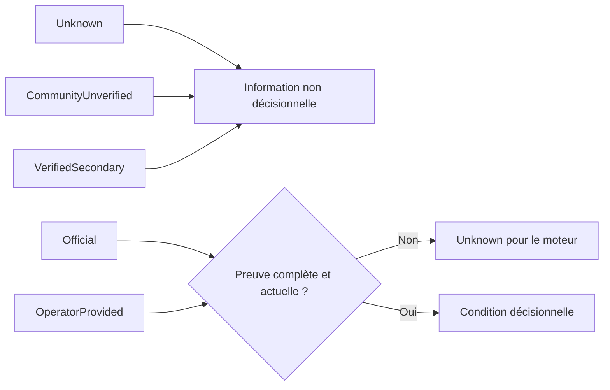
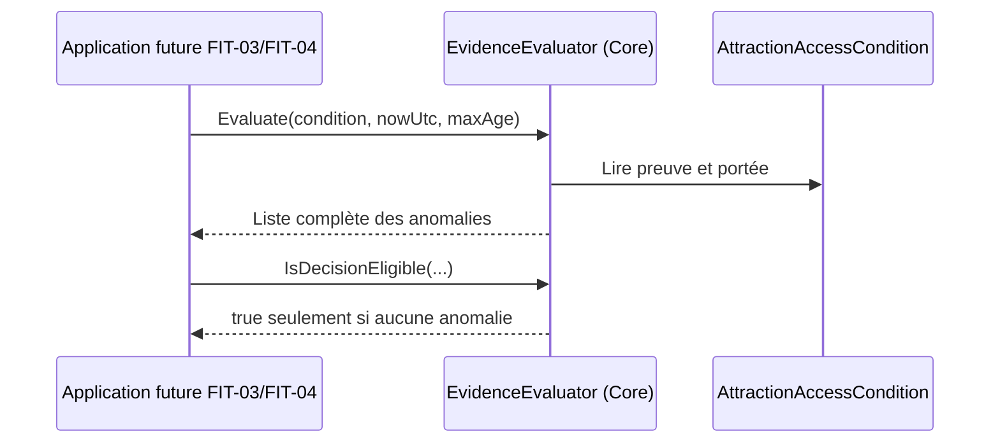
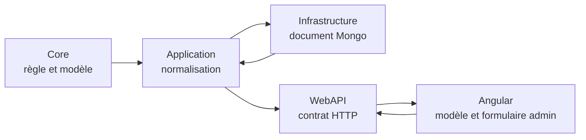

# FIT-02 — Preuves des restrictions d'accès

> Statut : implémenté le 14 septembre 2026
>
> Contrat parent : `park-fit-decision-2026-01`
>
> Version du schéma de provenance : `1`

## 1. Résultat métier

Une condition d'accès ne se résume plus à une valeur telle que « 120 cm ». Le
modèle canonique conserve désormais ce qui permet de juger cette information : qui
l'a publiée, où elle a été trouvée, quand elle a été collectée et vérifiée, ce
qu'elle concerne exactement et pendant quelle période elle s'applique.

Cette évolution prépare le moteur « Quel parc pour nous ? » sans lui permettre de
présenter une ancienne donnée non sourcée comme une certitude. Une condition
historique continue d'exister, mais son absence de preuve est explicite et produit
un état inconnu pour toute décision future.

## 2. Modèle canonique

`AttractionAccessCondition` reste l'unique représentation métier. Les champs de
restriction existants ne changent pas et les preuves sont ajoutées au même objet :

| Champ | Sens | Règle |
|---|---|---|
| `ProvenanceSchemaVersion` | version de lecture de la preuve | `1` à la normalisation |
| `SourceKind` | nature de l'émetteur | officiel et exploitant seulement pour décider en V1 |
| `SourceUrl` / `SourceReference` | origine consultable ou référence éditoriale | au moins l'une des deux |
| `CollectedAtUtc` | instant de collecte | UTC obligatoire |
| `VerifiedAtUtc` | dernière vérification humaine ou contrôlée | UTC, postérieure à la collecte, non future et assez récente |
| `SourceLanguageCode` | langue de la source | code de culture valide |
| `SourceSummary` | transcription localisée et fidèle | au moins un texte non vide |
| `SourceConfidence` | confiance dans la transcription | moyenne ou haute pour décider |
| `Scope` / `ScopeDetail` | attraction, véhicule, siège ou période | détail obligatoire hors attraction entière |
| `EffectiveFrom` / `EffectiveTo` | intervalle local inclusif | fin postérieure ou égale au début |

Les types, valeurs, accompagnements, libellés et descriptions déjà présents
restent portés par le même objet. Il n'existe ni deuxième collection, ni miroir,
ni adaptateur de compatibilité durable.

## 3. États de source



Une source secondaire vérifiée peut plus tard être affichée comme contexte. Elle
ne détermine pas l'accès en V1. La confiance seule ne transforme jamais une source
secondaire en source officielle.

## 4. Évaluation pure dans le Core

`AttractionAccessConditionEvidenceEvaluator` reçoit une condition, l'instant UTC
d'évaluation et l'âge maximal accepté. Il renvoie toutes les anomalies
indépendantes au lieu de s'arrêter à la première : source absente, URL invalide,
dates manquantes ou incohérentes, vérification périmée, langue invalide, résumé
absent, confiance insuffisante, portée ambiguë ou période impossible.



L'évaluateur est sans accès réseau, sans base et sans horloge implicite. Le même
jeu de faits produit donc toujours le même résultat, et les jalons suivants
pourront l'utiliser sans déplacer la règle dans l'API ou l'interface.

## 5. Migration MongoDB sans double système

Les conditions sont embarquées dans :

```text
parkItems
└── attractionDetails
    └── accessConditions[]

standaloneAttractions
└── attractionDetails
    └── accessConditions[]
```

Au démarrage, une migration idempotente cible seulement les conditions dont la
version est absente ou antérieure à `1`. Une mise à jour par pipeline ajoute :

```json
{
  "provenanceSchemaVersion": 1,
  "sourceKind": "Unknown",
  "sourceSummary": [],
  "sourceConfidence": "Unknown",
  "scope": "Attraction"
}
```

Les valeurs déjà enrichies ont priorité grâce à l'ordre de fusion MongoDB. La
migration n'invente ni URL, ni référence, ni langue, ni date. Elle est physique :
après exécution, les documents historiques utilisent le schéma courant et aucun
lecteur parallèle de l'ancien format n'est maintenu.

## 6. Traversée des couches



- le Core possède le sens et l'éligibilité décisionnelle ;
- l'Application nettoie les textes, codes de langue et instants UTC ;
- l'Infrastructure persiste l'unique schéma et migre les documents ;
- la WebAPI transporte chaque champ sans accepter une version de schéma cliente
  arbitraire ;
- Angular préserve la preuve lors d'une édition, même avant l'écran d'audit de
  `FIT-03`.

## 7. Preuves automatisées

| Niveau | Cas protégés |
|---|---|
| Core | sources autorisées, historique inconnu, source secondaire, URL/langue invalides, dates futures/périmées/incohérentes, portée et intervalle |
| Infrastructure | filtre de migration, valeurs historiques honnêtes, priorité aux données existantes, aller-retour Mongo |
| WebAPI | aller-retour complet et version de schéma contrôlée par le serveur |
| Angular | aller-retour du formulaire d'administration sans perte de preuve |

## 8. Performance, responsive et retour arrière

La migration réalise une seule mise à jour bornée par collection et ne touche que
les documents historiques concernés. Aucun calcul supplémentaire n'est ajouté aux
pages publiques et aucun paquet frontend n'est introduit. FIT-02 ne crée pas de
nouvel écran ; il ne modifie donc pas la mise en page mobile. Tout écran de
pilotage ultérieur reste soumis aux contrôles responsive du projet.

Un retour applicatif peut ignorer les champs ajoutés sans perdre les restrictions
existantes. Les ajouts MongoDB sont non destructifs ; une restauration de
sauvegarde n'est nécessaire que si l'on souhaite supprimer physiquement les
marqueurs de provenance, ce qui n'est pas requis pour revenir au code précédent.

## 9. Limite volontaire et suite

FIT-02 sait distinguer une preuve exploitable d'une donnée incomplète, mais ne
calcule pas encore la couverture d'un parc et n'affiche pas de tableau de
traitement. `FIT-03` agrégera ces anomalies, identifiera les attractions à corriger
et fournira à l'administration un pilotage responsive. Aucun parc réel ni volume de
visites ne conditionne ce travail technique.
