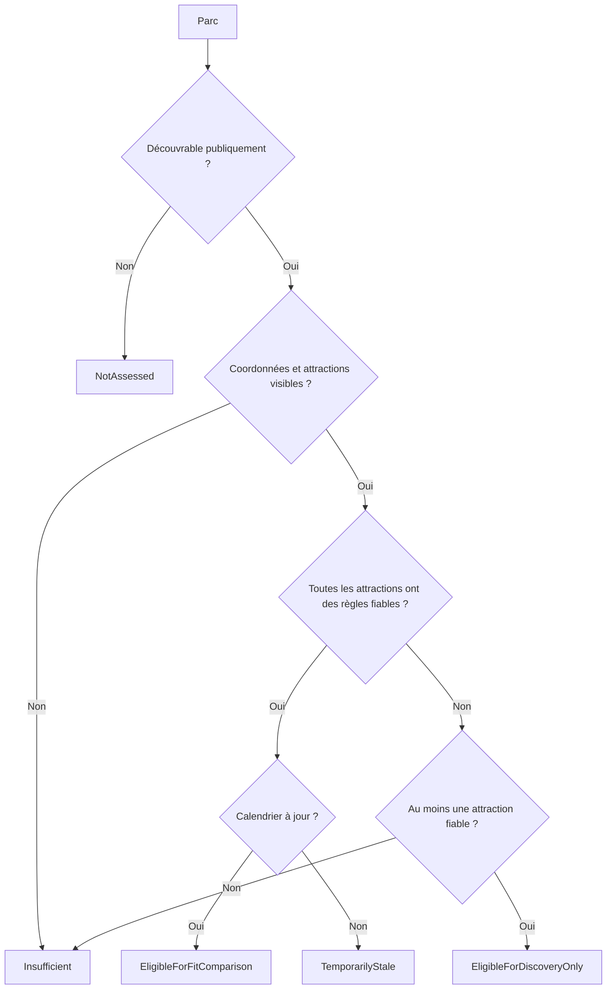
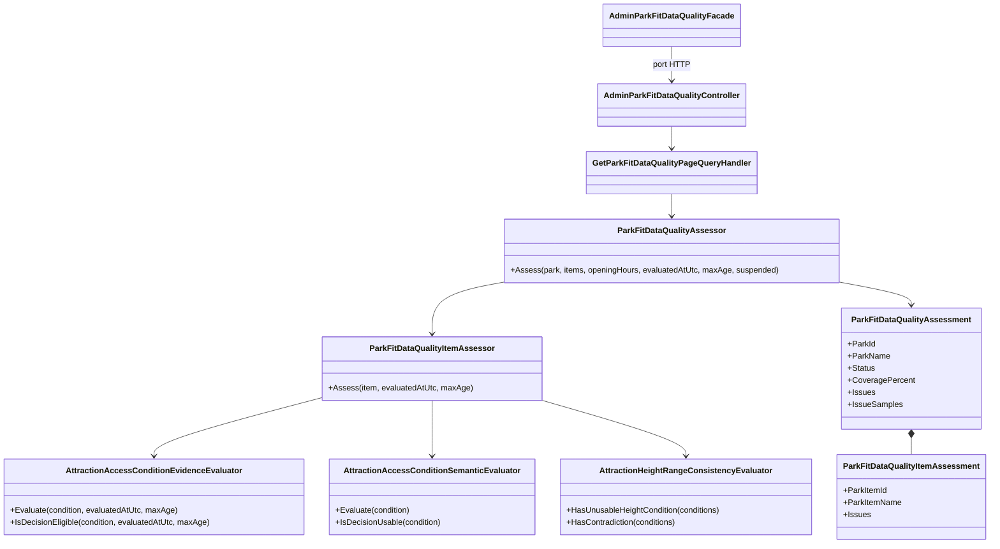
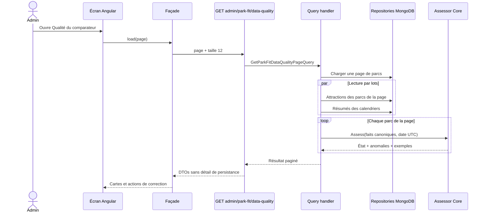

# FIT-03 — Audit de préparation des parcs

> Statut : implémenté le 14 septembre 2026
>
> Contrat parent : `park-fit-decision-2026-01`
>
> Âge maximal d'une preuve décisionnelle : 365 jours

## 1. Résultat métier

L'administration dispose d'un écran « Qualité du comparateur » qui répond à une
question simple : les données actuelles d'un parc permettent-elles de l'utiliser
dans le futur comparateur « Quel parc pour nous ? » sans inventer une réponse ?

Chaque parc reçoit un état, un pourcentage de couverture et une liste de corrections
concrètes. L'administrateur voit notamment le type ou les langues manquants, les
attractions sans classification précise ou intérieure/extérieure, les règles
d'accès absentes, les informations d'accessibilité non sourcées, les preuves trop
anciennes et les contradictions de taille. Les exemples sont limités à huit par
parc et ouvrent directement l'édition de l'attraction concernée.

Ce jalon ne recommande encore aucun parc. Il prépare et contrôle les faits dont le
moteur de compatibilité individuel de `FIT-04` aura besoin.

## 2. Gate de préparation

L'évaluation ne repose pas sur les visites des membres ni sur une cohorte réelle.
Elle utilise exclusivement les données éditoriales canoniques du parc.

| État | Sens métier |
|---|---|
| `NotAssessed` | le parc n'est pas publiquement découvrable |
| `Insufficient` | il manque une base indispensable, ou aucune attraction n'est entièrement fiable |
| `EligibleForDiscoveryOnly` | une partie est fiable, mais le parc ne doit pas encore être comparé |
| `EligibleForFitComparison` | coordonnées, calendrier actuel et toutes les attractions visibles actuellement ouvertes sont exploitables |
| `TemporarilyStale` | la structure est complète, mais des preuves ou le calendrier doivent être renouvelés |
| `Suspended` | état réservé à la suspension opérationnelle de `FIT-13` |

Une attraction visible mais fermée ou retirée est conservée dans l'historique sans
pénaliser la préparation du parc. Une attraction actuellement ouverte est comptée
comme exploitable uniquement lorsque son type est précis et compatible avec sa
catégorie, que sa classification intérieure/extérieure est connue, qu'elle possède au
moins une condition d'accès applicable à la date UTC de l'audit et que toutes ses conditions actuelles franchissent l'évaluateur
de preuve de `FIT-02` ainsi que l'évaluateur sémantique. Ce dernier refuse notamment
un âge sans valeur ou exprimé dans une unité de taille, une taille sans unité et une
règle personnalisée sans définition stable. Une information d'accessibilité renseignée doit avoir une
URL HTTP(S) absolue consultable et une plage de taille dont le minimum dépasse le maximum est
signalée comme ambiguë. Le parc doit lui-même avoir un type et au moins une langue
publique documentée. Une valeur numérique inconnue de l'énumération des types de
parc est refusée comme une valeur absente. Les coordonnées utilisent le validateur canonique du domaine :
le point factice `(0, 0)` ne satisfait jamais la gate.

Les plages de taille sont converties en centimètres avant comparaison. Une règle en
pouces ne peut donc pas créer ou masquer une contradiction par sa seule unité. Deux
règles ne sont comparées que si leurs portées peuvent s'appliquer ensemble et si
leurs périodes d'effet se chevauchent ; des véhicules, sièges ou périodes distincts
ne produisent pas de faux blocage.



## 3. Architecture et responsabilités

La règle reste dans le Core. Les couches externes ne recalculent ni la couverture
ni l'état du parc.



- le Core calcule l'état, la couverture et les anomalies ;
- l'Application valide la pagination, collecte une page de parcs puis charge les
  attractions ouvertes et calendriers correspondants par lots ;
- la WebAPI expose un endpoint de lecture réservé aux administrateurs activés et
  non bloqués, avec cache interdit ;
- Angular orchestre l'état d'écran via une façade et un port, sans injecter le
  service HTTP concret dans le composant.

## 4. Séquence d'audit



## 5. Schéma MongoDB lu

FIT-03 n'ajoute ni collection, ni projection, ni doublon. Il lit les trois sources
existantes et produit l'audit à la demande :

```text
parks
└── _id, name, isVisible, lifecycleStatus, position

parkItems
└── parkId, name, isVisible, category
    └── attractionDetails
        └── accessConditions[]
            ├── type, value, companionRule
            ├── sourceKind, sourceUrl/sourceReference
            ├── collectedAtUtc, verifiedAtUtc
            ├── sourceLanguageCode, sourceSummary, sourceConfidence
            └── scope, scopeDetail, effectiveFrom/effectiveTo

parkOpeningHours
└── parkId, lastVerifiedAtUtc, firstDate, lastDate, hasScheduleData,
    coverageSegments[], regularRules[], dateOverrides[]
```

Les identifiants techniques restent dans le contrat admin uniquement pour ouvrir
la bonne fiche d'édition. Ils ne sont jamais présentés comme libellés : l'interface
affiche les noms du parc et de l'attraction.

## 6. Performance et sécurité

- la page est bornée à 12 parcs dans l'interface ;
- une page de parcs déclenche deux lectures par lots, exécutées en parallèle, et
  non une requête par attraction ; la lecture MongoDB dédiée filtre en base les
  attractions visibles et ouvertes puis ne projette que leur identité, leur type,
  leurs classifications et leurs conditions d'accès ;
- le calcul est pur, synchrone et borné aux données de cette page ;
- aucune nouvelle dépendance frontend et aucun calcul sur les pages publiques ;
- l'endpoint exige le rôle administrateur et le statut de compte autorisé ;
- les réponses sont `no-store` car elles décrivent l'état éditorial interne.

Les descriptions, positions et détails techniques inutiles ne sont pas transférés
par cette projection d'audit.
Le premier contrat conserve donc une source unique de vérité.

## 7. Responsive et accessibilité

L'écran utilise des cartes et non un tableau large. Le compteur « Parcs à compléter »
repose sur l'état global du parc : une coordonnée ou un calendrier manquant reste
donc visible même lorsqu'aucune attraction individuelle n'est en erreur. Chaque grille repose sur
`minmax(0, 1fr)`, les contenus longs peuvent se couper, les composants ont une
largeur maximale de 100 %, et les colonnes deviennent uniques sur téléphone. Les
boutons de pagination et d'actualisation occupent toute la largeur sous 480 px.
Un contrat automatisé protège ces règles, y compris le paysage de faible hauteur.

La couverture est fournie sous forme textuelle et par une barre dotée des attributs
ARIA de progression. Les statuts ne reposent pas uniquement sur la couleur.

## 8. Preuves automatisées

| Niveau | Comportements couverts |
|---|---|
| Core | parc prêt, coordonnées factices, type de parc absent ou indéfini, type/langue/classification manquants ou incohérents, URL d'accessibilité invalide, règle sémantiquement inutilisable, condition expirée/future, calendrier absent, preuves périmées, unités mixtes et contradiction min/max limitée aux portées/périodes compatibles |
| Application | pagination, lecture projetée des seules attractions visibles et ouvertes par lots, agrégation, rejet d'une pagination invalide avant accès aux données |
| WebAPI | contrat paginé, mapping des noms et anomalies, authentification et autorisation admin |
| Angular | contrat HTTP, résumé métier de la façade, pagination, conservation des données sur erreur, liens d'édition, reflow mobile |

## 9. Suite

`FIT-04` construira le moteur de compatibilité pour une personne : à partir d'un
profil minimal et d'une attraction, il expliquera si elle est compatible seule,
compatible avec accompagnateur, incompatible, inconnue ou non applicable. Il
réutilisera directement les conditions et preuves validées ici.
