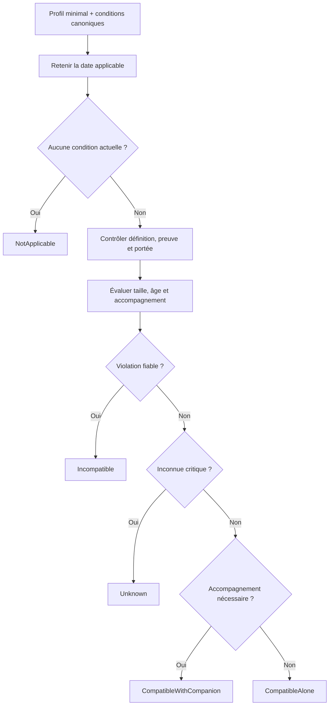
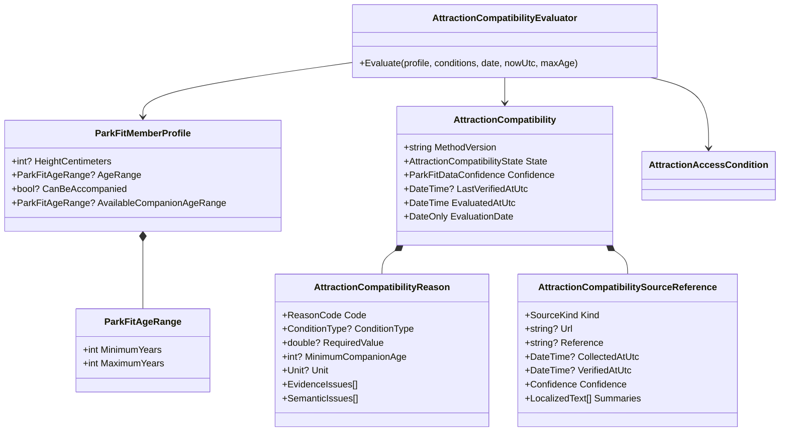
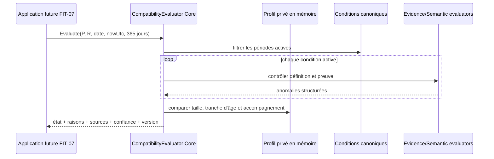

# FIT-04 — Compatibilité individuelle d'une attraction

> Statut : implémenté le 14 septembre 2026
>
> Contrat parent : `park-fit-decision-2026-01`
>
> Version de méthode : `park-fit-2026-01`

## 1. Résultat métier

Le Core sait désormais répondre à la question « cette attraction paraît-elle
compatible avec les informations minimales de cette personne ? ». Il ne promet
jamais l'accès : la décision finale reste celle de l'exploitant le jour de la
visite.

Le moteur retourne exactement un des cinq états normatifs :

| État | Sens métier |
|---|---|
| `CompatibleAlone` | toutes les règles actuelles, fiables et évaluables sont satisfaites sans accompagnateur |
| `CompatibleWithCompanion` | les règles sont satisfaites seulement avec un accompagnateur déclaré et conforme aux âges connus |
| `Incompatible` | au moins une règle actuelle, fiable et dure est certainement violée |
| `Unknown` | une donnée personnelle, une preuve, une définition ou une configuration critique empêche une conclusion positive |
| `NotApplicable` | aucune condition ne concerne la date évaluée |

Chaque résultat contient des codes de raisons stables, les seuils concernés, les
âges minimaux d'accompagnateur, les anomalies exactes de définition ou de preuve,
les sources disponibles, la date de
calcul, la date métier, la plus ancienne vérification active et la version de
méthode.

## 2. Profil minimal et privé

`ParkFitMemberProfile` ne collecte que les faits nécessaires à ce jalon :

- taille facultative en centimètres ;
- tranche d'âge facultative, sans date de naissance ;
- possibilité déclarée d'être accompagné ;
- tranche d'âge de l'accompagnateur disponible lorsqu'elle est connue.

Une taille doit rester entre 1 et 300 cm. Une tranche d'âge est inclusive, ordonnée
et bornée à 130 ans. Fournir l'âge d'un accompagnateur sans déclarer explicitement
qu'un accompagnement est disponible est rejeté comme une entrée incohérente.

Aucun nom civil, diagnostic, dossier médical, carte d'invalidité, donnée biométrique
ou historique de visite n'entre dans ce calcul. Le profil reste un objet en mémoire
du Core ; FIT-04 ne le persiste pas.

## 3. Ordre de décision



La priorité `Incompatible` avant `Unknown` est volontaire : une preuve fiable de
refus reste concluante même si une autre règle indépendante manque. En revanche,
deux seuils qui se contredisent rendent le groupe de seuils concerné inconnu ; le
moteur ne choisit pas silencieusement la valeur la plus favorable.

## 4. Taille

Les pouces sont convertis en centimètres par un convertisseur Core partagé avec
l'audit FIT-03. Les bornes sont inclusives : une personne exactement au minimum ou
au maximum satisfait ce seuil.

Une paire courante est interprétée sans écraser l'une de ses deux règles :

```text
MinHeight = 120 cm
MinHeightAccompanied = 100 cm

taille < 100 cm       -> Incompatible
100 cm <= taille <120 -> accompagnateur exigé
taille >= 120 cm      -> CompatibleAlone sur la taille
```

Le seuil accompagné ne peut pas être supérieur au seuil seul. Une taille maximale
s'ajoute comme contrainte dure. Quand la taille personnelle manque, la réponse est
`Unknown`, jamais compatible par défaut.

## 5. Âge et accompagnement

L'âge est une tranche inclusive. Pour un minimum de 14 ans :

- `[14, 14]` satisfait le seuil ;
- `[12, 12]` le viole ;
- `[12, 14]` le traverse et reste `Unknown`.

Les variantes `MinAge` et `MinAgeAccompanied` suivent la même logique de repli que
la taille. Lorsqu'un accompagnateur est nécessaire :

- disponibilité absente : `Unknown` ;
- accompagnement explicitement impossible : `Incompatible` ;
- âge minimal de l'accompagnateur entièrement satisfait : compatibilité accompagnée ;
- tranche entièrement sous le minimum : `Incompatible` ;
- tranche traversant le minimum : `Unknown`.

Le moteur individuel ne suppose ni qu'un adulte quelconque convient, ni qu'il peut
accompagner plusieurs personnes. FIT-05 évaluera ces relations au niveau du groupe.

## 6. Preuves, périodes et portées

Une condition n'est décisionnelle que si l'évaluateur FIT-02 confirme sa source,
sa fraîcheur, ses dates, sa langue, sa confiance et sa portée. Les anomalies
exactes sont conservées dans `EvidenceIssues` et `SemanticIssues`.

- une source `VerifiedSecondary` ou communautaire reste informative mais produit
  `Unknown` en V1 ;
- une preuve vieille de plus de 365 jours produit `Unknown` avec le code exact ;
- une condition expirée ou future n'entre pas dans le calcul du jour ;
- les jours de début et de fin sont inclusifs ;
- une règle limitée à un véhicule, un siège ou une configuration produit `Unknown`
  tant que cette configuration n'est pas explicitement sélectionnée ;
- les restrictions de grossesse, cardiaques, dos/nuque, transfert, pass d'accès et
  personnalisées demandent une confirmation personnelle ou officielle : FIT-04 ne
  collecte pas de diagnostic et ne fabrique donc pas un verdict.

Cette prudence empêche une règle valable pour un seul siège de devenir une promesse
pour toute l'attraction.

## 7. Modèle de classes



Chaque classe nommée possède son propre fichier. Le contrôle automatisé global
« une classe = un fichier » reste applicable au C# et à TypeScript.

## 8. Séquence



L'Application future orchestrera le chargement. Elle ne recalculera aucun seuil et
la WebAPI ne décidera jamais du verdict.

## 9. MongoDB et performance

FIT-04 ne crée aucune collection, aucun index, aucune migration et aucune écriture.
Il consomme le modèle canonique `parkItems[].attractionDetails.accessConditions[]`
en mémoire après son chargement par l'Application.

Le calcul est déterministe, sans réseau et borné au nombre de conditions de
l'attraction. Les tris servent uniquement à stabiliser les raisons et les sources ;
aucune dépendance supplémentaire n'est introduite.

## 10. Preuves automatisées

Cinquante-six scénarios FIT-04 couvrent notamment :

- absence, expiration et futur des règles ;
- minimum, maximum et égalité exacte aux seuils ;
- conversion pouces/centimètres ;
- seuil seul, seuil accompagné et passage de l'un à l'autre ;
- accompagnement absent, impossible, certain ou ambigu ;
- âge minimal de l'accompagnateur ;
- tranches d'âge sous, sur et à cheval sur un seuil ;
- preuve périmée, source secondaire et définition invalide ;
- contradiction min/max et seuil accompagné incohérent ;
- portée véhicule non généralisable ;
- priorité d'une violation fiable sur une autre inconnue ;
- conservation d'une alternative accompagnée inconnue avant tout rejet sur le seuil seul ;
- tranche d'âge chevauchant le seuil seul sans faux rejet faute d'accompagnateur ;
- départage déterministe des seuils égaux par l'exigence d'accompagnement la plus stricte ;
- incohérence explicite entre âge d'accompagnateur et absence d'accompagnement ;
- choix stable de la règle expliquant une donnée de taille manquante ;
- rejet certain conservé quand l'accompagnement est explicitement indisponible ;
- invariance à l'ordre des conditions ;
- version, confiance, dates et sources ;
- fusion déterministe de tous les résumés citant une même source ;
- validation des bornes du profil privé.

Les tests FIT-03 sont rejoués avec les évaluateurs partagés afin de prouver que
l'extraction de la période et des unités ne change pas la gate d'administration.

## 11. Interface et responsive

FIT-04 est volontairement un jalon Core : il n'ajoute pas encore d'écran. Les codes
ne contiennent aucune phrase localisée et seront traduits par Angular dans FIT-09.
Les exigences mobile dès 320 px, zoom 200 %, retour à la ligne des sources et raisons
visibles avant tout score restent obligatoires pour FIT-08 à FIT-10.

## 12. Suite

FIT-05 combinera ces verdicts individuels pour un groupe. Il distinguera tout le
monde ensemble, séparation possible, participation partielle, personne compatible
et situation inconnue, sans inventer la capacité d'un véhicule ou d'un
accompagnateur.
