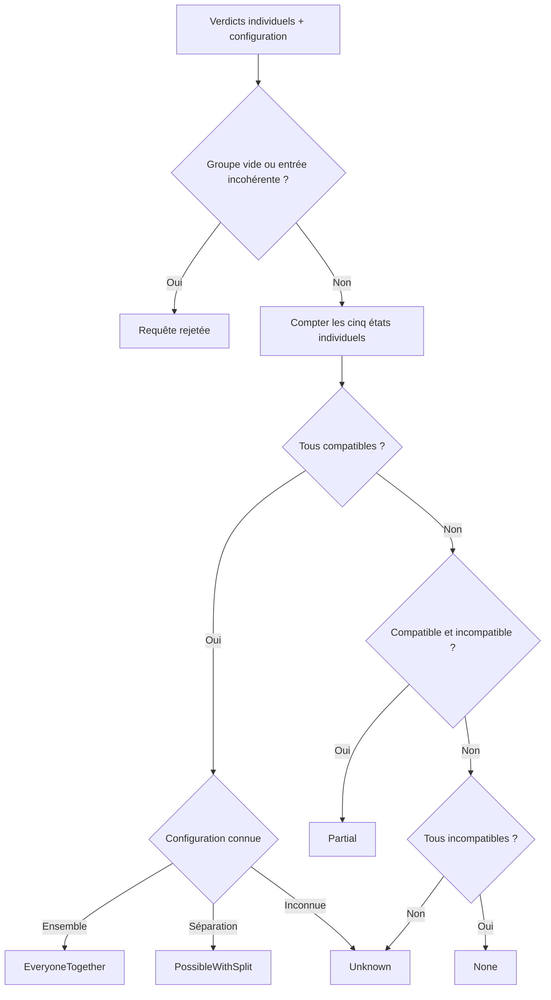
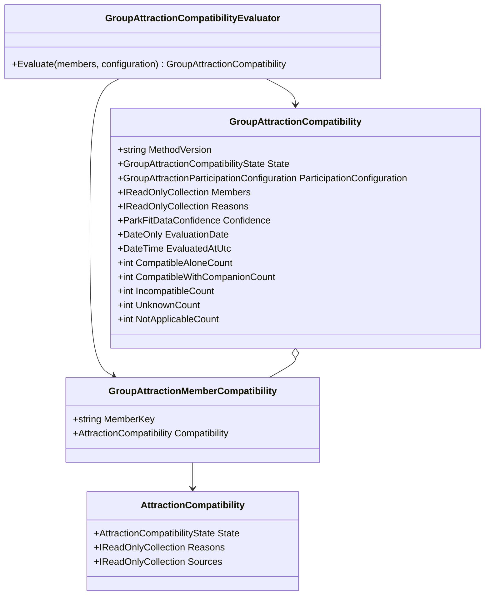
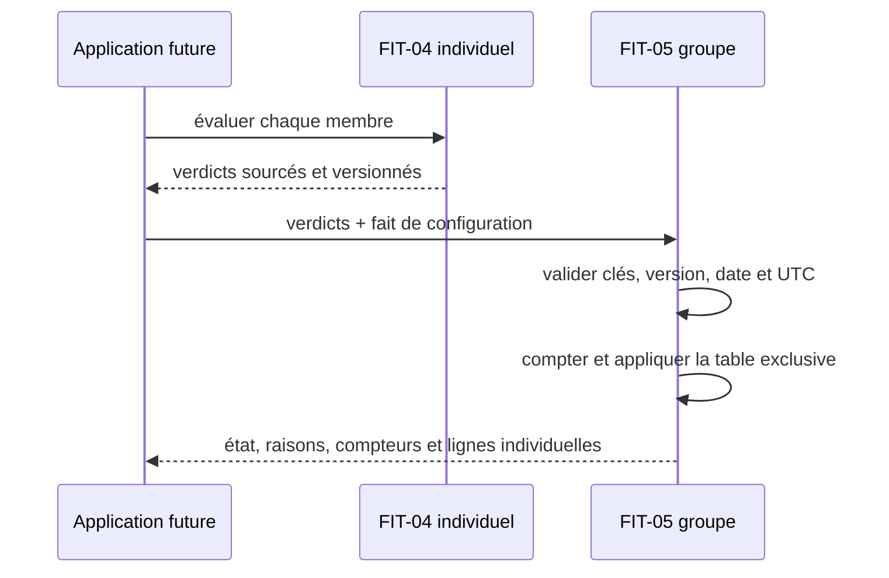

# FIT-05 — Compatibilité d'une attraction pour un groupe

Date : 14 septembre 2026  
Version de méthode : `park-fit-2026-01`  
Version applicative : `5.3.20`

## 1. Résultat métier

FIT-05 combine les verdicts individuels de FIT-04 sans les remplacer. Pour une
attraction et un groupe non vide, il retourne exactement un des cinq états suivants :

| État | Sens métier |
|---|---|
| `EveryoneTogether` | chaque membre est compatible et une même organisation réalisable est connue |
| `PossibleWithSplit` | chaque membre est compatible, mais une séparation connue est nécessaire |
| `Partial` | au moins un membre est compatible et au moins un autre est incompatible |
| `None` | tous les membres sont incompatibles, sans exception ni inconnue |
| `Unknown` | les faits individuels ou l'organisation du groupe ne permettent pas de conclure |

Le moteur conserve chaque ligne individuelle. Une conclusion de groupe ne masque
donc jamais le membre concerné, sa raison, ses sources ou son niveau de confiance.

## 2. Entrées minimales

Chaque membre est représenté par :

- une clé opaque propre à la requête, normalisée et non vide ;
- le résultat individuel complet produit par FIT-04.

La clé n'est ni un nom, ni une adresse électronique, ni un identifiant analytics.
Deux membres ne peuvent pas partager la même clé dans une évaluation.

L'organisation connue est un fait séparé :

| Configuration | Signification |
|---|---|
| `Unknown` | la capacité ou les relations d'accompagnement ne sont pas démontrées |
| `EveryoneTogether` | une configuration commune est explicitement démontrée |
| `SplitRequired` | plusieurs configurations ou sous-groupes réalisables sont explicitement nécessaires |

Une configuration connue est acceptée uniquement lorsque tous les verdicts
individuels sont compatibles. Le Core refuse ainsi une entrée contradictoire telle
que « tout le monde ensemble » avec un membre individuellement incompatible.

## 3. Table de décision exhaustive

Les états `CompatibleAlone` et `CompatibleWithCompanion` forment l'ensemble des
compatibilités conclues. `NotApplicable` n'est pas converti silencieusement en
compatibilité : s'il empêche l'une des conditions exactes ci-dessous, le groupe
reste `Unknown`.

| Compatibles | Incompatibles | Inconnus / non applicables | Configuration | Résultat |
|---:|---:|---:|---|---|
| tous | 0 | 0 | `EveryoneTogether` | `EveryoneTogether` |
| tous | 0 | 0 | `SplitRequired` | `PossibleWithSplit` |
| tous | 0 | 0 | `Unknown` | `Unknown` |
| au moins 1 | au moins 1 | quelconque | `Unknown` | `Partial` |
| 0 | tous | 0 | `Unknown` | `None` |
| autre | autre | au moins 1 ou conclusion incomplète | `Unknown` | `Unknown` |

La priorité de `Partial` est volontaire : compatible + incompatible + inconnu reste
une participation partielle déjà démontrée. En revanche, incompatible + inconnu
reste inconnu, car le résultat final pourrait encore devenir `None` ou `Partial`.

## 4. Aucune hypothèse de capacité

Le résultat `CompatibleWithCompanion` démontre seulement la compatibilité de la
personne avec un accompagnateur admissible. Il ne démontre pas :

- combien de personnes cet accompagnateur peut prendre en charge simultanément ;
- combien de places contient un véhicule ;
- si plusieurs membres doivent être répartis sur plusieurs véhicules ;
- si un accompagnateur peut être réutilisé entre deux configurations.

Sans fait explicite sur l'organisation, un groupe entièrement compatible reste donc
`Unknown`. L'application pourra fournir ce fait dans un jalon ultérieur à partir de
données structurées ; FIT-05 ne le fabrique pas.

## 5. Algorithme déterministe

L'ordre d'entrée des membres ne modifie ni l'état ni les codes de raison. Les
membres sont restitués par clé opaque en ordre ordinal stable.

## 6. Modèle de classes

Chaque classe et chaque enum sont placés dans un fichier distinct. Le Core ne
dépend ni de l'Application, ni de l'Infrastructure, ni du Web, ni d'Angular.

## 7. Séquence de calcul

FIT-05 n'ajoute pas encore cette orchestration à l'Application : il fournit le
contrat métier pur que FIT-06 et FIT-07 pourront appeler.

## 8. Version, date et confiance

Tous les résultats individuels d'une agrégation doivent :

- utiliser `park-fit-2026-01` ;
- partager la même date métier ;
- contenir un horodatage UTC valide ;
- porter un état et une confiance reconnus.

Le résultat de groupe conserve cette version et cette date. Son horodatage est le
plus récent des calculs individuels. Sa confiance est le niveau individuel le plus
faible : une moyenne ne peut pas masquer un membre moins bien documenté.

## 9. Codes de raison

Les raisons sont structurées, stables et sans texte localisé :

- `EveryoneTogetherKnown` ;
- `SplitRequiredKnown` ;
- `PartialParticipation` ;
- `NoMemberCompatible` ;
- `ParticipationConfigurationUnknown` ;
- `MemberCompatibilityUnknown` ;
- `MemberCompatibilityNotApplicable`.

Les codes d'inconnue et de non-applicabilité restent présents dans un résultat
`Partial`. Angular les traduira dans FIT-09 sans recalculer l'état.

## 10. Preuves automatisées

Trente scénarios FIT-05 couvrent :

- les cinq états de groupe ;
- compatible + incompatible + inconnu donnant `Partial` ;
- incompatible + inconnu donnant `Unknown` ;
- `NotApplicable` restant prudent ;
- les configurations ensemble, séparée et inconnue ;
- la conservation des compteurs et des raisons ;
- la confiance minimale et l'horodatage le plus récent ;
- l'invariance à l'ordre des membres ;
- la copie de la collection d'entrée ;
- groupe vide, collection nulle, clé vide et doublon ;
- configuration, état, confiance, version, date ou UTC invalides.

La suite Core complète contient 918 tests verts après ce jalon.

## 11. Stockage, confidentialité et performance

FIT-05 est un calcul linéaire en nombre de membres, sans I/O, cache, dépendance ou
stockage. Il ne crée aucune collection MongoDB et ne nécessite aucune migration.
Il ne collecte aucune donnée personnelle supplémentaire et ne journalise rien.

## 12. Interface et responsive

Ce jalon Core n'ajoute aucun écran. FIT-09 affichera d'abord l'état du groupe puis
les membres concernés, avec des cartes qui se replient dès 320 px, des textes longs
retournant à la ligne, aucun identifiant technique visible et une alternative
textuelle à toute matrice. L'état ne dépendra jamais de la couleur seule.

## 13. Suite

FIT-06 construira les sous-scores versionnés après les filtres durs. Il utilisera
les compteurs de groupe sans transformer une inconnue en zéro, sans moyenner les
membres au point de masquer le moins bien servi et sans présenter le résultat comme
une probabilité d'aimer.
