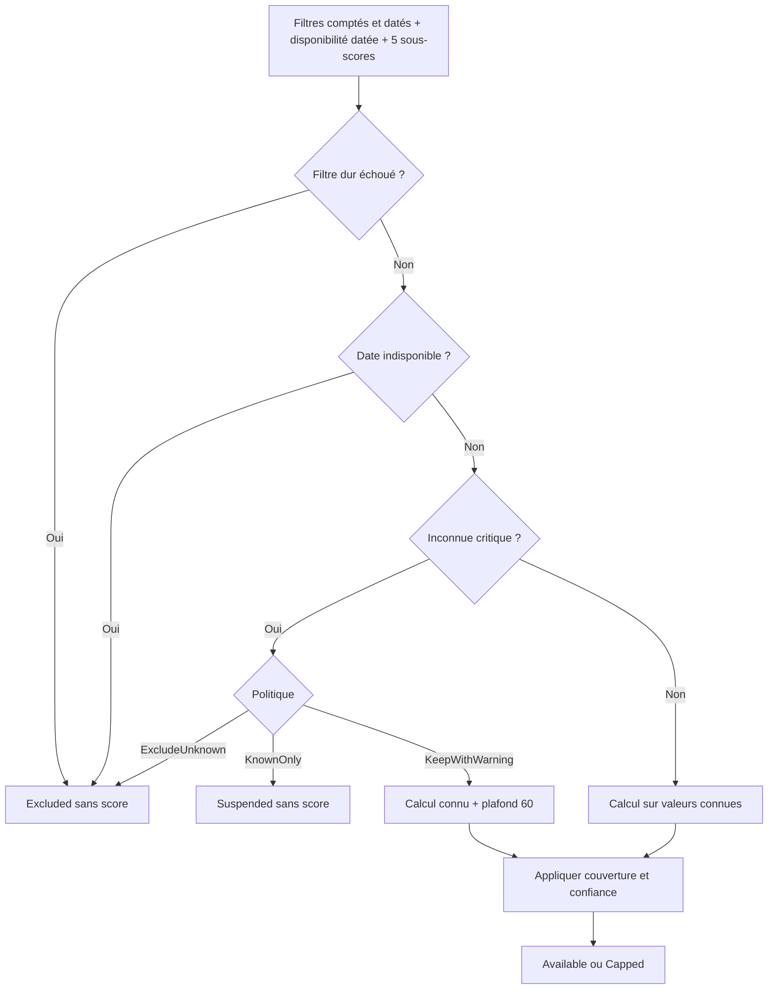
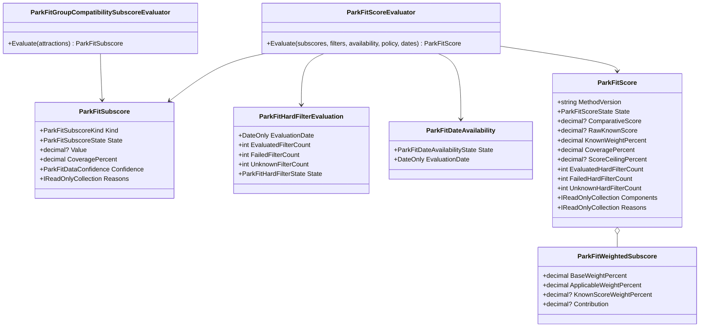
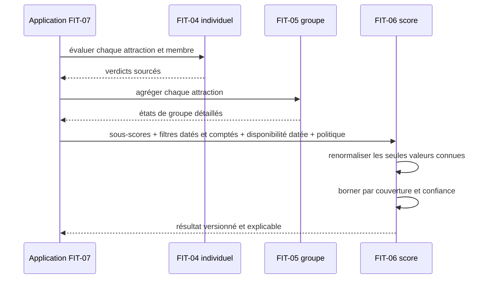

# FIT-06 — Sous-scores et score comparatif versionnés

Date : 14 septembre 2026

Version de méthode : `park-fit-2026-01`

Version applicative : `5.3.21`

## 1. Résultat métier

FIT-06 transforme les faits déjà évalués par FIT-04 et FIT-05 en un indicateur de
comparaison entre parcs. Il ne prédit pas si une personne aimera un parc et ne
garantit jamais l'accès à une attraction.

Le résultat répond à quatre questions séparées :

1. le parc a-t-il franchi les critères éliminatoires ?
2. quelles composantes sont connues, inconnues ou non applicables ?
3. quel score les seules données connues produisent-elles ?
4. jusqu'où la couverture et la confiance autorisent-elles à afficher ce nombre ?

Un parc refusé par un filtre dur ou indisponible à la date demandée n'obtient aucun
score. Une préférence élevée ne peut donc jamais compenser une impossibilité.

## 2. Formule publique

| Composante | Poids de base | Sens métier |
|---|---:|---|
| `GroupCompatibility` | 45 % | part de l'offre réellement praticable par le groupe |
| `PreferenceCoverage` | 25 % | couverture des envies déclarées |
| `TravelConvenience` | 15 % | facilité du trajet selon les faits fournis |
| `IndoorResilience` | 10 % | capacité de l'offre à rester pertinente en intérieur |
| `BudgetFit` | 5 % | adéquation au budget, seulement avec des prix fiables |

```text
Score brut connu =
  0,45 × compatibilité du groupe
+ 0,25 × couverture des préférences
+ 0,15 × facilité du trajet
+ 0,10 × résilience en intérieur
+ 0,05 × adéquation au budget
```

Lorsqu'une composante est inconnue, elle ne vaut pas zéro. Les poids des seules
composantes connues sont renormalisés pour produire `RawKnownScore`. Le résultat
conserve pour chaque ligne :

- le poids public de base ;
- le poids parmi les composantes applicables ;
- le poids parmi les composantes effectivement connues ;
- la contribution exacte au score brut ;
- la couverture, la confiance et les codes de raison.

Exemple complet : `80 × 45 % + 60 × 25 % + 100 × 15 % + 50 × 10 % +
40 × 5 % = 73`. Le score brut est donc `73/100`, avant plafonnement.

## 3. Normalisation de la compatibilité du groupe

Chaque attraction évaluée par FIT-05 reçoit la valeur suivante :

| État FIT-05 | Valeur normalisée |
|---|---:|
| tout le monde ensemble | 100 |
| séparation nécessaire mais réalisable | 75 |
| participation partielle | 35 |
| personne compatible | 0 |
| inconnu | exclu du calcul, jamais converti en 0 |

La moyenne des attractions connues n'est pas suffisante. Le moteur calcule aussi,
pour chaque membre, la part d'attractions où cette personne est compatible seule
ou accompagnée. Le sous-score final est le minimum entre la moyenne du groupe et
le taux du membre le moins bien servi.

```text
CompatibilitéGroupe = min(
  moyenne des états de groupe connus,
  minimum des taux de compatibilité individuels connus
)
```

Si un membre ne possède aucun résultat connu, la composante devient `Unknown`.
Sa couverture est le minimum entre la couverture des états de groupe et celle du
membre le moins documenté. La confiance est la plus faible de tous les faits
connus qui contribuent à la moyenne du groupe ou à la borne individuelle, même
si l'organisation collective d'une attraction reste inconnue. L'ordre des
attractions ne modifie jamais le résultat.

## 4. Inconnue, non-applicabilité et filtres

Les trois états d'une composante ne sont pas interchangeables :

| État | Valeur | Effet |
|---|---|---|
| `Known` | 0 à 100 | participe au score brut |
| `Unknown` | aucune | reste visible et réduit la couverture |
| `NotApplicable` | aucune | sort explicitement du dénominateur applicable |

`GroupCompatibility` et `PreferenceCoverage` sont toujours requises : elles ne
peuvent pas être déclarées non applicables. `BudgetFit` ne devient connu qu'avec
une confiance moyenne ou haute ; sinon il doit rester inconnu ou non applicable.

Les filtres sont traités avant le score final :

| Fait | Résultat |
|---|---|
| filtre dur échoué | `Excluded`, aucun score |
| date demandée indisponible | `Excluded`, aucun score |
| filtre et date acceptés | calcul autorisé |
| fait critique inconnu | application de la politique d'inconnu |

Le moteur ne reçoit pas un simple drapeau global pour les filtres durs. Il reçoit
une évaluation immuable avec sa date, le nombre total de filtres, le nombre
échoué et le nombre inconnu. Deux seuils non vérifiables restent donc deux faits
critiques distincts. La disponibilité est elle aussi portée par un objet daté ;
le score refuse tout filtre, calendrier ou sous-score de groupe calculé pour une
autre date que celle annoncée dans le résultat.

## 5. Politiques d'inconnu

Un fait critique inconnu est chaque filtre dur inconnu, une disponibilité datée
inconnue ou une compatibilité de groupe inconnue. Le compteur porte sur les faits,
pas seulement sur ces trois catégories.

| Politique | Effet d'une inconnue critique |
|---|---|
| `ExcludeUnknown` | résultat `Excluded`, sans score |
| `KnownOnly` | résultat `Suspended`, sans score |
| `KeepWithWarning` | avec une seule inconnue critique, score calculé mais plafonné à 60 |

Une inconnue non critique ne reçoit aucun point et ne suspend pas à elle seule le
mode `KnownOnly`. Elle réduit toutefois la couverture et donc le plafond possible.
À partir de deux faits critiques inconnus, le score est toujours suspendu, y compris
avec `KeepWithWarning` : un nombre ne serait plus suffisamment étayé.

## 6. Plafonds de probité

Le score comparatif affichable est le plus petit de quatre nombres :

```text
ComparativeScore = min(
  RawKnownScore,
  couverture factuelle,
  plafond de confiance,
  plafond d'inconnue critique
)
```

La couverture factuelle est elle-même prudente : minimum entre la part des poids
connus et la couverture pondérée déclarée par les composantes applicables.

| Confiance minimale | Plafond |
|---|---:|
| haute | 100 |
| moyenne | 85 |
| faible | 65 |
| inconnue sur une composante pourtant déclarée connue | score suspendu |

Une inconnue critique conservée avec avertissement ajoute le plafond de 60. Le
résultat expose le plafond actif, même lorsque le score brut est déjà inférieur.
Le nombre final est arrondi à deux décimales, à mi-chemin en s'éloignant de zéro.

## 7. États et preuves du résultat

| État | Sens |
|---|---|
| `Available` | score disponible sans réduction numérique |
| `Capped` | score brut réduit par au moins un plafond |
| `Suspended` | faits insuffisants pour afficher honnêtement un nombre |
| `Excluded` | parc éliminé par la demande ou la politique choisie |

Les codes de raison structurés indiquent le filtre échoué, la date indisponible,
l'inconnue critique, la confiance insuffisante, la couverture incomplète ou la
non-applicabilité facultative. Ces codes ne contiennent aucun texte localisé :
FIT-09 les traduira côté Angular sans recalculer la décision.

## 8. Diagramme de décision



## 9. Modèle de classes



Chaque classe et chaque enum de FIT-06 possède son propre fichier. Toutes les
règles restent dans le Core ; aucune couche HTTP, MongoDB ou Angular ne les répète.

## 10. Séquence future d'orchestration



FIT-06 fournit le domaine pur. FIT-07 ajoutera l'orchestration et le contrat HTTP
sans déplacer les règles dans le contrôleur.

## 11. Preuves automatisées

Les 71 scénarios ciblés couvrent notamment :

- les cinq normalisations de groupe et le minimum individuel ;
- les attractions inconnues exclues sans devenir zéro ;
- la couverture du membre le moins documenté ;
- la confiance d'un fait individuel qui borne le score malgré un groupe inconnu ;
- la formule publique, les poids et les contributions recomposables ;
- la renormalisation d'un budget non applicable ;
- les plafonds de couverture et de confiance ;
- les trois politiques face à une inconnue critique ;
- la suspension obligatoire lorsque plusieurs faits critiques sont inconnus ;
- le comptage de plusieurs filtres durs inconnus sans les agréger en un seul fait ;
- la conservation et la cohérence des dates sources du sous-score de groupe, des
  filtres durs et de la disponibilité ;
- les exclusions par filtre ou calendrier ;
- la suspension sans donnée connue ou avec confiance inconnue ;
- les collections incomplètes, dupliquées, incohérentes ou invalides ;
- l'invariance à l'ordre et la copie défensive des entrées.

La suite Core complète contient 989 tests verts après ce jalon.

## 12. Stockage, confidentialité et performance

FIT-06 est déterministe, sans I/O ni persistance. Il n'ajoute aucune collection
MongoDB et ne requiert aucune migration. Les évaluateurs ne journalisent ni profil,
ni taille, ni besoin personnel. Le calcul du score est linéaire dans ses cinq
composantes ; l'agrégation du groupe parcourt les attractions et leurs membres sans
appel réseau.

## 13. Interface et responsive

Ce jalon n'ajoute pas encore d'écran. FIT-09 affichera les raisons avant le nombre,
les inconnues au même niveau que les points forts et le libellé « score comparatif »
plutôt qu'un faux pourcentage de satisfaction.

À 320 px comme avec un zoom à 200 %, les composantes devront devenir des cartes
verticales avec `min-width: 0`, retours à la ligne et aucun débordement horizontal.
Les poids et plafonds auront une alternative textuelle ; ni la couleur ni un
graphique ne porteront seuls l'information.

## 14. Suite

FIT-07 exposera la recherche anonyme bornée. Elle appellera ces évaluateurs via la
couche Application, retournera un payload minimal contenant version, raisons,
couverture et preuves, appliquera le rate limiting public et ne persistera aucun
profil anonyme.
