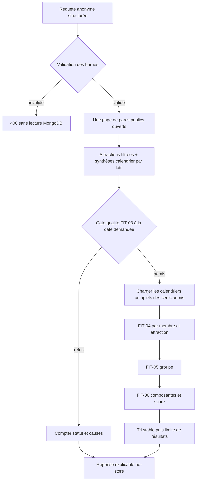
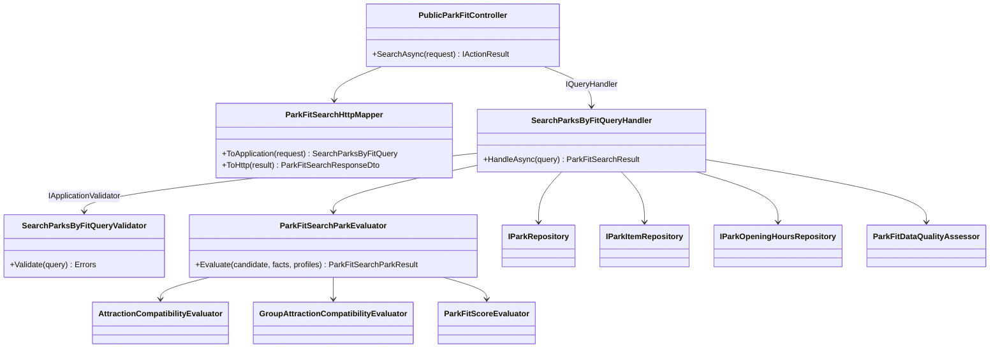
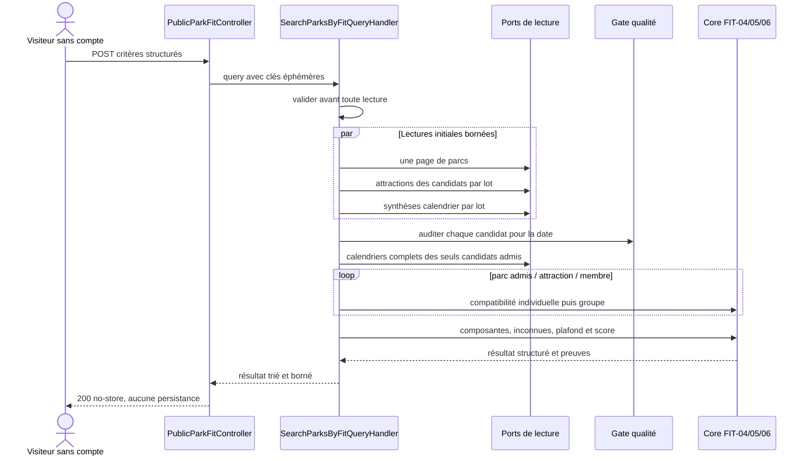

# FIT-07 — API de recherche anonyme et bornée

Date : 14 septembre 2026

Version applicative : `5.3.22`

Version de méthode : `park-fit-2026-01`

## 1. Valeur métier

FIT-07 relie les règles fiables des jalons précédents à un premier cas d'usage
produit : demander quels parcs correspondent le mieux à un groupe pour une date
donnée, sans créer de compte et sans enregistrer les critères.

Le endpoint ne promet pas qu'une personne sera admise. Il classe uniquement les
parcs qui franchissent la gate de qualité, distingue les faits connus des inconnues
et restitue les sources qui ont réellement soutenu les décisions.

Ce jalon ne comprend pas encore le formulaire visuel (`FIT-08`), la page détaillée
d'explication (`FIT-09`), la comparaison côte à côte (`FIT-10`), les profils
sauvegardés (`FIT-11`) ni le calcul de trajet (`FIT-12`).

## 2. Contrat HTTP minimal

```text
POST /api/public/park-fit/search
```

Exemple de requête :

```json
{
  "evaluationDate": "2026-10-10",
  "members": [
    {
      "heightCentimeters": 120,
      "minimumAgeYears": 8,
      "maximumAgeYears": 8,
      "canBeAccompanied": true,
      "companionMinimumAgeYears": 18,
      "companionMaximumAgeYears": 70
    }
  ],
  "preferredAttractionTypes": ["familyRide", "darkRide"],
  "preferIndoor": true,
  "countryCode": "FR",
  "unknownDataPolicy": "keepWithWarning",
  "maximumResults": 10
}
```

Bornes :

- 1 à 8 membres ;
- 0 à 8 types précis d'attractions, sans doublon ;
- tranches d'âge et tailles limitées aux valeurs admises par le Core ;
- code pays ISO à deux lettres facultatif ;
- 1 à 20 résultats ;
- 200 candidats inspectés au maximum ;
- 12 sources critiques au maximum par parc ;
- 6 requêtes par adresse IP et par minute par défaut, configurable au déploiement.

Le contrat membre ne contient ni nom, ni alias, ni texte libre. Le mapper HTTP
génère des clés ordinales éphémères (`member-1`, `member-2`) pour permettre au Core
d'associer ses calculs pendant la requête. Ces clés ne sont ni renvoyées ni stockées.

## 3. Réponse explicable

La réponse globale expose :

- la version de méthode et la date exacte évaluée ;
- l'horodatage UTC du calcul ;
- le nombre total, inspecté, éligible et rejeté de candidats ;
- l'éventuelle troncature du portefeuille ;
- les nombres par statut qualité et par cause de rejet ;
- une liste bornée de parcs ordonnée de façon déterministe.

Chaque parc expose son nom public et son identifiant de navigation, puis :

- l'état `Available`, `Capped`, `Suspended` ou `Excluded` ;
- le score comparatif facultatif, le score brut connu et le plafond appliqué ;
- la couverture, la confiance et le nombre d'inconnues ;
- les cinq composantes avec poids, contribution, couverture et raisons ;
- les volumes `EveryoneTogether`, `PossibleWithSplit`, `Partial`, `None` et
  `Unknown` ;
- la disponibilité exacte à la date demandée ;
- le statut et la fraîcheur de la qualité ;
- les sources critiques avec nature, URL ou référence, langue, dates, confiance et
  résumés localisés ;
- deux preuves ne sont dédupliquées que si toute leur identité, leurs métadonnées
  et leurs résumés localisés sont identiques.

Les codes structurés restent en anglais et stables dans l'API. Angular les traduira
dans `FIT-09` ; le backend ne fabrique pas de phrases d'interface.

## 4. Règles de décision



Une date explicitement fermée produit `Unavailable`, puis un résultat `Excluded`.
Un calendrier sans règle pour cette date produit `Unknown`. Cette inconnue suit la
politique demandée et n'est jamais convertie en ouverture.

Sans préférence de type, `PreferenceCoverage` est neutre et connue à 100 : le parc
n'est ni favorisé ni pénalisé par une préférence absente. La composante intérieure
est `NotApplicable` lorsqu'elle n'est pas demandée. Trajet et budget restent
`NotApplicable` jusqu'aux jalons prévus et sortent donc du dénominateur.

Pour plusieurs membres tous individuellement compatibles, FIT-07 ne déduit pas que
le groupe tiendra dans un véhicule ni qu'un accompagnateur pourra couvrir plusieurs
personnes. Tant qu'aucun fait structuré ne prouve l'organisation, l'état collectif
reste `Unknown`, conformément à FIT-05.

## 5. Respect de l'architecture



- Core : règles pures, déterministes, sans HTTP ni persistance.
- Application : validation, orchestration et lectures par ports.
- Infrastructure : implémentations MongoDB existantes, sans nouveau stockage.
- WebAPI : contrat, mapping, statut HTTP, cache et limitation de débit.
- Angular : aucun calcul métier ; son intégration commencera dans FIT-08.

Chaque classe et chaque enum sont dans un fichier distinct.

## 6. Séquence d'une recherche



## 7. Confidentialité, sécurité et performance

- `[AllowAnonymous]` permet un premier résultat sans compte.
- `[ResponseCache(NoStore = true)]` interdit la mise en cache applicative du profil.
- Aucun critère personnel n'est placé dans une URL, une route ou la réponse.
- Aucun logger, événement analytics, dépôt d'écriture ou collection MongoDB n'est
  appelé par ce cas d'usage.
- Le rate limiting IP est distinct et configurable.
- La validation précède toutes les lectures.
- Les requêtes de données sont groupées ; il n'existe pas de lecture par parc ou
  attraction.
- Les calendriers complets, plus lourds, ne sont chargés qu'après la gate qualité.
- Le tri est stable : état, score, couverture, nom puis identifiant.

Le plafond de 200 candidats est explicite dans la réponse par
`candidatePoolTruncated`. Il protège le VPS et évite de prétendre avoir comparé un
portefeuille que le calcul n'a pas inspecté.

## 8. MongoDB et migration

FIT-07 ne modifie aucun document et n'ajoute aucun index ou collection. Il réutilise
les parcs, attractions, conditions enrichies par FIT-02 et calendriers existants.
Aucune migration MongoDB n'est nécessaire pour ce jalon.

## 9. Preuves automatisées

Les tests ciblés couvrent notamment :

- date obligatoire, bornes membres/préférences/résultats et code pays ;
- rejet des clés applicatives libres ou dupliquées ;
- cohérence des tranches d'âge et de l'accompagnement ;
- absence totale de lecture lorsque la requête est invalide ;
- une seule page de candidats et des lectures par lots ;
- chargement des calendriers complets limité aux candidats éligibles ;
- exposition des causes de rejet qualité et de la troncature ;
- ouverture et fermeture exactes à la date demandée ;
- date civile maximale évaluable sans dépassement du calendrier ;
- conservation de preuves partageant une URL mais portant des métadonnées distinctes ;
- préférence de types, résilience intérieure et inconnues ;
- route publique, `no-store` et policy de rate limiting ;
- mapping du nom public, des composantes, raisons et preuves localisées ;
- règle globale « une classe = un fichier ».

Les résultats exacts des commandes de validation sont consignés dans la pull
request de la version `5.3.22`.
