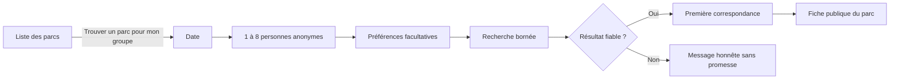
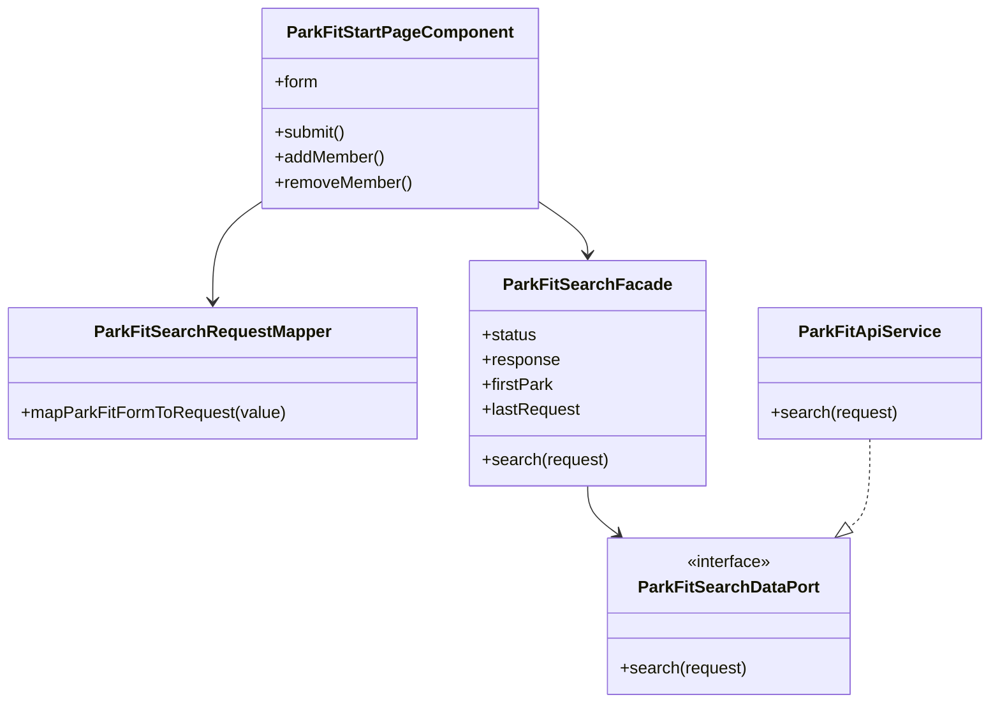
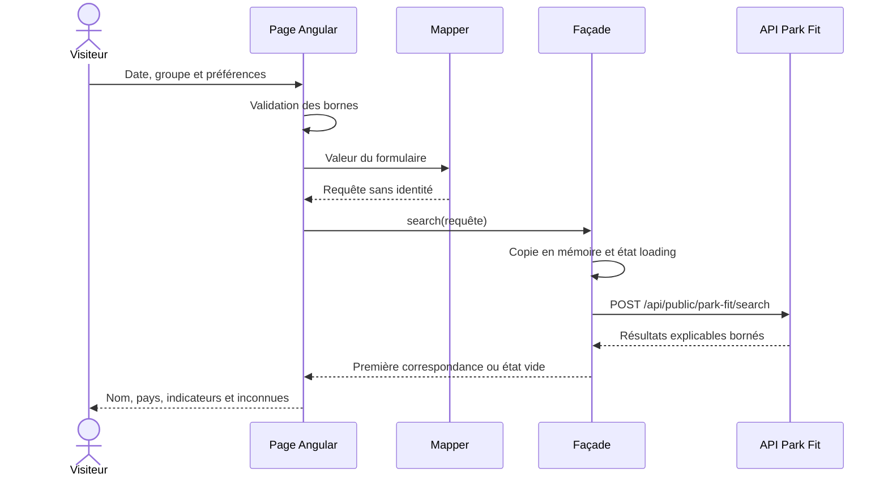

# FIT-08 — Formulaire Web anonyme et premier résultat

Date : 14 septembre 2026

Version applicative : `5.3.23`

Version de méthode : `park-fit-2026-01`

## 1. Valeur métier

FIT-08 rend enfin le moteur Park Fit utilisable par un visiteur. Depuis la liste
des parcs, la personne ouvre une boussole de sortie, indique la date, décrit les
membres du groupe et choisit quelques envies. Aucun compte, nom ou alias n'est
demandé avant le premier résultat.

Le jalon répond volontairement à une seule question : « quelle est la première
piste crédible pour notre groupe ? ». Il montre le nom du parc et trois indicateurs
concrets, sans présenter le score comme une probabilité ni cacher les inconnues.
La liste complète et les explications détaillées appartiennent à `FIT-09`.

## 2. Parcours livré



Le formulaire demande uniquement :

- une date d'évaluation ;
- pour chaque personne, une taille et un âge facultatifs ;
- la possibilité réelle d'être accompagnée et, facultativement, l'âge de
  l'accompagnateur ;
- des types d'attractions préférés ;
- une préférence facultative pour les expériences en intérieur.

Une valeur vide reste inconnue. Les préférences influencent l'ordre mais ne sont
pas des exclusions. Le client fixe la politique prudente `KeepWithWarning` et une
réponse limitée à dix parcs.

## 3. Confidentialité par construction

```text
URL publique
└── /{lang}/park-fit
    ├── aucun nom
    ├── aucune taille
    ├── aucun âge
    └── aucune préférence

Mémoire de l'onglet Angular
└── dernière requête structurée, perdue au rechargement

API
└── calcul synchrone no-store, sans écriture MongoDB
```

La route utilise le rendu client. Les critères ne sont donc pas sérialisés dans le
HTML SSR public. La façade conserve une copie de la dernière requête uniquement en
mémoire pour restaurer le formulaire après une navigation dans le même onglet. Il
n'existe ni `localStorage`, ni `sessionStorage`, ni collection MongoDB, ni donnée
analytics ajoutée par ce jalon.

La page porte `noindex,nofollow,noarchive`, sans `hreflang` ni JSON-LD. Le serveur
reconnaît explicitement sa route afin qu'un accès direct renvoie bien `200` tout en
appliquant aussi l'en-tête `X-Robots-Tag` strict. Elle garde une URL canonique
stable qui ne contient aucun critère.

## 4. Architecture Angular



Le composant gère l'affichage et le formulaire typé. Le mapper construit le contrat
minimal. La façade orchestre les états `idle`, `loading`, `success` et `error`,
empêche un double envoi et traduit les erreurs HTTP en messages localisés. Le port
isole la fonctionnalité du service HTTP concret. Aucun calcul de compatibilité ou
de score n'est dupliqué dans Angular.

## 5. Séquence d'une recherche



Un second clic pendant le calcul est ignoré. Un code `429` reçoit un message dédié
et une requête invalide un message de correction ; aucune erreur technique brute
n'est affichée. Un parc explicitement `Excluded`, notamment pour une fermeture
connue, n'est jamais présenté comme la première correspondance.

## 6. Responsive et accessibilité

La page est construite sans largeur minimale imposée par son contenu : chaque
grille emploie `minmax(0, 1fr)`, les contrôles sont bornés à `100%` et les textes
longs peuvent revenir à la ligne. Sous 760 px, le bloc d'introduction et l'action
finale passent sur une colonne. Sous 560 px, les champs membres, les indicateurs et
les actions deviennent verticaux. Une adaptation supplémentaire protège les écrans
de 360 px.

Les cibles interactives mesurent au moins 44 px. Les préférences sont de vrais
boutons avec `aria-pressed`, les erreurs utilisent `role="alert"`, le chargement et
le résultat sont annoncés, et les libellés ne reposent pas uniquement sur la couleur.

## 7. Navigation et identité publique

Le point d'entrée est intégré au héros de la liste des parcs plutôt qu'à la barre
mobile déjà dense. Le résultat affiche exclusivement `parkName` et le pays
localisé. `parkId` reste une donnée de navigation opaque utilisée pour produire la
route canonique existante de la fiche ; il n'est jamais rendu comme libellé.

## 8. Persistance et MongoDB

FIT-08 ne nécessite aucune migration MongoDB. Il consomme le contrat de FIT-07 et
ne crée aucun document. Le schéma lu et les preuves métier restent ceux documentés
dans FIT-02, FIT-03 et FIT-07.

## 9. Preuves automatisées

| Niveau | Comportements couverts |
|---|---|
| Mapper | âges exacts, entiers normalisés, accompagnateur supprimé lorsqu'il n'est pas applicable, politique prudente |
| Façade | copie en mémoire, premier résultat, double envoi bloqué, erreur de limitation dédiée |
| HTTP | `POST` anonyme, corps exact, absence de transfert cache |
| Page | groupe borné de 1 à 8, aucune propriété nominative, restauration en mémoire, SEO privé |
| Routes | accès sans garde de compte, rendu client avant le fallback SSR |
| Responsive | largeur bornée, reflow à 560 et 360 px, rupture des textes longs |
| i18n | clés synchronisées et contrôlées dans les huit langues |
| Architecture | façade derrière un port et règle une classe par fichier |

## 10. Limite assumée et suite

Le premier écran ne présente qu'un parc et trois indicateurs afin de garder une
entrée simple. `FIT-09` ajoutera la liste de résultats et une explication complète :
facteurs favorables, incompatibilités, inconnues, couverture, fraîcheur, méthode et
preuves critiques. Cette séparation empêche FIT-08 de devenir une page dense ou
administrative avant que la hiérarchie d'explication soit conçue et testée.
