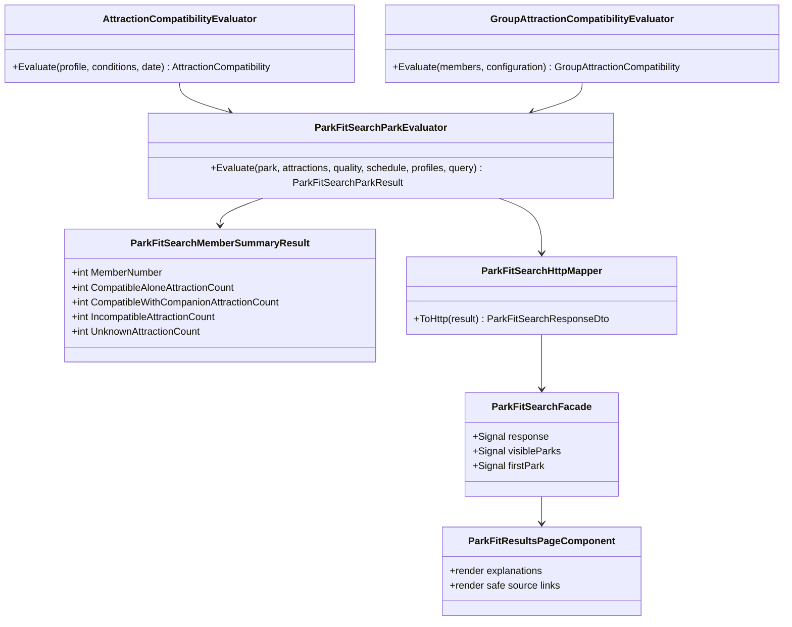
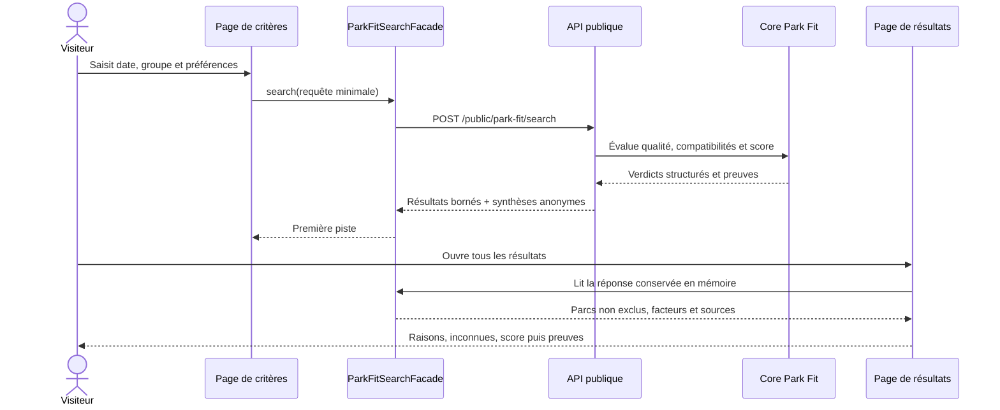
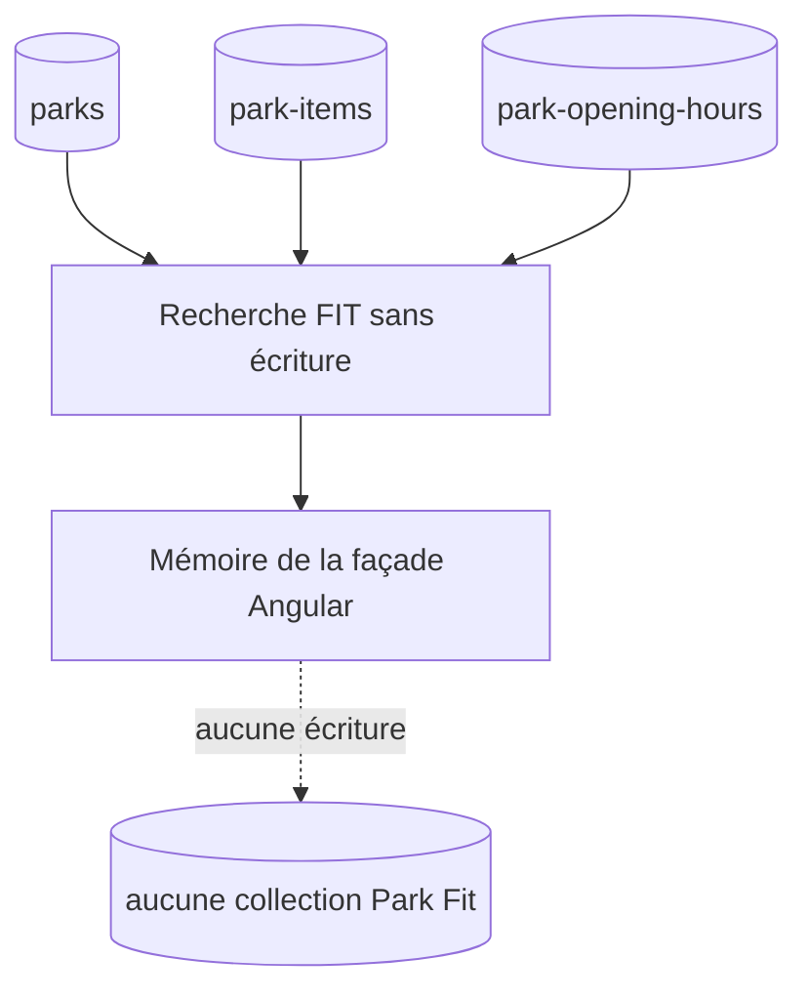

# FIT-09 — Résultats Park Fit expliqués

## Résultat métier

Après une recherche anonyme, la personne ne reçoit plus seulement une première
piste. Elle peut ouvrir une page de décision qui présente tous les parcs encore
comparables, dans l'ordre calculé par la méthode versionnée.

Chaque résultat montre, avant le score :

- ce que tout le groupe peut faire ensemble ;
- ce qui demande une organisation ou une séparation du groupe ;
- les inconnues restantes, même lorsque leur nombre est nul ;
- une synthèse par personne, identifiée uniquement par son rang dans le formulaire ;
- les limites qui ont plafonné, suspendu ou rendu impossible le score ;
- la disponibilité connue pour la date choisie.

Le score vient ensuite, avec sa couverture et sa confiance. Le texte précise qu'il
sert à ordonner les réponses d'une même recherche et qu'il ne constitue ni une
probabilité ni une garantie d'accès.

## Parcours

Un rechargement direct de la page de résultats ne tente pas de reconstruire des
critères privés. Il propose de relancer la recherche. La page et le formulaire sont
rendus uniquement côté client et portent `noindex, nofollow, noarchive`.
La page profonde conserve néanmoins un fil d'Ariane visible et un `BreadcrumbList`
localisé reliant l'accueil, le formulaire Park Fit et les résultats.

## Architecture

La règle de compatibilité reste dans le Core. L'Application orchestre les résultats
et produit la synthèse anonyme par personne. La WebAPI ne fait que mapper le contrat.
Angular traduit les codes structurés à travers une table fermée : une future valeur
inconnue reçoit un libellé générique et n'est jamais affichée telle quelle.

## Séquence

## Contrat et confidentialité

`ParkFitSearchMemberSummaryDto` ajoute uniquement : numéro ordinal de personne et
compteurs de verdicts. Le contrat n'expose pas la clé éphémère du backend, ne répète
pas la taille ou l'âge et n'ajoute aucun nom.

Les identifiants de parc servent uniquement à fabriquer les routes publiques. Les
références internes d'une preuve ne sont jamais affichées. Seules les URL HTTPS
validées deviennent des liens ; le résumé privilégie la langue active, puis
l'anglais, puis la première traduction non vide.
Les horodatages de vérification sont formatés dans le fuseau UTC afin de conserver
la date factuelle publiée, indépendamment du fuseau du visiteur.

## MongoDB

FIT-09 n'ajoute ni collection, ni index, ni migration. Les critères et résultats
restent en mémoire dans l'onglet courant. Les collections existantes de parcs,
d'attractions et de calendriers demeurent les seules sources du calcul déjà livré
par FIT-07.

## Responsive et accessibilité

La page utilise des cartes plutôt qu'un tableau horizontal. Chaque grille revient à
une seule colonne à 760 px ou 520 px ; les sources passent à une colonne à 360 px.
Les conteneurs ont `min-width: 0`, les textes peuvent se couper et l'hôte interdit
le débordement horizontal. Les actions ont une largeur tactile complète sur mobile.
L'ordre visuel et DOM conserve raisons, inconnues, score, puis preuves.

## Preuves automatisées

- Application : synthèse ordinale par membre à partir des verdicts individuels ;
- WebAPI : mapping du nom public, des explications, preuves et compteurs individuels ;
- Angular : filtrage des parcs exclus, fallback des codes inconnus, choix de la
  traduction de source et refus des URL non HTTPS ;
- routes : page anonyme sans garde, CSR et en-tête robots privé ;
- responsive : contrats 520 px et 360 px sans largeur minimale débordante ;
- i18n : parité des clés et bundles générés dans les huit langues ;
- architecture : façade/port et une classe par fichier.

## Limites assumées et suite

Le trajet et le budget sont affichés comme non demandés tant que FIT-12 ne les
calcule pas. FIT-10 réutilisera ces mêmes explications pour comparer de deux à quatre
parcs côte à côte sans créer une seconde méthode de score.
