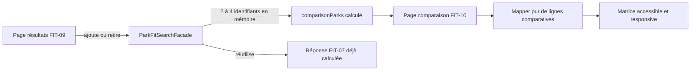
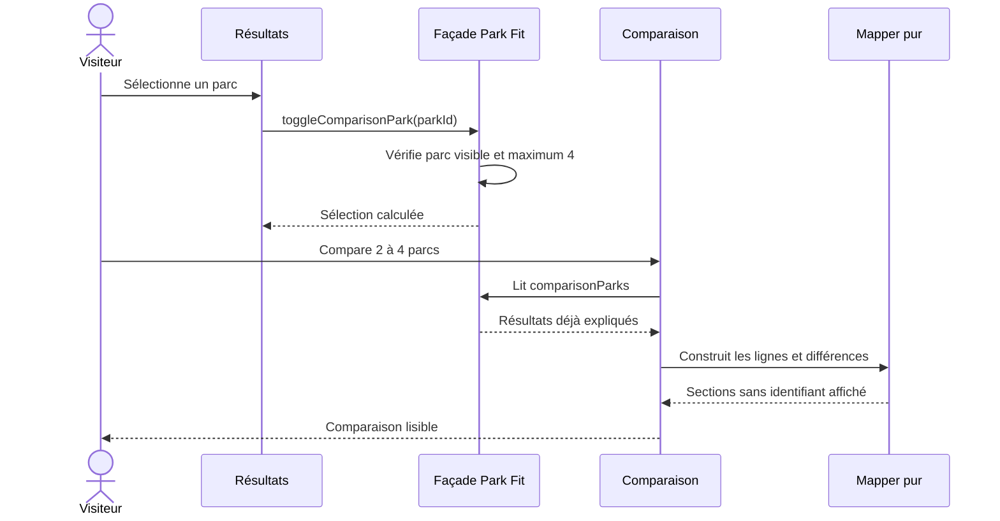
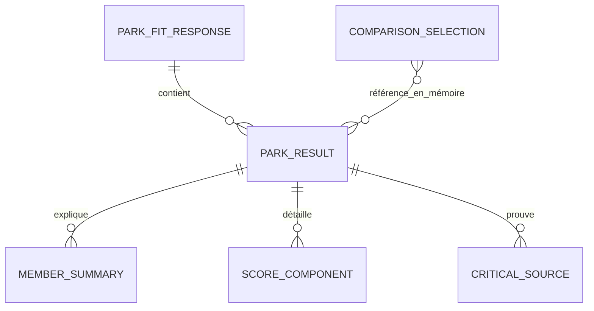

# FIT-10 — Comparaison côte à côte des résultats Park Fit

## Résultat métier

Le visiteur peut choisir de deux à quatre parcs parmi les résultats fiables de la
même recherche et comprendre leurs écarts sans alterner entre plusieurs fiches. La
comparaison ne réduit pas la décision à une note : elle place sur les mêmes lignes
la compatibilité du groupe et de chaque personne, les expériences communes, les
inconnues, les préférences, les contraintes pratiques et la qualité des preuves.

Une différence est signalée par le texte « Différence », une icône et une bordure
distincte. Le filtre « seulement les différences » retire les lignes identiques sans
changer ni recalculer les résultats.

## Périmètre livré

- sélection explicite de 2 à 4 parcs depuis les cartes expliquées ;
- retrait d'un parc et blocage accessible du cinquième choix ;
- remise à zéro de la sélection lors d'une nouvelle recherche ;
- page `/:lang/park-fit/compare` en rendu client et hors indexation ;
- fil d'Ariane visible `Accueil > Park Fit > Résultats > Comparaison` et équivalent
  `BreadcrumbList` JSON-LD localisé ;
- matrice couvrant toutes les données actuellement fiables du résultat FIT-07 ;
- mode « différences uniquement » ;
- liens publics limités aux URL HTTPS officielles ou fournies par l'exploitant ;
- huit langues et note de version 5.3.26 ;
- comportement explicite lorsque la navigation directe ne contient plus la sélection.

Changer les poids, enregistrer dans une liste, créer un projet et partager un snapshot
ne sont pas simulés dans ce jalon : ils nécessitent respectivement un contrat de
recalcul et les briques de persistance/partage prévues plus loin dans la roadmap.

## Architecture

La façade orchestre l'état éphémère. Le composant ne contacte aucune API concrète et
le mapper pur transforme les résultats structurés en sections, cellules et empreintes
de différence. Il réutilise les mappers fermés de FIT-09 pour les états métier et la
validation des URL ; aucune phrase localisée ne remonte du backend.

## Séquence

## Données et confidentialité

`COMPARISON_SELECTION` n'est pas une collection MongoDB. Il s'agit d'un signal Angular
contenant au maximum quatre identifiants déjà présents dans la réponse courante. Il
n'y a donc ni migration, ni index, ni endpoint de duplication, ni persistance locale.
Les tailles, âges et capacités d'accompagnement ne figurent ni dans l'URL ni dans la
matrice ; seuls les totaux anonymes par personne fournis par FIT-09 sont comparés.

## Lecture honnête

- le score reste nommé « comparatif » et accompagné de sa couverture et de sa confiance ;
- les lignes de trajet, budget et intérieur utilisent les sous-scores versionnés quand
  ils existent, sinon elles disent que la donnée est indisponible ou non demandée ;
- l'ouverture reprend l'état calendaire calculé, tandis que l'heure exacte est déclarée
  indisponible tant que le contrat ne l'expose pas ;
- l'absence de lien officiel public n'est pas remplacée par une référence interne ;
- masquer les lignes identiques ne modifie aucune valeur.

## Responsive et accessibilité

Au-dessus de 960 px, chaque ligne utilise une colonne de libellé et deux à quatre
colonnes de parcs. Sous 960 px, la ligne devient une carte verticale et répète le nom
du parc avant chaque valeur : aucune correspondance ne dépend de la position visuelle.
Tous les conteneurs emploient `min-width: 0`, `max-width: 100%` et des retours de mots ;
le composant racine coupe tout débordement horizontal. À 700 px, actions et barre de
filtre occupent la largeur disponible ; un contrat CSS spécifique couvre aussi 360 px.

Les sélections et le filtre utilisent `aria-pressed`, les zones dynamiques annoncent
le compte choisi, les titres structurent les sections et les différences ont un texte
explicite en plus de leur présentation visuelle.

## Preuves automatisées

- façade : ordre, minimum, maximum, retrait et remise à zéro ;
- mapper : détection des différences et non-exposition des références techniques ;
- sécurité des sources : seule une URL HTTPS validée devient cliquable ;
- routes : accès anonyme et rendu client ;
- SSR : statut 200 de l'enveloppe privée et en-tête `noindex, nofollow, noarchive` ;
- SEO : fil d'Ariane JSON-LD à quatre niveaux ;
- page : navigation localisée et filtre de différences ;
- responsive : bascule de la grille en cartes et garde-fous jusqu'à 360 px ;
- i18n : parité des huit langues.
