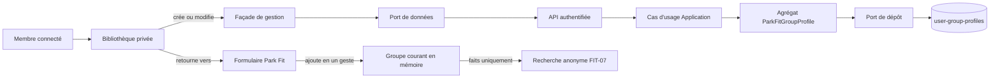
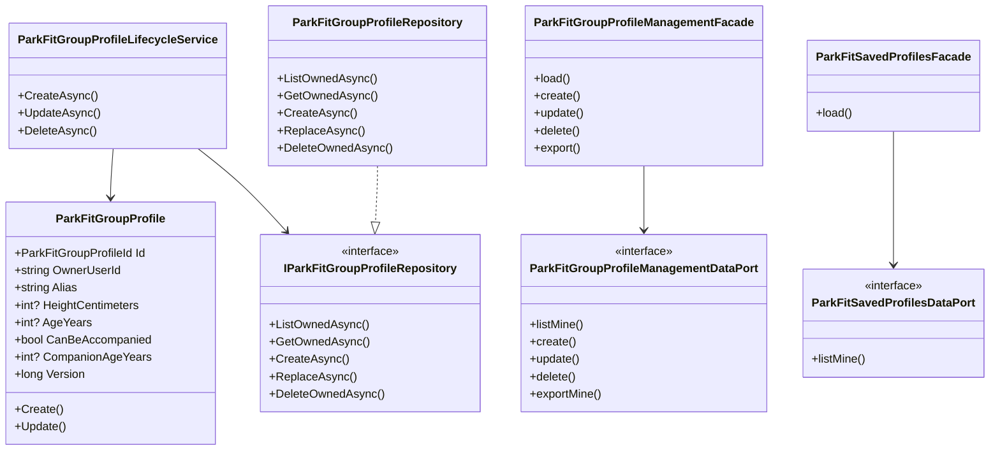
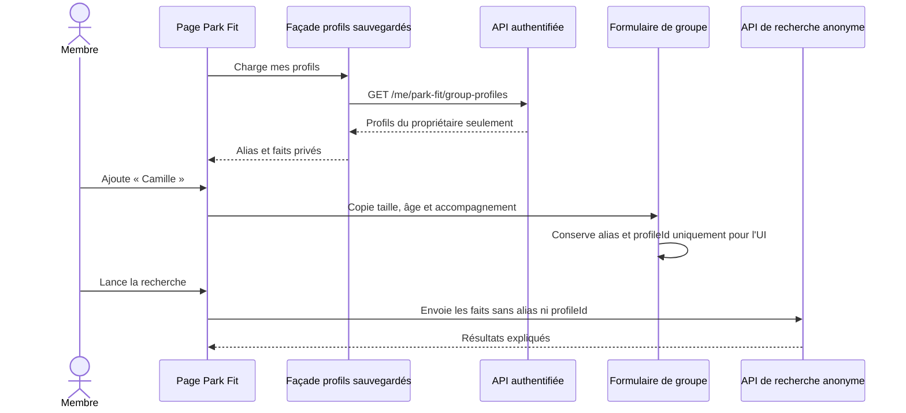
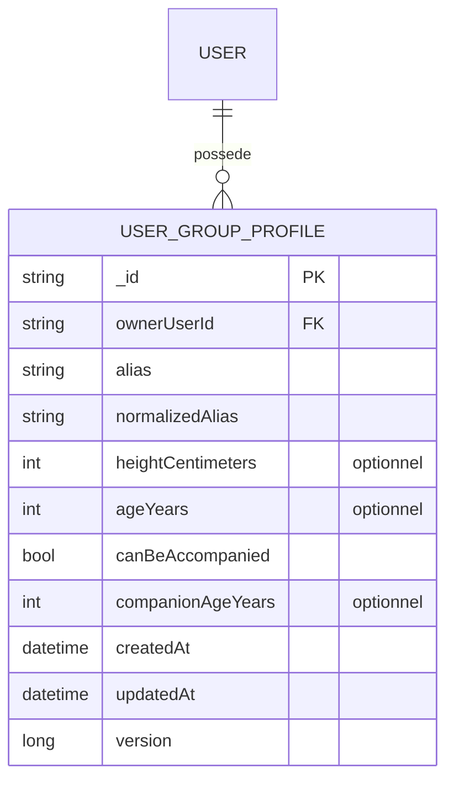

# FIT-11 — Profils privés sauvegardés pour Park Fit

## Résultat métier

Un membre connecté peut enregistrer les caractéristiques utiles d'une personne sous
un alias privé, puis ajouter ce profil à un groupe Park Fit en un geste. Il ne doit
plus ressaisir la taille, l'âge ou la possibilité d'être accompagné à chaque
recherche. L'alias sert uniquement à reconnaître le profil dans l'espace privé : il
n'est jamais envoyé au moteur de recommandation.

Le membre dispose d'une bibliothèque dédiée pour créer, modifier, supprimer et
exporter ses profils. Les visiteurs sans compte conservent le formulaire anonyme de
FIT-08, sans friction ni persistance imposée.

## Périmètre livré

- bibliothèque privée accessible sous `/:lang/profile/park-fit/profiles` ;
- création et modification d'un alias, d'une taille, d'un âge et des faits
  d'accompagnement déjà compris par le moteur ;
- ajout d'un profil sauvegardé dans le groupe depuis la page Park Fit ;
- impossibilité d'ajouter deux fois le même profil à une recherche ;
- suppression avec confirmation explicite ;
- export JSON lisible, dépourvu d'identifiant de profil, d'identifiant utilisateur
  et de version technique ;
- isolation systématique par propriétaire et réponse introuvable en cas d'accès à
  un profil tiers ;
- protection contre l'écrasement d'une modification plus récente ;
- interface traduite dans les huit langues et version 5.3.27 ;
- création automatique de la collection et de ses index au démarrage, sans commande
  MongoDB manuelle.

Les recherches, favoris, projets et résultats Park Fit ne sont pas persistés par ce
jalon. Le profil sauvegardé est une aide de saisie privée, pas une identité publique
ni un dossier médical.

## Flux fonctionnel

Le frontend dépend de ports abstraits. Les façades portent l'orchestration et les
composants restent concentrés sur l'affichage. Côté serveur, le contrôleur traduit
HTTP, les handlers délèguent au service applicatif, l'agrégat Core protège les règles
et Infrastructure seule connaît MongoDB.

## Diagramme de classes

Les deux ports frontend sont adaptés à leur consommateur : la page Park Fit ne reçoit
que la lecture, tandis que la bibliothèque privée peut exercer tout le cycle de vie.
Ils sont indépendants du port serveur portant le même rôle architectural.

## Séquence d'ajout dans une recherche

## Schéma MongoDB

La collection `user-group-profiles` possède deux index :

- `(ownerUserId, normalizedAlias)` unique, afin qu'un membre ne crée pas deux alias
  équivalents malgré la casse ou les espaces ;
- `(ownerUserId, updatedAt desc, _id)`, afin d'afficher efficacement la bibliothèque
  privée dans un ordre stable.

Les filtres de lecture, remplacement et suppression contiennent tous
`ownerUserId`. Les mutations contiennent également `version` : une action fondée sur
un écran périmé reçoit un conflit au lieu d'écraser l'état courant.

## Confidentialité et minimisation

- l'API exige un compte activé et non bloqué ;
- les réponses portent `Cache-Control: no-store` ;
- les aliases et caractéristiques ne sont jamais rendus sur une page publique ;
- le propriétaire n'est jamais exposé par le contrat HTTP ;
- l'export omet `_id`, `ownerUserId`, `normalizedAlias`, les dates et `version` ;
- le mapper de recherche ignore explicitement les deux champs UI
  `sourceProfileId` et `sourceAlias` ;
- aucune donnée n'est placée dans l'URL, le stockage du navigateur ou l'analytics par
  cette fonctionnalité.

## Responsive et accessibilité

La bibliothèque utilise des cartes fluides en `minmax`, des conteneurs avec
`min-width: 0`, des mots cassables et aucun minimum fixe susceptible d'élargir le
viewport. Sous 520 px, les actions occupent la largeur disponible ; à 360 px, les
faits passent sur une seule colonne. Les cibles tactiles atteignent 44 px et les
erreurs sont annoncées comme alertes. La sélection rapide sur Park Fit utilise une
liste horizontale contenue qui se replie sans défilement de page.

## Preuves automatisées

- Core : validation, normalisation et incrément de version ;
- Application : création, conflit d'alias, accès tiers, conflit concurrent et
  suppression ;
- export : absence d'identifiants techniques et du propriétaire ;
- Infrastructure : mapping aller-retour, filtres propriétaires et définition des
  index MongoDB ;
- WebAPI : authentification et contrats sans identifiant propriétaire ;
- frontend : appels HTTP, façades, route authentifiée, ajout au groupe sans fuite
  d'alias/ID, contrat responsive et parité des huit langues ;
- architecture : une seule classe par fichier et dépendances façades/ports contrôlées.
