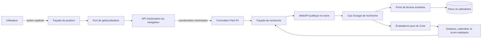
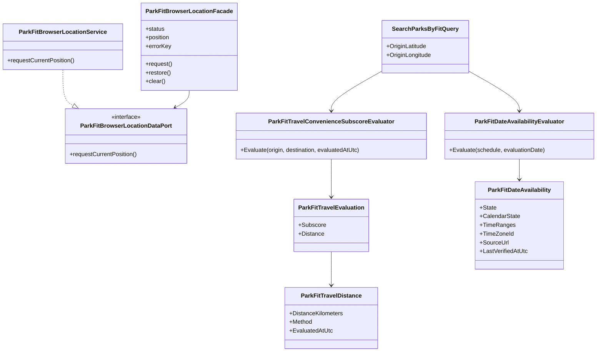
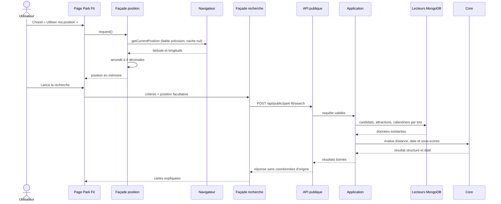
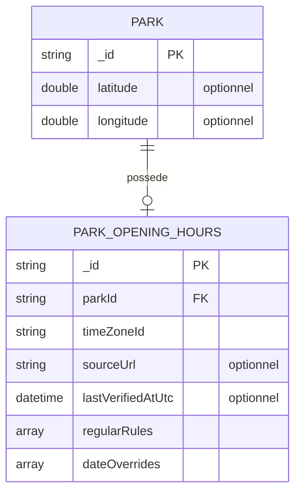

# FIT-12 — Distance directe et calendrier explicite

## Résultat métier

Park Fit peut maintenant tenir compte du trajet sans demander d'adresse et sans faire
croire qu'il connaît un itinéraire routier. L'utilisateur choisit librement de
partager sa position avec le navigateur ; chaque parc affiche alors sa distance
directe, calculée à vol d'oiseau et datée. Sans ce choix, la recherche fonctionne
exactement comme avant et le trajet ne participe pas au score.

Le résultat explique aussi ce que le calendrier permet réellement de conclure pour
la date choisie. Il ne réduit plus toutes les absences d'information à un simple
« inconnu » : ouverture, fermeture, fermeture exceptionnelle, calendrier non publié,
trou dans un calendrier existant et horaires manquants restent distincts.

## Périmètre livré

- activation volontaire de la position dans le formulaire public Park Fit ;
- coordonnées arrondies à quatre décimales dans le navigateur avant l'appel HTTP ;
- validation serveur d'une paire latitude/longitude finie et dans les bornes du
  globe ;
- aucune réexposition de l'origine dans la réponse ;
- calcul géodésique pur à partir des coordonnées déjà connues du parc ;
- distance arrondie au dixième de kilomètre et horodatée ;
- sous-score de trajet linéaire, de 100 à 0 entre 0 et 1 000 km ;
- méthode comparative versionnée `park-fit-2026-02` ;
- six états métier de calendrier et restitution des horaires, du fuseau, de la
  fraîcheur et de la source officielle HTTPS ;
- affichage des mêmes faits dans les résultats et la comparaison ;
- interface et erreurs traduites dans les huit langues ;
- contrats responsive jusqu'à 360 px ;
- version applicative 5.3.28.

Un temps de route, un itinéraire, un trafic en temps réel, une adresse, une durée
minute par minute ou un filtre de rayon ne sont pas inventés par ce jalon. Ils
nécessiteraient un fournisseur, ses conditions, ses quotas et une politique de cache
distincte.

## Décision sur la distance

La distance est calculée avec la formule de Haversine déjà centralisée dans le Core :

```text
distanceKm = rayonTerrestre × angle(origin, parc)
scoreTrajet = 100 × (1 000 - min(distanceKm, 1 000)) / 1 000
```

La valeur est une préférence souple, pas un filtre éliminatoire. Elle porte une
confiance `Medium`, car une ligne droite ne représente ni les routes, ni les
frontières, ni le trafic. Le plafond de confiance de la méthode empêche donc le score
comparatif d'afficher une certitude supérieure à la nature de ce fait. À partir de
1 000 km, le sous-score vaut zéro, mais le parc n'est pas exclu.

| Situation | État du sous-score | Valeur exposée | Effet |
|---|---|---|---|
| position non demandée | `NotApplicable` | aucune | le poids trajet quitte le dénominateur |
| position connue, parc sans coordonnées | `Unknown` | aucune | la couverture baisse, aucune distance n'est inventée |
| deux positions connues | `Known` | distance directe datée | poids de 15 %, confiance moyenne |

## Décision sur le calendrier

| Fait disponible à la date | État public | Disponibilité utilisée par le score |
|---|---|---|
| plage horaire connue | `OpenConfirmed` | disponible |
| règle régulière explicitement fermée | `ClosedConfirmed` | indisponible |
| exception datée explicitement fermée | `ExceptionalClosure` | indisponible |
| date en dehors de toute période publiée | `CalendarNotPublished` | inconnue |
| trou entre des périodes déjà publiées | `CalendarIncomplete` | inconnue |
| règle présente, mais ni horaires ni fermeture explicite | `OpeningHoursUnknown` | inconnue |

Une fermeture connue continue d'exclure le parc pour la date. Une donnée inconnue
suit la politique Park Fit déjà choisie (`KeepWithWarning`, `KnownOnly` ou
`ExcludeUnknown`) ; elle ne devient jamais une ouverture par défaut.

Dans la comparaison, le fuseau et la date de vérification font partie de
l'empreinte de différence afin que le filtre dédié ne masque pas deux calendriers
visuellement proches, mais factuellement distincts.

## Architecture applicative



- **Core** possède la formule de distance, la classification du calendrier et la
  pondération métier.
- **Application** valide l'origine, orchestre les lectures existantes et compose les
  évaluateurs sans règle de calcul dupliquée.
- **Infrastructure** conserve uniquement son rôle de lecture MongoDB. Aucun appel à
  un fournisseur de trajet n'est introduit.
- **WebAPI** traduit les contrats et ne rend cliquables que les sources calendrier
  en HTTPS.
- **Angular** demande le consentement par une action, minimise les coordonnées,
  orchestre via des façades et affiche les états structurés traduits.

## Diagramme de classes



Chaque classe de production reste dans son propre fichier. Les ports séparent les
façades Angular des implémentations concrètes, et les calculs restent hors des
composants et des contrôleurs.

## Séquence d'une recherche avec position



## Schéma MongoDB et migration

FIT-12 ne crée et ne modifie aucun document. Il lit uniquement les champs existants :



Les coordonnées d'origine ne sont jamais écrites dans MongoDB. Les index existants
sur l'identifiant de parc du calendrier couvrent déjà la lecture groupée. Il n'y a
donc ni migration, ni nouveau schéma, ni collection à initialiser après déploiement.

## Confidentialité, sécurité et probité

- la position n'est demandée qu'après une action explicite ;
- le service navigateur n'est jamais invoqué pendant le SSR ;
- la précision est réduite avant l'appel et l'origine n'est pas retournée par l'API ;
- après l'envoi, la position active et la copie des critères conservée pour faciliter
  un retour au formulaire effacent toutes deux l'origine ; une nouvelle recherche
  avec distance exige donc une nouvelle action explicite ;
- le lancement de la recherche reste désactivé pendant une demande de position : une
  réponse tardive du navigateur ne peut pas être réutilisée silencieusement ;
- l'origine n'entre ni dans l'URL, ni dans `localStorage`, ni dans `sessionStorage`,
  ni dans MongoDB, ni dans un événement analytics ;
- le résultat HTTP reste `no-store` et soumis au rate limit Park Fit existant ;
- retirer la position rétablit immédiatement un calcul sans trajet ;
- aucune URL calendrier non HTTPS n'est exposée comme lien ;
- les libellés disent « distance directe » et rappellent explicitement qu'il ne
  s'agit pas d'un itinéraire routier.

## Performance et exploitation

Le calcul Haversine est constant par parc et s'exécute sur le portefeuille déjà
borné à 200 candidats. Les parcs, attractions et calendriers conservent les lectures
par lots de FIT-07 ; aucun N+1 n'est ajouté. La réponse reste limitée à 20 résultats.

Comme aucun fournisseur externe n'est appelé, aucun cache de trajet, quota, retry,
circuit breaker ou secret n'est nécessaire. Cette absence est volontaire pour le
premier niveau honnête de distance. Un futur trajet routier devra introduire un port
Application dédié, une implémentation Infrastructure, une politique de coût et des
fallbacks sans remplacer silencieusement la méthode géodésique.

## Responsive et accessibilité

Le panneau de position utilise trois zones sur grand écran, deux zones puis une
action pleine largeur sous 560 px. Les cartes distance/calendrier utilisent des
colonnes fluides et passent sur une colonne sous 520 px. Tous les conteneurs portent
`min-width: 0`, les textes et URLs peuvent se couper, les boutons occupent la largeur
disponible et aucun minimum fixe ne peut élargir le viewport à 360 px.

L'état de chargement, le refus, l'indisponibilité et le succès sont textuels : la
compréhension ne dépend pas de la couleur. Le bouton d'effacement possède un libellé
et la source s'ouvre avec `noopener noreferrer`.

## Preuves automatisées

- Core : origine absente, destination absente, distance nulle, distance supérieure
  à 1 000 km, formule et horodatage ;
- Core : les six états calendrier, horaires, source, fuseau et fraîcheur ;
- Application : validation des paires et bornes géographiques, composition du
  trajet et du calendrier dans le résultat ;
- WebAPI : mapping des coordonnées en entrée, détail public en sortie et rejet des
  liens calendrier non HTTPS ;
- frontend : mapping minimisé, service de géolocalisation et absence d'appel SSR,
  façade, restitution, effacement, résultats, comparaison et contrats responsive ;
- i18n : parité des huit langues ;
- architecture : contrôle façades/ports et règle une classe par fichier.
