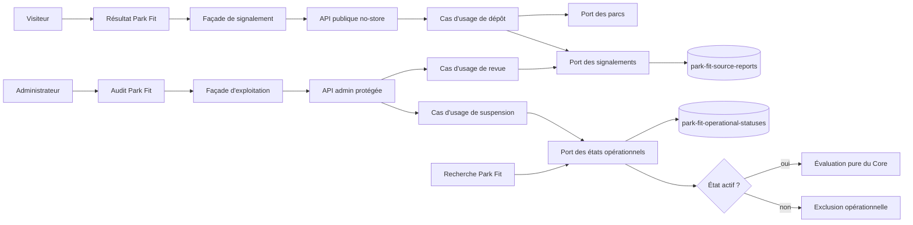
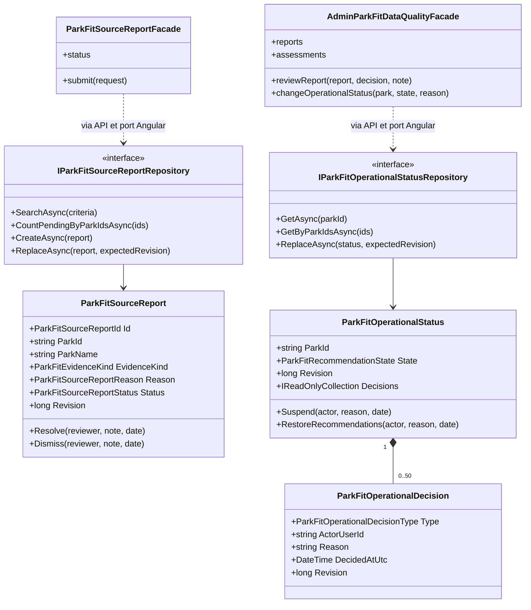
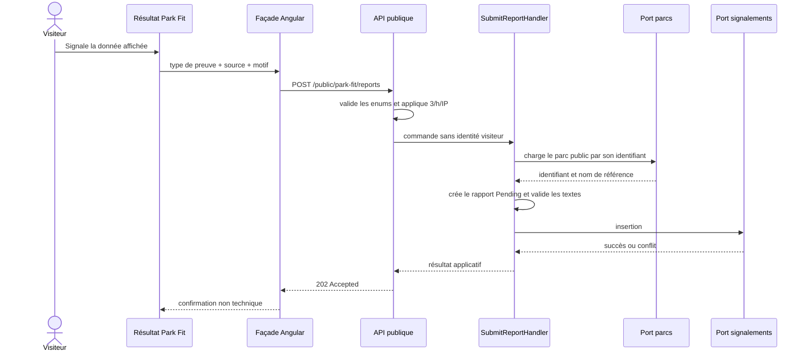
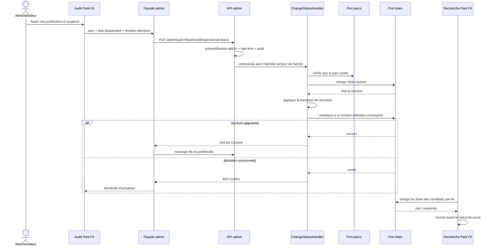
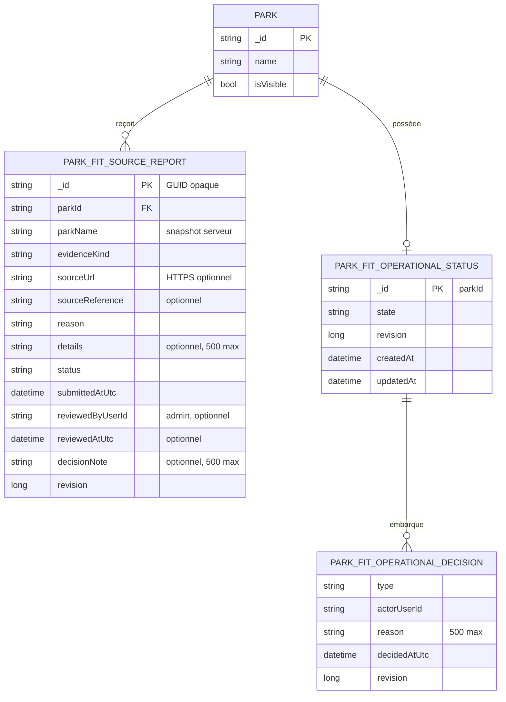

# FIT-13 — Sources, signalements et suspension opérationnelle

## Résultat métier

Park Fit devient exploitable dans la durée, même lorsque les données réelles
évoluent. Depuis une source affichée dans un résultat, un visiteur peut signaler
qu'une information semble dépassée, incorrecte, inaccessible ou incomplète. Il ne
doit ni créer de compte, ni fournir d'identité, ni recopier ses critères privés.

L'administration dispose d'une file de signalements reliée au portefeuille de
qualité. Elle peut vérifier la preuve, classer le retour comme corrigé ou sans suite,
et suspendre immédiatement un parc des recommandations Park Fit. Cette suspension
est volontairement indépendante de la visibilité générale : la fiche publique du
parc reste consultable et aucune donnée éditoriale n'est supprimée.

## Périmètre livré

- signalement public au plus près du calendrier et des conditions d'accès critiques ;
- cinq motifs structurés et une précision libre bornée à 500 caractères ;
- résolution du nom du parc côté serveur, sans faire confiance au navigateur ;
- file admin des signalements en attente avec preuve, motif et commentaire ;
- décision « corrigé » ou « sans suite », versionnée et auditée ;
- état Park Fit `Active` ou `Suspended`, séparé du statut public du parc ;
- justification obligatoire pour suspendre comme pour réactiver ;
- historique borné aux 50 dernières décisions opérationnelles ;
- exclusion des parcs suspendus avant les calculs de compatibilité coûteux ;
- compteur explicite des candidats suspendus dans le diagnostic de recherche ;
- compteurs de signalements par parc dans l'audit de qualité ;
- interface publique et admin traduite dans les huit langues ;
- contrats responsive vérifiés jusqu'à 360 px ;
- version applicative 5.3.29.

Ce jalon ne modifie pas les sources éditoriales à la place de l'équipe. Un
signalement constitue une alerte à vérifier, pas une preuve suffisante. Il ne rend
pas non plus un parc privé et ne supprime aucune attraction.

## Règles métier

### Cycle d'un signalement

```text
Pending ── marquer comme corrigé ──> Resolved
   └────── classer sans suite ──────> Dismissed
```

Un signalement traité est immuable. Une seconde décision doit partir d'un nouveau
signalement. La révision attendue protège contre deux décisions administratives
concurrentes : une seule écriture peut gagner.

Le motif `Other` exige une précision. Les autres motifs acceptent une précision
facultative. Les URLs de source doivent être absolues, en HTTPS, sans identifiant
embarqué. Les textes rejettent les balises et caractères de contrôle dangereux.

### Cycle opérationnel d'un parc

```text
Active ── suspendre + justification ──> Suspended
   ^                                      |
   └──── réactiver + justification ───────┘
```

Une transition vers l'état déjà actif est refusée. Chaque décision incrémente la
révision, conserve l'auteur côté serveur, la justification et un horodatage UTC
monotone. L'identité de l'administrateur n'est jamais exposée dans les contrats
publics ou dans la vue admin de l'historique.

| Situation | Fiche publique | Données du parc | Recherche Park Fit |
|---|---:|---:|---:|
| état absent ou `Active` | visible selon ses règles habituelles | inchangées | candidat si la qualité suffit |
| `Suspended` | inchangée | inchangées | exclu avant notation |
| signalement `Pending` seul | inchangée | inchangées | inchangée jusqu'à une décision admin |

## Architecture applicative



- **Core** porte les agrégats, transitions, invariants, révisions et historiques.
- **Application** résout les faits, orchestre les ports et ne connaît pas MongoDB.
- **Infrastructure** persiste les deux nouveaux agrégats avec écritures optimistes
  et lectures par lots.
- **WebAPI** applique autorisation, audit, rate limiting et traduction des contrats.
- **Angular** garde les composants concentrés sur l'affichage ; les effets réseau et
  états d'écran passent par des façades et des ports.

Chaque classe de production reste dans son propre fichier.

## Diagramme de classes



## Séquence d'un signalement public



Le nom transmis à l'administration provient du parc chargé côté serveur. Le client
ne peut donc pas associer artificiellement un identifiant à un faux nom.

## Séquence d'une suspension admin



## Schéma MongoDB



### Collections et index

`park-fit-source-reports` :

- `{ status: 1, submittedAtUtc: -1, _id: -1 }` pour la file admin paginée ;
- `{ parkId: 1, status: 1, submittedAtUtc: -1 }` pour les compteurs par parc.

`park-fit-operational-statuses` :

- `_id = parkId`, donc un seul état par parc ;
- `{ state: 1, updatedAt: -1 }` pour l'exploitation opérationnelle.

Les collections et index sont créés par l'initialiseur MongoDB au démarrage. Aucune
migration manuelle des documents existants n'est nécessaire : l'absence de document
opérationnel signifie `Active`. Il n'existe pas d'ancien mécanisme parallèle à
adapter ou à conserver.

## Confidentialité et sécurité

- aucun compte, nom, courriel ou identifiant de profil n'est demandé au visiteur ;
- aucun critère de groupe, position ou résultat complet n'est persisté avec le
  signalement ;
- seules la cible, la catégorie de preuve, la source déjà visible, le motif et la
  précision volontaire sont conservés ;
- la route publique est `no-store` et limitée par adresse IP à trois dépôts par
  heure par défaut ;
- les sources non HTTPS et les chaînes contenant du balisage sont refusées ;
- les routes de revue et suspension exigent un compte actif non bloqué avec rôle
  `ADMIN` ;
- chaque mutation admin est inscrite dans le journal d'audit existant ;
- les identités des administrateurs restent dans MongoDB et dans l'audit, jamais
  dans les DTO retournés à l'interface ;
- la révision optimiste produit un conflit plutôt qu'un écrasement silencieux ;
- la suspension ne détourne pas les règles de publication générales.

## Performance et exploitation

La recherche charge les états opérationnels pour tous les candidats en une lecture
groupée. Les parcs suspendus sont retirés avant l'évaluation de leurs attractions,
de leur calendrier et de leurs sous-scores. Aucun N+1 n'est ajouté.

L'audit admin charge en parallèle sa page de qualité et une page bornée à douze
signalements en attente. Les compteurs sont agrégés par MongoDB et le nombre de
décisions embarquées est limité à 50. Les mutations admin ont une concurrence
serveur de un, sans file d'attente, afin de protéger le VPS et de rendre les conflits
explicites.

## Responsive et accessibilité

- toutes les cartes, formulaires, liens et textes possèdent `min-width: 0` et une
  largeur maximale contenue ;
- les textes et URLs peuvent se couper sans élargir le viewport ;
- les zones de saisie utilisent la largeur disponible avec `box-sizing: border-box` ;
- sous 420 px, les entêtes, actions et boutons deviennent verticaux et pleine largeur ;
- les actions publiques atteignent au moins 44 px de hauteur ;
- les confirmations et erreurs sont annoncées via une zone `aria-live` ;
- l'état suspendu possède un texte et une icône, sans dépendre de la couleur seule ;
- les tests de contrat vérifient l'absence de `min-width` fixe et la présence des
  règles de confinement mobile jusqu'à 360 px.

## Preuves automatisées

- tests Core des transitions, validations, horodatages, révisions et historiques
  tronqués ;
- tests Application du dépôt, de la revue, de la concurrence, de la suspension sans
  changement de visibilité et de l'exclusion avant notation ;
- tests Infrastructure des allers-retours MongoDB et de la conservation des décisions ;
- tests WebAPI des contrats, rôles, audit, rate limiting et valeurs techniques
  invalides ;
- tests Angular des services HTTP, façades, rechargements après mutation, états
  d'erreur et contrats responsive ;
- vérifications i18n sur les huit langues, architecture des ports et règle une
  classe par fichier.

## Limites assumées et suite

FIT-13 ne corrige pas automatiquement une source et ne déduit pas une suspension à
partir du seul volume de signalements : une décision humaine traçable reste requise.
Il ne collecte pas non plus d'événement analytics nominatif.

FIT-14 instrumentera les résultats de façon agrégée et respectueuse de la vie privée
pour mesurer les sorties sans résultat, les inconnues et l'usage des explications.
Conformément à la décision produit, cette étape technique ne dépendra pas d'un volume
réel de visites ou d'un panel communautaire pour être implémentée.
