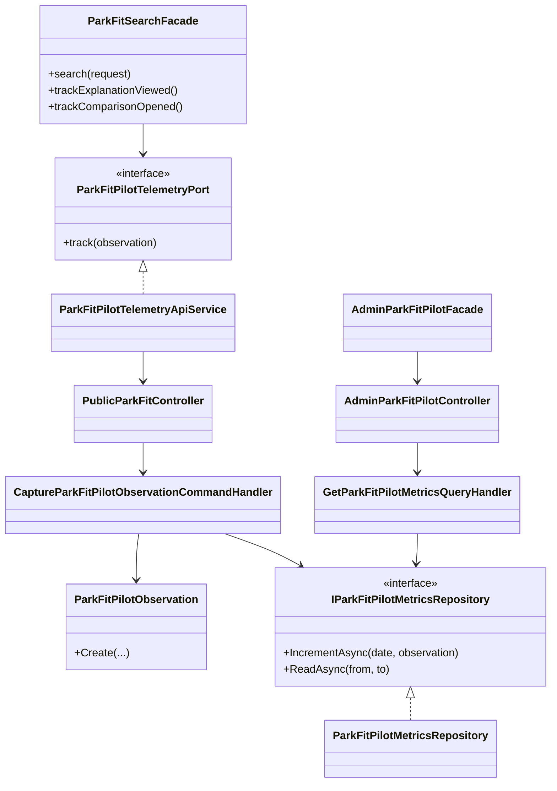
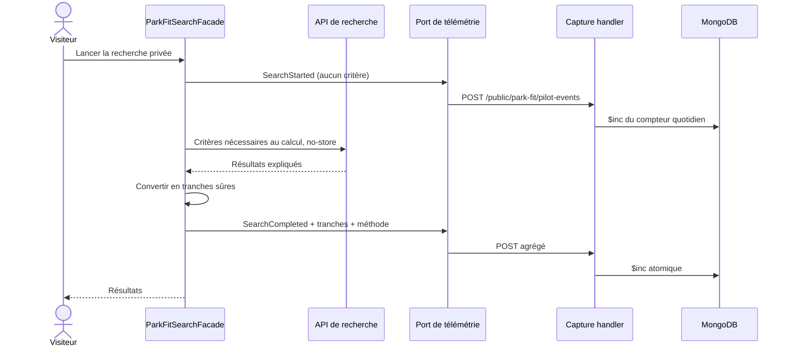
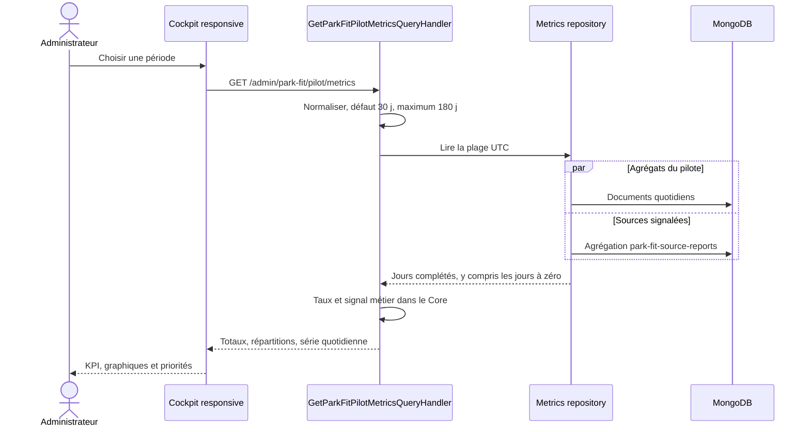

# FIT-14 — Observabilité privée du pilote Park Fit

## 1. Résultat métier

Le pilote peut désormais répondre à cinq questions sans connaître les personnes ni
leurs critères :

1. combien de recherches commencent et aboutissent ;
2. combien ne proposent aucun parc ;
3. à quelle fréquence les données inconnues limitent les réponses ;
4. si les explications et la comparaison sont réellement consultées ;
5. quelles lacunes ou sources dépassées doivent être traitées en priorité.

Ces indicateurs sont des aides à la décision. Ils ne remplacent pas une vérification
qualitative et aucune quantité minimale de visites ou de membres ne bloque les
prochains jalons techniques.

## 2. Confidentialité par construction

Le navigateur ne transmet que des catégories fermées :

- événement : recherche lancée, aboutie, échouée, explication ouverte ou comparaison ouverte ;
- volume de résultats : `None`, `One`, `TwoToFour`, `FiveOrMore` ;
- inconnues : `None`, `Limited`, `Significant` ;
- durée : quatre tranches, jamais une durée exacte ;
- échec : validation, limitation de débit ou problème technique ;
- comparaison : deux, trois ou quatre parcs ;
- version de méthode et codes publics de qualité déjà présents dans la réponse.

Le contrat interdit les identifiants de membre, session, recherche ou parc, les
coordonnées, la date demandée, les tailles, les âges, les préférences et tout texte
libre. L'API est anonyme, `no-store` et limitée par IP, mais l'adresse IP n'est pas
persistée. L'agrégation est faite pendant l'écriture : il n'existe donc aucune ligne
d'événement permettant de reconstruire un parcours individuel.

## 3. Architecture



Le Core valide les combinaisons d'événements et calcule le signal de santé. La couche
Application orchestre l'horloge, la plage de lecture et les taux. Infrastructure est
seule responsable des incréments atomiques et des requêtes MongoDB. Les contrôleurs
ne contiennent aucune règle métier. Angular passe par des ports pour la recherche,
la télémétrie et l'administration.

## 4. Schéma MongoDB

Collection : `park-fit-pilot-daily-metrics`.

```javascript
{
  _id: "2026-09-14",              // jour UTC, pas un identifiant de personne
  dateUtc: ISODate("2026-09-14T00:00:00Z"),
  eventCounts: {
    SearchStarted: NumberLong(18),
    SearchCompleted: NumberLong(15),
    ExplanationViewed: NumberLong(7),
    ComparisonOpened: NumberLong(4)
  },
  resultBandCounts: { None: NumberLong(2), TwoToFour: NumberLong(8) },
  unknownLevelCounts: { None: NumberLong(6), Limited: NumberLong(7), Significant: NumberLong(2) },
  durationBandCounts: { UnderHalfSecond: NumberLong(10), UnderOneAndHalfSeconds: NumberLong(5) },
  failureKindCounts: { Technical: NumberLong(1) },
  comparisonSizeCounts: { Two: NumberLong(3), Three: NumberLong(1) },
  qualityIssueCounts: { MissingOpeningCalendar: NumberLong(2) },
  zeroResultQualityIssueCounts: { MissingOpeningCalendar: NumberLong(1) },
  methodVersionCounts: { "park-fit-2026-02": NumberLong(15) },
  updatedAtUtc: ISODate("2026-09-14T18:45:00Z"),
  expiresAtUtc: ISODate("2027-10-19T00:00:00Z")
}
```

Index :

- `idx_park_fit_pilot_date` sur `dateUtc` pour les plages admin ;
- `idx_park_fit_pilot_retention` TTL sur `expiresAtUtc` pour supprimer
  automatiquement les agrégats après 400 jours ;
- `_id` garantit un document partagé unique par jour.

Chaque observation utilise un `updateOne` avec `upsert`, `$inc`, `SetOnInsert` et
`$set`. Aucun verrou applicatif ni lecture avant écriture n'est nécessaire. La
collection est créée et indexée par l'initialiseur au déploiement : aucune commande
MongoDB manuelle n'est attendue.

Les signalements de sources viennent de la collection canonique
`park-fit-source-reports`, agrégée côté base par jour et par raison. Ils ne sont pas
recopiés dans un second système.

## 5. Séquences

### 5.1 Recherche publique



Une panne de télémétrie n'empêche jamais la recherche ou l'affichage : l'envoi est
volontairement secondaire et son erreur est absorbée côté client.

### 5.2 Lecture du cockpit



## 6. Signal métier

Le Core calcule des pourcentages bornés : aboutissement, zéro résultat, inconnues
importantes, ouverture des explications et ouverture des comparaisons.

Les abandons sont la différence, bornée à zéro, entre recherches lancées et
recherches ayant abouti ou échoué. Les causes de résultat vide sont incrémentées
séparément à partir des codes de qualité agrégés de ces seules réponses.

- aucune recherche aboutie : `AwaitingObservations` ;
- au moins 25 % de résultats vides ou d'inconnues importantes : `NeedsAttention` ;
- explications ou comparaisons utilisées sans alerte précédente : `Encouraging` ;
- sinon : `Monitor`.

Le drapeau `RequiresQualitativeReview` reste toujours vrai : le signal ne prétend
pas prouver seul la compréhension ou l'utilité du produit.

## 7. Interface et responsive

La route admin lazy-loadée `/admin/park-fit-pilot` présente :

- une période filtrable de 30 jours par défaut et 180 jours au maximum ;
- huit indicateurs immédiatement lisibles ;
- un graphique quotidien sans dépendance graphique lourde ;
- les répartitions de résultats, inconnues et lacunes ;
- une explication permanente de la minimisation des données.

Toutes les grilles utilisent `minmax(0, 1fr)`, les descendants critiques ont
`min-width: 0`, les textes longs peuvent se couper et le seul débordement autorisé
est le défilement interne du graphique. Les cartes passent à une colonne sous
640 px et un contrat automatisé couvre également le paysage de faible hauteur.

## 8. Preuves automatisées

- Core : validation des combinaisons et calcul des taux/signaux ;
- Application : jour UTC, écriture par port, agrégation et plage invalide ;
- Infrastructure : index de lecture et TTL ;
- WebAPI : contrat public minimal, `no-store`, anonymat et rate limiting ;
- Angular : événements dépourvus de critères/identifiants, navigation admin,
  responsive, architecture des ports, règle une classe par fichier et huit langues.

Limite assumée : l'observabilité mesure les actions des navigateurs qui atteignent
l'application. Elle ne cherche pas à identifier un même visiteur entre deux actions,
et les compteurs anonymes peuvent être influencés par du trafic automatisé malgré
la limitation de débit. Les appels de trajet/cache et les ajouts à une liste ou à un
projet ne sont pas comptés tant que ces fonctions n'existent pas dans Park Fit ; ils
devront réutiliser ce même vocabulaire agrégé lorsqu'ils seront introduits.
