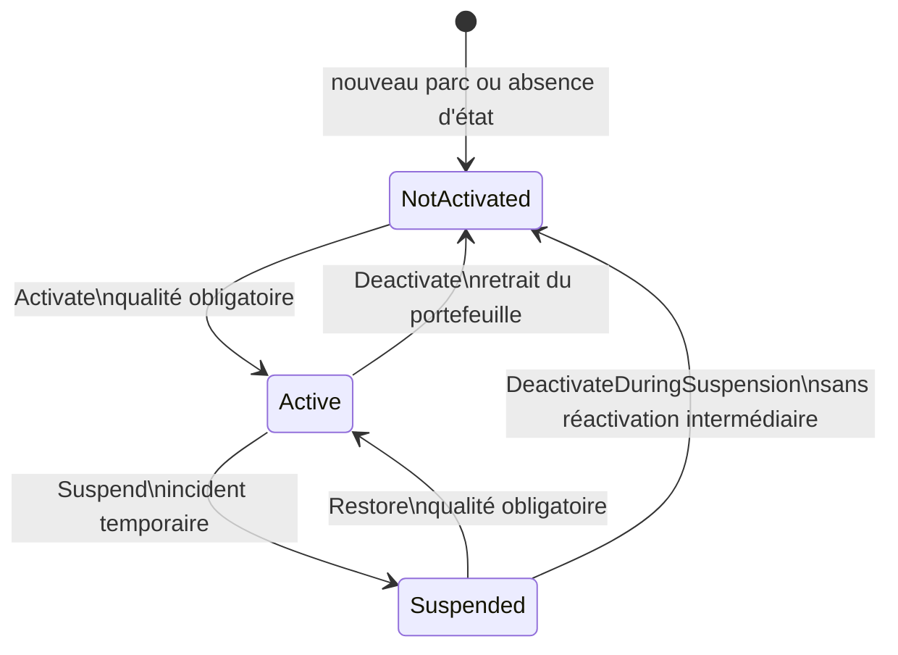
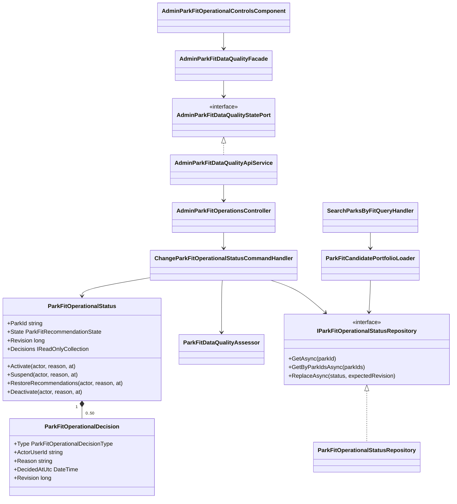
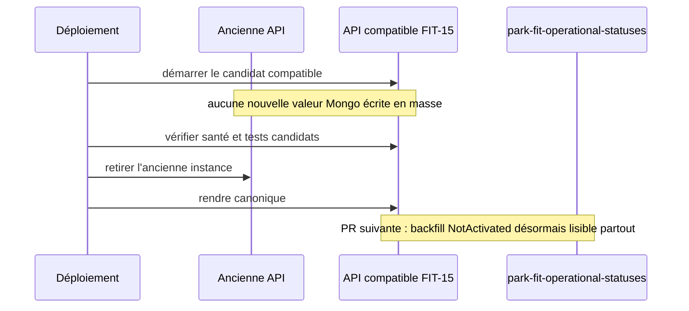
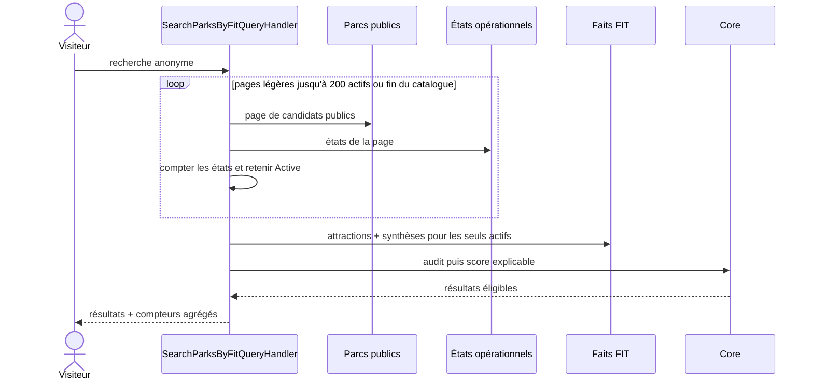

# FIT-15 — Activation explicite du portefeuille Park Fit

## 1. Résultat métier

La publication générale d'un parc et sa présence dans Park Fit sont désormais deux
décisions différentes. Un parc peut rester parfaitement visible sur le site sans
participer aux recommandations tant que son audit n'est pas prêt ou que l'équipe ne
l'a pas activé explicitement.

Le portefeuille possède trois états :

| État | Fiche publique | Recherche Park Fit | Action attendue |
|---|---:|---:|---|
| `NotActivated` | inchangée | exclu | compléter puis activer |
| `Active` | inchangée | candidat si la qualité reste suffisante | surveiller |
| `Suspended` | inchangée | exclu temporairement | corriger puis rétablir, ou retirer |

Le volume de visites, le nombre de comptes et la taille d'une cohorte ne participent
pas à cette décision. La gate est factuelle : le parc doit réussir le même audit de
qualité que celui utilisé par le moteur public.

## 2. Règles de transition



Chaque décision exige une justification sans balisage, un acteur admin, une date UTC
et la révision attendue. Une écriture concurrente est refusée. L'historique est
borné aux 50 décisions les plus récentes, mais chaque fragment conservé reste
validable même après troncature.

L'activation et le rétablissement relisent :

- la visibilité et le cycle de vie du parc ;
- les coordonnées, le type et le contenu public ;
- les attractions visibles et ouvertes ;
- leurs conditions d'accès, sources, dates, portées et cohérence ;
- la couverture actuelle du calendrier d'ouverture.

Seul `EligibleForFitComparison` permet de passer à `Active`. L'interface désactive
l'action dans les autres cas et le serveur répète impérativement le contrôle.

## 3. Architecture



Le Core possède le cycle de vie et l'audit de qualité. L'Application collecte les
faits par les ports existants et orchestre la transition. Infrastructure est seule
à connaître MongoDB et la migration physique. Le contrôleur HTTP mappe uniquement
les contrats. Le composant Angular ne connaît ni l'URL ni la persistance et passe
par la façade existante.

## 4. Schéma MongoDB

### 4.1 État canonique

Collection `park-fit-operational-statuses` :

```javascript
{
  _id: "park-public-id",
  state: "Active", // NotActivated | Active | Suspended
  revision: NumberLong(3),
  decisions: [
    {
      type: "Activated",
      actorUserId: "admin-user-id",
      reason: "Données et calendrier vérifiés",
      decidedAtUtc: ISODate("2026-09-14T18:00:00Z"),
      revision: NumberLong(1)
    },
    {
      type: "Suspended",
      actorUserId: "admin-user-id",
      reason: "Source officielle à revérifier",
      decidedAtUtc: ISODate("2026-09-14T18:30:00Z"),
      revision: NumberLong(2)
    },
    {
      type: "Restored",
      actorUserId: "admin-user-id",
      reason: "Source officielle renouvelée",
      decidedAtUtc: ISODate("2026-09-14T19:00:00Z"),
      revision: NumberLong(3)
    }
  ],
  createdAt: ISODate("2026-09-14T18:00:00Z"),
  updatedAt: ISODate("2026-09-14T19:00:00Z")
}
```

L'index `{ state: 1, updatedAt: -1 }` sert au pilotage. `_id` est l'identifiant du
parc et garantit un état unique. Les raisons et acteurs sont réservés à
l'administration ; la recherche publique ne les renvoie pas.

## 5. Déploiement compatible avant migration physique

Avant FIT-15, l'absence de document signifiait implicitement « actif ». Le nouveau
code lui donne immédiatement la sémantique sûre `NotActivated`, mais cette première
livraison n'écrit pas encore la nouvelle valeur enum en masse. C'est volontaire :
pendant le basculement sans interruption, l'ancienne API encore en service ne sait
pas désérialiser cette valeur.

Le déploiement est donc ordonné en deux PR :

1. la présente PR déploie le nouveau modèle, la lecture sûre, les actions admin et la
   pagination après activation ;
2. après disparition vérifiée des anciennes instances, une PR de migration dédiée
   matérialise chaque état absent en `NotActivated`, par lots idempotents, sans
   modifier les états `Active` ou `Suspended` déjà pilotés.

Il n'existe déjà plus de comportement applicatif « absent = actif ». La seconde phase
ne changera donc aucun résultat métier : elle alignera physiquement MongoDB sur la
sémantique déjà déployée, sans adaptateur durable ni intervention manuelle.



## 6. Recherche publique

La recherche parcourt les candidats publics par pages légères et filtre leur état
avant d'appliquer la limite de 200 parcs actifs. Des parcs non activés placés avant un
parc actif dans l'ordre alphabétique ne peuvent donc plus masquer ce dernier. Elle ne
charge attractions et calendriers que pour les identifiants explicitement `Active`,
ce qui borne les faits lourds même si le catalogue public est plus grand.



La réponse distingue les candidats suspendus, non activés et rejetés par la qualité.
Elle ne révèle ni justification, ni acteur, ni historique administratif.

## 7. Interface admin et responsive

Dans l'audit « Qualité du comparateur », chaque carte présente l'état et sa
conséquence avant les actions :

- actif : suspendre temporairement ou retirer du portefeuille ;
- suspendu : rétablir si la qualité le permet, ou retirer directement ;
- non activé : activer uniquement lorsque l'audit est prêt.

La justification s'ouvre seulement après le choix de l'action et peut être annulée.
Les actions utilisent une grille fluide, puis une colonne unique sous `30rem`.
Tous les descendants critiques ont `min-width: 0`, `max-width: 100%` et les textes
longs se coupent ; aucun défilement horizontal de page n'est créé.

Les libellés existent en français, anglais, allemand, néerlandais, italien,
espagnol, polonais et portugais.

## 8. Preuves automatisées

- Core : transitions, retrait pendant une suspension, versions et historique
  tronqué ;
- Application : activation éligible, refus d'une qualité insuffisante, exclusion
  d'un état absent, compteurs séparés, pagination après activation et lectures groupées ;
- Infrastructure : lecture des états explicites sans écriture d'un enum incompatible
  pendant le premier basculement ;
- WebAPI : mapping additif du compteur `notActivatedCandidateCount` et validation
  de l'enum central ;
- Angular : activation verrouillée, contrats responsive, façade/port et huit
  dictionnaires cohérents.

La fonctionnalité FIT-15 est complète côté métier. Sa PR technique suivante réalise
uniquement le backfill compatible après ce premier déploiement. La gate FIT-G vérifie
ensuite l'ensemble des invariants déjà automatisables ; les observations terrain
restent un outil d'amélioration et ne bloquent pas l'achèvement technique demandé.
