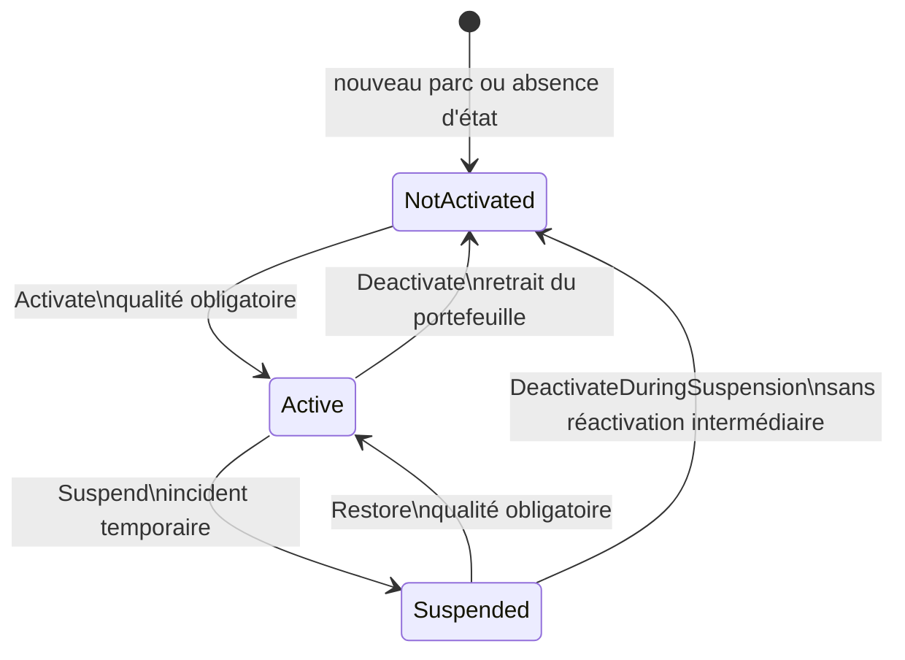
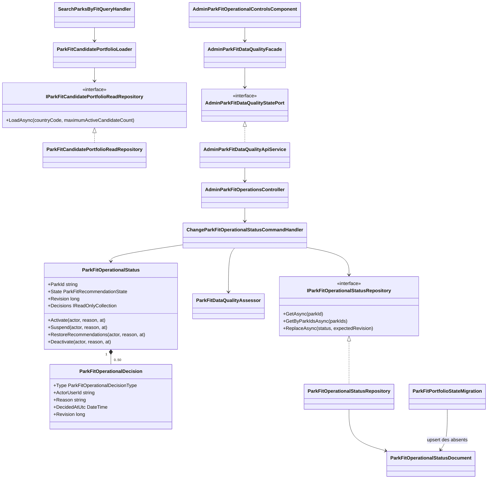
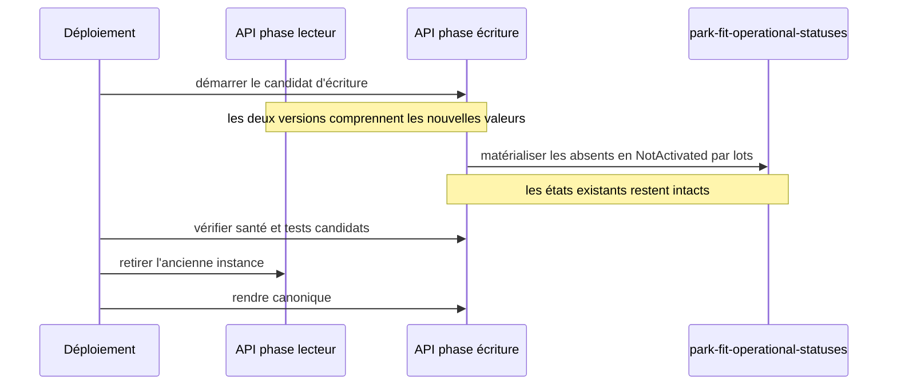
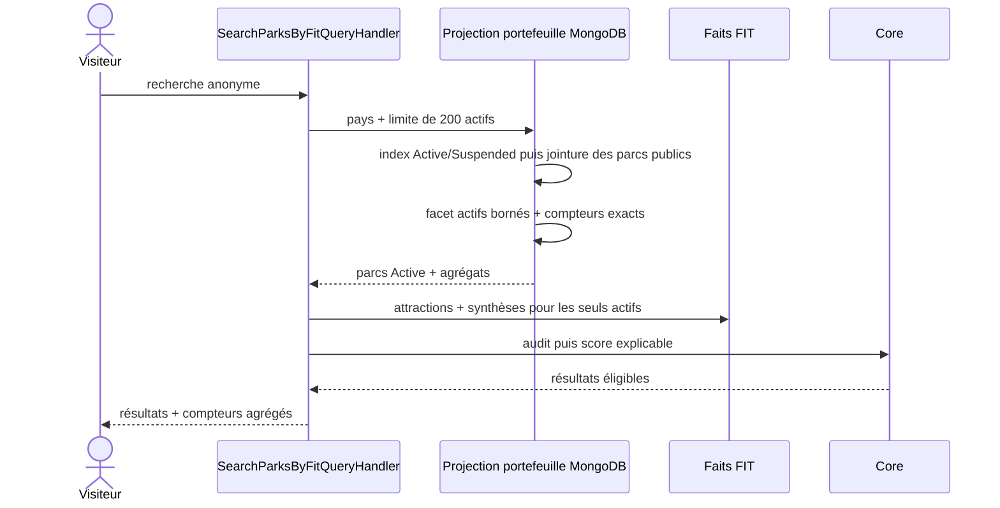

# FIT-15 — Activation explicite du portefeuille Park Fit

## 1. Résultat métier

La publication générale d'un parc et sa présence dans Park Fit sont désormais deux
décisions différentes. Un parc peut rester parfaitement visible sur le site sans
participer aux recommandations tant que son audit n'est pas prêt ou que l'équipe ne
l'a pas activé explicitement.

Le portefeuille possède trois états :

| État | Fiche publique | Recherche Park Fit | Action attendue |
|---|---:|---:|---|
| `NotActivated` | inchangée | exclu | compléter puis activer |
| `Active` | inchangée | candidat si la qualité reste suffisante | surveiller |
| `Suspended` | inchangée | exclu temporairement | corriger puis rétablir, ou retirer |

Le volume de visites, le nombre de comptes et la taille d'une cohorte ne participent
pas à cette décision. La gate est factuelle : le parc doit réussir le même audit de
qualité que celui utilisé par le moteur public.

## 2. Règles de transition



Chaque décision exige une justification sans balisage, un acteur admin, une date UTC
et la révision attendue. Une écriture concurrente est refusée. L'historique est
borné aux 50 décisions les plus récentes, mais chaque fragment conservé reste
validable même après troncature.

L'activation et le rétablissement relisent :

- la visibilité et le cycle de vie du parc ;
- les coordonnées, le type et le contenu public ;
- les attractions visibles et ouvertes ;
- leurs conditions d'accès, sources, dates, portées et cohérence ;
- la couverture actuelle du calendrier d'ouverture.

Seul `EligibleForFitComparison` permet de passer à `Active`. L'interface désactive
l'action dans les autres cas et le serveur répète impérativement le contrôle.

## 3. Architecture



Le Core possède le cycle de vie et l'audit de qualité. L'Application collecte les
faits par les ports existants et orchestre la transition. Infrastructure est seule
à connaître MongoDB et la migration physique. Le contrôleur HTTP mappe uniquement
les contrats. Le composant Angular ne connaît ni l'URL ni la persistance et passe
par la façade existante.

## 4. Schéma MongoDB

### 4.1 État canonique

Collection `park-fit-operational-statuses` :

```javascript
{
  _id: "park-public-id",
  state: "Active", // NotActivated | Active | Suspended
  revision: NumberLong(3),
  decisions: [
    {
      type: "Activated",
      actorUserId: "admin-user-id",
      reason: "Données et calendrier vérifiés",
      decidedAtUtc: ISODate("2026-09-14T18:00:00Z"),
      revision: NumberLong(1)
    },
    {
      type: "Suspended",
      actorUserId: "admin-user-id",
      reason: "Source officielle à revérifier",
      decidedAtUtc: ISODate("2026-09-14T18:30:00Z"),
      revision: NumberLong(2)
    },
    {
      type: "Restored",
      actorUserId: "admin-user-id",
      reason: "Source officielle renouvelée",
      decidedAtUtc: ISODate("2026-09-14T19:00:00Z"),
      revision: NumberLong(3)
    }
  ],
  createdAt: ISODate("2026-09-14T18:00:00Z"),
  updatedAt: ISODate("2026-09-14T19:00:00Z")
}
```

L'index `{ state: 1, updatedAt: -1 }` sert au pilotage. `_id` est l'identifiant du
parc et garantit un état unique. Les raisons et acteurs sont réservés à
l'administration ; la recherche publique ne les renvoie pas.

### 4.2 Marqueur de migration

Collection `park-fit-portfolio-migrations` :

```javascript
{
  _id: "fit-15-portfolio-activation-v1",
  startedAtUtc: ISODate("2026-09-15T00:00:00Z"),
  completedAtUtc: ISODate("2026-09-15T00:00:02Z")
}
```

Un marqueur terminé empêche tout nouveau parcours du catalogue. Un marqueur sans
`completedAtUtc` fait reprendre l'opération après une interruption ; les upserts
restent sans effet sur les états déjà présents.

## 5. Déploiement compatible et migration physique

Avant FIT-15, l'absence de document signifiait implicitement « actif ». Le nouveau
code lui donne immédiatement la sémantique sûre `NotActivated`, mais cette première
livraison n'écrit pas encore la nouvelle valeur enum en masse. C'est volontaire :
pendant le basculement sans interruption, l'ancienne API encore en service ne sait
pas désérialiser cette valeur.

Le déploiement a donc été ordonné en deux PR :

1. la première PR a déployé le nouveau modèle de lecture, comprend les futures valeurs
   d'état et de décision, applique la lecture sûre et pagine les seuls états actifs ;
   elle conservait uniquement les écritures historiques `Suspend` et `Restore` ;
2. après déploiement vérifié de ce lecteur compatible, la présente PR ouvre les
   actions `Activate` et `Deactivate`, puis matérialise chaque état absent en
   `NotActivated`, par lots idempotents, sans modifier les états `Active` ou
   `Suspended` déjà pilotés.

Il n'existe plus de comportement applicatif « absent = actif ». La seconde phase ne
change donc aucun résultat métier : elle aligne physiquement MongoDB sur la
sémantique déjà déployée, sans adaptateur durable ni intervention manuelle. La
migration conserve un marqueur dédié, parcourt les identifiants par lots de 500 et
utilise exclusivement `$setOnInsert` : un état existant et son historique ne sont
jamais écrasés, même si plusieurs instances démarrent simultanément.



## 6. Recherche publique

La recherche interroge directement la cohorte pilotée avec une projection MongoDB
dédiée. Elle part de l'index des seuls états `Active` et `Suspended`, joint les fiches
de parc, puis applique visibilité, cycle de vie, pays et coordonnées. La limite de
200 ne s'applique qu'aux documents déjà `Active`. Un facet calcule les volumes actifs
et suspendus ; un comptage léger du catalogue public permet d'en déduire exactement
les non-activés, sans les joindre ni les remonter dans l'Application. Chaque requête
est limitée à dix secondes.

Des milliers de parcs non activés n'entraînent donc plus une pagination applicative
non bornée et ne peuvent pas masquer un parc actif. Attractions et calendriers ne
sont chargés que pour les identifiants actifs effectivement retenus.



La réponse distingue les candidats suspendus, non activés et rejetés par la qualité.
Elle ne révèle ni justification, ni acteur, ni historique administratif.

## 7. Interface admin et responsive

Dans l'audit « Qualité du comparateur », chaque carte présente l'état, sa conséquence
et les actions désormais ouvertes :

- actif : suspendre temporairement ou retirer du portefeuille ;
- suspendu : rétablir si la qualité le permet, ou retirer directement ;
- non activé : activer uniquement lorsque l'audit est prêt.

La justification s'ouvre seulement après le choix de l'action et peut être annulée.
Les actions utilisent une grille fluide, puis une colonne unique sous `30rem`.
Tous les descendants critiques ont `min-width: 0`, `max-width: 100%` et les textes
longs se coupent ; aucun défilement horizontal de page n'est créé.

Les libellés existent en français, anglais, allemand, néerlandais, italien,
espagnol, polonais et portugais.

## 8. Preuves automatisées

- Core : transitions, retrait pendant une suspension, versions et historique
  tronqué ;
- Application : activation et rétablissement soumis à la qualité, retrait direct
  depuis les états actif ou suspendu, concurrence optimiste, compteurs séparés et
  lectures groupées des seuls actifs ;
- Infrastructure : migration idempotente vers `NotActivated` sans écrasement,
  lecture des états explicites, projection active bornée après filtres publics et
  compteurs par facet ;
- WebAPI : mapping additif du compteur `notActivatedCandidateCount` et validation
  de l'enum central ;
- Angular : quatre actions explicites, blocage de l'activation lorsque la qualité
  devient insuffisante, fermeture d'une confirmation devenue obsolète, contrats
  responsive, façade/port et huit dictionnaires cohérents.

Cette seconde livraison termine FIT-15 après le déploiement préalable du lecteur
compatible. La gate FIT-G vérifie ensuite l'ensemble des invariants déjà
automatisables ; les observations terrain restent un outil d'amélioration et ne
bloquent pas l'achèvement technique demandé.
