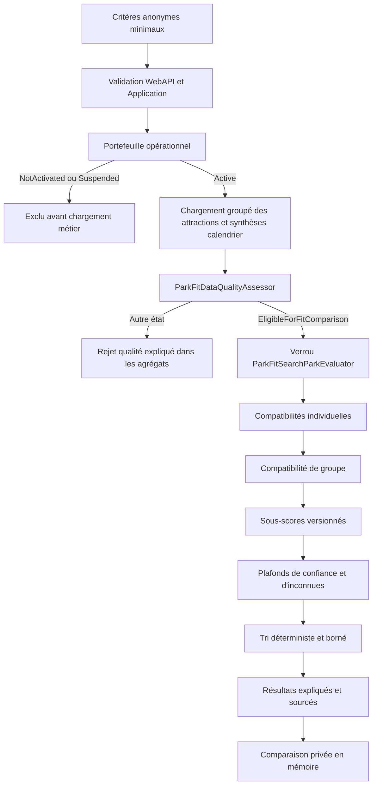
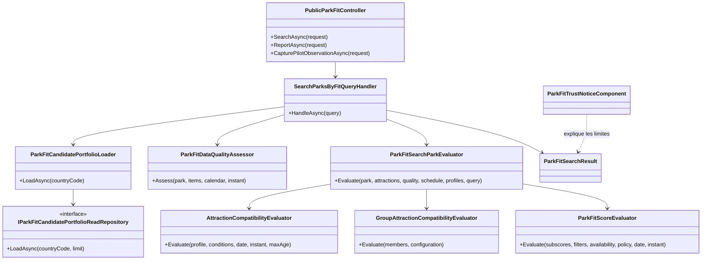
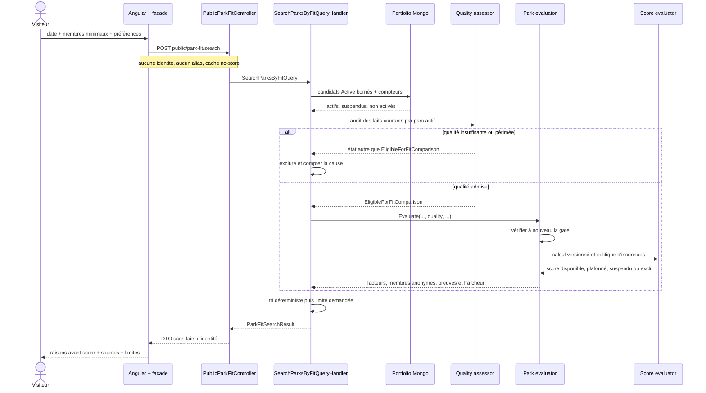
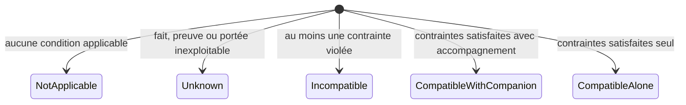
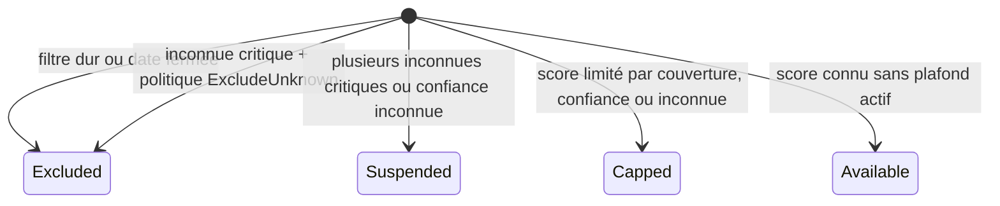
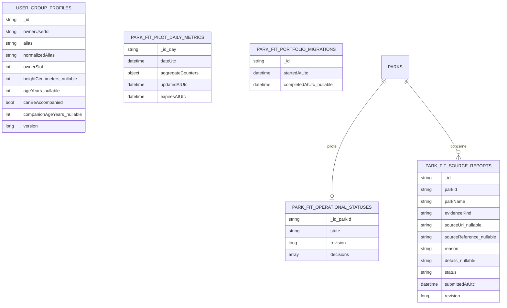

# FIT-G — Gate finale de sûreté et de confiance Park Fit

Date de clôture technique : 15 septembre 2026

Version cible : 5.3.38

Roadmap : [`04-park-fit-recommendation-and-comparison-roadmap.md`](../roadmaps/product-growth/04-park-fit-recommendation-and-comparison-roadmap.md)

## 1. Résultat métier

Park Fit répond à une question de décision : quels parcs suffisamment documentés
correspondent le mieux à un groupe, une date, une origine facultative et des envies ?
La réponse reste une aide comparative et non une promesse d'accès.

La gate `FIT-G` ferme les quinze jalons en imposant quatre garanties lisibles :

1. un parc hors portefeuille actif ou insuffisamment documenté ne peut pas devenir
   un résultat ;
2. les compatibilités, incompatibilités et inconnues restent séparées jusqu'à
   l'écran ;
3. le rang est expliqué, daté et sourcé, sans influence commerciale ;
4. la recherche anonyme conserve uniquement les faits minimaux nécessaires au
   calcul courant.

Le nouveau verrou de `ParkFitSearchParkEvaluator` constitue une seconde barrière :
même si ce service d'Application était appelé par un futur handler, il refuserait une
évaluation dont la qualité n'est pas `EligibleForFitComparison`. Le handler public
continue de filtrer la cohorte auparavant afin de ne charger les calendriers complets
que pour les candidats admis.

Le composant Angular `ParkFitTrustNoticeComponent` rend visibles deux garanties qui
n'étaient auparavant qu'implicites dans la documentation :

- aucun partenariat ni paiement ne modifie l'ordre ;
- les conditions d'accès et horaires doivent toujours être confirmés sur le site
  officiel du parc avant la visite.

Il est réutilisé sur le formulaire, la page de résultats et la comparaison, dans les
huit langues prises en charge.

## 2. Gate finale et preuves

| Critère de sortie | Garantie implémentée | Preuve principale |
|---|---|---|
| Aucun parc sans gate de données | portefeuille `Active`, audit canonique puis verrou de l'évaluateur | `SearchParksByFitQueryHandlerTests`, `ParkFitSearchParkEvaluatorTests` |
| Compatible, incompatible et inconnu distincts | enums individuels et groupe sans conversion implicite | `AttractionCompatibilityEvaluatorTests`, `GroupAttractionCompatibilityEvaluatorTests` |
| Chaque résultat explique ses facteurs | raisons du score, cinq composantes, compteurs groupe et membre | `ParkFitScoreEvaluatorTests`, `ParkFitSearchHttpMapperTests`, pages résultats/comparaison |
| Restriction critique sourcée et datée | l'audit rejette source, résumé, confiance ou horodatage insuffisants | `ParkFitDataQualityAssessorTests`, `AttractionCompatibilityEvaluatorTests` |
| Profils privés et minimisés | propriétaire isolé ; alias et identifiant retirés de la recherche, identifiants techniques retirés de l'export | `ParkFitGroupProfileLifecycleServiceTests`, `ExportMyParkFitGroupProfilesQueryHandlerTests`, tests du formulaire |
| Aucune santé détaillée stockée | uniquement âge, taille, accompagnement et âge d'accompagnateur | contrats `ParkFitGroupProfile` et `ParkFitSearchMemberCriteria` |
| Score non présenté comme probabilité | libellés explicites avant et dans le score | `park-fit.json` dans huit langues, page de résultats |
| Inconnues capables de réduire ou suspendre | plafond de couverture/confiance, suspension ou exclusion selon politique | `ParkFitScoreEvaluatorTests` |
| Confirmation officielle obligatoire | encart de confiance sur les trois écrans et liens HTTPS filtrés | `ParkFitTrustNoticeComponent`, `park-fit-result-display.helpers.spec.ts` |
| Aucun partenariat dans l'ordre | tri déterministe sur état, scores, couverture, nom et ID | handler de recherche et encart de confiance |
| Premier résultat sans compte | contrôleur anonyme, route sans garde et état en mémoire | `PublicParkFitControllerTests`, `app.routes.spec.ts`, `ParkFitStartPageComponent` |
| Compréhension du pourquoi | raisons avant score, preuves, comparaison ligne à ligne, télémétrie agrégée | tests des trois pages et du cockpit pilote |
| Corrections et manques opérables | signalement public, file admin, suspension et restauration versionnées | tests FIT-13 et FIT-15 |

La compréhension en situation réelle ne peut pas être fabriquée par un test
automatisé. Conformément à la décision produit, elle reste observée par le pilote
agrégé sans bloquer la livraison technique et sans prétendre qu'une cohorte a été
mesurée lorsqu'elle ne l'a pas été.

## 3. Chaîne de décision

Deux conditions sont donc nécessaires, jamais alternatives : l'état opérationnel
doit être `Active` et l'audit factuel courant doit être
`EligibleForFitComparison`.

## 4. Diagramme de classes simplifié

Les règles pures restent dans `AmusementPark.Core`. L'Application orchestre les
ports et bloque la publication d'une évaluation non admise. Infrastructure ne fait
que lire, écrire, indexer et migrer MongoDB. WebAPI mappe des contrats explicites.
Angular affiche et orchestre par façades ; il ne recalcule aucune décision métier.

## 5. Séquence d'une recherche publique

## 6. États métier

### 6.1 Compatibilité individuelle

Une incompatibilité réelle n'est jamais ramenée à `Unknown`. Une donnée absente
n'est jamais ramenée à `CompatibleAlone`.

### 6.2 Résultat global

Le score `/100` classe seulement les parcs de la même recherche. Il ne représente ni
une probabilité de réussite, ni un taux d'attractions garanties.

## 7. Schéma MongoDB consolidé

La recherche anonyme et ses résultats ne créent aucun document. Les collections
ci-dessous servent les fonctions facultatives ou opérationnelles.

### `user-group-profiles`

Un document appartient à un seul compte. Il stocke uniquement un alias d'interface,
une taille facultative, un âge facultatif, la possibilité d'être accompagné et un
âge d'accompagnateur facultatif. Aucun diagnostic, pathologie, traitement, mobilité
détaillée, texte médical ou résultat Park Fit n'y figure. Les limites et index
empêchent la croissance non bornée et les doublons d'alias par propriétaire.

### `park-fit-operational-statuses`

`_id` est l'identifiant du parc. `state` vaut `NotActivated`, `Active` ou
`Suspended`. `revision` protège les écritures concurrentes. Chaque décision conserve
son type, l'administrateur, une justification, la date UTC et la révision. Retirer un
parc revient à `NotActivated` ; son historique n'est pas effacé.

### `park-fit-source-reports`

Le signalement public ne contient aucun profil ni critère de recherche. Le serveur
résout le nom du parc et filtre les URL sûres. Le traitement admin est versionné et
auditable.

### `park-fit-pilot-daily-metrics`

Les événements sont agrégés directement par jour : volumes, tranches de latence,
niveaux d'inconnues, tailles de comparaison, causes d'échec et problèmes de qualité.
Il n'existe aucun événement individuel, utilisateur, session, position, profil ou
parc recherché. Un index TTL supprime les agrégats après 400 jours.

### `park-fit-portfolio-migrations`

Le témoin `fit-15-portfolio-activation-v1` rend la matérialisation initiale
idempotente. Une exécution interrompue reprend ; `completedAtUtc` n'est écrit qu'après
tous les lots. Les documents opérationnels existants ne sont jamais écrasés.

## 8. Confidentialité et sécurité

- `POST /public/park-fit/search` est anonyme, limité en débit et `no-store` ;
- la requête publique n'accepte ni nom, ni alias, ni texte libre, ni identifiant de
  compte ;
- la position est facultative, arrondie côté navigateur, consommée une fois et non
  persistée ;
- les résultats et la sélection de comparaison restent dans la mémoire de l'onglet ;
- les profils sauvegardés exigent une authentification et toutes les lectures ou
  écritures sont bornées au propriétaire ;
- les exports conservent l'alias utile mais retirent identifiants internes,
  propriétaire et révision ;
- seuls les liens HTTPS valides deviennent cliquables ; une référence interne n'est
  jamais rendue comme URL publique ;
- les mutations admin conservent autorisation, justification, audit et concurrence
  optimiste.

## 9. Performance

- le portefeuille Mongo part des seuls états opérationnels actifs ou suspendus ;
- le nombre d'actifs inspectés est limité à 200 ;
- attractions et synthèses de calendrier sont chargées par lots ;
- le calendrier complet n'est chargé que pour les parcs ayant franchi l'audit ;
- le calcul est pur, synchrone et linéaire sur la cohorte bornée ;
- la réponse contient au maximum 20 résultats ;
- aucun snapshot par combinaison de critères, appel IA ou service routier n'est
  créé ;
- la télémétrie incrémente un agrégat journalier au lieu d'écrire un événement par
  interaction.

## 10. Responsive et accessibilité

Le parcours reste utilisable à 360 px : conteneurs `min-width: 0`, largeur maximale
bornée, retour à la ligne des contenus longs, grilles fluides et passages en une
colonne. Le nouvel encart de confiance utilise
`grid-template-columns: auto minmax(0, 1fr)` puis une seule colonne à 360 px. Il ne
crée donc ni largeur minimale implicite, ni défilement horizontal.

Les différences de comparaison possèdent un libellé et ne reposent pas sur la seule
couleur. Les encarts utilisent un rôle `note`, les sources externes indiquent leur
nature et les liens ouverts dans un nouvel onglet appliquent `noopener noreferrer`.

## 11. Migration et exploitation

Aucune migration MongoDB manuelle n'est nécessaire pour `FIT-G`. La migration de
portefeuille de `FIT-15` a déjà été exécutée au démarrage de la version 5.3.37 et le
déploiement VPS a franchi sa healthcheck. `FIT-G` ne modifie aucun document : il
renforce le verrou d'Application et l'explication publique.

Les corrections restent opérables de deux façons :

1. le visiteur signale une preuve ou un calendrier depuis le résultat ;
2. l'administration traite la file, corrige la donnée canonique et peut suspendre le
   parc immédiatement, puis le rétablir seulement après un nouvel audit éligible.

## 12. Limites assumées

- la distance est géodésique et non routière ;
- le budget reste non applicable tant qu'aucune donnée assez fiable ne permet de
  l'évaluer ;
- une capacité de véhicule ou d'accompagnateur n'est jamais inventée ;
- une restriction personnelle nécessitant une appréciation médicale reste inconnue
  et doit être confirmée officiellement ;
- le pilote ne revendique aucune validation terrain sans observations réelles ;
- un partenariat futur ne pourra influencer l'ordre sans changement explicite du
  contrat métier, des tests et de la communication publique.

## 13. Preuves de livraison

Les contrôles ciblés de la PR couvrent :

- le refus de tous les états qualité non admissibles par
  `ParkFitSearchParkEvaluatorTests` ;
- l'encart de confiance, ses deux messages et son rôle accessible ;
- le contrat responsive propre au composant à 360 px ;
- la parité des huit dictionnaires de traduction ;
- la règle une classe par fichier et les frontières façade/port ;
- les tests Application et Angular Park Fit concernés.

Les suites CI complètes restent l'autorité avant fusion : backend, frontend,
architecture, sécurité des dépendances, build SSR de production, images Docker et
déploiement VPS.
