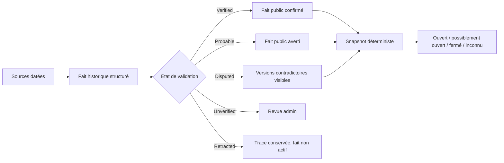
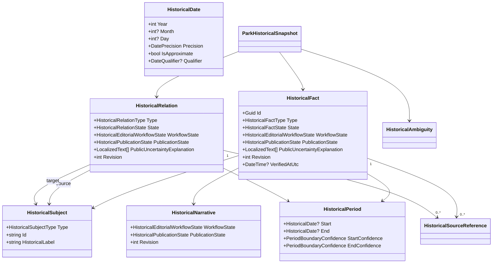
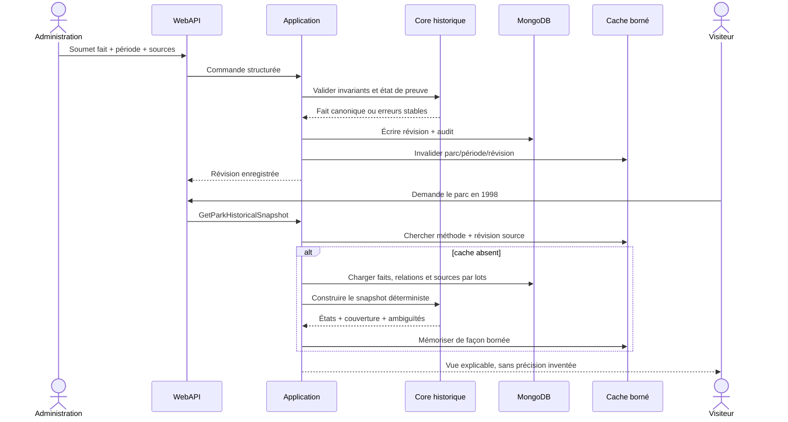

# HIST-01 — Contrat sémantique de l’explorateur historique

> Statut : accepté le 25 septembre 2026
>
> Portée : dates, périodes, faits, preuves, relations, incertitudes et migration
>
> Version de méthode initiale : `history-2026-01`
>
> Implémentation concernée : `HIST-02` à `HIST-14`

## 1. Décision métier

L’explorateur répond à une question factuelle : **que sait-on du parc à une
époque donnée, avec quel niveau de certitude et grâce à quelles preuves ?**

Il ne transforme jamais une année en date exacte, une proximité chronologique
en remplacement, un texte éditorial en preuve, ni l’absence de donnée en
fermeture. Le public doit pouvoir distinguer :

- ce qui est vérifié ;
- ce qui est seulement probable ;
- ce qui est contesté ;
- ce qui n’a pas encore été vérifié ;
- ce qui a été retiré après correction ;
- ce qui reste impossible à conclure pour la date demandée.

Cette sémantique appartient au Core. L’Application orchestre les cas d’usage,
MongoDB persiste les valeurs canoniques, la WebAPI les expose et Angular les
présente sans réinterpréter leur sens.



## 2. Frontière du domaine

### 2.1 Trois objets qui ne se remplacent pas

| Objet | Rôle | Ne porte pas |
|---|---|---|
| `HistoricalFact` | Assertion structurée et révisable sur un sujet pendant une période. | Un récit multilingue complet. |
| Contenu éditorial | Titre, résumé et article qui expliquent le contexte humain. | La vérité temporelle calculable. |
| `HistoricalRelation` | Lien explicite, orienté, daté et sourcé entre deux sujets. | Une association vague ou une proximité supposée. |

Un fait peut pointer vers un contenu éditorial, mais son calcul ne dépend jamais
du texte. Une relation n’est jamais encodée dans une liste générique
d’identifiants liés.

### 2.2 Identités

Les sujets historiques réutilisent les identifiants chaîne canoniques des
entités actuelles, enveloppés par des types du Core. Les premières familles sont
le parc, l’élément de parc, l’attraction autonome, la zone, l’exploitant et le
constructeur. Ajouter une famille impose une valeur explicite et un résolveur ;
un identifiant seul n’est jamais suffisant pour deviner son type.

Une entité retirée de l’offre actuelle garde son identité historique. Sa
suppression fonctionnelle ne cascade donc pas sur les faits, sources, relations
ou anciennes visites qui la référencent. Si la cible ne peut plus être résolue,
le système conserve son libellé historique figé et signale une cible retirée.

## 3. Date historique canonique

### 3.1 Forme

```csharp
public sealed record HistoricalDate(
    int Year,
    int? Month,
    int? Day,
    DatePrecision Precision,
    bool IsApproximate,
    DateQualifier? Qualifier);
```

`HistoricalDate` et `VisitDate` partagent les principes de précision, mais
restent deux types distincts. Une visite est une occurrence personnelle ; une
date historique peut qualifier une borne ouverte, une approximation ou une
partie de période.

### 3.2 Invariants

- `Year` est obligatoire et appartient au calendrier grégorien pris en charge
  par la plateforme ; aucune heure ni aucun fuseau n’est associé à une date
  historique civile.
- `Year` exige `Month == null` et `Day == null`.
- `Month` exige un mois valide et `Day == null`.
- `Day` exige un mois et un jour constituant une date réelle.
- Une précision absente n’est pas remplacée par `1` : « 1998 » reste une année,
  jamais le 1er janvier 1998.
- `Early`, `Mid` et `Late` sont des qualifications de position dans l’unité
  exprimée ; elles ne fabriquent pas de jour publiable.
- `Before` et `After` expriment une borne ouverte exclusive.
- `Circa` implique `IsApproximate == true`.
- `IsApproximate == true` peut exister sans `Circa` lorsque la source elle-même
  signale une approximation sans employer ce qualificatif.
- Une qualification inconnue est rejetée ; elle n’est pas rabattue sur une
  valeur par défaut.

### 3.3 Enveloppe de précision

Une date partielle produit une **enveloppe civile** seulement pour comparer les
bornes connues :

| Entrée | Début de l’enveloppe | Fin de l’enveloppe |
|---|---|---|
| `1998` | 1er janvier 1998 | 31 décembre 1998 |
| `1998-05` | 1er mai 1998 | 31 mai 1998 |
| `1998-05-12` | 12 mai 1998 | 12 mai 1998 |
| `Before 1998` | ouverte | 31 décembre 1997 |
| `After 1998` | 1er janvier 1999 | ouverte |

Cette enveloppe sert au raisonnement, pas à l’affichage d’une précision absente.
`Early`, `Mid`, `Late`, `Circa` et `IsApproximate` rendent la borne non certaine.
Aucune tolérance arbitraire de type « environ = plus ou moins un an » n’est
inventée. Lorsque le calcul ne peut pas établir une borne certaine, il rend une
ambiguïté ou un état possible.

## 4. Périodes et frontières

```csharp
public sealed record HistoricalPeriod(
    HistoricalDate? Start,
    HistoricalDate? End,
    PeriodBoundaryConfidence StartConfidence,
    PeriodBoundaryConfidence EndConfidence);
```

Les confiances de borne sont `Confirmed`, `Estimated` et `Disputed`. Une borne
absente est ouverte et n’emploie pas une fausse date sentinelle.

Conventions canoniques :

- un événement ponctuel répète la même date structurée en début et fin ;
- une période toujours en cours a un début et une fin absente ;
- une période dont seul le terme est connu a un début absent et une fin ;
- les deux bornes absentes sont invalides ;
- une fin certainement antérieure au début est invalide ;
- des enveloppes qui se chevauchent sans ordre certain restent valides mais
  produisent une ambiguïté explicite ;
- une borne `Estimated` ou `Disputed` ne permet pas à elle seule de conclure
  `KnownOpen` ou `KnownClosed` à sa frontière.

Un fait ponctuel et une période ouverte sont ainsi discernables sans indicateur
implicite ni date magique.

## 5. Faits historiques

### 5.1 Familles initiales

Pour un parc : ouverture, fermeture, réouverture, changement de nom,
changement d’exploitant ou de propriétaire, extension ou réduction, évolution
de zone et événement majeur documenté.

Pour un élément : annonce, construction, ouverture, fermeture temporaire,
réouverture, fermeture définitive, démantèlement, relocalisation, renommage,
changement de thème, modification technique majeure et déplacement de zone.

Une valeur inconnue de type n’est jamais publiée comme `Other` silencieusement.
`Other` reste un choix éditorial explicite accompagné d’un libellé et d’une
source.

### 5.2 État de preuve

| État | Signification normative | Visibilité par défaut |
|---|---|---|
| `Verified` | Au moins une preuve admissible soutient le fait et la revue structurée est achevée. | Publique. |
| `Probable` | Les preuves convergent mais ne permettent pas une affirmation certaine. | Publique avec avertissement et raison. |
| `Disputed` | Des sources admissibles se contredisent ou la conclusion est activement contestée. | Publique avec les positions et la fourchette. |
| `Unverified` | La donnée est importée, incomplète ou pas encore revue. | Administration uniquement, hors transition de migration explicitement balisée. |
| `Retracted` | Une révision a invalidé une assertion auparavant conservée. | Non active ; trace d’audit conservée. |

`VerifiedAtUtc` est nullable et n’est renseigné qu’au passage réel vers
`Verified`. Un fait importé ou `Unverified` garde `null` : une date par défaut ne
doit jamais simuler une vérification. Les revues de faits `Probable` ou
`Disputed` restent datées dans le journal de revue sans détourner ce champ.

`Verified` ne signifie pas « vrai pour toujours ». Toute correction crée une
nouvelle révision auditée, invalide les snapshots dépendants et garde la version
précédente consultable en administration.

### 5.3 Fait, interprétation et projection

- Le fait stocke le sujet, le type, la période, l’état, les sources, sa valeur
  structurée, la révision et la dernière vérification.
- Le récit éditorial peut expliquer l’importance du fait, sans modifier son
  intervalle ni sa confiance.
- Le snapshot est une projection déterministe de faits et relations à une date.
  Il ne devient jamais une nouvelle source.
- Une suggestion automatique reste une suggestion admin. Elle ne crée ni fait
  public ni relation publique avant validation humaine.

## 6. Sources et preuves

Une référence canonique porte : titre, éditeur ou auteur, URL ou référence
bibliographique, date de publication si connue, date d’accès, langue, type de
source, éventuelle archive, portée exacte, note admin et statut d’accessibilité.
Les droits d’un média restent séparés de la preuve factuelle.

### 6.1 Admissibilité

Un fait `Verified` doit posséder au moins une source qui :

- permet d’identifier l’émetteur ;
- possède une référence stable ou une URL ;
- couvre réellement le sujet, le type et la période affirmés ;
- indique sa date d’accès ;
- n’est ni retirée ni hors périmètre.

Une source peut prouver le nom sans prouver le jour exact. La portée est donc
attachée explicitement aux champs ou assertions couverts. Le nombre de sources
ne remplace pas leur qualité.

### 6.2 Contradictions

Les sources contradictoires sont toutes conservées. Le système ne sélectionne
pas automatiquement la date la plus récente, la plus précise ou la plus
favorable. La divergence produit `Disputed`, une explication éditoriale et, si
possible, une fourchette. Une résolution ultérieure indique quelles preuves ont
motivé la nouvelle révision.

## 7. Relations temporelles

Les relations initiales sont `RenamedTo`, `ReplacedBy`, `MovedTo`,
`RethemedAs`, `SuccessorOf`, `SamePhysicalAssetAs`, `SharesLocationWith`,
`OperatedByDuring` et `LocatedInZoneDuring`.

Chaque relation possède deux sujets typés, une direction, une période, une
confiance, un état de validation, une note éditoriale et ses propres sources.
Elle n’hérite pas automatiquement des sources d’un fait voisin.

### 7.1 Distinctions obligatoires

| Relation | Affirme | N’affirme pas |
|---|---|---|
| `RenamedTo` | Même identité éditoriale sous un nouveau nom. | Même matériel si les entités diffèrent. |
| `ReplacedBy` | Une source décrit explicitement un remplacement. | Même emplacement, causalité ou succession immédiate. |
| `MovedTo` | Le sujet a changé de localisation documentée. | Qu’il a changé d’identité. |
| `RethemedAs` | Continuité documentée avec nouveau thème. | Simple ressemblance ou même constructeur. |
| `SuccessorOf` | Une succession explicitement documentée. | Remplacement physique. |
| `SamePhysicalAssetAs` | Continuité du matériel démontrée. | Même nom, modèle ou zone uniquement. |
| `SharesLocationWith` | Emplacement commun documenté pendant une période. | Remplacement ou identité commune. |

La proximité des dates, la zone, un nom ressemblant ou un identifiant externe
peuvent alimenter une suggestion admin uniquement. Aucun de ces critères ne
publie une relation.

### 7.2 Cohérence du graphe

- une auto-relation est refusée sauf cas métier explicitement autorisé ;
- les relations symétriques sont stockées une fois et lues dans les deux sens ;
- les relations dirigées ne génèrent pas leur inverse sémantique sans règle ;
- la traversée est bornée et détecte les cycles ;
- un cycle n’est pas supprimé silencieusement : il devient un diagnostic, puis
  bloque la publication s’il contredit le type de relation ;
- une correction rétracte ou révise la relation, sans réécrire l’historique.

## 8. Publication et workflow

Le workflow canonique est :

```text
Draft → SourcesAttached → EditorialReview → StructuredValidation → Published
                                                      ↘ Corrected / Retracted
```

`HistoricalEditorialWorkflowState` persiste explicitement chacune de ces étapes :
`Draft`, `SourcesAttached`, `EditorialReview`, `StructuredValidation`,
`Published`, `Corrected` et `Retracted`. Il n’est pas déduit à la volée du
journal d’audit. Les transitions invalides sont refusées par le Core et chacune
ajoute un événement de revue.

L’état de workflow indique où en est le travail. L’état de preuve indique ce que
l’on peut conclure. Ils ne sont pas interchangeables : un fait `Disputed` peut
être correctement revu et publié, tandis qu’un fait `Verified` en brouillon
n’est pas public.

Le fait, la relation et le récit lié possèdent chacun leur propre workflow et
leur propre état de publication. `HistoricalPublicationState` vaut `Draft`,
`Published`, `LegacyPublishedPendingReview` ou `Withdrawn`.
`LegacyPublishedPendingReview` est réservé à HIST-04 : il conserve temporairement
un contenu déjà public dont les preuves ne satisfont pas encore le nouveau
contrat, sans le présenter comme vérifié. Aucun endpoint de création ou
modification ordinaire ne peut choisir cet état.

Cette indépendance est obligatoire : un fait peut rester public tandis que son
article est encore en brouillon ou a été retiré. Dans ce cas, la réponse
publique conserve le fait structuré mais omet entièrement le récit non publié.
Inversement, publier un récit ne publie jamais automatiquement son fait ou une
relation. Les transitions sont explicites, versionnées et auditées pour chaque
ressource.

Dans le flux normal, `Published` exige un workflow `Published` ou `Corrected` ;
les étapes antérieures restent `Draft`, et une rétractation impose
`Withdrawn`. La migration place `LegacyPublishedPendingReview` en
`EditorialReview`. Le Core refuse toute combinaison contradictoire au lieu de
laisser l’Application ou MongoDB en interpréter le sens.

Un fait ou une relation `Probable` ou `Disputed` possède en propre une
`PublicUncertaintyExplanation` localisée, distincte du récit et de toute note
admin. Sa publication est refusée tant qu’une explication non vide n’existe pas
dans les huit langues prises en charge. Le public conserve ainsi la raison de
l’incertitude même lorsque l’article lié reste en brouillon ou a été retiré.

Règles de publication :

- `Unverified` n’est pas public par défaut ;
- `Probable` et `Disputed` exigent une explication visible ;
- `LegacyPublishedPendingReview` affiche un avertissement localisé obligatoire,
  reste exclu des snapshots décisionnels et des nouveaux liens SEO, et apparaît
  dans les diagnostics jusqu’à sa revue ;
- `Retracted` ne participe plus aux calculs publics ;
- chaque publication fige une révision et une version de méthode ;
- l’absence de traduction utilise le fallback annoncé, jamais un faux texte
  traduit ;
- une page ne se présente pas comme exhaustive lorsque sa couverture ne l’est
  pas.

## 9. Raisonnement temporel déterministe

Pour un élément et un instant demandé, le Core rend exactement l’un des états :

| État | Condition |
|---|---|
| `KnownOpen` | Les faits admissibles démontrent l’ouverture à cet instant et aucune borne certaine ne la contredit. |
| `KnownClosed` | Les faits admissibles démontrent qu’il n’est pas ouvert à cet instant. |
| `PossiblyOpen` | L’ouverture est compatible avec les bornes, mais dépend d’une approximation, d’une contestation ou d’un chevauchement. |
| `Unknown` | Les données ne permettent pas de choisir parmi les autres états. |

Ordre de décision :

1. écarter les révisions remplacées et faits rétractés ;
2. charger l’historique de cycle de vie publié nécessaire jusqu’à l’instant
   demandé, pas seulement les faits ponctuels dont la période contient cet
   instant ;
3. écarter `LegacyPublishedPendingReview` du calcul décisionnel ;
4. calculer les enveloppes sans compléter les dates ;
5. réduire les transitions de cycle de vie selon les règles ci-dessous ;
6. détecter contradictions et bornes ambiguës ;
7. rendre un état certain seulement si toutes les preuves décisionnelles
   nécessaires le permettent ;
8. sinon rendre `PossiblyOpen` ou `Unknown` avec des raisons structurées.

Un élément sans date n’est jamais présumé ouvert. Un fait `Probable` ou
`Disputed` peut expliquer `PossiblyOpen`, mais pas produire seul `KnownOpen`.
Une réouverture crée une nouvelle période d’activité ; elle ne modifie pas
rétroactivement la précédente.

### 9.1 Réduction des événements de cycle de vie

Les événements ponctuels sont des **bornes**. Le builder les ordonne par leurs
enveloppes civiles et replie toute la séquence du sujet jusqu’à l’instant demandé :

| Transition | Effet sur l’état courant |
|---|---|
| `Opening` | commence la première période connue d’activité ; avant cette borne confirmée, le sujet est `KnownClosed` si le fait affirme bien son ouverture initiale ; |
| `Reopening` | termine une fermeture temporaire et commence une nouvelle période active ; |
| `TemporaryClosure` | termine la période certainement active ; sa période fermée n’est certaine que jusqu’à sa fin ou sa réouverture documentée ; |
| `DefinitiveClosure` | termine la période active ; une réouverture ultérieure crée une nouvelle période et un diagnostic de cohérence ; |
| `Closure` non qualifiée | ne devient pas automatiquement temporaire ou définitive ; elle crée une borne incertaine à classifier pendant la migration ; |
| annonce, construction, renommage, thème | n’altère pas l’état d’exploitation à elle seule. |

Ainsi, une ouverture ponctuelle confirmée en 1998 suivie d’aucune fermeture
admissible couvre 1999 : la borne ouvre un intervalle actif. Une fermeture
temporaire suivie d’une réouverture le découpe en deux intervalles actifs.
Une fermeture temporaire connue seulement par son jour de début ne prouve pas
que le sujet est resté fermé indéfiniment : après cette borne, l’état redevient
`Unknown` tant qu’une période ou une réouverture ne borne pas la fermeture.

Seules les transitions dont l’ordre est certain sont repliées comme états
certains. Si deux enveloppes se chevauchent, si des transitions incompatibles
partagent une date partielle ou si une borne est `Estimated`/`Disputed`, le
builder ne les départage jamais par identifiant, date de création ou ordre
MongoDB : il produit une ambiguïté et abaisse le résultat vers `PossiblyOpen` ou
`Unknown`. Le tri technique final est stable, mais ne résout aucune vérité
métier. Une transition impossible, comme deux ouvertures certaines successives
sans fermeture, est signalée au diagnostic au lieu d’être silencieusement
ignorée.

## 10. Couverture et ambiguïtés

Chaque snapshot indique au minimum : éléments aux périodes fiables, périodes
partielles, éléments sans date, couverture des zones et noms, dernière revue et
niveau `Partial`, `Substantial` ou `HighConfidence`.

Le niveau est calculé par la méthode versionnée ; il n’est pas une appréciation
Angular. Les nombres bruts restent exposés pour que le public comprenne le
résultat. Une ambiguïté possède un code stable, les sujets concernés, les faits
ou relations en cause et une explication localisable. Elle ne contient aucune
note admin privée.

## 11. Migration du système existant

Le dépôt possède aujourd’hui un modèle `HistoryEvent` et une collection
`historyEvents`. La cible est une **migration**, pas un adaptateur permanent ni
deux moteurs concurrents. `HIST-04` effectuera une bascule versionnée et
rejouable après que le Core et la persistance canoniques auront été livrés.

### 11.1 Correspondance initiale

| Existant | Cible | Règle de migration |
|---|---|---|
| `EntityType` + `OwnerId` | `HistoricalSubject` | Identité typée, jamais résolue par heuristique. |
| `Year`, `Month`, `Day`, `DatePrecision` | `HistoricalDate` | Valeurs conservées sans compléter les parties absentes. |
| date unique | période ponctuelle ou borne de cycle de vie | Même date en début et fin ; les ouvertures et fermetures sont ensuite réduites en intervalles selon la section 9.1. |
| `EventType` | `HistoricalFactType` | Table explicite ; valeur inconnue signalée et non rabattue. |
| `Titles`, `Summaries`, `Article` | contenu éditorial lié | Texte et huit langues conservés. |
| `Sources` | sources canoniques | Champs connus conservés ; champs absents marqués à compléter. |
| `IsVisible` | workflow de publication | Ne détermine pas à lui seul l’état de preuve. |
| `PreviousName`, `NewName` | valeur structurée de renommage | Relation seulement si identité et sources l’établissent. |
| anciens/nouveaux exploitants | fait structuré + cibles typées | Aucun exploitant inventé si l’identifiant ne se résout pas. |
| `RelatedParkIds`, `RelatedParkItemIds` | contexte de migration | Jamais converti automatiquement en `ReplacedBy` ou autre relation. |
| événement automatique d’ouverture/fermeture | fait candidat issu de l’entité actuelle | Revue de la précision et provenance avant publication canonique. |

### 11.2 Garanties

- aucune suppression de titre, résumé, article, source, image ou identifiant ;
- conservation d’une copie de sauvegarde et d’un rapport avant bascule ;
- migration idempotente avec marqueur de version et compteurs avant/après ;
- les enregistrements incomplets deviennent `Unverified`, pas `Verified` ;
- `HistoryArticle.IsPublished` est migré vers l’état de publication propre du
  récit, indépendamment de celui du fait ;
- une donnée actuellement visible mais non prouvée est migrée vers
  `LegacyPublishedPendingReview`, conserve son contenu public avec un
  avertissement explicite, ne participe à aucun état certain et rejoint une file
  de revue mesurable ; elle n’est pas promue artificiellement ;
- ce statut transitoire ne peut être créé que par la migration, doit évoluer
  vers `Published` après preuve ou `Withdrawn` après décision, et son compteur
  doit atteindre zéro avant la gate finale `HIST-G` ;
- aucune double écriture durable après la bascule ;
- retour arrière par restauration contrôlée, jamais par lecture simultanée des
  deux modèles ;
- slugs et liens publics existants disposent d’une redirection ou d’une
  résolution stable lorsqu’un contrat de route change ;
- rapport des cibles absentes, types inconnus, dates invalides, sources
  incomplètes et associations non converties.

MongoDB sera mis à jour par la migration applicative déployée. Aucune opération
manuelle directe sur la base de production n’est requise de l’utilisateur.

## 12. Architecture cible





Le builder reste pur, déterministe et testable sans HTTP ni MongoDB. Les
repositories exposent des projections bornées. Les contrôleurs ne portent
aucune règle temporelle. Angular reçoit des états et raisons déjà calculés via
un port et une façade ; il ne décide jamais si un élément était ouvert.

## 13. Persistance, cache et performance

Les collections cibles sont `historical-facts`, `historical-relations`,
`historical-sources`, `historical-review-events` et, si nécessaire,
`historical-snapshot-cache`.

- index par sujet, période, type et état ;
- unicité des révisions et audit append-only ;
- aucun TTL sur les faits, relations, preuves ou revues ;
- cache identifié par parc, instant normalisé, méthode et révision source ;
- invalidation ciblée après correction ;
- génération à la demande, puis cache borné ;
- pré-calcul uniquement pour des dates éditorialement retenues ;
- aucune persistance d’une année arbitraire simplement parce qu’elle a été
  saisie dans une URL ;
- chargement batch des présentations et médias, sans N+1 ;
- profondeur et taille de lignée bornées.

## 14. Contrats publics et confidentialité

- seuls les faits et relations `Published`, plus les contenus de migration
  `LegacyPublishedPendingReview` explicitement avertis, entrent dans les réponses
  publiques ;
- seuls les faits et relations `Published` admissibles participent aux
  snapshots décisionnels ;
- un récit brouillon ou retiré est omis même lorsque son fait reste publié ;
- les notes admin, historiques de revue et suggestions restent privés ;
- les sources publiques exposent uniquement les champs éditorialement validés ;
- les statistiques de visites personnelles restent privées jusqu’à une
  publication explicite via le système central `SHARE` ;
- les agrégats de diagnostics ne révèlent ni compte, ni commentaire, ni visite ;
- les corrections sont traçables sans exposer l’identité interne d’un auteur ;
- les identifiants MongoDB et autres identifiants techniques ne sont jamais des
  libellés visiteurs.

## 15. Présentation, accessibilité et responsive

Les futures frises, tableaux et graphes ont toujours une alternative en liste.
La certitude ne repose ni sur la couleur seule ni sur une icône seule. Les dates
partielles sont écrites comme telles dans les huit langues.

Tout composant HIST devra être vérifié au minimum à 320, 360, 390, 768 et
1280 pixels : aucune largeur fixe bloquante, `min-width: 0` sur les enfants de
grille/flex, textes et URL longues cassables, tableaux transformables ou
défilables dans leur propre conteneur, actions tactiles accessibles et aucune
page plus large que le viewport. Les contrôles non disponibles sont masqués
lorsqu’ils n’apportent aucune information utile.

## 16. SEO et indexation

La frise principale peut être indexable. Seules les années clés explicitement
retenues, avec couverture suffisante et contenu utile, rejoignent le sitemap.
Les dates arbitraires et filtres produisent `noindex` et une canonicalisation
stable. Les métadonnées mentionnent l’incertitude et ne promettent jamais une
liste complète en couverture partielle.

Le SSR rend le snapshot initial, le niveau de couverture, les sources et le
breadcrumb contextualisé. Une cible manquante ou un instant invalide ne produit
pas un faux `200` indexable.

## 17. Exemples normatifs

### 17.1 Année d’ouverture seulement

« Ouvert en 1998 » devient une date de précision `Year`. Le 12 mai 1998 peut
être compatible avec ce fait, mais le système n’affiche jamais « ouvert le
1er janvier 1998 ».

### 17.2 Fermeture approximative

« Fermé vers 2004 » devient une borne `Circa`, approximative. Une vue 2004 peut
classer l’élément `PossiblyOpen`; elle ne choisit pas arbitrairement un jour de
fermeture.

### 17.3 Réouverture

Ouverture 1998, fermeture 2005, réouverture 2007 donnent deux périodes actives.
La vue 2006 rend `KnownClosed` si les trois bornes sont confirmées.

### 17.4 Remplacement non démontré

Une attraction ferme en 2010 et une autre ouvre dans la même zone en 2011.
Sans source explicite, aucune relation `ReplacedBy` n’existe. L’interface peut
montrer les deux faits chronologiques séparément.

### 17.5 Sources contradictoires

Une source officielle indique juin 1987 et un ouvrage documenté juillet 1987.
Le fait devient `Disputed`, conserve les deux sources et affiche la divergence.
Il ne choisit pas automatiquement la source officielle ni le mois le plus tôt.

## 18. Conséquences pour les jalons suivants

- `HIST-02` implémente exactement ces valeurs, invariants, enveloppes et tests
  de frontière dans le Core.
- `HIST-03` persiste faits, sources, révisions et audit avec leurs index.
- `HIST-04` migre `historyEvents` vers ce modèle unique et retire l’ancien
  chemin après vérification des compteurs et contenus.
- `HIST-05` et `HIST-06` construisent états, couverture et ambiguïtés sans règle
  dans l’Application ou l’interface.
- `HIST-07` à `HIST-14` exposent et présentent ce contrat sans en modifier la
  sémantique.

Toute évolution incompatible exigera une nouvelle version de méthode, une note
de décision, une stratégie de migration et des tests de non-régression. Une
modification de libellé ne doit pas changer silencieusement le calcul historique.

## 19. Gate HIST-01

- dates exactes, partielles, approximatives et qualifiées distinguées ;
- période ponctuelle et bornes ouvertes non ambiguës ;
- états de preuve séparés du workflow éditorial ;
- fait, récit, relation et snapshot séparés ;
- aucune déduction silencieuse de remplacement ou de continuité ;
- sources contradictoires conservées ;
- règles publiques et privées explicites ;
- migration de l’existant définie sans double système durable ;
- architecture Core/Application/Infrastructure/WebAPI/Angular respectée ;
- cache, SEO, accessibilité et responsive encadrés avant implémentation.
