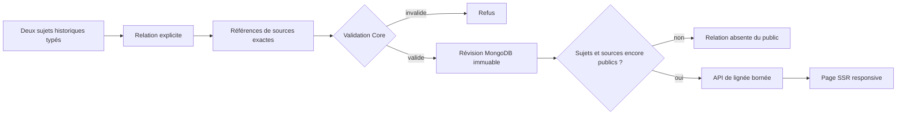
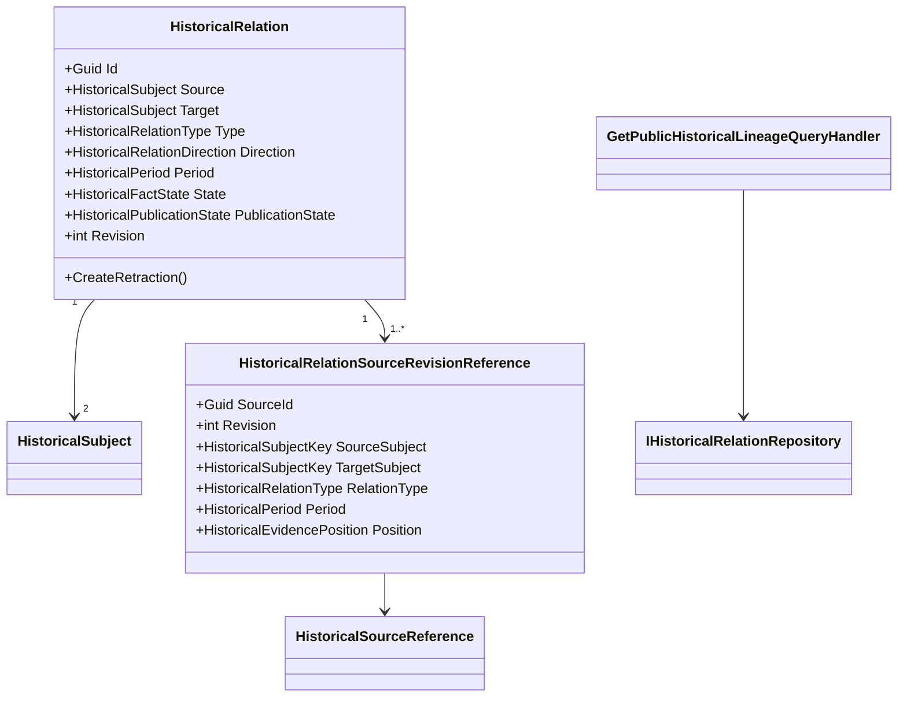
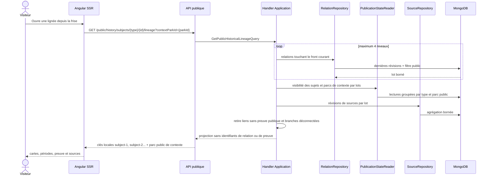

# HIST-09 — Relations et lignées historiques explicites

> Statut : implémenté le 27 septembre 2026  
> Version : 5.3.88  
> Portée : Core, Application, MongoDB, API publique, Angular SSR et i18n

## Enjeu métier

Une ressemblance de nom, une date proche ou un emplacement commun ne prouve
pas qu'une attraction en remplace une autre. `HIST-09` permet de raconter la
continuité réelle d'un parc sans transformer une hypothèse éditoriale en fait.
Le visiteur voit ce qui relie deux éléments, quand ce lien s'applique et sur
quelles sources il repose.

Les neuf types initiaux sont :

- `RenamedTo` : même identité renommée ;
- `ReplacedBy` : remplacement explicitement documenté ;
- `MovedTo` : déplacement documenté ;
- `RethemedAs` : rethématisation documentée ;
- `SuccessorOf` : succession sans affirmer un remplacement matériel ;
- `SamePhysicalAssetAs` : même installation physique ;
- `SharesLocationWith` : emplacement partagé ;
- `OperatedByDuring` : exploitant pendant une période ;
- `LocatedInZoneDuring` : présence dans une zone pendant une période.

`SamePhysicalAssetAs` et `SharesLocationWith` sont symétriques. Les autres
relations sont dirigées. Une relation dirigée n'engendre jamais
automatiquement sa réciproque.

## Flux de publication



La source doit couvrir l'identité du sujet de départ, l'identité du sujet
cible, le type de relation et la période. Un lien `Verified` ne tolère pas une
preuve contradictoire admissible. Un lien `Disputed` exige au contraire au
moins une preuve favorable et une preuve contradictoire portant sur une portée
commune. `Probable` et `Disputed` exigent une explication publique dans les huit
langues.

## Modèle de classes



Les entités et validateurs purs résident dans Core. L'Application borne la
traversée, orchestre la visibilité et assemble la projection. Infrastructure
seule connaît MongoDB. Le contrôleur HTTP et Angular ne contiennent aucune
règle de preuve.

## Schéma MongoDB

Collection `historical-relations` :

```javascript
{
  _id: "<revision-uuid>",
  relationId: "<stable-relation-uuid>",
  revision: 2,
  supersedesRevision: 1,
  source: {
    type: "ParkItem",
    id: "<internal-subject-id>",
    historicalLabel: "Ancienne attraction",
    publicationPolicy: "HistoricalOnly",
    contextParkId: "<park-id>"
  },
  target: { /* même structure */ },
  type: "ReplacedBy",
  direction: "Directed",
  period: { start: { year: 2001 }, end: { year: 2001 } },
  state: "Verified",
  workflowState: "Published",
  publicationState: "Published",
  sources: [{
    sourceId: "<source-uuid>",
    revision: 2,
    sourceSubject: { type: "ParkItem", id: "..." },
    targetSubject: { type: "ParkItem", id: "..." },
    relationType: "ReplacedBy",
    period: { /* assertion exacte */ },
    position: "Supports",
    scopes: [
      "RelationSourceIdentity",
      "RelationTargetIdentity",
      "RelationType",
      "Period"
    ]
  }],
  transitionReviewEvent: { /* revue immuable */ },
  recordedAtUtc: "2026-09-27T10:00:00Z"
}
```

Indexes :

- unique `(relationId, revision)` ;
- `(source.type, source.id, type, revision desc)` ;
- `(target.type, target.id, type, revision desc)` ;
- `(publicationState, state)` ;
- `(sources.sourceId, sources.revision)` ;
- `(transitionReviewEvent.occurredAtUtc desc, revision desc)`.

La collection est créée et indexée par l'initialiseur existant au démarrage.
Aucune migration de contenu n'est volontairement lancée : les anciens liens
narratifs ne constituent pas une preuve suffisante pour fabriquer une relation.

## Séquence de lecture publique



La traversée est bornée à quatre niveaux, soixante sujets et deux cents
relations par lot. Un contrôle supplémentaire détecte réellement si une suite
existe au-delà de la profondeur publique. La page l'indique alors sans charger
un graphe illimité.

## Contrat public et confidentialité technique

La route publique est :

```text
GET /api/public/history/subjects/{type}/{id}/lineage?contextParkId={parkId}
```

L'identité canonique d'un sujet est le triplet type, identifiant et parc de
contexte. Le parc de contexte est obligatoire pour un élément ou une zone :
deux anciens sujets provenant de parcs différents ne fusionnent donc jamais,
même si un identifiant technique a été réutilisé. Cette portée fait partie des
clés de traversée, des références de preuve et des index MongoDB ; le dépôt la
filtre dès la requête et l'Application la revérifie avant exposition.

Les paramètres d'URL désignent nécessairement la ressource demandée. Dans le corps,
les sujets de la relation reçoivent des clés locales `subject-1`, `subject-2`,
utilisables seulement pour relier les cartes de cette réponse. Le parc public
de contexte peut fournir son identité de route et son nom afin de construire un
fil d'Ariane réellement navigable ; son éligibilité publique est revérifiée en
lot. Les identifiants de relation, de source et de révision ne sont jamais
sérialisés.

## Responsive, SSR et SEO

La frise appelle la lignée seulement lorsque son lot borné confirme qu'un lien
publié touche le sujet. La page dédiée est rendue côté serveur. Son fil d'Ariane
visible et son `BreadcrumbList` relient Accueil, Parcs, le parc de contexte,
son Histoire et le sujet consulté. Elle reste `noindex,follow` jusqu'au jalon
`HIST-13`.

La route Angular porte également le parc de contexte avant le type de sujet :
`/{lang}/history/lineages/{contextParkId}/{type}/{id}/{slug}`. Son canonical et
son rendu SSR conservent cette portée afin qu'une lignée ne soit jamais
adressable sous l'identité d'un autre parc.

Chaque conteneur utilise `min-width: 0`, `overflow-wrap: anywhere` et une largeur
bornée au viewport. Sous 560 px, les deux sujets et la flèche passent en colonne,
les métadonnées occupent toute la largeur et aucune source longue ne peut créer
de défilement horizontal.

## Limite volontaire et suite

`HIST-09` fournit le modèle, la persistance, la lecture publique et la restitution.
`HIST-12` ajoutera l'écran de saisie, de revue, de correction et de rétractation
admin en appelant le même `IHistoricalRelationRepository`. Il ne créera ni
adaptateur parallèle ni second format de relation.
