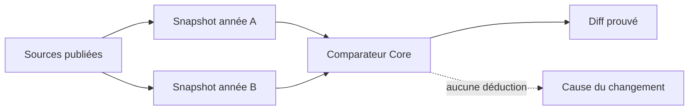
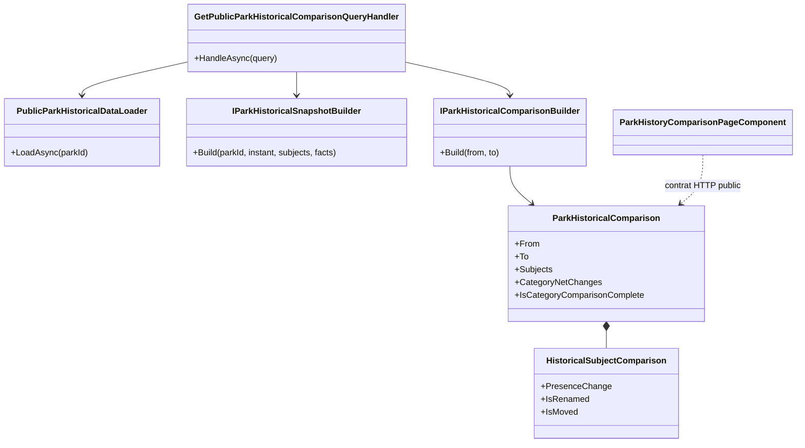
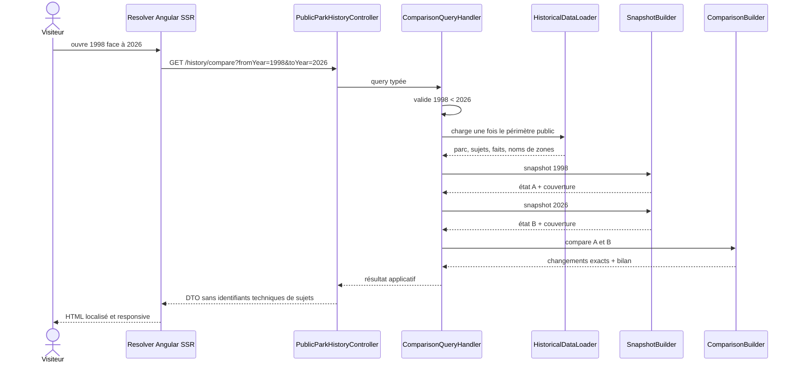

# HIST-10 — Comparaison historique entre deux dates

Date : 27 septembre 2026

Version : 5.3.90

Statut : implémenté

## 1. Valeur métier

La comparaison répond à une question simple : « qu'est-ce qui a réellement
changé dans ce parc entre ces deux années ? ». Elle ne se contente pas de
juxtaposer deux listes. Elle sépare :

- les éléments présents aux deux époques ;
- les ouvertures établies ;
- les fermetures établies ;
- les changements de nom établis ;
- les changements de zone établis ;
- les situations encore incertaines ;
- l'évolution nette du nombre d'éléments ouverts par catégorie.

La comparaison est accessible depuis la frise historique et chaque vue
annuelle. Son URL publique est stable :

```text
/{lang}/park/{parkId}/{parkSlug}/history/compare/{fromYear}/{toYear}
```

## 2. Principe de confiance

Le système ne compare jamais directement les documents MongoDB. Il demande au
moteur canonique de reconstruire le parc à chaque date, puis compare les deux
résultats. Une lacune documentaire reste une incertitude.



La flèche en pointillé indique une sortie volontairement inexistante : le
moteur n'émet aucune cause automatique.

## 3. Règles de classement

| État au départ | État à l'arrivée | Résultat |
|---|---|---|
| ouvert établi | ouvert établi | présent aux deux dates |
| fermé établi | ouvert établi | ouvert entre les dates |
| ouvert établi | fermé établi | fermé entre les dates |
| fermé établi | fermé établi | absent aux deux dates, non affiché |
| toute combinaison avec `PossiblyOpen` ou `Unknown` | — | incertain |

Un renommage exige deux noms historiques connus et différents. Un déplacement
exige deux zones historiques connues, résolues et différentes. Le simple fait
que le nom ou la zone manque à une date ne produit jamais un changement.

Le bilan par catégorie ne compte que les éléments `ParkItem` ouverts avec
certitude et dont la catégorie historique est connue. Le contrat indique
explicitement si des éléments ouverts non classés rendent ce bilan partiel.

## 4. Architecture



Les responsabilités restent séparées :

- Core : règles de comparaison pures ;
- Application : chargement unique et orchestration des deux snapshots ;
- WebAPI : contrat public et résolution des libellés ;
- Angular : navigation, présentation et SEO ;
- Infrastructure : lecture des faits existants, sans nouvelle persistance.

HIST-10 n'ajoute aucune collection MongoDB et ne nécessite aucune migration.
Il consomme les faits, sources et index déjà livrés par HIST-03 à HIST-09.

## 5. Séquence d'une requête



## 6. Contrat public

L'endpoint est :

```http
GET /public/parks/{parkId}/history/compare?fromYear=1998&toYear=2026
```

Il expose le parc public, les deux dates, la couverture des deux snapshots,
les comparaisons de sujets, le bilan par catégorie et la version de méthode.
Il n'expose pas :

- l'identifiant interne d'un élément historique ;
- l'identifiant interne d'une zone ;
- l'identifiant d'un fait, d'une preuve ou d'une révision ;
- une valeur structurée interne ;
- une cause supposée.

Chaque sujet reçoit une clé locale `subject-N`, valable uniquement dans la
réponse. Les zones sont résolues séparément pour l'année de départ et l'année
d'arrivée afin qu'un ancien nom ne soit pas remplacé par le nom actuel.

## 7. Interface et responsive

L'écran comporte :

1. deux champs d'année et une validation locale ;
2. un axe visuel départ-arrivée ;
3. quatre compteurs synthétiques ;
4. un graphique léger par catégorie, sans bibliothèque supplémentaire ;
5. des cartes distinctes pour ouvertures, fermetures, transformations et
   incertitudes ;
6. une liste repliable des présences stables ;
7. un rappel clair de la méthode de preuve.

Il n'utilise aucun tableau à largeur intrinsèque. À 520 pixels et moins, tous
les contrôles, graphiques et cartes passent en une colonne. Les conteneurs ont
`min-width: 0`, les libellés utilisent `overflow-wrap: anywhere` et l'hôte
partagé coupe tout débordement horizontal. Ce contrat est testé à 320 pixels.

## 8. SSR, navigation et SEO

Le resolver valide les deux années avant tout appel réseau. Une plage inversée
produit un 404 SSR au lieu d'une page vide. Les erreurs temporaires conservent
le statut HTTP correspondant.

Le fil d'Ariane visible et le `BreadcrumbList` suivent :

```text
Accueil > Parcs > Parc > Histoire > 1998 face à 2026
```

La page définit un titre, une description et une URL canonique localisés. Elle
reste `noindex,follow` : HIST-13 décidera quelles comparaisons ont assez de
couverture et de valeur éditoriale pour devenir indexables.

## 9. Preuves automatisées

Les tests protègent notamment :

- la matrice ouvert/fermé/incertain ;
- les renommages et déplacements uniquement avec deux valeurs connues ;
- le bilan net et son indicateur de catégories manquantes ;
- le refus des plages inversées avant toute lecture ;
- le chargement applicatif unique pour les deux snapshots ;
- l'absence d'identifiants techniques dans le DTO public ;
- la résolution des noms historiques de zones ;
- l'encodage exact de l'endpoint Angular ;
- le resolver SSR et son 404 local ;
- l'ordre des routes devant la route générique d'article ;
- le repli responsive de l'écran de comparaison.

## 10. Limites assumées

- Le résultat reflète la couverture documentaire disponible, pas une vérité
  exhaustive sur le parc.
- Une ouverture ou fermeture survenue entre les deux dates n'est annoncée que
  si les états aux bornes sont établis.
- La cause d'un changement devra toujours provenir d'un récit ou d'un fait
  explicitement sourcé ; elle n'est pas déduite du diff.
- L'administration de la couverture et la revue ergonomique relèvent de
  HIST-12 ; la sélection SEO et le partage relèvent de HIST-13.
