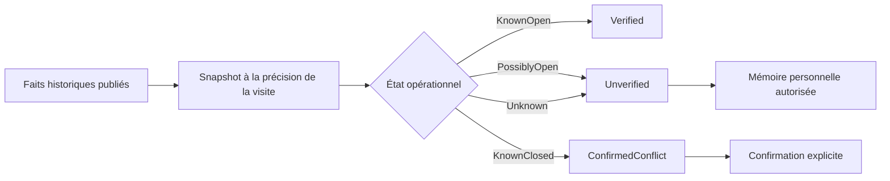
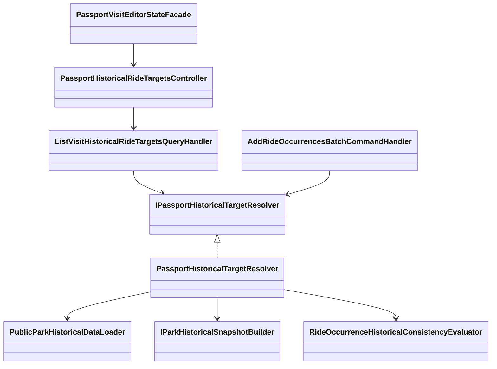
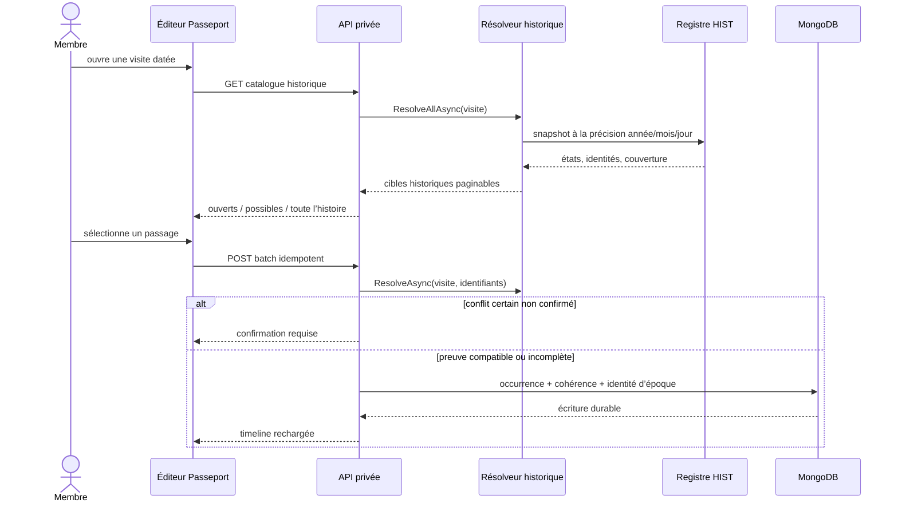

# HIST-11A — Contexte historique canonique du Passeport

Date : 27 septembre 2026  
Statut : implémenté dans la version 5.3.91

## Enjeu métier

Lorsqu’une personne complète une visite ancienne, le sélecteur ne doit pas lui
présenter le parc actuel comme s’il n’avait jamais changé. Il doit replacer les
attractions dans la période de la visite, tout en laissant la mémoire personnelle
possible lorsque les preuves sont incomplètes.

Cette livraison couvre le socle de `HIST-11` : catalogue daté, identité de
l’époque, contrôle des conflits certains et revalidation non destructive. Le
signalement « cet élément existait » et les statistiques historiques personnelles
restent deux livraisons distinctes (`HIST-11B` et `HIST-11C`).

## Comportement livré

| État historique canonique | Présentation | Effet à l’enregistrement |
|---|---|---|
| `KnownOpen` | proposé par défaut | cohérence `Verified` |
| `PossiblyOpen` | filtre séparé | mémoire acceptée, cohérence `Unverified` |
| `Unknown` | recherche « toute l’histoire » | mémoire acceptée, cohérence `Unverified` |
| `KnownClosed` | recherche « toute l’histoire » | confirmation explicite exigée |

Le catalogue permet la recherche et le filtrage par zone avec une pagination
bornée à 50 éléments côté serveur. Il expose aussi la couverture historique afin
que l’interface n’affiche jamais une absence de preuve comme une certitude.

Le nom et la catégorie résolus à la date de visite sont figés dans l’occurrence.
Une amélioration ultérieure du registre historique recalcule l’indicateur de
cohérence lors de la lecture ou de la modification, sans supprimer le souvenir ni
réécrire silencieusement sa note privée.

## Une seule source de vérité

L’ancien calcul local à partir des seules dates courantes d’ouverture et de
fermeture a été supprimé du flux Passeport. Le domaine reçoit désormais l’état
produit par `ParkHistoricalSnapshotBuilder` et applique uniquement la conversion
suivante :



Le parcours de transition d’un voyage vers le Passeport consomme le même
résolveur. Il n’existe donc pas de seconde interprétation historique propre au
Trip Planner.

## Architecture



Les responsabilités restent séparées :

- Core : conversion pure état historique → cohérence ;
- Application : résolution canonique et orchestration des cas d’usage ;
- Infrastructure : projection Mongo minimale et persistance de l’identité figée ;
- WebAPI : authentification, validation du filtre et DTO ;
- Angular : état d’écran, recherche, pagination et rendu responsive.

## Séquence d’ajout d’un passage



## Schéma Mongo concerné

Les occurrences conservent déjà leur `historicalConsistency` et leur
`historicalTarget`. La réservation idempotente mémorise désormais la même
identité afin qu’une reprise après coupure produise exactement le même résultat.

```text
userRideOccurrenceCreationOperations
└─ creationPreparation
   ├─ parkId
   ├─ visitDate { year, month?, day?, precision, isApproximate }
   ├─ timeZoneId?
   ├─ serviceDayConvention
   └─ items[]
      ├─ index
      ├─ parkItemId
      ├─ historicalConsistency
      ├─ historicalTargetName?       <- nom à la date de visite
      └─ historicalTargetCategory?   <- catégorie à la date de visite

userRideOccurrences
├─ historicalConsistency
└─ historicalTarget?
   ├─ name
   └─ category
```

Les deux nouveaux champs de préparation sont optionnels. Les documents déjà
finalisés restent lisibles ; aucune duplication de collection et aucun second
modèle de cohérence ne sont introduits.

## Performance et responsive

- résolution courante par lots de 200 identifiants ;
- aucune lecture d’image pendant les validations d’écriture ;
- images chargées uniquement pour le catalogue visible ;
- snapshots Trip calculés uniquement pour les jours confirmables ou reprenables ;
- pagination serveur bornée ;
- grille à une colonne sous 46 rem ;
- champs et cartes avec `min-width: 0`, `max-width: 100%` et retour à la ligne
  forcé pour empêcher tout dépassement horizontal sur mobile.

## Preuves automatisées

- les quatre états canoniques sont testés dans le Core ;
- le résolveur prouve qu’un état antérieur à une ouverture connue devient un
  conflit certain et qu’une validation n’effectue aucune lecture d’image ;
- le handler teste propriété de la visite, recherche, zone, pagination, compteurs
  et couverture ;
- l’API teste l’authentification privée, le `no-store` et le mapping ;
- le front teste l’appel paginé privé, le mapping d’une attraction historique,
  les sélections, les conflits et les réponses concurrentes.

## Suites de HIST-11

1. `HIST-11B` — signalement sourcé « cet élément existait » avec modération ;
2. `HIST-11C` — statistiques historiques privées : attractions disparues,
   transformations, noms d’époque, catégories et première année de visite ;
3. publication éventuelle uniquement via le système central `SHARE`.
