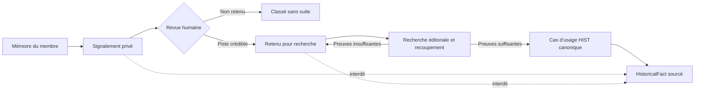
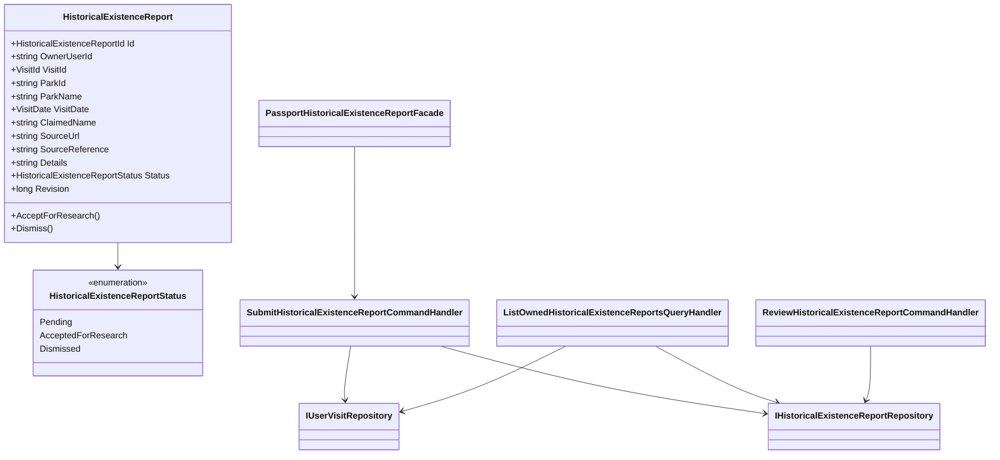
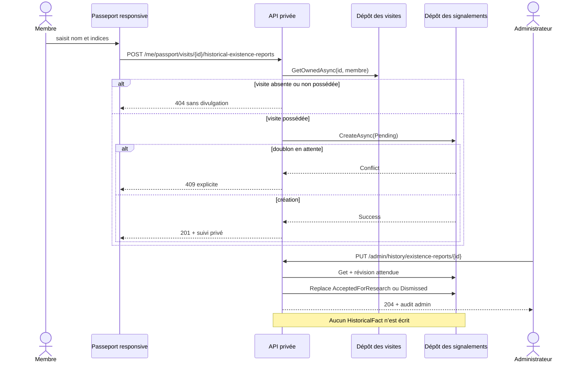

# HIST-11B — Signalement historique depuis le Passeport

Date : 27 septembre 2026
Statut : implémenté dans la version 5.3.92

## Enjeu métier

Une visite personnelle peut contenir le souvenir d’une attraction absente du
catalogue historique. L’absence ne prouve pas que l’attraction n’existait pas :
elle peut révéler un inventaire incomplet, un ancien nom ou une période encore
mal documentée.

Le Passeport permet désormais de signaler cette mémoire depuis la visite
concernée. Le membre indique le nom dont il se souvient et peut ajouter une URL
HTTPS, une référence matérielle et des détails. Le signalement reste privé,
traçable et soumis à une revue humaine. Il ne crée, ne publie et ne modifie
jamais directement un `HistoricalFact`.

## Parcours livré

1. le membre ouvre une visite de son Passeport, brouillon ou terminée ;
2. il développe « Une attraction manque pour cette visite ? » ;
3. il saisit un nom et, facultativement, une source ou des indices ;
4. l’API vérifie que la visite lui appartient ;
5. le contexte factuel minimal est figé : parc, nom du parc et date de visite ;
6. le signalement apparaît dans son suivi avec l’état `À vérifier` ;
7. un administrateur peut le retenir pour recherche ou le classer sans suite ;
8. toute création de fait historique reste un cas d’usage éditorial distinct.

Une contrainte MongoDB empêche deux signalements simultanément en attente pour
le même membre, la même visite et le même nom normalisé. Un nouveau signalement
reste possible après traitement, afin de fournir une nouvelle preuve.

## Frontière de confiance



`AcceptedForResearch` signifie uniquement que la piste mérite une recherche.
Il ne signifie ni « vrai », ni « publié », ni « visible dans les snapshots ».

## Modèle de domaine



Le Core porte les invariants de texte sûr, URL HTTPS, chronologie de revue et
transition unique. L’Application contrôle la propriété de la visite et orchestre
les cas d’usage. L’Infrastructure ne fait que persister et indexer. Les
contrôleurs imposent authentification, autorisation, limitation de débit,
`no-store` et audit admin. Angular passe exclusivement par un port de données.

## Séquence de signalement et de revue



## Schéma MongoDB

```text
historical-existence-reports
├─ _id
├─ ownerUserId
├─ visitId
├─ parkId
├─ parkName
├─ visitDate
│  ├─ year
│  ├─ month?
│  ├─ day?
│  ├─ precision
│  └─ isApproximate
├─ claimedName
├─ normalizedClaimedName
├─ sourceUrl?
├─ sourceReference?
├─ details?
├─ status
├─ submittedAtUtc
├─ reviewedByUserId?
├─ reviewedAtUtc?
├─ decisionNote?
└─ revision

index idx_history_existence_status_submitted
  status ↑, submittedAtUtc ↓, _id ↓

index idx_history_existence_owner_visit
  ownerUserId ↑, visitId ↑, submittedAtUtc ↓

index idx_history_existence_park_status
  parkId ↑, status ↑, submittedAtUtc ↓

index unique ux_history_existence_pending_claim
  ownerUserId ↑, visitId ↑, normalizedClaimedName ↑
  filtre partiel : status = Pending
```

La collection est créée par l’initialiseur MongoDB. Elle est additive : aucune
migration destructive ni coexistence avec un ancien système n’est nécessaire.

## Confidentialité et sécurité

- les routes membre sont limitées aux rôles connectés et activés ;
- le chargement vérifie toujours la propriété de la visite avant la lecture des
  signalements ;
- l’identifiant du propriétaire et celui du relecteur ne sont jamais renvoyés
  dans les DTO ;
- le titre et la note privée de la visite ne sont jamais copiés ;
- la purge différée d’une visite supprime aussi tous ses signalements, en
  exigeant à la fois l’identifiant de visite et celui du propriétaire ;
- seules les URL HTTPS sans informations d’authentification sont acceptées ;
- les balises et caractères de contrôle dangereux sont refusés ;
- le débit est limité par membre et la revue admin est sérialisée ;
- la révision optimiste empêche une double décision concurrente ;
- les réponses privées portent `no-store`.

## Responsive et accessibilité

Le composant est indépendant de la timeline et disponible même lorsque la visite
est terminée. Il utilise `min-width: 0`, `max-width: 100%`,
`overflow-wrap: anywhere` et des champs bornés. Sous 640 pixels, en-tête,
formulaire, suivi et actions passent en une colonne ; les boutons occupent toute
la largeur utile. Aucun contenu long (nom, source ou décision) ne peut élargir le
viewport.

Les erreurs sont associées aux champs, les statuts sont annoncés dans une zone
vivante et les boutons conservent une cible tactile exploitable.

## Preuves automatisées

- invariants Core, URL sûre et transition de revue unique ;
- propriété de visite, absence de fuite intercompte et contexte figé ;
- suivi borné au propriétaire et révision concurrente ;
- index MongoDB privé, file de revue et dédoublonnage partiel ;
- routes privées/admin, `no-store`, limitation de débit et audit ;
- port Angular, erreurs 409/429, absence de cache de transfert ;
- contrat responsive à une colonne et retour à la ligne des contenus longs ;
- traductions alignées dans les huit langues.

## Suite de la roadmap

`HIST-11C` exploitera uniquement les faits historiques canoniques pour produire
les statistiques personnelles d’époque. Les signalements, même retenus pour
recherche, en restent exclus tant qu’un fait sourcé n’a pas été créé et publié
par le système HIST.
