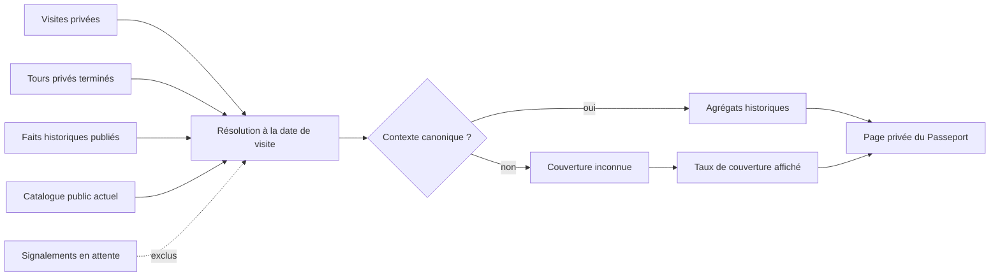
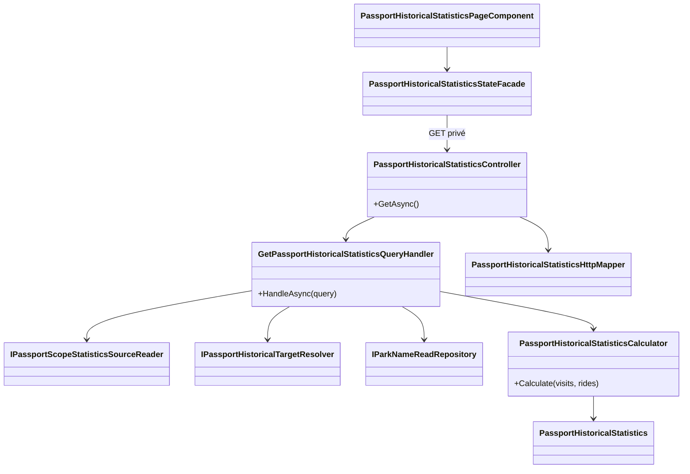
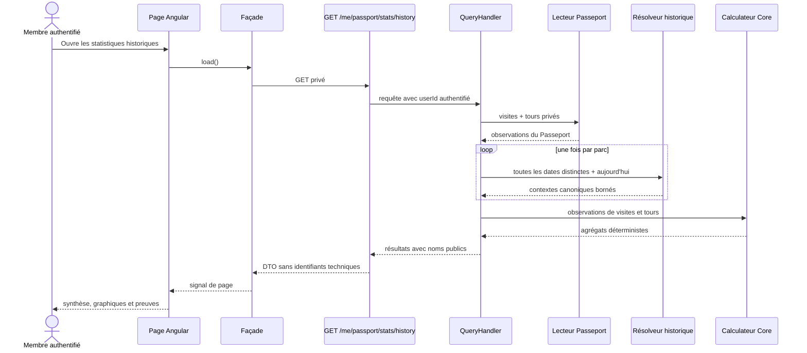
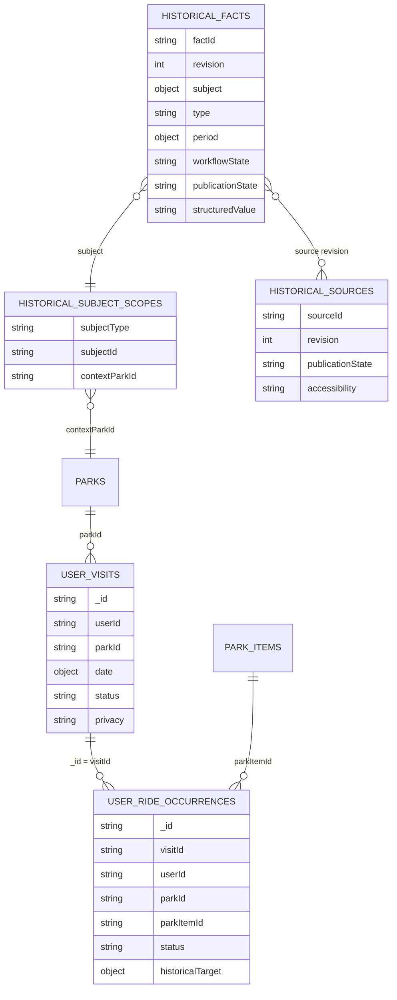

# HIST-11C — Statistiques historiques privées du Passeport

Date : 27 septembre 2026  
Statut : implémenté dans la version 5.3.93

## Résultat métier

Le Passeport ne présente plus seulement une somme de visites et de tours. Il
replace désormais l'expérience personnelle dans l'histoire documentée des
parcs : première année visitée, époques parcourues, attractions aujourd'hui
disparues, transformations vécues, noms d'époque et catégories historiques.

Cette lecture est strictement privée. Elle est calculée à la demande depuis le
Passeport du membre et n'est ni publiée, ni intégrée automatiquement à un
partage existant.

## Règles de confiance

Une statistique historique n'est comptée que si le contexte de l'attraction à
la date de visite provient du référentiel canonique publié. Les propositions
de membres créées par `HIST-11B`, les faits en attente de revue et les
résolutions de secours ne deviennent donc jamais des preuves par simple effet
de calcul.

Les règles détaillées sont les suivantes :

- seuls les tours au statut `Completed` alimentent les statistiques par
  attraction ;
- une attraction disparue était `KnownOpen` à la visite et est
  canoniquement `KnownClosed` aujourd'hui ;
- une transformation exige un nom ou une catégorie canonique différente
  entre la visite et aujourd'hui ;
- une époque de parc correspond à une empreinte déterministe de l'inventaire
  canoniquement ouvert, avec les noms et catégories valables à cette date ;
- deux visites d'un même parc ne représentent plusieurs époques que si leurs
  empreintes diffèrent ;
- les données non résolues restent visibles dans le taux de couverture mais
  ne sont jamais devinées ;
- l'année de première visite vient de toutes les visites privées, tandis que
  les statistiques d'attractions exigent une preuve canonique.

## Parcours utilisateur

La page de statistiques globales du Passeport expose une action
« statistiques historiques ». La nouvelle page affiche :

1. une synthèse de la première visite, des époques, disparitions,
   transformations, noms historiques et du taux de couverture ;
2. un graphique des époques vécues par parc ;
3. un graphique des catégories historiques réellement parcourues ;
4. des cartes lisibles pour les attractions disparues, transformations et
   noms d'époque ;
5. une explication permanente de la qualité des preuves et du caractère
   privé des résultats.

Les identifiants MongoDB et identifiants métier internes ne traversent pas le
contrat HTTP destiné à l'écran. Les parcs et attractions sont présentés par
leurs noms.

## Architecture applicative

La séparation des responsabilités reste stricte :

- **Core** : règles pures de calcul, sans HTTP, Angular ni MongoDB ;
- **Application** : orchestration des lectures, résolution par date et
  conversion des noms ;
- **Infrastructure** : réutilisation des lecteurs MongoDB et du moteur
  historique existants, sans nouvelle dépendance du domaine ;
- **WebAPI** : authentification, réponse `no-store` et DTO sans identifiants
  techniques ;
- **Angular** : état de page dans une façade derrière un port, rendu et
  navigation dans le composant.

Chaque classe et chaque interface applicative ajoutée possède son propre
fichier.

## Séquence de calcul

Le handler regroupe les dates par parc et effectue une résolution groupée. Il
n'exécute donc pas une requête historique par tour, ce qui borne le coût pour
le VPS de production.

## Schéma MongoDB lu

Ce jalon n'ajoute aucune collection, aucun champ et aucun index. Il ne demande
donc ni migration MongoDB ni adaptation des données existantes. La projection
est calculée à la lecture.

Collections concernées en lecture :

- `user-visits` ;
- `user-ride-occurrences` ;
- `parks` et `parkItems` pour les noms et le catalogue actuel ;
- `historical-subject-scopes`, `historical-facts` et
  `historical-sources` via le moteur historique existant.

Les documents `historical-existence-reports` ne participent pas au calcul tant
que leur contenu n'a pas été revu puis publié dans le référentiel canonique.

## Contrat HTTP et confidentialité

`GET /me/passport/stats/history` exige un membre authentifié, activé et non
bloqué. La réponse porte `Cache-Control: no-store`. Elle contient des noms,
années, compteurs et taux, mais aucun `parkId`, `parkItemId`, `visitId` ou
`rideOccurrenceId`.

La publication future d'une partie de ces données devra passer par le système
centralisé `SHARE`. Cette livraison ne crée pas un second mécanisme de partage
et ne modifie aucun partage existant.

## Responsive et accessibilité

La page respecte le contrat mobile global du projet :

- toutes les grilles utilisent `minmax(0, 1fr)` ;
- chaque conteneur critique porte `min-width: 0` et `max-width: 100%` ;
- les textes longs utilisent `overflow-wrap` ;
- les grilles passent à une colonne sous 900 px ou 620 px ;
- la marge basse tient compte de la navigation mobile et de la safe area ;
- aucun tableau horizontal ni identifiant long ne peut dépasser le viewport ;
- les graphiques conservent une structure accessible et des légendes
  explicites.

## Vérifications automatisées

- calculs Core : couverture vide, époques distinctes, transformation,
  disparition, noms et catégories ;
- handler Application : résolution groupée, noms lisibles et exclusion des
  données non canoniques ;
- contrôleur WebAPI : authentification, `no-store` et absence d'identifiants
  techniques ;
- façade Angular : succès et erreur localisée ;
- page Angular : graphiques, contenu nommé, absence d'identifiants et contrat
  responsive ;
- route lazy/authentifiée, endpoint et service HTTP ;
- architecture « une classe par fichier » et dépendances façade/ports ;
- cohérence des huit langues.

## Limites assumées

- une couverture historique partielle produit moins de statistiques, jamais
  une estimation ;
- une visite sans tour terminé contribue aux années et époques, pas aux
  statistiques d'attractions ;
- les statistiques restent privées tant qu'un futur jalon `SHARE` n'a pas
  défini explicitement un périmètre publiable ;
- l'extension de la couverture à davantage de parcs reste gouvernée par
  `HIST-14`.
