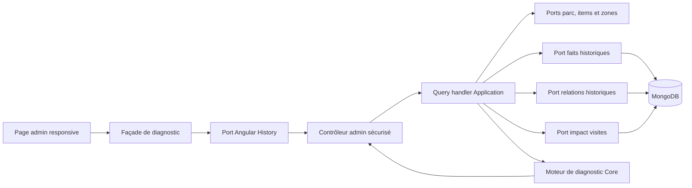
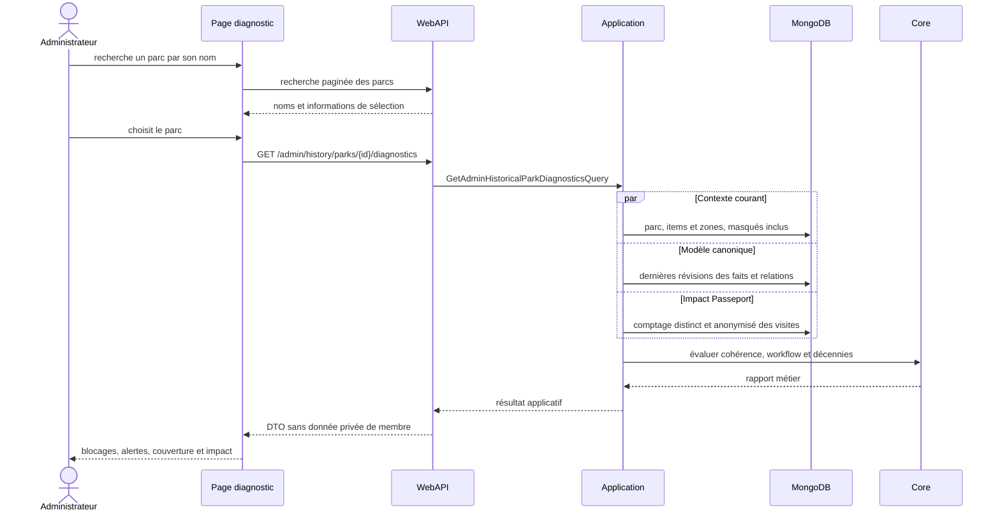

# HIST-12A — Diagnostic historique d’administration

## Résultat métier

Avant de publier ou corriger l’histoire d’un parc, l’administration peut
désormais rechercher le parc par son nom et obtenir un rapport synthétique qui
répond à quatre questions :

1. quelles incohérences doivent être corrigées ;
2. quelles preuves documentaires manquent ;
3. quelles périodes sont suffisamment couvertes ;
4. combien de visites personnelles pourraient devoir être réévaluées.

Le rapport n’est pas un second éditeur historique. Il lit le modèle canonique
introduit par `HIST-02` à `HIST-11`, puis prépare le travail de l’atelier
éditorial `HIST-12B`.

## Périmètre des contrôles

Le Core produit des codes métier stables pour :

- une date de début ou de fin absente ;
- un intervalle temporel ambigu ;
- une ouverture enregistrée après une fermeture sans réouverture explicite ;
- un cycle incompatible dans une filiation ;
- plusieurs changements de nom qui se chevauchent ;
- une relation vers une zone absente du parc courant et de son histoire ;
- un fait ou une relation sans source.

Les erreurs bloquantes sont séparées des avertissements éditoriaux. Les
révisions rétractées ou retirées ne créent plus de signal actif, mais restent
comptées dans l’avancement du workflow afin que l’historique de revue ne soit
pas masqué.

## Architecture

- le Core possède les règles de cohérence et les agrégats du rapport ;
- l’Application orchestre les lectures et ne connaît pas MongoDB ;
- l’Infrastructure recharge la dernière révision de chaque chaîne et agrège
  les visites distinctes ;
- la WebAPI impose le rôle administrateur, un compte activé et non bloqué,
  désactive le cache et mappe un contrat explicite ;
- Angular passe par deux ports injectables : diagnostic et recherche de parc.

## Séquence de lecture

## Confidentialité Passeport

La requête sur les passages filtre uniquement les occurrences terminées,
actives et rattachées au parc. Une agrégation MongoDB compte les `visitId`
distincts par état de cohérence. Le résultat ne contient que trois nombres :
visites potentiellement incohérentes, conflits confirmés et visites non
vérifiables. Les identifiants de visite et d’utilisateur ne quittent jamais
l’Infrastructure.

## Persistance et déploiement

Aucun document existant n’est transformé et aucune migration de données n’est
requise. Le démarrage de l’API crée ou vérifie :

- deux indexes de portée parc sur les relations historiques ;
- un index couvrant parc, statut, cohérence, suppression et visite sur les
  passages.

Le diagnostic utilise les collections canoniques `historical-facts`,
`historical-relations` et `user-ride-occurrences`. Il n’existe donc ni
adaptateur de compatibilité ni système parallèle à retirer plus tard.

## Responsive et accessibilité

La page utilise des cartes et non un tableau horizontal. Toutes les grilles
emploient `minmax(0, 1fr)`, les conteneurs ont `min-width: 0`, les textes longs
peuvent se couper et chaque disposition multi-colonnes devient une seule
colonne sous 42 rem. Un test de contrat protège ces invariants afin d’éviter un
nouveau dépassement du viewport mobile.

## Suite `HIST-12B`

Le prochain incrément ajoutera, sur le même modèle canonique, l’atelier
d’édition et de revue des faits, relations et sources, l’aperçu de ce que verra
le public et la simulation d’impact avant publication. La publication restera
une transition explicite et auditée.
