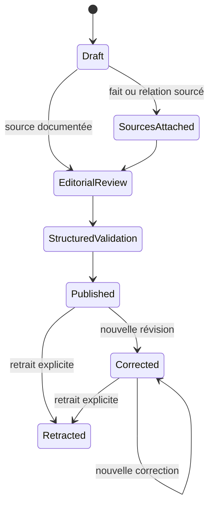
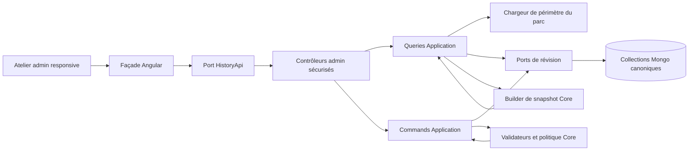
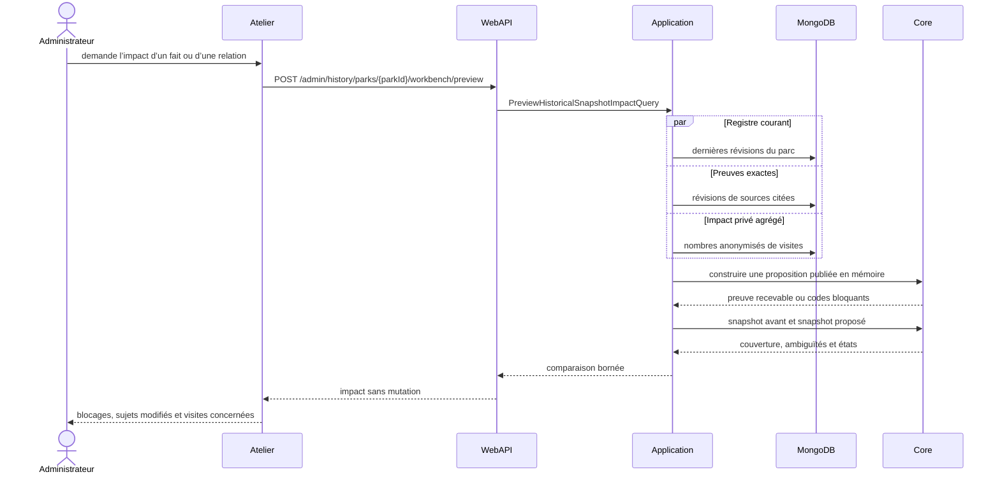

# HIST-12B — Atelier éditorial historique canonique

## Résultat métier

L’administration peut désormais transformer une information historique brute
en fait public vérifiable sans agir directement sur les pages visiteurs. Pour
un parc sélectionné, l’atelier permet de :

1. documenter une source et déclarer exactement ce qu’elle peut prouver ;
2. créer ou corriger un fait daté ou une relation entre deux identités ;
3. conserver les dates partielles, l’approximation et la contestation ;
4. faire passer chaque ressource par les étapes explicites de revue ;
5. simuler le résultat public et l’impact Passeport avant la publication ;
6. corriger ou retirer une information sans effacer ses versions précédentes.

L’atelier consomme le registre canonique introduit par `HIST-02` à `HIST-11`.
Il ne crée ni second historique, ni adaptateur de compatibilité, ni stockage
éditorial parallèle.

## Workflow et invariants

- chaque transition ajoute une révision immuable et un événement de revue ;
- `ExpectedRevision` protège contre l’écrasement concurrent ;
- un fait ou une relation vérifié ne peut atteindre la validation structurée
  sans satisfaire les invariants du domaine ;
- une ressource probable ou contestée ne peut être publique sans explication
  éditoriale dans les huit langues ;
- une preuve n’est recevable que pour sa révision exacte, son accessibilité et
  les portées explicitement sélectionnées ;
- une relation conserve ses deux identités : elle ne fusionne jamais deux
  attractions ou deux noms par déduction silencieuse.

## Architecture applicative

- le Core possède les transitions, les invariants de preuve, les dates et le
  calcul déterministe du snapshot ;
- l’Application charge le périmètre, orchestre les ports et construit une
  proposition de publication sans connaître MongoDB ou HTTP ;
- l’Infrastructure ajoute atomiquement la révision et son événement de revue
  dans le document canonique ;
- la WebAPI impose le rôle administrateur, un compte activé et non bloqué, un
  débit borné pour les mutations et simulations, et des DTO explicites ;
- Angular ne contient que l’état d’écran, la saisie et la présentation. Les
  appels passent par une façade et un port injectable.

## Séquence de prévisualisation

La simulation ne change aucune publication. Une relation est contrôlée pour
ses preuves et sa lignée, mais n’invente pas un changement de snapshot si elle
ne porte pas elle-même un état opérationnel.

## Contrats d’administration

Les routes sont séparées par responsabilité :

- `GET /admin/history/parks/{parkId}/workbench` charge le périmètre borné ;
- `POST|PATCH /admin/history/sources` gère les preuves ;
- `POST|PATCH /admin/history/parks/{parkId}/facts` gère les faits ;
- `POST|PATCH /admin/history/parks/{parkId}/relations` gère les relations ;
- les suffixes `/review` font avancer d’une seule étape ;
- les suffixes `/retract` retirent une publication sans suppression ;
- `POST .../workbench/preview` calcule l’impact sans écrire.

Toutes les mutations sont auditées. Les réponses d’erreur de production ne
renvoient ni exception interne ni contenu privé.

## Persistance et MongoDB

Aucune migration de données ni nouvelle collection n’est requise. L’atelier
réutilise `historical-facts`, `historical-relations` et `historical-sources`,
dont les documents savent déjà conserver leurs révisions et événements de
revue. La bibliothèque charge au plus cent dernières sources, auxquelles elle
ajoute les sources déjà citées par le parc afin de rester bornée sans rendre
une correction historique introuvable.

Les snapshots historiques sont actuellement calculés à la demande à partir de
la dernière révision canonique ; il n’existe donc pas de cache persistant à
purger. Si le cache facultatif de la roadmap est activé ultérieurement, sa clé
inclura la révision source et l’ancienne projection deviendra automatiquement
obsolète sans double système.

## Responsive, accessibilité et performance

L’atelier est paresseusement chargé avec les autres écrans d’administration.
Les listes utilisent des cartes plutôt que des tableaux horizontaux. Tous les
conteneurs ont `min-width: 0`, les textes et adresses longues peuvent se couper,
les grilles utilisent `minmax(0, 1fr)` et les actions deviennent pleine largeur
sur mobile. La page protège ainsi les viewports étroits jusque 320 pixels.

La simulation, plus coûteuse qu’une lecture, est soumise à une politique de
concurrence unique avec file bornée. Les sources sont chargées par lots et les
diagnostics Passeport ne remontent que des nombres agrégés.

## Preuves automatisées

- tests Core sur la progression exacte du workflow et les états terminaux ;
- tests Application sur l’ajout immuable d’une révision, l’audit et le conflit
  de concurrence ;
- tests du port HTTP sur l’encodage des routes et le corps de prévisualisation ;
- tests de façade sur la dernière sélection, le rechargement après mutation et
  les erreurs sûres ;
- test de contrat responsive contre les débordements du viewport ;
- compilation Angular de production avec SSR et contrôle i18n des huit langues.

## Suite

`HIST-13` sélectionnera les pages historiques réellement pertinentes pour le
SEO et le partage. L’atelier reste privé et `noindex` ; il prépare des données
fiables mais ne rend aucune route d’administration publique.
