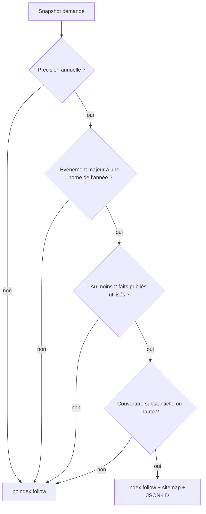
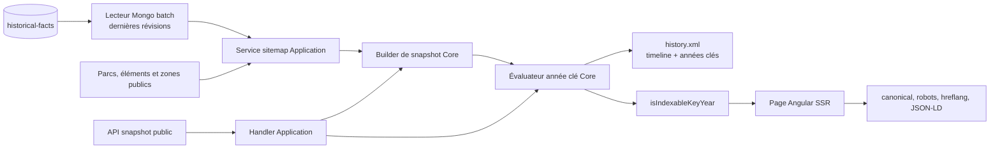
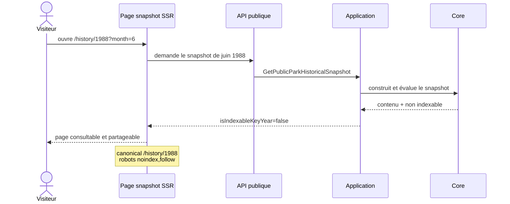

# HIST-13 — Années historiques clés, SEO et partage

## Résultat métier

L’explorateur historique peut désormais faire connaître les reconstitutions qui
ont une réelle valeur éditoriale sans créer une page indexable pour chaque date
possible. Une année devient une **année clé** uniquement lorsqu’elle réunit :

1. un événement canonique d’importance majeure qui commence ou se termine cette
   année-là ;
2. au moins deux faits publiés et admissibles effectivement utilisés par le
   snapshot ;
3. une couverture historique au moins substantielle ;
4. une sélection à la précision annuelle, jamais un mois ou un jour arbitraire.

Les autres reconstitutions restent consultables et partageables, mais elles sont
signalées `noindex,follow`. Leur URL canonique pointe vers l’année normalisée afin
de ne pas fragmenter la visibilité entre les variantes mensuelles et
journalières.

## Décision d’indexation

La règle appartient au Core dans
`HistoricalSnapshotSeoEligibilityEvaluator`. L’API renvoie seulement la décision
`IsIndexableKeyYear` avec le snapshot ; Angular applique les balises, sans
recalculer une règle métier.

## Architecture et flux de données

- le lecteur Mongo exécute une agrégation unique, sélectionne la dernière
  révision de chaque fait, puis ne conserve que les faits publiés admissibles ;
- le sitemap charge les présentations publiques en lots et ne construit des
  snapshots que pour les années candidates portées par des faits majeurs ;
- aucun balayage de toutes les années et aucune requête par parc ne sont
  introduits ;
- les sujets masqués avec une politique liée à leur fiche actuelle ne peuvent
  pas rendre une année publique ; un sujet `HistoricalOnly` explicitement
  publié reste admissible.
- la publication, la correction ou la rétractation réussie d’un fait public
  programme immédiatement une régénération du sitemap persistant ; un brouillon
  ou une mutation en conflit ne déclenche aucun travail inutile.
- la création, la modification ou la suppression réussie d’une zone programme
  aussi cette régénération, car sa visibilité peut modifier l’éligibilité
  publique d’une année historique.

## Canonicalisation et partage

Une année clé sans filtre reçoit `index,follow`, les alternates des huit langues
et un JSON-LD `WebPage`. Les timelines relient leurs événements datés au snapshot
annuel. Un récapitulatif de visite publique dont la date est visible propose
également « voir le parc à cette époque ». La date masquée ne produit aucun lien
historique.

Le composant de partage commun est réutilisé ; aucun second mécanisme social
n’est créé. Il partage l’URL courante et identifie clairement le parc et l’année.

## Responsive et accessibilité

Les nouvelles actions réutilisent les boutons et panneaux responsive existants.
Les liens de date acceptent le retour à la ligne, conservent un focus visible et
n’ajoutent aucune largeur fixe. Le récapitulatif public n’affiche le lien que
lorsque la date partagée existe réellement.

## Persistance et déploiement

Aucune migration MongoDB n’est nécessaire : ce jalon lit les collections
canoniques existantes et ajoute seulement une projection optimisée. Aucun cache
persistant ni second système historique n’est introduit. Le comportement devient
actif à la livraison applicative.

## Preuves automatisées

- Core : précision, événement majeur, couverture et nombre minimal de faits ;
- Application : exclusion des sujets masqués et sélection des années candidates ;
- Application : régénération du sitemap après publication, correction ou
  rétractation d’un fait public ;
- Application : régénération après création, modification ou suppression d’une
  zone de parc ;
- sitemap : émission de la timeline et de la seule année clé, dans chaque langue ;
- Infrastructure : ordre de l’agrégation Mongo et filtre des dernières révisions
  publiées ;
- WebAPI : transport de la décision d’indexation ;
- Angular : canonical, `robots`, alternates et JSON-LD selon la décision ;
- i18n : cohérence des huit langues et des sources modulaires.

## Suite

`HIST-14` active l’explorateur parc par parc selon un gate explicite de qualité.
Il réutilisera cette décision d’année clé et ne dépendra pas de l’existence de
visites communautaires.
