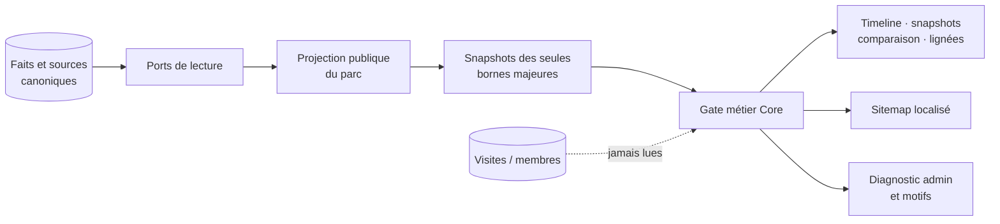
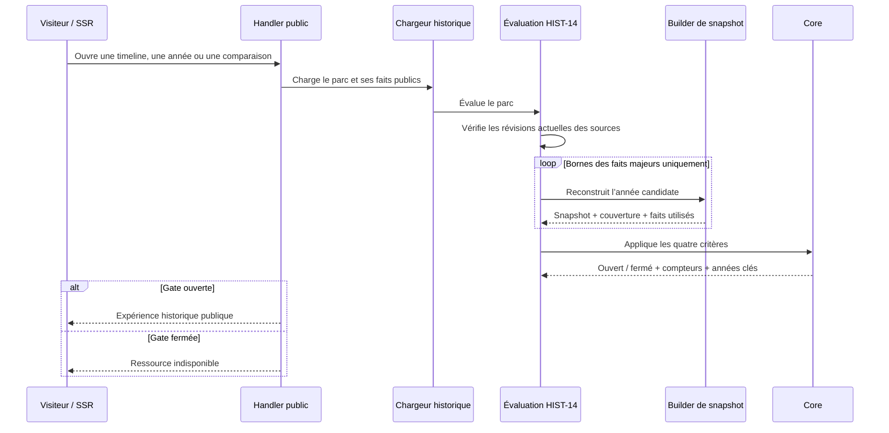

# HIST-14 — Gate qualité de l’explorateur historique par parc

> Date : 28 septembre 2026
> Version : 5.3.104
> Roadmap : `HIST-14`

## Résultat métier

Un parc n’expose son explorateur historique que lorsque ses données structurées
permettent une expérience réellement documentée. Un ancien article narratif,
un trafic important ou l’existence de visites dans le Passeport ne suffisent
jamais à ouvrir l’explorateur.

La gate est ouverte lorsque les quatre preuves suivantes sont réunies :

1. au moins deux faits structurés sont publiés et admissibles à la décision ;
2. chaque fait publié possède au moins une source dont la dernière révision est
   encore publiée et accessible ou archivée ;
3. au moins un fait est qualifié de jalon majeur ;
4. au moins une borne de jalon majeur produit une année clé indexable selon
   `HIST-13` : snapshot annuel, couverture au moins substantielle et deux faits
   distincts réellement utilisés par la reconstitution.

Ces critères sont cumulatifs. Ils conservent les dates partielles, les faits
probables ou contestés et les sujets historiques disparus : l’incertitude
documentée n’est pas assimilée à une absence de qualité.

## Autorité et architecture

- `HistoricalParkRolloutGateEvaluator` possède les seuils et le verdict pur ;
- `HistoricalParkRolloutGateAssessmentService` orchestre les snapshots des
  seules années candidates et réutilise
  `HistoricalSnapshotSeoEligibilityEvaluator`. Il résout aussi la révision
  actuelle des sources : une preuve retirée ne maintient jamais la gate
  ouverte grâce à son ancienne référence figée ;
- `PublicParkHistoricalDataLoader` applique la visibilité du parc, des items et
  des zones avant l’évaluation ;
- les handlers publics échouent comme une ressource absente lorsque la gate est
  fermée, afin de ne pas exposer une page pauvre ou indexable par erreur ;
- l’atelier et le diagnostic admin reçoivent le même objet métier, sans
  recalculer les règles dans Angular.

## Séquence publique

## Administration et responsive

Le diagnostic affiche une carte de déploiement avant les indicateurs
techniques. Chaque critère est formulé comme une action éditoriale et montre le
compteur réellement observé. Les années clés qualifiées sont listées sans
identifiant interne. Une mention explicite rappelle que les visites et les
membres n’influencent jamais la décision.

La carte utilise des colonnes fluides `minmax(0, 1fr)`, autorise la césure des
contenus longs et passe en une colonne sous `42rem`. Le conteneur de page garde
`min-width: 0` et `overflow-x: clip`, ce qui empêche tout dépassement du
viewport mobile.

## Persistance et performance

Aucun document MongoDB, index, flag ou état d’activation n’est ajouté. La gate
est une vue calculée des collections historiques existantes ; il n’existe donc
ni migration manuelle, ni backfill, ni double système à synchroniser.

Les snapshots ne sont construits que pour les années de début ou de fin des
faits majeurs. La gate évalue la projection complète du parc, puis la timeline
charge uniquement la page demandée grâce à la pagination Mongo existante : le
tri et le volume du résultat public restent bornés par `pageSize`. Les
sitemaps XML et HTML refusent les branches d’un parc fermé. Le lecteur SEO
filtre d’abord sur les identifiants des parcs publics indexés, puis charge sans
troncature leurs dernières révisions admissibles ; un parc ancien ne disparaît
donc pas lorsque le corpus global dépasse une limite arbitraire.

## Preuves automatisées

- Core : ouverture, absence d’année clé, nombre insuffisant de faits, source
  manquante et absence de jalon majeur ;
- Application : sélection bornée des seules années majeures ;
- Application : fermeture après retrait de la dernière révision d’une source ;
- Application : timeline et lignée indisponibles lorsque la gate est fermée ;
- Infrastructure : lecture complète ciblée sur les seuls parcs publics, sans
  plafond global ;
- Application : sitemaps XML et HTML limités aux parcs ouverts et aux années
  qualifiées ;
- WebAPI : transport du verdict, des compteurs et des années sans identifiant
  technique supplémentaire ;
- Angular : façade, libellés dans les huit langues et contrat responsive ;
- architecture : une classe ou interface par fichier et dépendances via ports.

## Limites assumées

La gate ne prétend pas que l’histoire d’un parc est exhaustive. Elle prouve
qu’un premier parcours public possède assez de structure, de sources, de
couverture et de valeur éditoriale. Les diagnostics de décennie continuent à
montrer honnêtement les périodes moins documentées après l’ouverture.
