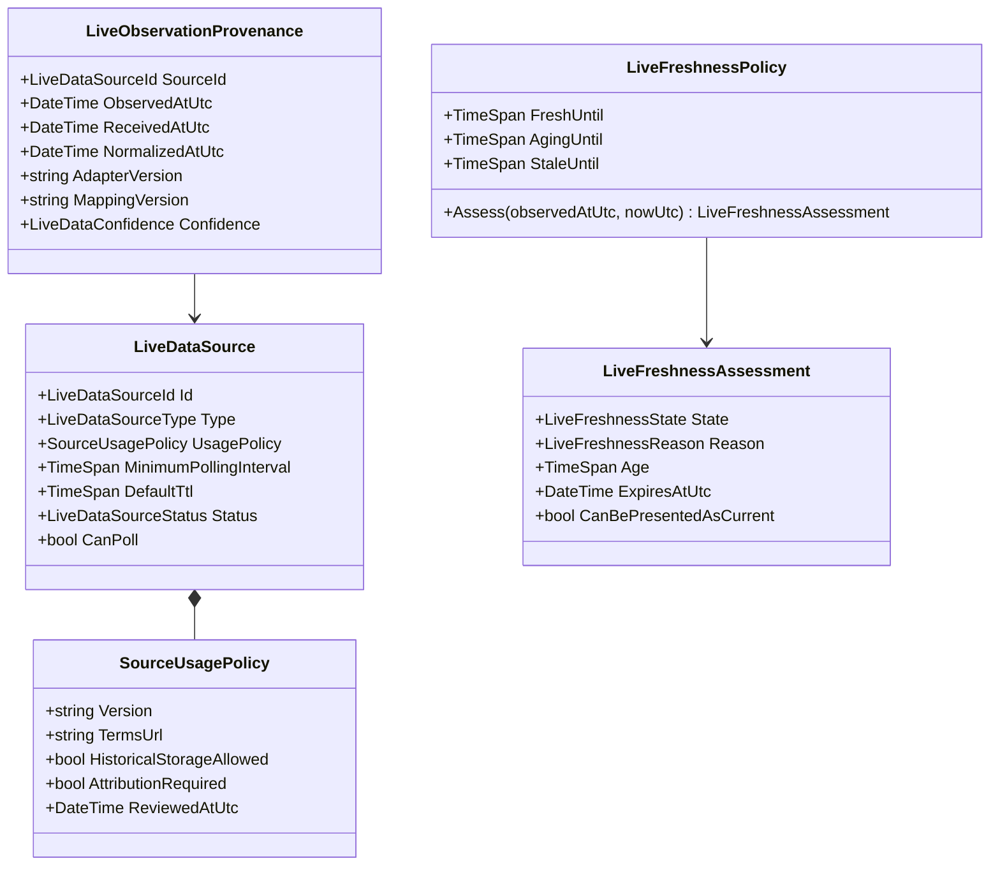
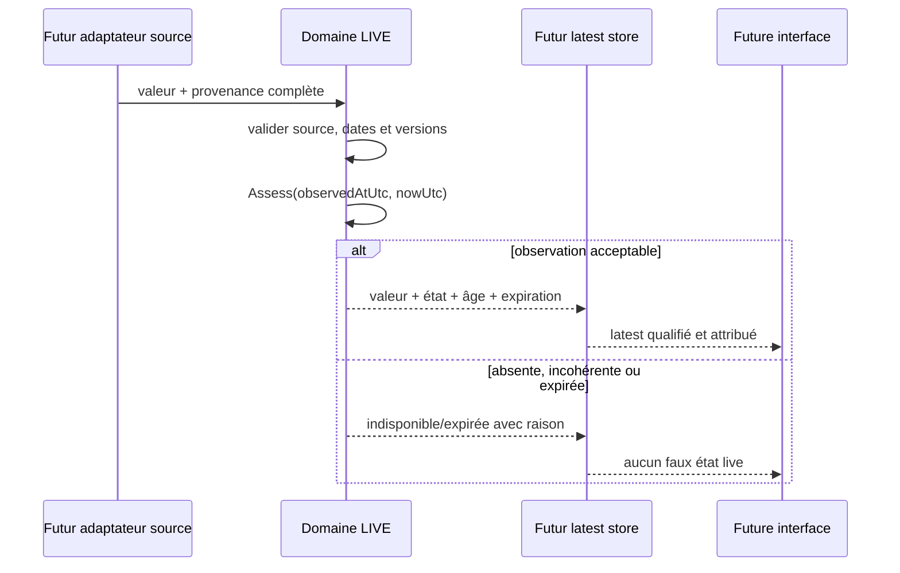

# LIVE-02 — Provenance et fraîcheur des données live

> Décision et implémentation du 28 septembre 2026.
>
> Version : `5.4.0`.
>
> Périmètre : domaine pur uniquement. Aucun appel fournisseur, stockage, endpoint
> ou affichage public n'est activé par ce jalon.

## 1. Résultat métier

Toute future donnée live devra pouvoir répondre sans ambiguïté à quatre questions :

1. qui l'a fournie et sous quelles conditions ;
2. quand la source l'a réellement observée ;
3. quelles transformations et quels mappings ont produit la valeur normalisée ;
4. si elle est encore fraîche, vieillissante, périmée, expirée ou indisponible.

Cette règle empêche notamment :

- d'afficher une absence de donnée comme `0 minute` ;
- de présenter indéfiniment une ancienne observation comme actuelle ;
- de perdre la licence ou l'attribution applicable après transformation ;
- de rendre un mapping ou un adaptateur impossible à auditer ;
- de confondre l'heure de collecte du site avec l'heure d'observation de la source.

## 2. Vocabulaire de domaine

### 2.1 Source et politique d'usage

`LiveDataSource` représente une source indépendante d'un fournisseur concret. Elle
porte un identifiant opaque, un type, un nom, un intervalle minimal de collecte,
une durée de validité par défaut, une politique d'usage et un état opérationnel.

Les types reconnus sont : source officielle, opérateur, partenaire, agrégateur
autorisé et contribution. Les états sont : candidate, active, suspendue et
retirée. Seule une source active peut être collectée.

`SourceUsagePolicy` conserve la version du contrat relu, son URL HTTPS, la date de
revue, les permissions d'usage commercial, de conservation historique et de
redistribution, ainsi que l'obligation d'attribution. Une attribution obligatoire
sans clé de traduction est rejetée.

### 2.2 Provenance d'une observation

`LiveObservationProvenance` conserve avec chaque future observation :

- la source et l'identifiant externe de la cible ;
- `observedAtUtc`, heure annoncée par la source ;
- `receivedAtUtc`, heure de réception par Amusement Parks Fun ;
- `normalizedAtUtc`, heure de normalisation ;
- l'identifiant de corrélation ;
- les versions de l'adaptateur, du mapping, du contrat d'usage et de la
  transformation ;
- le niveau de confiance explicite.

Toutes les dates sont UTC. Une normalisation antérieure à la réception est
impossible. Un décalage entre l'heure de la source et l'heure de réception reste
conservé au lieu d'être silencieusement réécrit ; la politique de fraîcheur décide
ensuite s'il est acceptable.

## 3. États de fraîcheur

`LiveFreshnessPolicy` possède quatre seuils strictement ordonnés et une tolérance
de dérive d'horloge :

| État | Signification produit | Présentation possible |
|---|---|---|
| `Fresh` | observation dans la fenêtre fraîche | actuelle, avec son âge |
| `Aging` | observation vieillissante | actuelle, avec avertissement discret |
| `Stale` | observation périmée mais encore informative | seulement avec avertissement explicite |
| `Expired` | observation trop ancienne | jamais comme donnée live actuelle |
| `Unavailable` | horodatage absent ou incohérent | état indisponible, jamais zéro |

Les frontières sont inclusives : une observation exactement au seuil reste dans
l'état qui se termine à ce seuil. La minute suivante passe à l'état suivant. Une
heure source légèrement future, dans la tolérance configurée, reçoit un âge nul.
Au-delà, l'observation devient indisponible. Les calculs sont déterministes et ne
lisent jamais directement l'horloge système : l'instant courant est fourni au
domaine.

Les limites de sûreté sont d'une heure maximum pour la dérive future acceptée et
d'un jour maximum pour la fenêtre périmée. Des seuils opérationnels plus courts
seront choisis par type de donnée et source lors de `LIVE-03`/`LIVE-04`.

## 4. Architecture

Le modèle vit dans `AmusementPark.Core`. Il ne connaît ni ThemeParks.wiki, ni
MongoDB, ni HTTP, ni Angular. Les futurs adaptateurs traduiront les réponses
externes vers ces primitives ; l'application orchestrera la collecte ;
l'infrastructure persistera les preuves ; l'API et le frontend ne feront que
présenter le résultat déjà qualifié.

## 5. Validation et preuves

Trente tests unitaires ciblés vérifient :

- identifiants opaques et valeurs non initialisées ;
- politique d'usage, HTTPS, attribution et timestamps UTC ;
- états de source et budgets de durée ;
- traçabilité et chronologie de normalisation ;
- niveau de confiance ;
- chaque frontière de fraîcheur ;
- données absentes, futures, expirées et dates extrêmes ;
- codes d'erreur stables utilisables par les couches supérieures.

## 6. Conséquences pour la suite

`LIVE-03` pourra créer des mappings vérifiés sans dépendre d'un format fournisseur
et l'administration pourra suspendre une source. `LIVE-04` traduira les fixtures
ThemeParks.wiki vers ce contrat. Aucun de ces jalons ne devra recalculer la
fraîcheur dans un contrôleur, un repository ou un composant frontend.

Ce jalon ne nécessite aucune migration MongoDB : aucun document n'est encore
persisté et aucune route publique n'est créée.
