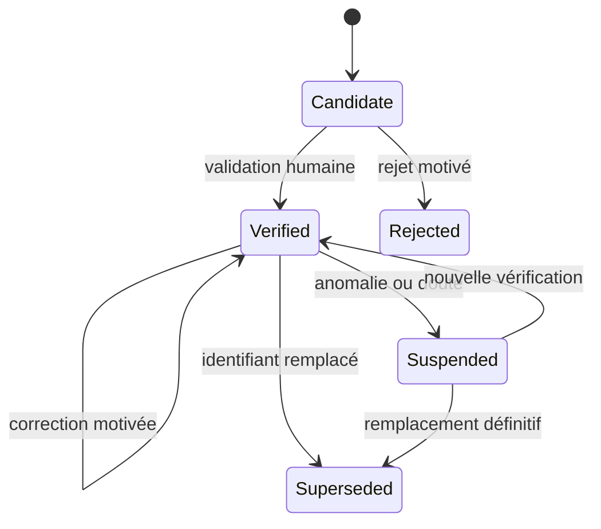
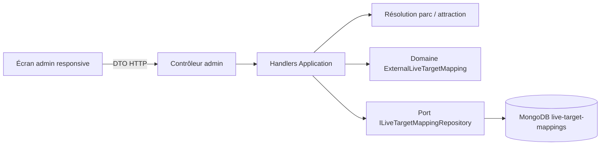

# LIVE-03 — Mapping vérifié des entités live

> Décision du 28 septembre 2026.
>
> Version : **5.4.2**.
>
> Statut : **socle de mapping et pilotage administratif livré**.

## 1. Résultat métier

Chaque identifiant de parc ou d'attraction reçu d'une future source live peut
désormais être relié à une entité réelle du site sans faire confiance à une simple
ressemblance de nom. Un rapprochement commence toujours en `Candidate`. Seule une
décision humaine explicite le fait passer en `Verified` et le rend utilisable par
la future chaîne live.

L'administration peut :

- enregistrer un identifiant externe découvert ;
- proposer une cible interne sans la valider ;
- rechercher et filtrer les correspondances ;
- comparer visuellement l'entité fournisseur à l'entité du site ;
- vérifier, corriger, suspendre, rejeter ou remplacer une correspondance ;
- voir la révision, le niveau de confiance et l'éligibilité live.

Ce jalon ne contacte aucun fournisseur, ne collecte aucune attente et n'expose
aucune donnée live au public. Ces responsabilités restent séparées dans
`LIVE-04` à `LIVE-09`.

## 2. Invariants de domaine

- `Candidate` n'est jamais éligible au live ;
- `Verified` exige une cible interne existante, une confiance `High` et un
  administrateur identifié ;
- parc, attraction, pays et parc parent doivent rester cohérents ; une attraction ne peut être vérifiée que si son parc parent externe possède déjà une correspondance vérifiée vers le même parc interne ;
- une correction doit changer de cible et comporter un motif ;
- suspension, rejet et remplacement ferment la période de validité et exigent un
  motif ;
- chaque décision crée une nouvelle révision contiguë ;
- une révision n'écrase jamais la précédente ;
- une version attendue protège contre l'écrasement concurrent ;
- le nom affiché reste informatif : il ne prouve jamais l'identité.

## 3. Cycle de vie



`Rejected` et `Superseded` sont terminaux. Un nouvel identifiant fournisseur crée
une nouvelle chaîne de mapping ; il ne recycle pas artificiellement l'ancienne.

## 4. Architecture



- **Core** porte le cycle de vie, les contrôles de cohérence, la confiance et les
  révisions ;
- **Application** orchestre la résolution des vraies entités et l'optimisme de
  concurrence ;
- **Infrastructure** persiste des snapshots append-only et crée les index ;
- **WebAPI** protège les routes par rôle admin, compte actif, audit et limite de
  concurrence ;
- **Angular** passe par un port et une façade, sans injecter l'API dans le
  composant.

## 5. Persistance MongoDB

Collection : `live-target-mappings`.

```text
ExternalLiveTargetMappingDocument
├── _id = <mappingId>:<revision>
├── mappingId
├── sourceId
├── externalTarget
│   ├── type, id, parentId
│   ├── displayName, parentDisplayName
│   └── countryCode
├── target?
│   ├── type, id, parkId
│   ├── displayName, parkDisplayName
│   └── countryCode
├── status, confidence
├── validFromUtc, validToUtc?
├── revision, supersedesRevision?
├── reviewedByUserId?, reviewNote?
└── recordedAtUtc
```

Index principaux :

- unicité de `(mappingId, revision)` ;
- unicité de `(sourceId, externalTarget.id, revision)` ;
- recherche par source, statut et révision ;
- recherche par type, statut et date d'enregistrement.

La collection est nouvelle : aucune migration de données historiques n'est
nécessaire et aucun ancien système de mapping live ne coexiste. L'initialiseur
Mongo la crée avec ses index au déploiement.

## 6. Contrats administratifs

```text
GET  /admin/live/mappings
POST /admin/live/mappings/candidates
POST /admin/live/mappings/{mappingId}/review
```

Les mutations sont sérialisées par une policy de concurrence dédiée, auditées et
protégées par la révision attendue. Les réponses n'autorisent pas le cache.

## 7. Responsive et accessibilité

L'écran utilise des cartes fluides au lieu d'un tableau large. Les identifiants
longs peuvent revenir à la ligne, chaque grille emploie `minmax(0, 1fr)` et toutes
les zones d'action deviennent mono-colonne sous `36rem`. Aucun contrôle ne possède
une largeur minimale susceptible de dépasser le viewport.

Les états ne reposent pas seulement sur la couleur, les groupes possèdent des
libellés accessibles et les textes sont disponibles dans les huit langues du
produit.

## 8. Tests et limites volontaires

Les tests couvrent le domaine, les handlers, la conversion Mongo, le contrôleur,
la façade, le client HTTP et le contrat responsive. Les contrôles d'architecture
`facade-ports` et `one-class-per-file` sont verts.

Limites reportées volontairement :

- la découverte automatique des identifiants appartient à l'adaptateur `LIVE-04` ;
- la quarantaine et les diagnostics multi-sources appartiennent à `LIVE-07` ;
- l'arrêt global d'une source appartient à `LIVE-10` ;
- aucune donnée n'est publique avant la gate `LIVE-D`.

## 9. Gate `LIVE-C`, partie mapping

- [x] mapping versionné et append-only ;
- [x] validation humaine obligatoire ;
- [x] cohérence parc, pays et type ;
- [x] correction et suspension sans perte de traçabilité ;
- [x] contrôle de concurrence ;
- [x] pilotage admin responsive et audité ;
- [ ] anomalies d'ingestion et quarantaine — `LIVE-07` ;
- [ ] mesure de charge du spike — `LIVE-05` ;
- [ ] revue avant exposition publique — gate `LIVE-D`.

Conclusion : le mapping est prêt à recevoir les entités de l'adaptateur pilote,
mais aucune donnée source n'est encore ingérée ni publiée.
