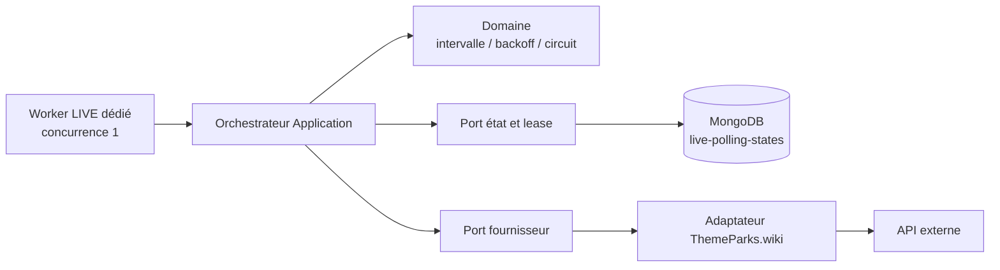
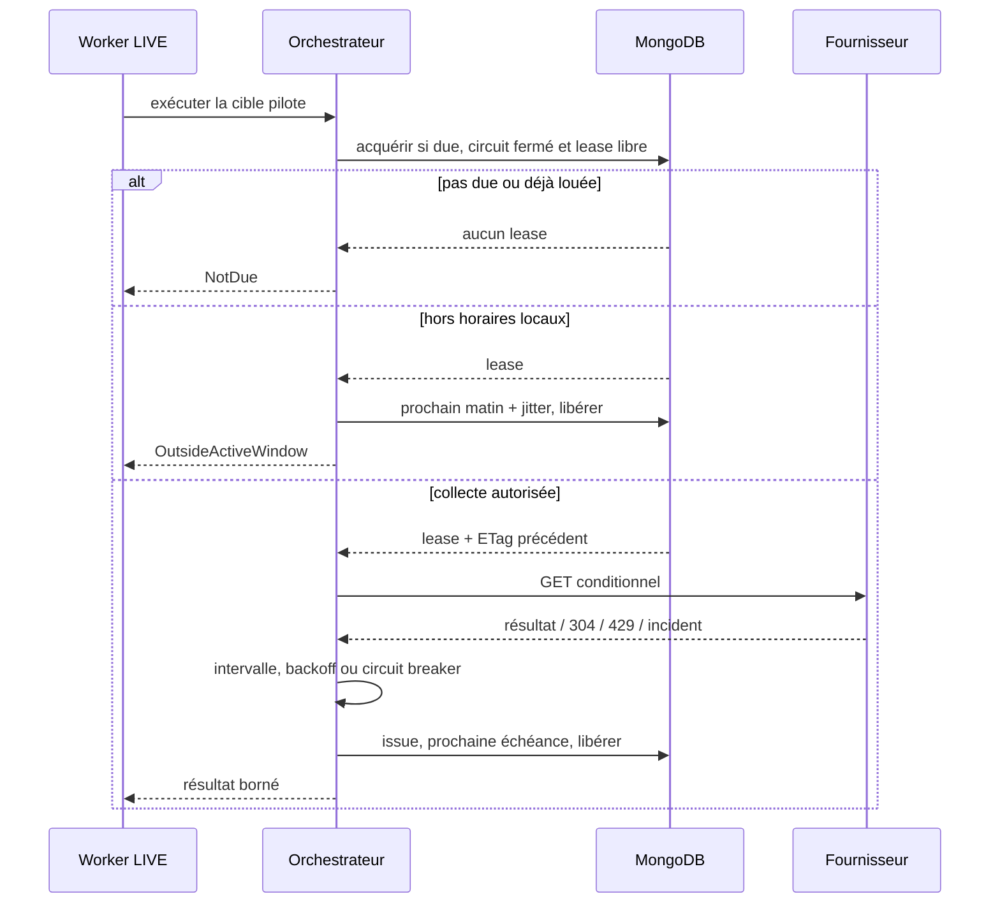

# LIVE-05 — Ordonnanceur de collecte borné

> Version : `5.4.5`
>
> Date : 29 septembre 2026
>
> Portée : un fournisseur pilote, un parc pilote, aucune exposition publique

## Résultat métier

Le produit possède désormais le régulateur nécessaire avant toute collecte de
temps d'attente. Il garantit qu'un fournisseur externe n'est pas sollicité plus
vite que prévu, qu'aucun appel n'est effectué pendant la nuit locale du parc et
qu'une panne ne provoque pas une boucle de relances agressive. Le pilote reste
désactivé par défaut et aucun temps d'attente n'est encore conservé ni affiché.

Cette étape protège simultanément :

- la disponibilité du petit VPS ;
- les quotas et les conditions d'utilisation du fournisseur ;
- la stabilité du produit lors d'une panne externe ;
- la future cohérence des données en empêchant deux collectes concurrentes.

## Limites volontaires du pilote

- un seul fournisseur et un seul parc configurables ;
- un seul appel réseau en cours ;
- intervalle minimal incompressible de cinq minutes ;
- fenêtre locale comprise entre 5 h au plus tôt et 23 h au plus tard ;
- boucle technique séquentielle dédiée, séparée des jobs métier ;
- activation explicite obligatoire ;
- aucune observation conservée avant `LIVE-06` ;
- aucun endpoint ni écran public.

## Architecture

Le domaine calcule les règles sans connaître MongoDB, HTTP ou le worker. La
couche Application acquiert un lease, vérifie la fenêtre active, appelle le port
du fournisseur puis enregistre uniquement l'issue technique. Infrastructure
porte la boucle, le verrou distribué, les métriques et l'adaptateur concret.

## Séquence d'un passage

## Protection contre la concurrence

L'état référence `(sourceId, externalEntityId)` et le fournisseur pilote possède
un index unique sur `sourceId`. Même deux instances configurées par erreur avec
des parcs différents ne peuvent donc pas lancer deux appels simultanés vers la
même source. L'acquisition atomique n'est possible que si :

- la prochaine échéance est atteinte ;
- le circuit n'est plus ouvert ;
- aucun lease valide n'existe.

Le lease dure moins que l'intervalle minimal de collecte. La clôture vérifie le
propriétaire, le jeton et l'expiration : un ancien worker ne peut donc pas écraser
l'état d'un successeur après une pause ou un redémarrage. L'acquisition avance
également l'échéance d'au moins un intervalle complet **avant** l'appel réseau :
un crash au pire moment ne peut donc jamais transformer l'expiration du lease en
relance agressive.

Si l'identifiant de la cible pilote est corrigé dans la configuration, l'état
unique de la source est remplacé atomiquement dès que son éventuel lease a
expiré et que le délai minimal de la source est écoulé. L'ETag, les échecs et
les dates de la précédente cible sont alors réinitialisés afin de ne pas
contaminer la planification du nouveau parc et d'éviter toute suppression Mongo
manuelle.

## Backoff, `Retry-After` et circuit breaker

Une réussite ou un `304 Not Modified` remet le compteur d'échecs à zéro. Un
incident applique un backoff exponentiel borné. Un `429` respecte la durée
`Retry-After` à partir de la réception effective de la réponse lorsqu'elle dépasse
le délai calculé. Après le seuil configuré, le
circuit s'ouvre pour la durée prévue. Le jitter évite que plusieurs processus se
réveillent exactement au même instant sans réduire l'intervalle minimal.

## Schéma MongoDB

Collection `live-polling-states` :

| Champ | Rôle |
|---|---|
| `sourceId`, `externalEntityId` | identité du fournisseur et de sa cible pilote ; source unique |
| `entityTag` | validateur HTTP pour l'appel conditionnel suivant |
| `nextAttemptAtUtc` | première nouvelle échéance autorisée |
| `lastPolledAtUtc` | dernier appel réellement effectué |
| `lastSuccessfulPollAtUtc` | dernière réponse exploitable ou inchangée |
| `consecutiveFailures` | base du backoff et du circuit breaker |
| `circuitOpenUntilUtc` | interdiction persistante de relancer avant cette date |
| `lastDisposition` | issue technique du dernier passage |
| `leaseOwner`, `leaseToken`, `leaseExpiresAtUtc` | verrou distribué temporaire |

Cette collection ne contient aucun temps d'attente, payload fournisseur ou
historique visiteur. Le stockage du dernier état normalisé appartient à
`LIVE-06`.

## Configuration sûre

`LiveDataPolling.Enabled` vaut `false` dans la configuration versionnée et la
liste des cibles est vide. Une activation invalide échoue au démarrage : absence
ou multiplicité de cible, intervalle inférieur à cinq minutes, lease trop long,
fuseau inconnu, fenêtre nocturne ou jitter excessif. L'activation en production
devra donc fournir une cible pilote explicite après validation opérationnelle.

## Observabilité

Le worker émet des compteurs par source et résultat, une durée d'exécution et un
compteur d'ouverture du circuit. Les logs ne contiennent ni payload, ni token, ni
donnée utilisateur. La séparation avec les workers généraux matérialise un
budget de concurrence propre au live et empêche cette collecte d'affamer les
autres traitements.

## Tests de contrat

Les tests couvrent notamment :

- l'intervalle minimal de cinq minutes ;
- la remise à zéro après succès ;
- le backoff exponentiel borné ;
- l'ouverture du circuit ;
- le respect de `Retry-After` ;
- la prochaine ouverture locale sans polling nocturne ;
- l'absence d'appel fournisseur quand la cible n'est pas due ;
- la transmission de l'ETag ;
- le défaut désactivé et les configurations dangereuses ;
- l'enregistrement DI du port Mongo et du worker dédié.

## Suite

`LIVE-06` ajoutera le stockage latest-only des observations normalisées avec une
écriture monotone : une réponse plus ancienne ne pourra jamais écraser une
observation plus récente. Le pilote restera non public.
