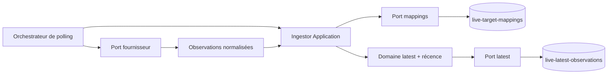
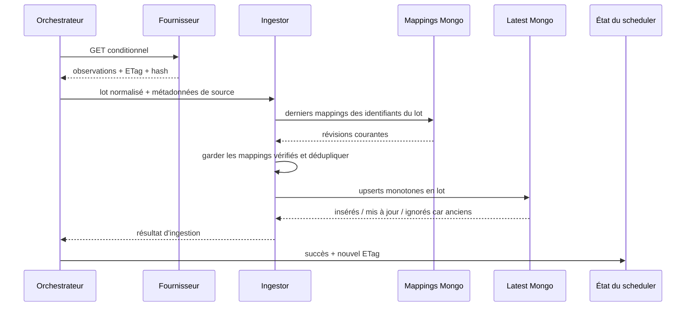

# LIVE-06 — Stockage du dernier état live

> Version : `5.4.6`
>
> Date : 29 septembre 2026
>
> Portée : stockage interne latest-only, sans collecte active ni exposition publique

## Résultat métier

Le produit sait désormais conserver une photographie fiable du dernier état
connu de chaque parc ou attraction relié au fournisseur pilote : statut
opérationnel, files typées et éventuel temps d'attente. Une réponse réseau
retardée ne peut jamais faire revenir l'information en arrière.

Cette étape ne rend rien visible. Elle sécurise la mémoire interne indispensable
aux futurs écrans, sans créer d'historique ni activer le polling en production.

## Règles garanties

- seuls les mappings humains `Verified`, actifs et du même type sont exploitables ;
- les mappings sont résolus en un lot pour éviter une requête Mongo par attraction ;
- une seule photographie subsiste par `(source, type de cible, cible interne)` ;
- l'heure d'observation du fournisseur décide en premier de la récence ;
- à heure d'observation égale, l'heure de réception décide ;
- `0 minute`, absence de valeur, fermeture et état inconnu restent distincts ;
- provenance, versions, niveau de confiance, hash et politique de fraîcheur restent attachés à la photographie ;
- un échec de stockage ne valide ni le succès du poll ni son nouvel ETag.

## Architecture



Core porte l'objet `LiveLatestObservation` et l'ordre de récence. Application
résout les correspondances et construit la provenance. Infrastructure traduit
les documents et exécute l'upsert Mongo atomique. Le fournisseur, MongoDB et le
worker ne franchissent pas les frontières du domaine.

## Séquence d'un succès



Si l'écriture latest échoue, la dernière étape devient un échec, l'ETag n'est
pas remplacé et le prochain poll peut récupérer de nouveau le contenu complet.
Une réponse `304 Not Modified` ne produit naturellement aucune écriture.

## Ordre monotone

Pour une photographie candidate `C` et la photographie persistée `P` :

```text
C remplace P si C.observedAt > P.observedAt
ou si C.observedAt = P.observedAt et C.receivedAt > P.receivedAt
```

Cette comparaison existe dans le domaine pour la déduplication d'un lot et dans
le pipeline Mongo pour la concurrence interprocessus. Il ne s'agit pas d'un
« lire puis écrire » : Mongo évalue et applique la décision dans la même mutation.

## Schéma MongoDB

Collection `live-latest-observations` :

| Champ | Rôle |
|---|---|
| `sourceId` | source externe normalisée |
| `target` | type, identifiant, parc parent et libellés internes |
| `status` | état opérationnel typé |
| `queues[]` | files, attente, fenêtres, groupes et prix sans perte de `0` |
| `provenance` | identifiant externe, trois horodatages, ticks de récence, corrélation et versions |
| `freshnessPolicy` | seuils et version utilisés pour interpréter l'âge |
| `expiresAtUtc` | instant au-delà duquel la photographie est expirée |
| `payloadSha256` | preuve d'identité du payload source sans conserver le brut |
| `hasStatusQueueConflict` | signal interne fermeture/attente contradictoire |
| `createdAt`, `updatedAt` | audit technique du document latest |

L'index unique `(sourceId, target.type, target.id)` garantit une photographie par
source et cible. Un second index `(target.parkId, target.type, expiresAtUtc)`
prépare la lecture bornée par parc de `LIVE-08`. `expiresAtUtc` n'est pas un TTL :
le dernier état expiré reste disponible pour expliquer l'indisponibilité, sans
être présenté comme frais.

Les dates BSON restent disponibles pour les requêtes temporelles. Les ticks UTC
associés aux heures d'observation et de réception préservent en plus la précision
du contrat .NET dans l'arbitrage, y compris lorsque deux mesures appartiennent à
la même milliseconde.

## Performance et bornes

- une résolution Mongo en lot pour tous les identifiants d'une réponse ;
- une écriture bulk non ordonnée pour toutes les cibles éligibles ;
- aucun payload brut du fournisseur n'est stocké ;
- aucune collection historique n'est créée ;
- le scheduler séquentiel et ses budgets de `LIVE-05` restent inchangés ;
- le polling versionné reste désactivé et sans cible.

## Tests de preuve

Les tests ciblés prouvent :

- l'ordre `observedAt`, puis `receivedAt` ;
- l'ordre sub-milliseconde malgré la précision native des dates BSON ;
- la non-régression face à une réponse ancienne reçue plus tard ;
- la conservation exacte d'une attente à zéro ;
- la résolution des mappings en un seul lot ;
- le rejet des mappings suspendus ;
- la déduplication de deux identifiants externes vers une même cible ;
- l'index naturel unique et les deux comparaisons du pipeline Mongo ;
- l'absence de collision de l'identifiant synthétique pour des identifiants opaques ;
- l'absence de validation de l'ETag lorsque la persistance échoue.

## Limites et suite

Les entrées inconnues ou inéligibles sont comptées mais pas encore conservées.
`LIVE-07` ajoutera leur quarantaine, leurs diagnostics et leur rejeu contrôlé
après correction d'un mapping. `LIVE-08` seulement ajoutera une API latest avec
cache, source et âge obligatoires. Aucun affichage public n'est autorisé avant
ces protections.
