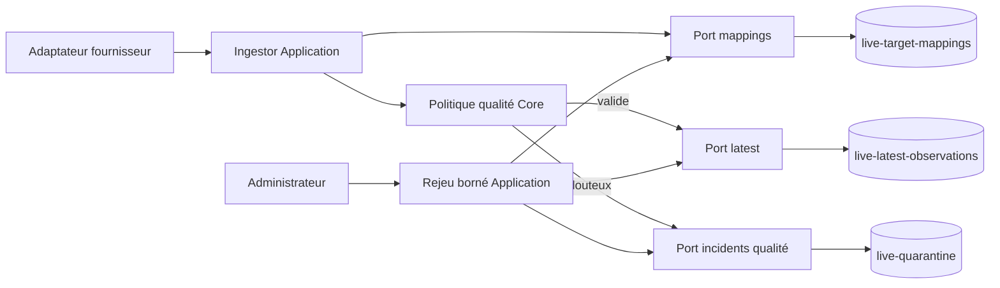
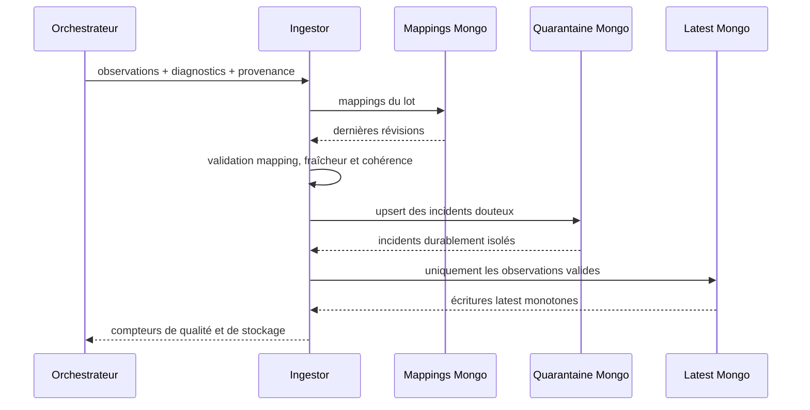
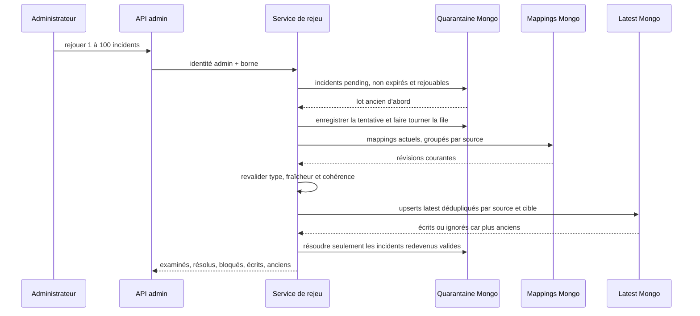

# LIVE-07 — Quarantaine et rejeu des données douteuses

> Version : `5.4.7`
>
> Date : 29 septembre 2026
>
> Portée : qualité interne, sans collecte active ni exposition publique

## Résultat métier

Une information live douteuse ne peut plus disparaître silencieusement ni
contaminer le dernier état exploitable. Elle entre dans un sas temporaire avec
une raison compréhensible, sa provenance minimale et une durée de conservation
bornée.

Après correction humaine d'un mapping, un administrateur peut rejouer au plus
100 incidents par action. Une donnée redevenue valide rejoint alors le dernier
état ; une donnée encore douteuse reste isolée. L'action est authentifiée,
limitée en débit et inscrite dans l'audit d'administration.

## Cas isolés

- identifiant fournisseur sans mapping ;
- mapping candidat, suspendu, rejeté ou incohérent avec le type de cible ;
- heure source au-delà de la dérive future autorisée ;
- attraction annoncée fermée avec un temps d'attente simultané ;
- diagnostic strict de l'adaptateur : valeur inconnue, doublon, champ invalide
  ou type non pris en charge.

Les quatre premiers cas conservent l'observation normalisée nécessaire à un
éventuel rejeu. Un diagnostic sans observation valide ne conserve que son code,
son éventuel identifiant externe et le champ concerné. Aucun payload fournisseur
brut ni texte privé n'est stocké.

## Architecture

Le domaine définit l'incident, sa raison, son cycle de vie et son caractère
rejouable. Application décide du routage, reconstruit une provenance complète
et orchestre le rejeu. Infrastructure persiste, déduplique et expire. WebAPI ne
fait qu'exposer une commande d'administration protégée.

## Séquence d'ingestion

La quarantaine est écrite avant le latest. Si son stockage échoue, l'ingestion
échoue elle aussi et l'ETag du poll n'est pas validé : le fournisseur pourra être
relu sans perdre les données douteuses.

## Séquence de rejeu

Un incident est résolu même si Mongo ignore sa photographie comme plus ancienne
qu'un latest déjà présent : le problème de mapping est bien corrigé et la règle
monotone protège l'état actuel.

## Schéma MongoDB

Collection `live-quarantine` :

| Champ | Rôle |
|---|---|
| `incidentId` | identifiant d'audit stable |
| `sourceId` | source externe |
| `observation` | observation normalisée uniquement si elle est rejouable |
| `reason` | mapping absent/inéligible, fraîcheur, contradiction ou diagnostic |
| `diagnosticCode` | code stable émis par l'adaptateur |
| `diagnosticExternalTargetId` | cible externe concernée, si connue |
| `diagnosticField` | champ fournisseur fautif, si connu |
| `receivedAtUtc`, `detectedAtUtc` | chronologie du contrôle |
| `expiresAtUtc` | suppression automatique après sept jours |
| `correlationId` | rattachement au lot d'ingestion |
| versions et `confidence` | preuve de la chaîne de transformation |
| `freshnessPolicy` | règle temporelle réutilisée au rejeu |
| `payloadSha256` | empreinte, jamais le payload brut |
| `status` | `Pending` ou `Resolved` |
| `resolvedAtUtc`, `resolvedByUserId` | audit du rejeu réussi |
| `replayAttemptCount`, `lastReplayAttemptAtUtc` | rotation et audit des tentatives |

La clé documentaire est une composition injective longueur/valeur de la source,
de la cible, de l'heure source, de la raison, du diagnostic et de l'empreinte du
payload. Le même incident relu après un échec est donc idempotent, tandis qu'un
contenu réellement différent reste distinct. Un index sert la file de rejeu par état,
raison et ancienneté. Un index TTL sur `expiresAtUtc` applique la rétention courte
sans job supplémentaire.

Les incidents jamais tentés passent avant ceux déjà examinés. Chaque tentative
met ensuite à jour son compteur et sa date : un mapping encore bloqué ne peut pas
monopoliser indéfiniment le début d'un lot et masquer des corrections plus récentes.

## Sécurité, charge et exposition

- le rejeu exige le rôle administrateur et un compte activé/non bloqué ;
- l'endpoint réutilise le rate limit d'administration live et `AdminAudit` ;
- un lot contient de 1 à 100 incidents ;
- les mappings sont chargés une fois par source et les latest sont dédupliqués
  par source/cible avec le même départage déterministe des alias que l'ingestion ;
- la collection ne contient aucun payload brut et s'autodétruit après sept jours ;
- aucune route publique, aucun écran public et aucun historique ne sont ajoutés ;
- le polling reste désactivé et sans cible.

## Tests de preuve

Les tests ciblés prouvent :

- les invariants et la transition auditée `Pending` vers `Resolved` ;
- l'isolement d'une contradiction fermeture/attente ;
- la conservation distincte des diagnostics fournisseur ;
- le rejeu après correction d'un mapping et le maintien des incidents bloqués ;
- la conservation des versions, du hash, des files et des ticks sub-milliseconde ;
- l'absence de collision de la clé de déduplication ;
- la présence de l'index TTL et du filtre de rejeu borné ;
- la protection, la limitation et l'audit de la commande HTTP.

## Suite

`LIVE-08` exposera une API de lecture latest publique et mise en cache. Elle devra
toujours fournir la source, l'âge, la fraîcheur et un état explicite ; une valeur
absente ne deviendra jamais zéro. `LIVE-09` seulement ajoutera l'interface pilote
responsive. Le gate `LIVE-C` est techniquement prêt, mais aucune collecte active
n'est activée par ce jalon.
