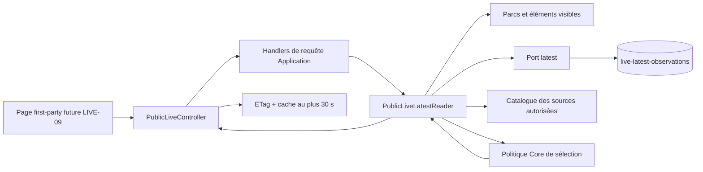

# LIVE-08 — API latest publique et cache prudent

> Décision du 29 septembre 2026. Version cible : `5.4.8`.

## Résultat métier

Le frontend dispose désormais d'un contrat first-party pour demander l'état live
d'un parc, d'un élément ou des éléments visibles d'un parc. Chaque réponse dit
explicitement si la donnée est courante, expirée, indisponible ou absente. Une
attente égale à zéro reste `0`; une attente inconnue reste `null`.

La source, son type, son attribution, l'heure observée, l'heure reçue, l'âge, la
fraîcheur, l'expiration et la confiance accompagnent toute observation connue.
Une observation expirée conserve ces preuves, mais son statut et ses files sont
retirés afin qu'elle ne puisse pas être présentée comme une information live.

## Surface HTTP bornée

```text
GET /public/live/parks/{parkId}
GET /public/live/items/{itemId}
GET /public/live/parks/{parkId}/items
```

Cette surface est limitée au contexte d'une page produit : elle ne propose ni
annuaire de sources, ni recherche globale, ni historique, ni export, ni flux, ni
endpoint multi-parcs. Un parc ou élément masqué ne peut pas être résolu. Pour une
fiche parc, la réponse groupe uniquement ses éléments publiquement visibles.

## Sémantique de disponibilité

| État | Sens | Statut/files exposés | Preuve source |
|---|---|---:|---:|
| `Current` | `Fresh`, `Aging` ou `Stale` selon la politique versionnée | oui | oui |
| `Expired` | la dernière observation a dépassé son TTL | non | oui |
| `Unavailable` | l'horodatage ne permet pas une présentation fiable | non | oui |
| `NoObservation` | aucune observation éligible n'existe | non | non |

La sélection de source est une politique de domaine déterministe. Elle privilégie
d'abord une observation encore courante, puis la priorité configurée, l'heure
observée, l'heure reçue et enfin l'identifiant source. Une source plus prioritaire
mais expirée ne masque donc pas une source secondaire encore courante. Les faits
de plusieurs sources ne sont jamais fusionnés.

## Architecture



Les contrôleurs ne portent aucune règle métier. Le domaine choisit la source,
l'Application vérifie la visibilité et orchestre la lecture, Infrastructure lit
MongoDB et décrit la source, et WebAPI mappe le résultat HTTP.

## Cache, fraîcheur et performances

- output cache anonyme : 30 secondes au maximum, raccourci à la prochaine
  transition de fraîcheur de l'observation sélectionnée ;
- cache navigateur révalidé à chaque lecture (`Cache-Control:
  public,max-age=0,must-revalidate`) afin qu'un intermédiaire ne puisse jamais
  redémarrer une durée de fraîcheur déjà entamée ;
- ETag SHA-256 déterministe sur le DTO public ;
- instant réel de la requête pour calculer l'âge et l'état ; l'ETag reste stable
  uniquement pendant la durée de cache serveur, calculée au moment où la réponse
  est réellement stockée et qui expire avant `Aging`, `Stale` ou `Expired` ;
- requêtes Mongo bornées à 16 sources par cible et 2 000 observations par parc ;
- index `(parkId, type, expiresAtUtc)` pour une liste de parc et index
  `(type, id)` dédié aux lectures unitaires ;
- rate limiting global des lectures publiques et CORS first-party existants ;
- tag d'invalidation public partagé : masquer, supprimer ou renommer une entité
  évince immédiatement sa réponse live mise en cache ;
- aucun `stale-while-revalidate`, donc aucun cache ne ressuscite silencieusement
  une observation expirée.

## Migration MongoDB

Le schéma latest conserve maintenant les ticks exacts de normalisation, en plus
de ceux d'observation et de réception. Une migration idempotente remplit ce champ
sur les éventuels documents antérieurs en choisissant une valeur jamais
antérieure à la réception exacte. La lecture ne dépend donc pas de deux schémas
durables concurrents.

## Revue du canal public et attribution

Les conditions officielles ThemeParks.wiki ont été relues le 29 septembre 2026 :
elles autorisent un site ou une application, y compris commerciale, à montrer les
temps d'attente à ses visiteurs avec le crédit visible `Powered by
ThemeParks.wiki`, mais interdisent miroir, re-API, flux et export massif. Leur
changelog du 28 septembre concerne le lancement des offres payantes et indique
qu'il ne modifie pas le sens de l'autorisation du niveau gratuit.

Références :

- <https://www.themeparks.wiki/terms> ;
- <https://www.themeparks.wiki/pricing>.

Chaque observation API emporte le texte et le lien d'attribution. `LIVE-09` devra
les rendre visibles à proximité des données. Deux interrupteurs doivent être
ouverts simultanément (`Enabled` et `PublicReadEnabled`) avant qu'une observation
soit exposée. Ils restent `false` dans la configuration versionnée de `5.4.8` :
le déploiement de ce jalon ne collecte et ne publie donc encore aucune donnée.

## Tests de preuve

Les tests ciblés couvrent :

- priorité de source et repli vers une source courante ;
- distinction `0`, `null`, expiration et absence ;
- non-divulgation des faits expirés ;
- refus d'un élément dont le parc parent n'est pas public ;
- conservation exacte des ticks Mongo et migration de l'ancien schéma ;
- suspension immédiate quand un interrupteur est fermé ;
- attribution, ETag faible ou fort et réponse `304` ;
- préservation du cache court avec revalidation obligatoire.

## Hors périmètre

`LIVE-08` ne livre pas encore l'affichage Angular, l'actualisation de page, les
alertes, l'historique ou la prévision. Le prochain jalon est `LIVE-09`, qui doit
présenter ce contrat en responsive sur les fiches parc et attraction, avec les
quatre états lisibles et l'attribution visible.
