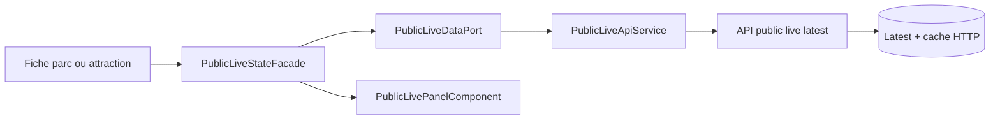
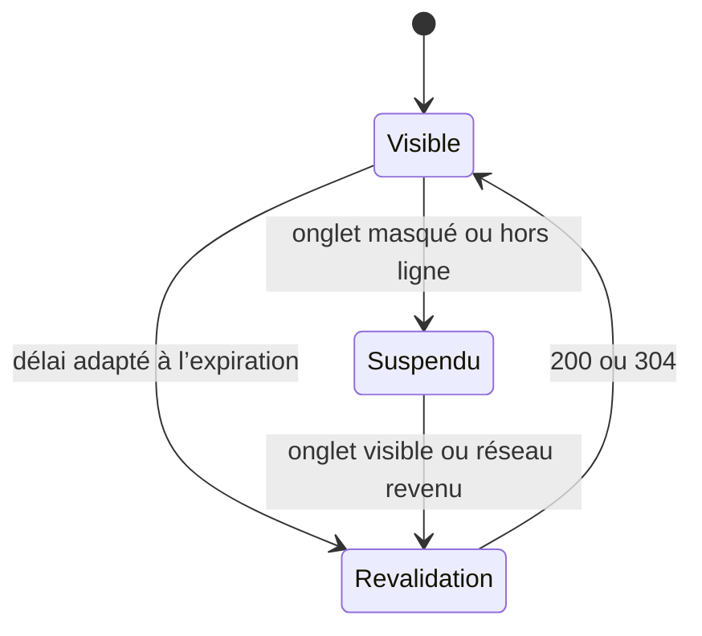

# LIVE-09 — Interface publique pilote

## Résultat métier

Les fiches publiques peuvent désormais expliquer la situation actuelle d’un
parc ou d’une attraction sans confondre popularité, qualité éditoriale et état
d’exploitation. Une attente nulle est affichée comme telle ; une valeur absente
reste inconnue ; une fermeture et une observation expirée ont leurs propres
libellés.

La fiche parc fournit une vue d’ensemble filtrable des attractions couvertes.
La fiche attraction détaille ses files. Dans les deux cas, l’âge et
l’attribution de la source restent associés à la donnée.

## Architecture

- `PublicLiveApiService` construit les lectures anonymes, mémorise les ETag et
  réutilise le corps local lors d’une réponse `304`.
- `PublicLiveStateFacade` orchestre le chargement, le réseau, la visibilité de
  l’onglet et le prochain contrôle.
- `PublicLivePanelComponent` ne contient que la présentation, les filtres
  locaux et les liens vers les fiches.
- les pages éditoriales, leur SEO et leur rendu serveur restent indépendants :
  aucun polling live n’est lancé pendant le SSR.

## Politique de rafraîchissement

Le délai vaut la moitié de la fenêtre de fraîcheur restante, bornée entre 30 et
120 secondes. Il passe à deux minutes lorsque la donnée n’est plus courante et
à cinq minutes en l’absence totale d’observation. Il n’y a ni WebSocket ni
boucle active dans un onglet masqué.

## Responsive et accessibilité

- grilles en `minmax(0, 1fr)` et retours de mots pour les noms longs ;
- filtres repliables sur plusieurs lignes, sans défilement horizontal imposé ;
- passage à une colonne avant 560 px ;
- information réseau annoncée et rafraîchissement manuel disponible ;
- animation supprimée lorsque l’utilisateur préfère réduire les mouvements.

## Activation

La collecte et la lecture publique restent désactivées par défaut. Un `404`
provenant du pilote désactivé masque silencieusement le bloc. `LIVE-10` ajoutera
les contrôles et preuves d’exploitation nécessaires avant l’ouverture explicite
des interrupteurs.
