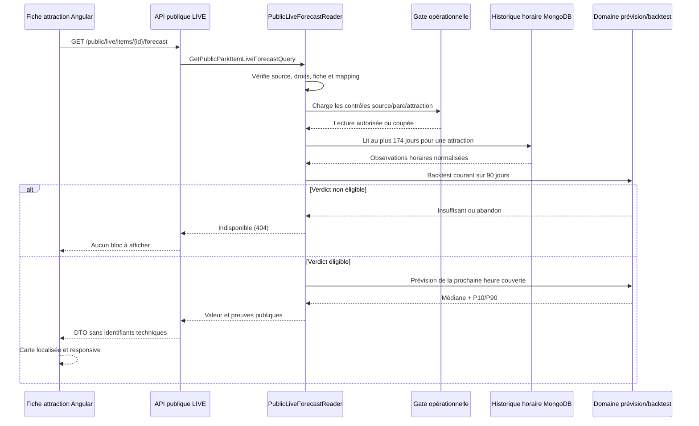

# LIVE-15 — Prévision publique strictement conditionnelle

## Finalité métier

LIVE-15 termine la phase LIVE en affichant une estimation pour l’heure suivante
uniquement lorsqu’une méthode a déjà prouvé qu’elle apporte plus de valeur que
la référence simple. L’absence de preuve, une dérive, une coupure opérationnelle
ou un créneau non couvert ne produit aucun bloc public.

La carte publique montre toujours :

- l’heure locale visée ;
- l’attente centrale estimée ;
- la fourchette plausible 10–90 % ;
- l’erreur moyenne réellement mesurée pendant le backtest ;
- la part des anciennes prévisions contenues dans cette fourchette ;
- la méthode expliquée en langage naturel ;
- la date du calcul, le volume de preuves et la source.

Elle rappelle explicitement qu’une prévision reste une estimation. Aucun
identifiant interne de parc, d’attraction, de mapping ou de cible fournisseur
n’est présent dans le contrat HTTP.

## Décision de publication

La décision est recalculée sur une fenêtre bornée : 84 jours d’apprentissage
précèdent 90 jours d’évaluation. Elle réutilise sans variante les agrégats et la
méthode versionnée de LIVE-14.

```text
source active + droit historique + fiche publique + mapping vérifié
                              │
                              ▼
                kill switches autorisent la lecture ?
                     │ non                 │ oui
                     ▼                     ▼
               aucune prévision      backtest courant
                                          │
                  ┌───────────────────────┼───────────────────────┐
                  ▼                       ▼                       ▼
         données insuffisantes     abandon recommandé      pilote éligible
                  │                       │                       │
                  └─────────────── aucune prévision ─────────────┘
                                                                  │
                                                                  ▼
                                             prochaine heure couverte aujourd’hui
                                                                  │
                                             au moins 8 jours comparables ?
                                                    │ non          │ oui
                                                    ▼              ▼
                                             aucune prévision   carte publique
```

La dernière observation doit en outre être encore actuelle et indiquer que
l’attraction fonctionne. Une fermeture, une interruption ou une donnée expirée
masque la prévision, même si le modèle historique reste éligible.

Une prévision n’est jamais prolongée au lendemain. Le domaine cible uniquement
la prochaine heure entière lorsqu’elle appartient encore à la fenêtre de
collecte du même jour local. Cette règle évite d’annoncer une attente pour une
journée dont les horaires réels ne sont pas prouvés par ce sous-système.

## Calcul de la valeur

Pour l’heure visée, le domaine conserve les points des 84 derniers jours ayant :

- le même jour de semaine ;
- la même heure locale ;
- un état opérationnel ;
- une attente `Standby` explicite, y compris zéro ;
- un bucket non tronqué ;
- une date de réception antérieure au calcul.

Il faut au moins huit journées comparables. La médiane devient l’estimation,
le percentile 10 % la borne basse et le percentile 90 % la borne haute. Le
serveur ne renvoie pas les observations brutes.

Le prétraitement horaire est désormais partagé entre le backtest et la
prévision. Une évolution ne peut donc pas modifier discrètement la méthode
publique sans modifier aussi la preuve qui l’autorise.

## Architecture et flux



- `Core` possède le prétraitement, le calendrier local, les seuils et les
  calculs statistiques purs.
- `Application` orchestre les droits, référentiels, mappings, contrôles et
  accès au port historique.
- `Infrastructure` conserve les buckets existants ; aucun nouveau schéma ni
  aucune migration MongoDB n’est nécessaire.
- `WebAPI` expose un endpoint anonyme borné, ETag et mis en cache au plus trente
  secondes, sans jamais dépasser l'expiration de l'observation live qui autorise
  la prévision. Les invalidations LIVE existantes restent applicables.
- `Infrastructure` mémorise séparément pendant quinze minutes le calcul
  historique positif ou négatif. Le contrôle léger de l'état live reste donc
  hors de ce cache long : une fermeture récente empêche la réponse publique sans
  relire ni recalculer les 174 jours d'historique.
- `Angular` appelle l’endpoint derrière le port et la façade publics, hors SSR.
  Une réponse absente ou en erreur ne laisse ni squelette ni message trompeur.
  La carte est aussi masquée dès que le bloc live courant signale une fermeture
  ou une information périmée. La façade renouvelle la prévision à la fin du
  créneau affiché, après quinze minutes d'indisponibilité et lors d'un
  rafraîchissement manuel des données live.

## Performance, responsive et accessibilité

Le calcul ne porte que sur une attraction et au plus 174 jours. Son cache
applicatif de quinze minutes conserve également le verdict négatif afin qu'une
absence normale de prévision ne répète pas le backtest à chaque visite. Un
verrou par clé évite les recalculs concurrents. Le cache HTTP de trente secondes
reste volontairement court pour revalider régulièrement l'état ouvert et les
contrôles opérationnels.

La carte utilise uniquement des grilles `minmax(0, 1fr)`, des conteneurs
`min-width: 0`, des retours de texte forcés et aucun défilement horizontal. À
430 px, estimation, intervalle, preuves et méthode passent sur une colonne. La
valeur, la fourchette et les preuves sont écrites : aucune information ne dépend
uniquement de la couleur.

## Critère d’arrêt

LIVE-15 ne garantit pas qu’une attraction produira un jour une prévision. Si le
rapport courant repasse à `Abandon` ou `Données insuffisantes`, la carte disparaît
automatiquement. Ce comportement est une réussite du dispositif de confiance,
pas une panne de la fonctionnalité.
