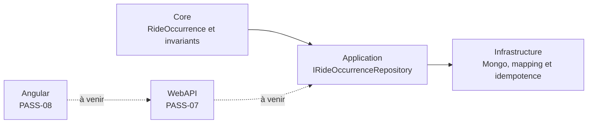
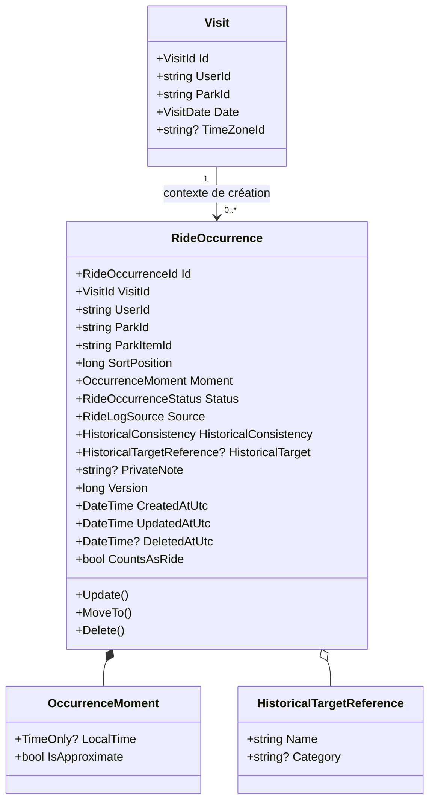
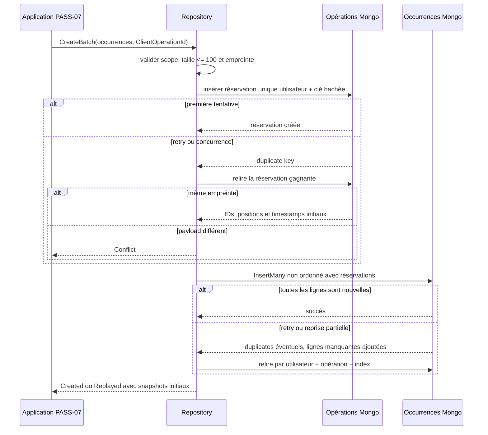

# PASS-06 — Domaine et persistance des occurrences de ride

## Objectif de la tranche

PASS-06 introduit la source de vérité privée du journal de visite. Une occurrence représente une expérience déclarée sur un élément du parc : cinq tours produisent cinq occurrences distinctes. Cette granularité rend possibles la correction ciblée, l'ordre réel, une future note par tour et des statistiques sans ambiguïté.

La tranche reste volontairement interne : les commandes HTTP et le réordonnancement atomique arrivent en PASS-07, puis la sélection multiple et la timeline responsive en PASS-08.

## Frontières d'architecture



- le Core possède les statuts, le comptage, la cohérence temporelle, la version et les transitions ;
- l'Application ne connaît que le port de persistance et ses modèles de pagination/idempotence ;
- l'Infrastructure mappe explicitement le domaine vers Mongo et garantit les écritures concurrentes ;
- aucun contrôleur, DTO HTTP, service concret ou détail BSON ne remonte dans le Core ou l'Application.

## Modèle métier



### Invariants

- une heure locale exige une visite au jour exact et un fuseau ; aucune heure ou date UTC n'est fabriquée ;
- l'ordre principal vient de `SortPosition`, avec un pas nominal de `1024` ; le rang d'affichage n'est pas persisté ;
- le tri déterministe est `SortPosition`, puis `CreatedAtUtc`, puis `Id` ;
- seul `Completed` alimente le nombre de tours ; `Attempted`, `MissedClosed`, `MissedUnavailable` et `SkippedByChoice` restent des informations distinctes ;
- `Planned` est exclu de l'historique et reste réservé à une future planification ;
- une occurrence appartient à une visite, un utilisateur et un parc immuables ;
- une mutation réelle incrémente `Version`, une opération sans changement ne l'incrémente pas ;
- la suppression pose un tombstone et interdit les mutations ultérieures ;
- le snapshot historique de cible est facultatif et réservé au repli après suppression physique d'une cible ;
- le commentaire privé est normalisé et borné à 4 000 caractères.

## Schéma Mongo

### `user-ride-occurrences`

```text
_id: string opaque
schemaVersion: 1
visitId: string
userId: string
parkId: string
parkItemId: string
sortPosition: int64
moment: {
  localTime?: string au format TimeOnly round-trip,
  isApproximate: boolean
}
status: string enum
source: string enum
historicalConsistency: string enum
historicalTarget?: {
  name: string,
  category?: string
}
privateNote?: string
version: int64
createdAt: date UTC
updatedAt: date UTC
deletedAtUtc?: date UTC
creationOperationKeyHash?: SHA-256
creationPayloadHash?: SHA-256
creationOperationIndex?: int32
creationOperationCount?: int32
creationSnapshot?: état initial rejouable
```

Les champs `createdAt` et `updatedAt` conservent la convention BSON commune de `MongoDocumentBase`. Le domaine les expose explicitement comme UTC. Le sous-document `assessment` n'est pas ajouté prématurément : PASS-10 l'introduira avec son type Core et son mapping complet.

### `user-ride-occurrence-operations`

```text
_id: string opaque
schemaVersion: 1
userId: string
operationKeyHash: SHA-256
payloadHash: SHA-256
items: [{
  index: int32,
  occurrenceId: string opaque,
  sortPosition: int64,
  createdAtUtc: date UTC,
  updatedAtUtc: date UTC
}]
createdAt: date UTC
updatedAt: date UTC
```

Ce marqueur léger réserve atomiquement les identifiants, positions et timestamps à la précision Mongo d'un lot avant les insertions. Il évite qu'un MongoDB autonome mélange deux allocations concurrentes d'une même opération ou modifie le résultat initial lors d'une reprise tardive, même si une première réponse réseau est perdue après une insertion partielle. La clé brute du client n'est jamais persistée.

## Idempotence d'un lot



Le hash sémantique ignore les identifiants, positions et timestamps générés. Il reste sensible à l'ordre et au contenu fonctionnel du lot. Ainsi, un retry qui régénère ses détails techniques retrouve le résultat réservé, tandis qu'une réutilisation de la même clé pour un autre contenu produit un conflit.

## Indexes et requêtes couvertes

| Index | Requête |
|---|---|
| `(visitId, sortPosition, createdAt, _id)` | timeline stable d'une visite et recherche de la dernière position |
| `(userId, parkItemId, visitId)` | historique privé d'un élément |
| `(userId, parkId, visitId)` | agrégations privées par parc |
| `(visitId, status)` | compteurs par résultat |
| `(userId, deletedAtUtc)` | exclusions et futures purges bornées |
| unique `(userId, creationOperationKeyHash, creationOperationIndex)` | déduplication de chaque ligne d'un lot |
| unique `(userId, operationKeyHash)` | réservation atomique d'un lot |

Toutes les lectures courantes combinent l'identifiant de visite avec le propriétaire et excluent les tombstones. Les listes sont cursorisées et bornées à 250 lignes par page ; les créations groupées sont bornées à 100 occurrences.

## Preuves automatisées

- 16 tests Core couvrent la temporalité, les cinq statuts, le comptage, le scope, les versions, l'ordre `long`, les tombstones et le repli historique ;
- les tests de mapping vérifient l'aller-retour de l'heure locale, les noms BSON, les enums chaîne, la précision Mongo et le snapshot initial ;
- les empreintes prouvent la stabilité face aux détails générés et la sensibilité à l'ordre métier ;
- les tests d'indexes rendent les clés exactes et l'unicité des deux niveaux d'idempotence ;
- les tests repository prouvent une ligne Mongo par occurrence, la limite de lot, la reprise partielle, les conflits de payload et la clôture optimiste par version ;
- le test d'injection garantit que l'Application reçoit le port, pas l'implémentation concrète.

## Limites assumées

- aucune route HTTP n'est exposée dans cette tranche ;
- la résolution parc/élément et la confirmation d'une incohérence historique appartiennent au handler PASS-07 ;
- le réordonnancement multi-document borné appartient à PASS-07 ;
- la note active embarquée appartient à PASS-10 ;
- l'audit append-only des corrections appartient à PASS-11 ;
- il n'y a aucun changement d'interface dans PASS-06 ; les contrôles responsive obligatoires reprendront sur les surfaces Angular de PASS-08.
