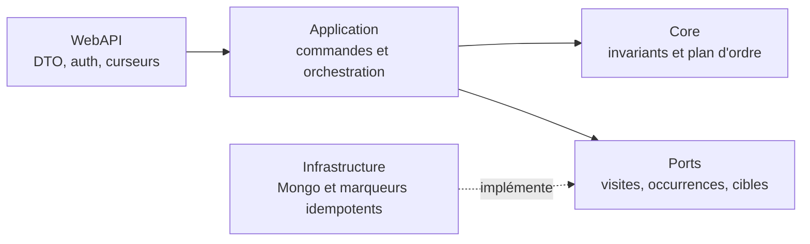
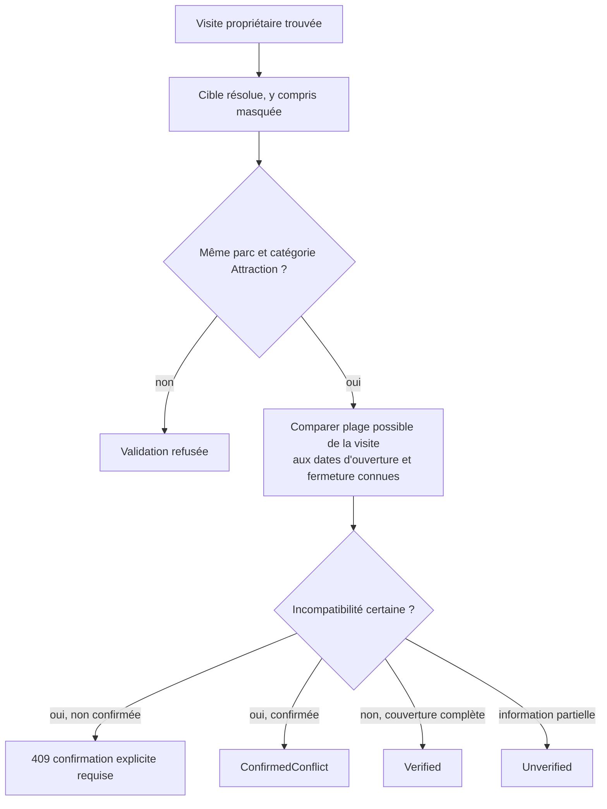
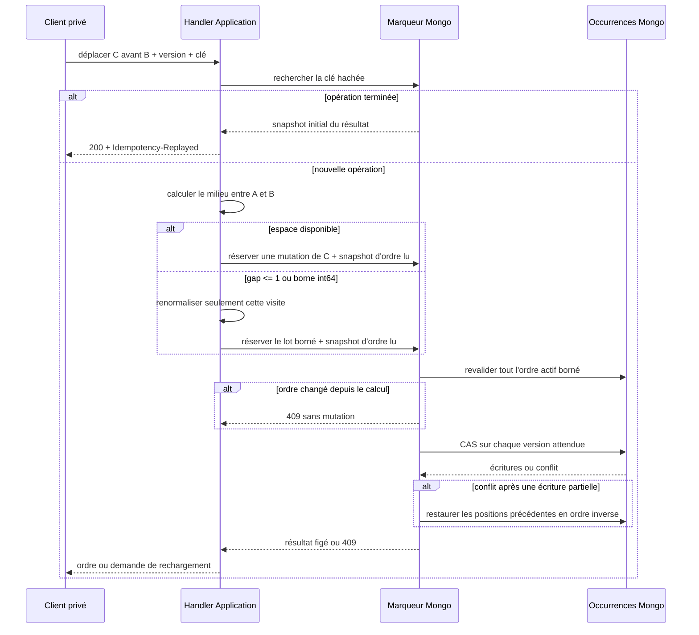

# PASS-07 — API privée des occurrences et ordre idempotent

## Objectif de la tranche

PASS-07 rend exploitable la persistance introduite par PASS-06. Un propriétaire peut désormais ajouter une attraction une ou plusieurs fois à une visite, relire la timeline par curseur, corriger une occurrence, la supprimer par tombstone et la déplacer sans qu'un double clic ou un retry réseau ne crée de doublon.

La tranche n'ajoute pas encore d'écran : la sélection multiple et la timeline responsive arrivent en PASS-08. Les contrats ont cependant été conçus pour que le front n'ait jamais à reconstruire les règles de statut, de comptage, de cohérence historique ou d'ordre.

## Frontières d'architecture



- WebAPI prend l'utilisateur uniquement dans le principal authentifié et ne publie jamais `UserId` ;
- Application vérifie la propriété de la visite, résout les cibles par `IVisitTargetResolver` et orchestre les ports ;
- Core calcule la compatibilité historique et les positions sans dépendance HTTP ou Mongo ;
- Infrastructure garantit les écritures bornées, les versions optimistes et les reprises par opération.

## Contrats HTTP privés

```text
POST   /api/me/passport/visits/{visitId}/occurrences
POST   /api/me/passport/visits/{visitId}/occurrences:batch
GET    /api/me/passport/visits/{visitId}/occurrences
GET    /api/me/passport/visits/{visitId}/occurrences/{occurrenceId}
PATCH  /api/me/passport/visits/{visitId}/occurrences/{occurrenceId}
DELETE /api/me/passport/visits/{visitId}/occurrences/{occurrenceId}?expectedVersion=N
POST   /api/me/passport/visits/{visitId}/occurrences:reorder
```

Les deux créations et le réordonnancement exigent `Idempotency-Key`. Une réponse rejouée conserve le même contrat et ajoute `Idempotency-Replayed: true`. Une renormalisation rare ajoute `Ride-Order-Normalized: true` sur le déplacement comme sur l'ajout qui l'a déclenchée : le client sait ainsi invalider les versions antérieures qu'il aurait en cache. Ce fait est conservé dans la réservation de création et reste donc présent sur son replay. L'opération interne de renormalisation conserve aussi, avant sa première écriture, l'empreinte de la création qui l'a déclenchée. La lecture de l'état d'append retrouve cette preuve durable : même si le processus s'arrête entre la renormalisation et la réservation de création, un retry propage encore le signal. L'empreinte de création porte sur toute la requête normalisée, y compris la confirmation explicite d'un conflit historique, et est recherchée avant la visite ou la cible mutable : un retry strictement identique reste donc rejouable même si l'attraction a ensuite été masquée, déplacée ou supprimée, tandis qu'une même clé associée à un consentement ou un contenu différent produit un conflit d'idempotence. Le `Location` d'une création unitaire pointe vers la lecture GET propriétaire de cette occurrence ; une autre visite ou un autre propriétaire reçoit `404`.

La création groupée accepte au plus 100 occurrences après expansion de `count`. « Cinq tours » produit donc cinq identités, cinq versions et cinq futures notes possibles. La réservation Mongo conserve le snapshot immuable complet de chaque occurrence : si une écriture non ordonnée n'en persiste qu'une partie, le retry recrée uniquement les lignes manquantes depuis cette réservation, sans relire une attraction qui aurait depuis changé ou disparu. La dernière position lue est revalidée après la réservation exclusive de la visite ; deux lots simultanés ne peuvent donc pas partager les mêmes positions. Un lot devenu obsolète est libéré avant toute écriture, puis recalculé automatiquement jusqu'à trois fois. Si la dernière position est trop proche de `long.MaxValue`, Application charge l'ordre borné, demande au Core un plan de normalisation, le persiste avec la même réservation exclusive et recalcule ensuite le lot : une borne technique atteinte ne condamne donc pas les ajouts futurs. L'identifiant interne de cette normalisation est une empreinte stable de la requête et de l'état ordonné lu. La liste est bornée à 250 éléments par page et utilise le curseur stable `(SortPosition, CreatedAtUtc, Id)`.

## Cohérence de la cible et de la date



Une date annuelle ou mensuelle ne reçoit jamais une précision inventée. Un chevauchement partiel reste `Unverified`. Une incompatibilité certaine ne peut être persistée qu'après `ConfirmHistoricalConflict=true`.

## Ordre stable

Le numéro affiché n'est pas persisté. Les positions initiales sont `1024, 2048, 3072…` et le tri reste `SortPosition`, `CreatedAtUtc`, `Id`.



Une opération Mongo conserve son empreinte, sa cible, les versions attendues, les positions précédentes, le snapshot borné de l'ordre lu, trois champs de résultat par allocation et un unique snapshot complet pour la réponse. Après réservation exclusive d'une opération `pending`, l'infrastructure relit toute la visite active et exige exactement les mêmes identifiants et positions avant la première mutation. Un ajout ou un déplacement concurrent rend donc le plan obsolète et retourne `409` sans l'appliquer. Une suppression acquiert elle aussi cette réservation avant d'écrire son tombstone : si elle passe la première, le déplacement revalide ensuite un ordre sans sa cible ; si elle passe après, elle attend la fin du déplacement puis applique son propre CAS. Le marqueur `orderGuardsValidated` rend la barrière du déplacement durable si le processus redémarre. Un retry qui a lu l'ancien état de ce marqueur le relit avant de conclure à un ordre obsolète ; le passage de `pending` à `conflict` exige atomiquement que la barrière soit encore non validée. Il ne peut donc ni libérer la visite pendant qu'un premier worker écrit, ni écraser son état `completed`.

Si la réponse réseau est perdue après une écriture, le même retry reconnaît les lignes déjà appliquées grâce à `lastReorderOperationKeyHash`, y compris après une correction ultérieure qui a augmenté leur version, termine les lignes restantes puis rejoue le snapshot réservé. Dès que l'occurrence déplacée est absente des allocations — plan entièrement sans changement ou renormalisation qui ne modifie que ses voisines — elle pose tout de même ce marqueur par un CAS sur la version attendue : elle n'incrémente pas la version métier, mais possède un point de linéarisation et ne peut pas répondre avec un snapshot déjà périmé. Si une version réellement concurrente bloque une ligne, les mutations déjà appliquées sont restaurées en ordre inverse par CAS. L'opération n'est marquée `conflict` qu'après ce rollback complet ; sinon elle reste `pending` et récupérable par la même clé. Une réutilisation de la clé avec un autre déplacement retourne `ride-occurrence.idempotency-key-conflict`, distinct d'un conflit de version récupérable par rechargement.

MongoDB autonome ne fournit pas de transaction multi-document : la renormalisation est donc une opération durable, bornée à 2 000 occurrences, reprise ligne par ligne et protégée par CAS avec compensation. Un index unique partiel `(userId, visitId)` sérialise toutes les mutations d'ordre `pending`, créations et suppressions comprises. Si le processus s'arrête après une réservation, la mutation suivante reprend d'abord l'opération déjà réservée depuis ses snapshots : elle termine une création incomplète, reprend un déplacement ligne par ligne ou effectue sa compensation, ou termine exactement le tombstone identifié par `lastDeleteOperationKeyHash`. L'ancien propriétaire et cette reprise peuvent coexister sans doubler les effets grâce aux marqueurs et aux CAS. La visite est libérée uniquement lorsque l'opération atteint `completed` ou `conflict`, ce qui évite à la fois un bail expirant trop tôt et un verrou abandonné définitivement. Aucune promesse de transaction Mongo inexistante n'est faite. Le chemin normal ne modifie qu'une occurrence ; la renormalisation n'arrive que lorsque le gap est épuisé.

## Mutations et concurrence

- `PATCH` et `DELETE` exigent la version active ;
- un corps `PATCH` sans version positive ou sans statut défini est rejeté en validation `400`, avant toute lecture de persistance ;
- une correction réelle incrémente la version ; un no-op ne l'incrémente pas mais confirme atomiquement que la version lue est toujours active avant de répondre ;
- une suppression conserve un tombstone, disparaît des lectures actives et partage la réservation exclusive de timeline avec les créations et déplacements ;
- un conflit de version retourne `ride-occurrence.version-conflict` et impose un rechargement ;
- seul `Completed` expose `CountsAsRide=true` ;
- l'heure locale reste facultative et exige une visite au jour exact avec fuseau lorsqu'elle est fournie.

## Schéma Mongo étendu par PASS-07

```text
user-ride-occurrences:
  lastReorderOperationKeyHash?: SHA-256
  lastDeleteOperationKeyHash?: SHA-256

user-ride-occurrence-operations:
  operationKind: creation | reorder | delete
  items: [{
    index: int32,
    occurrenceId: string,
    sortPosition: int64,
    createdAtUtc: date,
    updatedAtUtc: date,
    creationSnapshot: occurrence immuable réservée
  }]
  visitId?: string
  operationState?: pending | completed | conflict
  appendBaseWasEmpty?: boolean
  appendBaseSortPosition?: int64
  appendBaseValidated?: boolean
  movedOccurrenceId?: string
  reorderExpectedVersion?: int64
  reorderAnchorOccurrenceId?: string
  reorderPlacement?: First | Last | Before | After
  deleteOccurrenceId?: string
  deleteExpectedVersion?: int64
  deleteAtUtc?: date
  wasNormalized?: boolean
  relatedCreationOperationKeyHash?: SHA-256
  reorderItems?: [{
    index: int32,
    occurrenceId: string,
      expectedVersion: int64,
      previousSortPosition: int64,
      resultSortPosition: int64,
      resultVersion: int64,
      resultUpdatedAtUtc: date
  }]
  orderGuards?: [{ occurrenceId: string, sortPosition: int64 }]
  orderGuardsValidated?: boolean
  reorderResultSnapshot?: occurrence déplacée renvoyée au client
```

La clé client brute n'est jamais stockée. L'index unique `(userId, operationKeyHash)` couvre créations, déplacements et identifiants internes de suppression ; l'index unique partiel `(userId, visitId)` couvre toute opération `pending`, quel que soit son type, pour sérialiser la timeline d'une visite. Un index partiel `(userId, relatedCreationOperationKeyHash, visitId, operationState)` retrouve en coût borné la renormalisation terminée liée à un ajout interrompu. Chaque allocation de réordonnancement ne conserve que les trois champs nécessaires à son application et à sa compensation ; la note privée et les autres données complètes ne sont présentes qu'une fois dans `reorderResultSnapshot`. Même à la borne de 2 000 lignes avec une note UTF-8 maximale, le document de réservation testé reste inférieur à 1 Mo, très en dessous de la limite BSON de 16 Mio.

## Responsive et suite

PASS-07 n'ajoute aucun DOM, style ou route Angular : il ne peut donc pas introduire de débordement de viewport. PASS-08 devra utiliser ces contrats dans une timeline pensée dès 320 px, sans tableau rigide, sans action masquée par la navigation fixe et avec les contrôles de non-débordement désormais obligatoires dans `AGENTS.md`.

## Preuves attendues

- Core : 1 000 ajouts par lots, déplacement direct, no-op, gap épuisé, renormalisation et bornes `long` ;
- Application : expansion du nombre, propriété, validation cible/parc/catégorie, confirmation historique, versions, replay avant les dépendances mutables et normalisation avant ajout à la borne `long` ;
- Infrastructure : empreintes stables et sensibles au consentement historique, réservation commune ajout/déplacement, revalidation de la base d'ajout, reprise coopérative d'une opération abandonnée ou d'un retry concurrent, transition conditionnelle vers `conflict`, CAS, compensation, snapshots et taille BSON à la borne de 2 000 lignes ;
- WebAPI : propriétaire issu des claims, routes privées/no-store, `Location` relisible, en-têtes idempotents/normalisation et curseurs invalides rejetés avant le handler ;
- CI : build backend, tests, architecture et pipeline de déploiement avant fusion.
