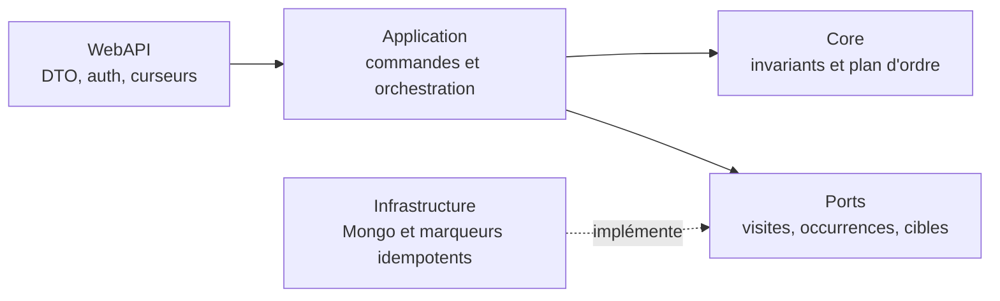
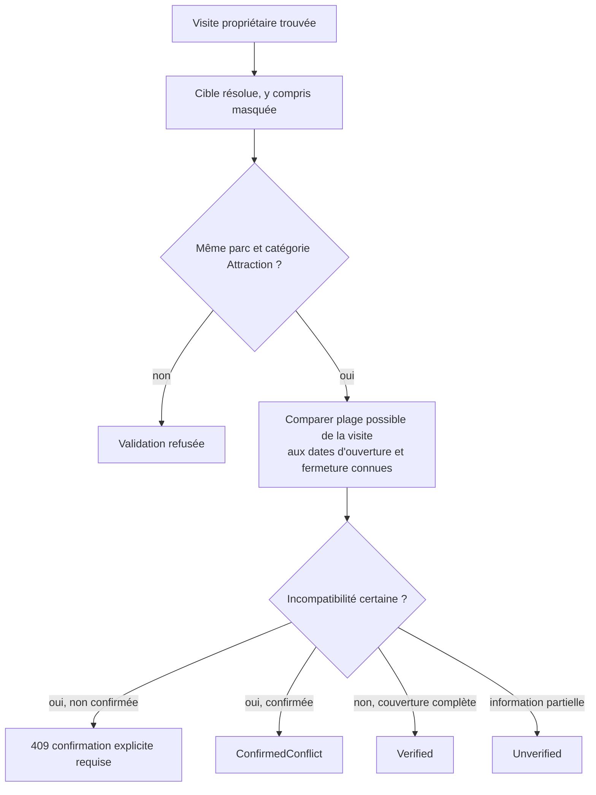
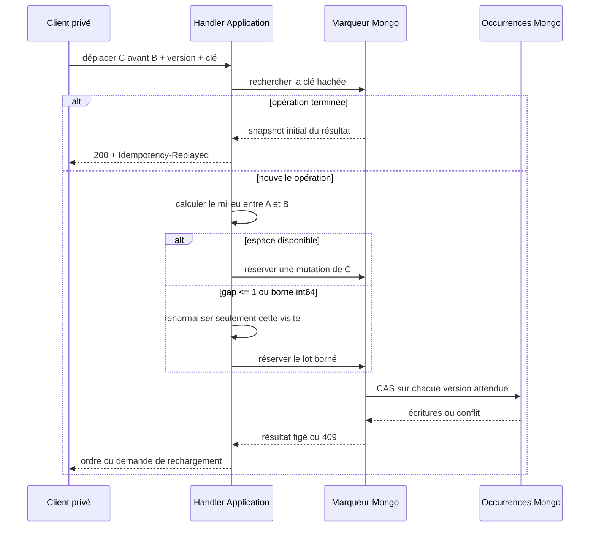

# PASS-07 — API privée des occurrences et ordre idempotent

## Objectif de la tranche

PASS-07 rend exploitable la persistance introduite par PASS-06. Un propriétaire peut désormais ajouter une attraction une ou plusieurs fois à une visite, relire la timeline par curseur, corriger une occurrence, la supprimer par tombstone et la déplacer sans qu'un double clic ou un retry réseau ne crée de doublon.

La tranche n'ajoute pas encore d'écran : la sélection multiple et la timeline responsive arrivent en PASS-08. Les contrats ont cependant été conçus pour que le front n'ait jamais à reconstruire les règles de statut, de comptage, de cohérence historique ou d'ordre.

## Frontières d'architecture



- WebAPI prend l'utilisateur uniquement dans le principal authentifié et ne publie jamais `UserId` ;
- Application vérifie la propriété de la visite, résout les cibles par `IVisitTargetResolver` et orchestre les ports ;
- Core calcule la compatibilité historique et les positions sans dépendance HTTP ou Mongo ;
- Infrastructure garantit les écritures bornées, les versions optimistes et les reprises par opération.

## Contrats HTTP privés

```text
POST   /api/me/passport/visits/{visitId}/occurrences
POST   /api/me/passport/visits/{visitId}/occurrences:batch
GET    /api/me/passport/visits/{visitId}/occurrences
PATCH  /api/me/passport/visits/{visitId}/occurrences/{occurrenceId}
DELETE /api/me/passport/visits/{visitId}/occurrences/{occurrenceId}?expectedVersion=N
POST   /api/me/passport/visits/{visitId}/occurrences:reorder
```

Les deux créations et le réordonnancement exigent `Idempotency-Key`. Une réponse rejouée conserve le même contrat et ajoute `Idempotency-Replayed: true`. Une renormalisation rare ajoute `Ride-Order-Normalized: true` pour le diagnostic.

La création groupée accepte au plus 100 occurrences après expansion de `count`. « Cinq tours » produit donc cinq identités, cinq versions et cinq futures notes possibles. La liste est bornée à 250 éléments par page et utilise le curseur stable `(SortPosition, CreatedAtUtc, Id)`.

## Cohérence de la cible et de la date



Une date annuelle ou mensuelle ne reçoit jamais une précision inventée. Un chevauchement partiel reste `Unverified`. Une incompatibilité certaine ne peut être persistée qu'après `ConfirmHistoricalConflict=true`.

## Ordre stable

Le numéro affiché n'est pas persisté. Les positions initiales sont `1024, 2048, 3072…` et le tri reste `SortPosition`, `CreatedAtUtc`, `Id`.



Une opération Mongo conserve son empreinte, sa cible, les versions attendues et les snapshots de résultat. Si la réponse réseau est perdue après une écriture, le même retry reconnaît les lignes déjà appliquées grâce à `lastReorderOperationKeyHash`, termine les lignes restantes puis rejoue le snapshot réservé. Une réutilisation de la clé avec un autre déplacement retourne `409`.

MongoDB autonome ne fournit pas de transaction multi-document : la renormalisation est donc une opération durable, bornée à 2 000 occurrences, reprise ligne par ligne et protégée par CAS. Aucune promesse de transaction Mongo inexistante n'est faite. Le chemin normal ne modifie qu'une occurrence ; la renormalisation n'arrive que lorsque le gap est épuisé.

## Mutations et concurrence

- `PATCH` et `DELETE` exigent la version active ;
- une correction réelle incrémente la version, un no-op ne l'incrémente pas ;
- une suppression conserve un tombstone et disparaît des lectures actives ;
- un conflit de version retourne `ride-occurrence.version-conflict` et impose un rechargement ;
- seul `Completed` expose `CountsAsRide=true` ;
- l'heure locale reste facultative et exige une visite au jour exact avec fuseau lorsqu'elle est fournie.

## Schéma Mongo ajouté à PASS-06

```text
user-ride-occurrences:
  lastReorderOperationKeyHash?: SHA-256

user-ride-occurrence-operations:
  operationKind: creation | reorder
  visitId?: string
  operationState?: pending | completed | conflict
  movedOccurrenceId?: string
  wasNormalized?: boolean
  reorderItems?: [{
    index: int32,
    occurrenceId: string,
    expectedVersion: int64,
    resultSnapshot: occurrence initiale après déplacement
  }]
  reorderResultSnapshot?: occurrence déplacée renvoyée au client
```

La clé client brute n'est jamais stockée. L'index unique existant `(userId, operationKeyHash)` couvre créations et déplacements.

## Responsive et suite

PASS-07 n'ajoute aucun DOM, style ou route Angular : il ne peut donc pas introduire de débordement de viewport. PASS-08 devra utiliser ces contrats dans une timeline pensée dès 320 px, sans tableau rigide, sans action masquée par la navigation fixe et avec les contrôles de non-débordement désormais obligatoires dans `AGENTS.md`.

## Preuves attendues

- Core : 1 000 ajouts par lots, déplacement direct, no-op, gap épuisé, renormalisation et bornes `long` ;
- Application : expansion du nombre, propriété, validation cible/parc/catégorie, confirmation historique, versions et replay avant les dépendances mutables ;
- Infrastructure : empreintes stables, réservation du déplacement, CAS, marqueur de reprise et snapshots ;
- WebAPI : propriétaire issu des claims, routes privées/no-store, en-têtes idempotents et curseurs invalides rejetés avant le handler ;
- CI : build backend, tests, architecture et pipeline de déploiement avant fusion.
