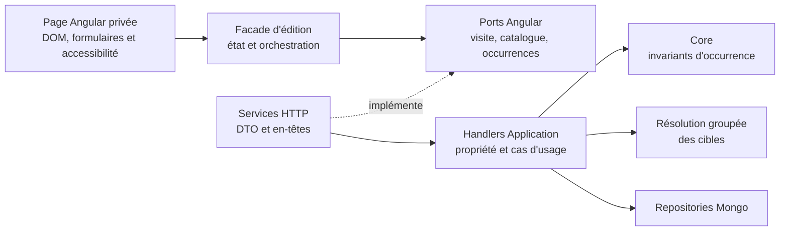
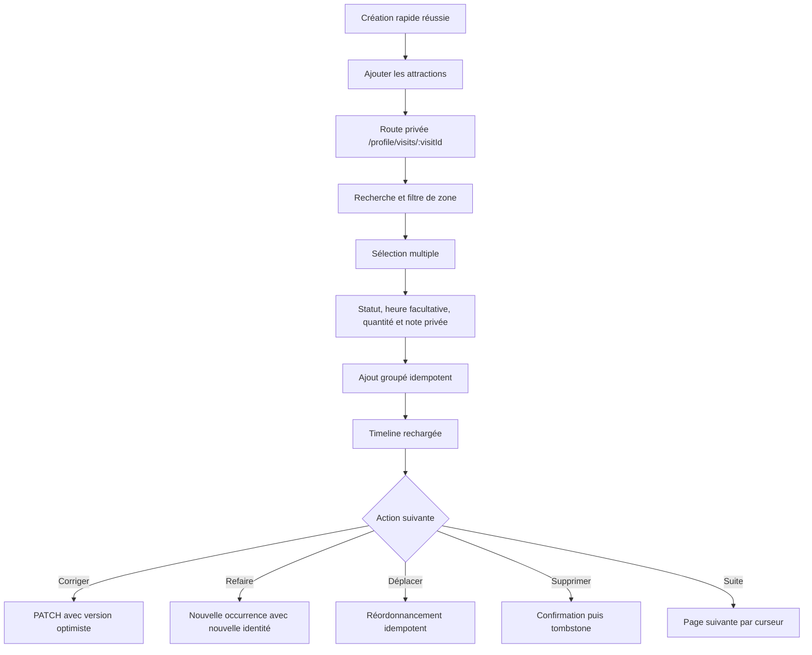
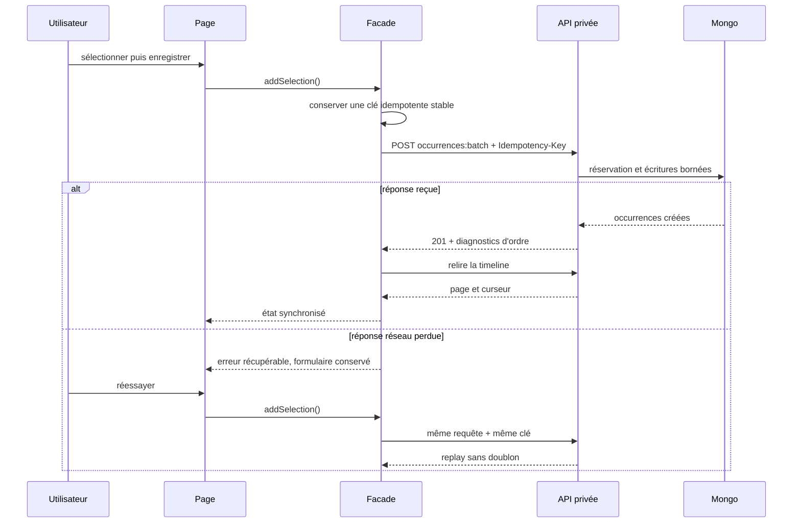

# PASS-08 — Saisie rétrospective et timeline privée

## Objectif de la tranche

PASS-08 rend les contrats de PASS-07 utilisables depuis le passeport privé. Après la création rapide d'une visite, la personne peut ouvrir une URL stable, retrouver les attractions du parc, en sélectionner plusieurs, préciser leur statut et leur nombre de passages, puis corriger la timeline occurrence par occurrence.

Les notes temporelles restent volontairement absentes de cette tranche : la note du parc arrive en PASS-09 et la note facultative d'une occurrence en PASS-10. L'interface ne simule donc aucun contrat qui n'existe pas encore.

## Frontières d'architecture



- le composant présente l'état et remonte les intentions, sans appeler directement une API ;
- la façade porte les chargements, les brouillons, les clés idempotentes, les reprises et la pagination ;
- les mappers purs transforment le catalogue et les formulaires en modèles d'écran ou requêtes ;
- les services HTTP restent limités aux contrats, à l'encodage des routes et aux en-têtes de diagnostic ;
- le backend continue de vérifier le propriétaire et d'appliquer les invariants du domaine ;
- les noms et statuts des attractions sont projetés par résolution groupée, sans requête par ligne.

## Parcours livré



Le sélecteur affiche les attractions visibles, historiques ou définitivement fermées fournies par le catalogue public. Le filtre de zone et la recherche sont cumulables. Chaque sélection possède son propre statut parmi `Completed`, `Attempted`, `MissedClosed`, `MissedUnavailable` et `SkippedByChoice`. Une quantité supérieure à un crée autant d'occurrences distinctes : chacune garde sa propre identité, sa version et sa future capacité de notation.

L'heure locale reste facultative. L'interface transmet explicitement son caractère approximatif et la confirmation d'une incohérence historique ; elle ne réinterprète jamais une date annuelle ou mensuelle. Les erreurs conservent les données saisies afin de permettre une reprise locale.

## Timeline, concurrence et reprise



Une clé de création reste stable après une erreur réseau ambiguë et n'est renouvelée qu'après succès ou conflit explicite. Les corrections et suppressions envoient la version connue. Un conflit entraîne un rechargement au lieu d'écraser silencieusement une modification concurrente. Le signal `Ride-Order-Normalized` déclenche également une relecture, car plusieurs versions peuvent avoir changé.

La façade conserve les brouillons d'édition dont les valeurs persistées n'ont pas changé. Charger une page supplémentaire, ajouter une autre attraction, supprimer une autre ligne ou réordonner la timeline ne peut donc pas effacer une saisie en cours. Si le serveur renvoie réellement de nouvelles valeurs éditables pour l'occurrence, le brouillon est au contraire resynchronisé afin de ne pas masquer une correction concurrente.

Toute suppression ou édition, réussie ou dont la réponse est perdue, déclenche une relecture afin de réconcilier l'état réellement enregistré et de renouveler le curseur de pagination si nécessaire. Les relectures complètes sont elles aussi liées à la génération de timeline qui les a déclenchées : une réponse invalidée ne peut pas ressusciter une occurrence supprimée ni écraser une édition plus récente. Les cibles absentes, déplacées vers un autre parc, reclassées hors des attractions ou qui ne subsistent que dans leur snapshot historique retombent sur leur référence historique non éditable. Elles restent consultables et supprimables, sans proposer d'édition ou de duplication vouée à échouer. Enfin, tout statut de cycle de vie non reconnu utilise le libellé localisé « statut inconnu » au lieu d'exposer une clé technique.

Le chargement initial demande la visite propriétaire, les métadonnées publiques utiles, le catalogue paginé et la première page de timeline. Une indisponibilité du catalogue n'efface pas une timeline privée déjà disponible. Les pages suivantes utilisent le curseur opaque du serveur.

Chaque pagination capture aussi la génération de timeline et le curseur qui l'ont créée. Une création, suppression, normalisation ou relecture invalide cette génération : toute réponse plus ancienne est ignorée, y compris son erreur éventuelle. Une demande de relecture reçue pendant une relecture active est mise en file et rejouée ensuite, ce qui empêche une réponse obsolète de réintroduire des doublons ou des trous.

## Projection des attractions sans N+1

Les réponses de lecture d'occurrences exposent désormais une projection additive :

```text
target?: {
  name: string,
  category?: string,
  lifecycleStatus?: string,
  isHistoricalSnapshot: boolean
}
```

Le handler de liste collecte les identifiants distincts de la page puis appelle une seule fois `IVisitTargetResolver`. Une attraction renommée, masquée ou fermée reste ainsi compréhensible avec son nom courant et son état. Si la référence n'existe plus, le snapshot historique immuable de l'occurrence fournit le nom et la catégorie, avec `isHistoricalSnapshot=true`. Aucune image n'est chargée dans cette vue légère.

## Confidentialité et rendu

- route authentifiée et lazy sous `/:lang/profile/visits/:visitId` ;
- rendu navigateur uniquement pour `/:lang/profile/**` ;
- politique SEO privée `noindex` ;
- appels propriétaires exclus du `TransferState` et du cache partagé ;
- aucun identifiant de propriétaire ni contenu de note privée dans les logs ou contrats publics.

## Contrat responsive bloquant

La page est construite sans tableau rigide et sans geste de swipe obligatoire.

| Largeur | Disposition attendue | Protection vérifiée |
|---|---|---|
| 320–340 px | une colonne, commandes d'ordre sur deux lignes | `min-width: 0`, contrôles bornés, texte cassable |
| 360–390 px | une colonne, pagination et actions refluées | aucune action hors viewport |
| 391–620 px | une colonne, formulaires et confirmations empilés | libellés longs et traductions sur plusieurs lignes |
| 621–900 px | une colonne confortable | timeline non sticky |
| > 900 px | sélecteur et timeline en deux colonnes flexibles | colonnes `minmax(0, ...)` |

À la largeur mobile, un espace bas inclut la hauteur de la navigation fixe et `env(safe-area-inset-bottom)`. Les cibles interactives font au moins 44 px, le focus clavier est visible et les champs utilisent `width/max-width: 100%` avec `box-sizing: border-box`. Les titres, états dynamiques et libellés localisés utilisent un reflow explicite pour ne jamais comprimer le texte comme sur l'ancien défaut de la carte de méthode des classements.

## Preuves attendues

- Application : propriété, résolution groupée des cibles, cible vivante et repli historique ;
- WebAPI : projection additive, route privée, absence de `UserId` et en-têtes de diagnostic ;
- data-access Angular : routes encodées, non-transfert des lectures privées, idempotence et diagnostics ;
- mapper : zones, cycle de vie, statuts, quantités, heures et confirmation historique ;
- façade : chargement, recherche, sélection, reprise réseau, CRUD, déplacement, conservation des brouillons, invalidation des pages obsolètes et conflits ;
- composant : parcours accessible, confirmation de suppression et contrat responsive 320 px ;
- routage : lazy loading authentifié, CSR et `noindex` ;
- localisation : huit langues générées depuis les sources ;
- CI : tests backend/frontend, garde d'architecture, build de production, fusion puis déploiement `master`.
