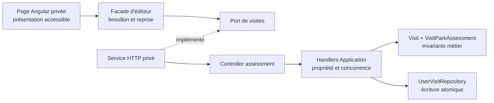
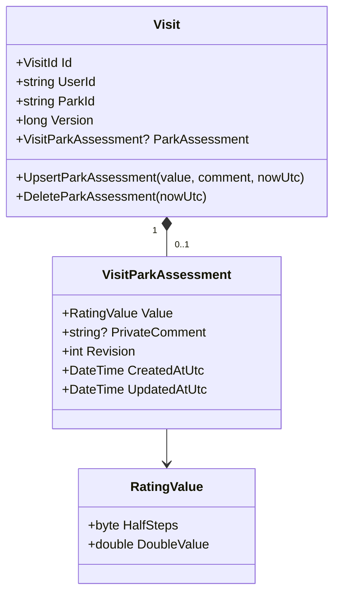
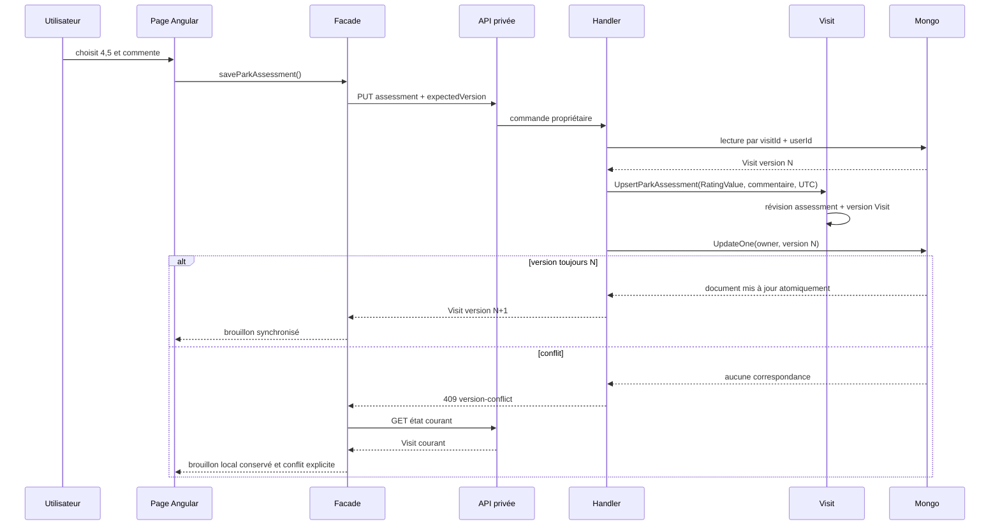

# PASS-09 — Évaluation privée du parc pour une visite

## Objectif de la tranche

PASS-09 permet d'associer zéro ou une évaluation au parc d'une visite précise. Cette observation temporelle répond à la question « quelle note donnes-tu à ce parc pour cette visite ? ». Elle reste privée et ne modifie ni la note globale courante de l'utilisateur, ni les agrégats, ni les classements communautaires.

La valeur utilise le `RatingValue` partagé du Core : dix valeurs exactes de 0,5 à 5 par demi-point. Un commentaire privé facultatif de 4 000 caractères maximum, une révision et deux timestamps UTC complètent l'état actif.

## Frontières d'architecture



- la page affiche les dix choix et transmet les intentions, sans reconstruire la règle des demi-points ;
- la façade conserve le brouillon, la version courante du parent et la stratégie de reprise ;
- le service HTTP ne porte que les DTO et l'encodage de route ;
- les handlers vérifient le propriétaire, convertissent la valeur vers le type du domaine et appliquent le verrou de version ;
- `Visit` possède l'unique assessment actif et contrôle sa durée de vie ;
- Mongo persiste le sous-document et la nouvelle version du parent dans un seul `UpdateOne`.

## Modèle de domaine et Mongo



```text
user-visits
└── document Visit
    ├── _id, userId, parkId, date, status, privacy
    ├── version, createdAt, updatedAt
    └── parkAssessment?                 # état actif embarqué
        ├── valueHalfSteps: 1..10       # 0,5 à 5
        ├── privateComment?: string
        ├── revision: int >= 1
        ├── createdAtUtc: UTC
        └── updatedAtUtc: UTC
```

L'embarquement garantit naturellement l'unicité par visite et empêche tout assessment orphelin. Aucun index sur la valeur n'est ajouté : PASS-09 n'effectue aucune requête analytique et le VPS ne paie donc aucun coût d'index prématuré. L'audit append-only des corrections appartient à PASS-11.

## Écriture et concurrence



Une réponse réseau perdue déclenche également une relecture. Si l'état courant correspond exactement à la demande, la façade reconnaît le succès sans inviter à une nouvelle écriture. Sinon elle adopte la version serveur, conserve le brouillon local et demande une confirmation explicite par un nouvel enregistrement. Une saisie modifiée pendant une requête n'est jamais remplacée par la réponse plus ancienne.

La suppression utilise le même verrou et retire `parkAssessment` par `$unset` dans l'écriture du parent. Supprimer un assessment déjà absent confirme encore la version propriétaire par une écriture neutre bornée, afin de ne pas déclarer un faux succès après une modification concurrente.

## Contrats privés

```text
PUT    /api/me/passport/visits/{visitId}/assessment
DELETE /api/me/passport/visits/{visitId}/assessment?expectedVersion=N
```

Les deux routes exigent un utilisateur activé dans les rôles autorisés, désactivent le cache et ne renvoient jamais `UserId`. Leur réponse est la visite privée courante, avec sa nouvelle version et son assessment éventuel. Les identifiants invalides ou étrangers retombent sur le même `404` afin de ne pas révéler l'existence d'une visite.

## Responsive et accessibilité

La carte d'évaluation est bornée par `width/max-width: 100%`, `min-width: 0` sur chaque branche de grille et `overflow-wrap` sur les libellés. Les dix notes passent de dix colonnes à cinq colonnes sous 900 px. Sous 620 px, l'en-tête, les actions et la confirmation de suppression se replient sans largeur fixe ; les champs utilisent `box-sizing: border-box` et le bas de page conserve la safe area de la navigation mobile.

Les notes forment un `radiogroup`, chaque bouton expose `role="radio"` et `aria-checked`, les cibles dépassent 44 px et le focus reste visible. Le commentaire possède un libellé, une limite native et une aide localisée. Les messages de reprise utilisent `role="alert"`.

## Preuves attendues

- Core : création, correction, suppression, normalisation, révisions, timestamps et absence de mutation après validation refusée ;
- Application : propriétaire, conversion exacte de `RatingValue`, version optimiste et erreurs stables ;
- Infrastructure : round-trip du sous-document et présence de l'assessment avec la version dans le même update Mongo ;
- WebAPI : routes privées, mapping additif et absence d'identifiant utilisateur ;
- Angular data-access : URL encodée, PUT et DELETE versionné ;
- façade : chargement, sauvegarde, suppression, conflit, réponse ambiguë et conservation des saisies plus récentes ;
- composant : radiogroup accessible, confirmation et contrat de non-débordement mobile ;
- localisation : huit langues générées depuis leurs sources ;
- livraison : CI complète, revue, fusion et déploiement de `master`.
