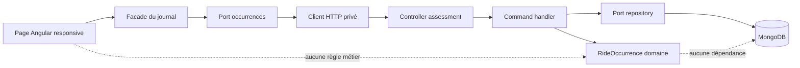
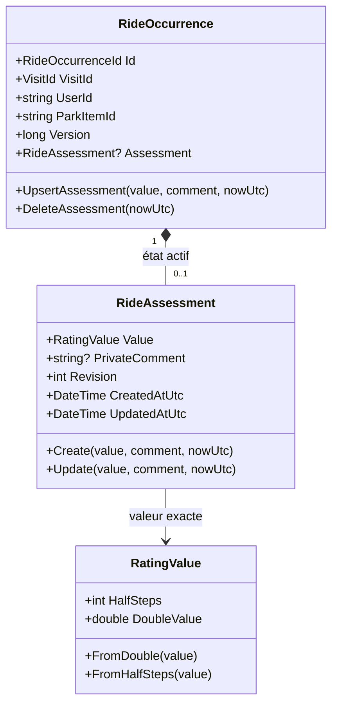
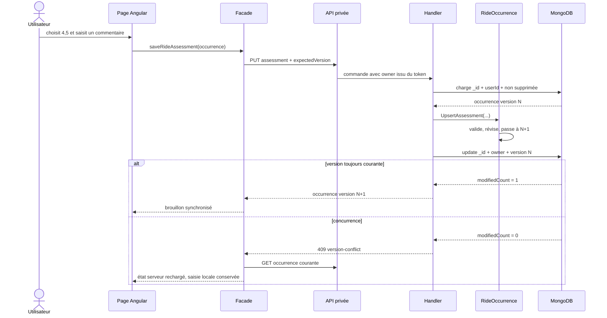

# PASS-10 — Évaluation privée d'une occurrence de ride

## Résultat

PASS-10 permet au propriétaire d'une visite de noter séparément chaque passage enregistré sur une attraction. La valeur va de `0,5` à `5` par demi-point et peut être accompagnée d'un commentaire privé de 4 000 caractères au maximum.

Cette observation temporelle n'est jamais une note communautaire : elle ne modifie ni la note publique courante d'une attraction, ni les agrégats, ni les classements. Les statistiques privées et les suggestions prévues plus tard pourront la lire explicitement, sans changer cette frontière.

## Frontières d'architecture



- `Core` porte `RideAssessment`, la valeur exacte, la révision, les timestamps et les invariants.
- `Application` orchestre la propriété, la validation de version et la persistance optimiste.
- `Infrastructure` embarque l'assessment dans le document de l'occurrence et l'écrit avec la version du parent.
- `WebAPI` expose uniquement les commandes privées authentifiées et mappe les DTO.
- Angular conserve l'orchestration dans la façade ; le composant ne fait que présenter et transmettre la saisie.

## Modèle de domaine



L'occurrence est la racine de cohérence. Une création ou modification incrémente à la fois la révision de l'assessment et la version de l'occurrence. Une suppression retire le sous-document et incrémente la version du parent. Une suppression déjà effective reste un succès seulement si la version propriétaire attendue est encore courante.

## Schéma MongoDB

```javascript
// user-ride-occurrences
{
  _id: "occurrence-1",
  schemaVersion: 2,
  visitId: "visit-1",
  userId: "owner-1",
  parkId: "park-1",
  parkItemId: "item-1",
  sortPosition: NumberLong(1024),
  moment: {
    localTime: "10:30:00.0000000",
    isApproximate: false
  },
  status: "Completed",
  source: "Manual",
  historicalConsistency: "Verified",
  assessment: {
    valueHalfSteps: 9,       // 4,5 / 5, sans flottant persistant
    privateComment: "Tour du soir",
    revision: 2,
    createdAtUtc: ISODate("2026-09-03T10:00:00Z"),
    updatedAtUtc: ISODate("2026-09-03T11:00:00Z")
  },
  version: NumberLong(3),
  createdAt: ISODate("2026-09-03T09:55:00Z"),
  updatedAt: ISODate("2026-09-03T11:00:00Z")
}
```

L'assessment actif est embarqué conformément aux décisions FOUNDATION : l'unicité est structurelle, aucun assessment orphelin n'est possible et MongoDB autonome peut modifier `assessment`, `version` et `updatedAt` atomiquement dans un seul document. Aucun index analytique n'est ajouté prématurément.

## Séquence d'enregistrement



Après un timeout ou une erreur serveur ambiguë, la façade recharge l'occurrence. Si l'assessment serveur correspond exactement à la saisie envoyée, l'opération est reconnue comme réussie ; sinon la version courante est adoptée et le brouillon de l'utilisateur est conservé.

## Contrat HTTP et confidentialité

```text
PUT    /api/me/passport/occurrences/{occurrenceId}/assessment
DELETE /api/me/passport/occurrences/{occurrenceId}/assessment?expectedVersion=N
```

Les routes exigent un utilisateur activé avec un rôle autorisé, désactivent tout cache et tirent l'identité du propriétaire du jeton. Un identifiant invalide, absent ou appartenant à un autre utilisateur produit le même `404`. La réponse ne contient jamais `UserId`.

## Responsive et accessibilité

- choix de note avec dix vrais boutons radio natifs, groupés par occurrence avec un nom unique ;
- grille de cinq colonnes, puis deux colonnes sous 340 px ;
- `min-width: 0`, `max-width: 100%`, retours de texte et textarea borné sur chaque branche imbriquée ;
- boutons et confirmation empilés sur mobile ;
- zones tactiles d'au moins 2,75 rem et focus clavier visible ;
- libellés et erreurs disponibles dans les huit langues prises en charge.

## Preuves automatisées

- Core : création, mise à jour, suppression, no-op, longueur maximale, restauration temporelle et occurrence supprimée.
- Application : propriété, valeur, version attendue, concurrence, suppression et confirmation d'un no-op.
- Infrastructure : round-trip BSON exact en demi-points, snapshots, filtre propriétaire et update atomique avec `$set`/`$unset`.
- WebAPI : identité issue du token, mapping, version de suppression, autorisation, no-store et routes PUT/DELETE.
- Angular : endpoints encodés, cache privé désactivé, façade, conservation des brouillons, récupération ambiguë, conflits, suppression, contrôles responsive et transmission des saisies.

L'audit append-only des changements reste volontairement hors de PASS-10 : il constitue le périmètre de PASS-11, sans modifier le modèle actif présenté ici.
