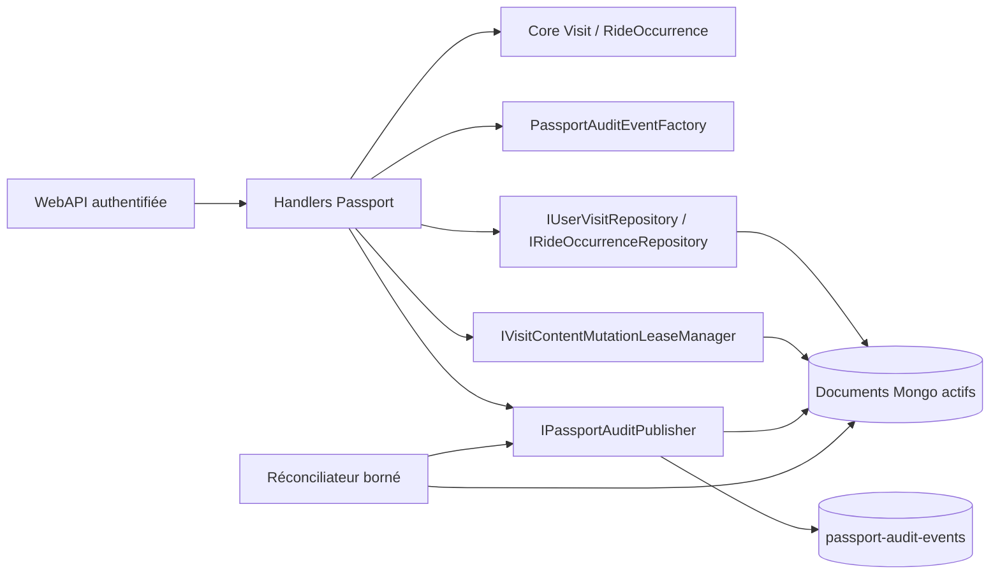
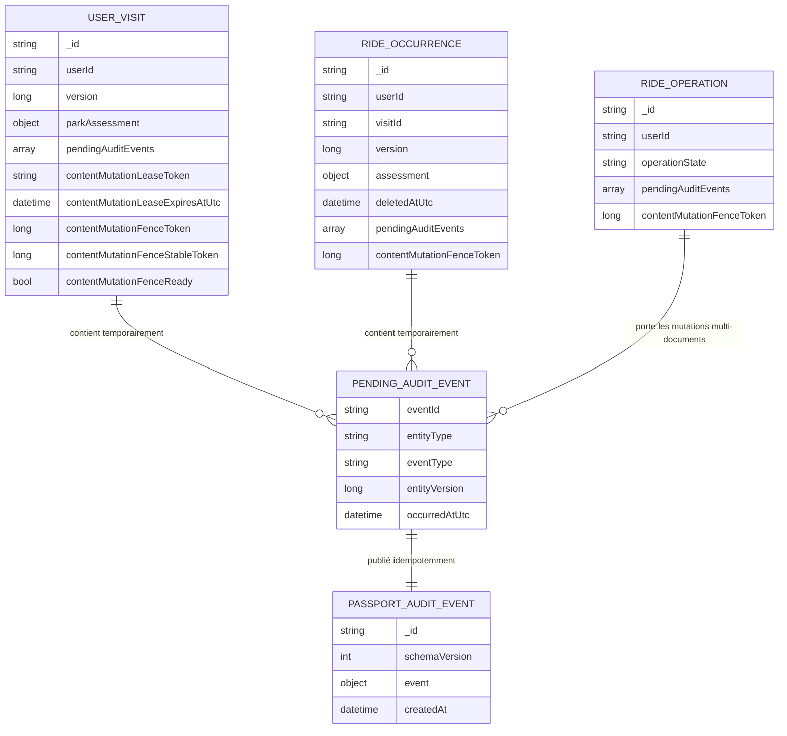
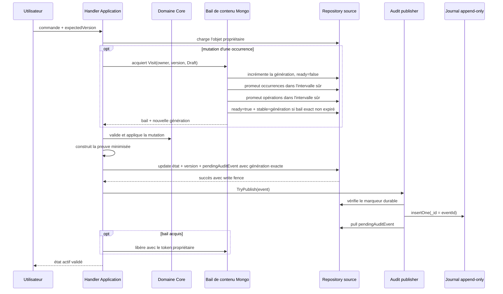
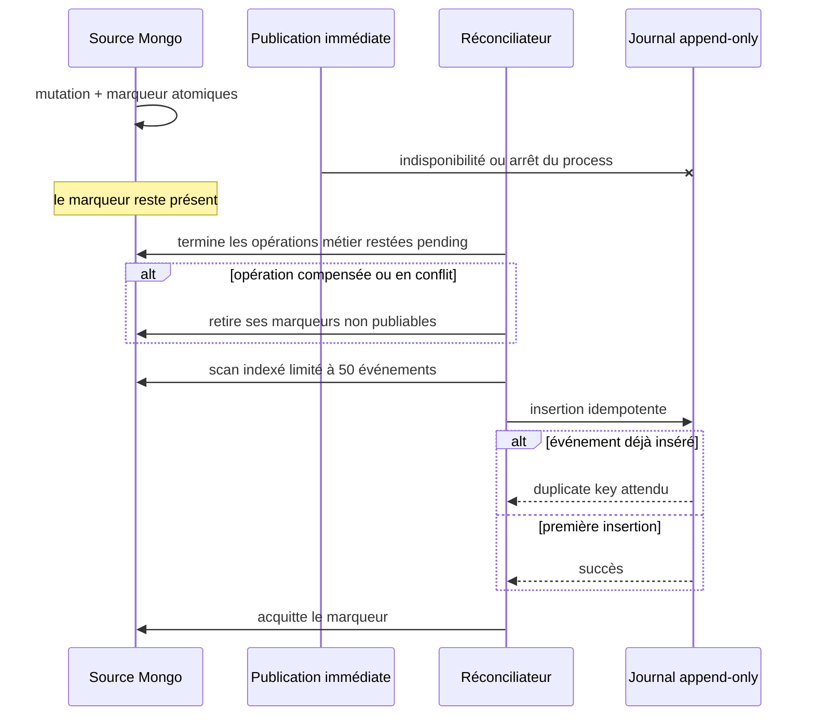
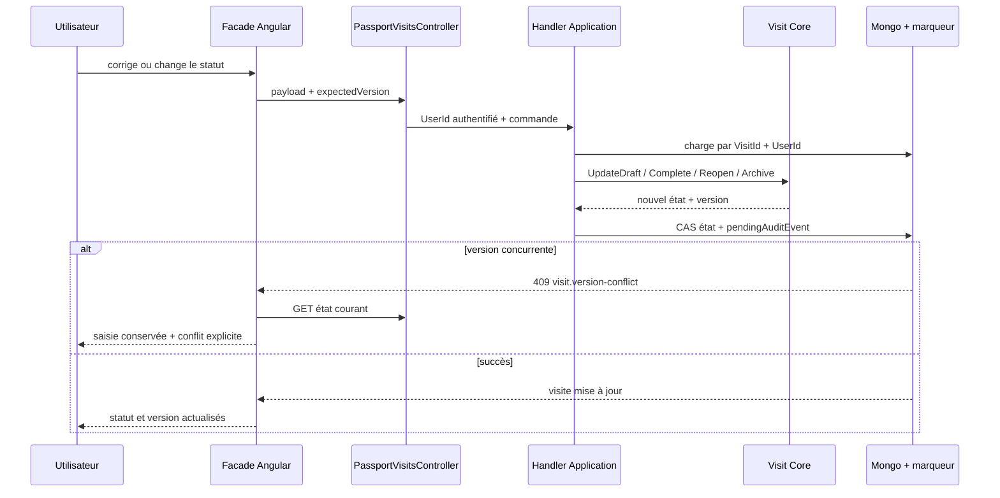

# PASS-11 — Audit privé des corrections du passeport

## 1. Résultat livré

PASS-11 rend traçables les mutations déjà disponibles sur les visites privées :

- création d'une visite ;
- correction de sa date, de son fuseau, de son titre et de sa note privée ;
- transitions explicites `Draft -> Completed`, `Completed -> Draft`, `Draft|Completed -> Archived` et `Archived -> Draft` ;
- création, modification et suppression de l'évaluation d'un parc pendant une visite ;
- ajout, modification, réordonnancement et suppression logique d'une occurrence de ride ;
- création, modification et suppression de l'évaluation d'une occurrence ;
- normalisation interne de l'ordre des occurrences.

Le journal est append-only et séparé de l'état actif. Aucune lecture du passeport ne reconstruit une visite, une occurrence ou une évaluation depuis l'audit. Le journal ne crée donc pas un système d'Event Sourcing.

Les quatre commandes de correction prévues par la roadmap sont exposées sous des routes propriétaires : `PATCH /me/passport/visits/{visitId}`, puis `POST .../complete`, `.../reopen` et `.../archive`. Elles exigent toutes `expectedVersion`. La suppression intégrale de visite et l'événement `VisitDeleted` restent réservés à PASS-17, où tombstone, purge et garanties RGPD seront livrés ensemble.

Le frontend place ces actions dans l'éditeur existant. Les formulaires et mutations de contenu ne sont disponibles qu'en brouillon ; une visite terminée ou archivée reste lisible et doit être rouverte volontairement. La grille passe à une colonne sous 620 px, chaque conteneur possède `min-width: 0`, les textes longs peuvent se couper et aucun champ ou bouton ne peut élargir le viewport.

## 2. Frontières d'architecture

- `AmusementPark.Core` définit la preuve minimisée et ses invariants.
- `AmusementPark.Application` reconnaît la mutation métier, compare l'ancien et le nouvel état, puis dépend uniquement de ports.
- `AmusementPark.Infrastructure` persiste atomiquement le marqueur avec la mutation, publie le journal et réconcilie les marqueurs restants.
- `AmusementPark.WebAPI` ne contient aucune règle d'audit et n'expose aucune route de lecture publique ou privée du journal dans cette tranche.

Les constructeurs publics des handlers de mutation exigent `IPassportAuditPublisher`. Les surcharges sans publisher sont internes à l'assembly et servent uniquement aux tests unitaires isolés : la composition de production ne peut pas omettre silencieusement l'audit.

Les mutations d'occurrence exigent aussi `IVisitContentMutationLeaseManager`. Son bail Mongo est acquis sur l'identité propriétaire, la version et le statut `Draft` de la visite. Avant `Complete` ou `Archive`, l'Application acquiert ce même bail et règle successivement toutes les opérations de contenu `pending` exactes : elle confirme chacune si son état métier est déjà appliqué, ou la compense et la place en conflit dans le cas contraire. La transition de cycle de vie n'est ensuite tentée qu'après la libération du bail. Toute mutation directe de la visite exige en retour l'absence d'un bail actif. Cette exclusion distribuée ferme la course entre une écriture de contenu et `Complete`/`Archive`, y compris avec plusieurs processus API et après plusieurs arrêts entre une écriture métier et son acquittement idempotent.

Le bail porte en plus une génération persistante et monotone, `contentMutationFenceToken`. Chaque acquisition — première utilisation, succession normale ou reprise après expiration — incrémente cette génération et place temporairement `contentMutationFenceReady` à `false`. Chaque écriture d'occurrence et chaque transition d'opération exige ensuite la génération exacte obtenue avec le bail. `contentMutationFenceStableToken` mémorise la dernière génération entièrement publiée. Le nouveau détenteur ne promeut que les descendants compris entre cette génération stable et la nouvelle génération : une écriture très ancienne arrivée après sa barrière reste donc exclue. Il promeut les occurrences puis les opérations avant de publier la nouvelle génération avec un `updateOne` exigeant le token de bail exact, la génération exacte et une échéance encore valide. Il n'utilise la nouvelle génération que si cet acquittement réussit, puis avance la génération stable.

Dès que la génération est déclarée prête, les lectures n'exposent que ses descendants et l'audit ignore toute génération obsolète. Pendant une promotion incomplète, les lectures et la reprise d'audit restent bornées à l'intervalle sûr entre la dernière génération stable et la génération en cours : une preuve déjà durable ne reste donc pas bloquée si le processus s'arrête avant l'acquittement final. La prochaine acquisition crée une autre génération et recommence la barrière avant toute mutation. Une création tardive n'est jamais publiée comme un faux succès et reste masquée jusqu'à ce que la reprise idempotente, interactive ou automatique, vérifie son opération exacte et l'adopte sous la génération courante. Cette barrière persistante protège même une écriture Mongo déjà envoyée qu'une simple annulation en mémoire ne pourrait plus arrêter.

Le détenteur renouvelle toutes les minutes son échéance de cinq minutes avec un filtre exigeant son token exact et une échéance non expirée. Un échec ou une perte de propriété annule le travail protégé encore en cours ; les filtres de génération refusent aussi toute écriture déjà envoyée qui arriverait après la reprise. Avant toute promotion ciblée d'une opération idempotente, le repository exige l'utilisateur et la visite d'origine : une même clé réutilisée sur une autre visite produit un conflit sans déplacer l'opération ni ses occurrences vers le fence numérique de cette seconde visite. Un bail réellement abandonné reste récupérable après cinq minutes.

L'acquisition et la validation `Draft` précèdent aussi toute reprise d'une opération idempotente de création ou de réordonnancement : un retry ne peut donc pas relancer une écriture réservée après la clôture de la visite. Une création réservée conserve en outre l'identité temporelle utilisée pour valider ses occurrences — parc, date avec sa précision, fuseau et convention de journée. Cette identité doit encore correspondre à la visite rechargée sous bail ; sinon l'opération exacte devient `conflict`, ses marqueurs sont retirés et aucun ancien instant local n'est appliqué. Le même contrôle protège le retry interactif. Une correction de date, précision, fuseau ou convention de journée acquiert le même bail avant de vérifier l'absence d'occurrences, puis écrit la visite avec un filtre exigeant le token exact de ce bail. Aucune création ne peut donc se glisser entre le contrôle et l'écriture. La correction est refusée lorsque des occurrences existent : c'est la barrière conservatrice retenue tant qu'une opération dédiée de revalidation atomique des enfants n'existe pas. Le titre, la note privée et le caractère approximatif restent corrigeables sans altérer leur chronologie.

## 3. Modèle MongoDB

### 3.1 État actif et marqueur réparable

Une mutation simple ajoute son événement à `pendingAuditEvents` dans le même `insertOne` ou `updateOne` que l'état actif et sa nouvelle version.

Les créations batch, suppressions et réordonnancements s'appuient déjà sur un document d'opération durable. Leurs preuves y restent attachées et ne deviennent publiables que lorsque `operationState == completed`. Cela empêche le réconciliateur de journaliser une étape intermédiaire qui pourrait encore être compensée.

### 3.2 Contenu d'une preuve

Le sous-document `event` conserve :

- un `eventId` déterministe fondé sur le type d'entité, son identifiant, sa version et le type d'événement ;
- `userId`, `entityType`, `entityId`, `visitId`, `parkId` et éventuellement `parkItemId` ;
- `eventType`, `entityVersion` et éventuellement `assessmentRevision` ;
- la liste typée des champs modifiés ;
- l'ancienne et la nouvelle date structurée uniquement lorsqu'elle change, en conservant exactement sa précision (`Year`, `Month` ou `Day`) et son caractère approximatif ;
- les anciennes et nouvelles notes en demi-points ;
- les anciens et nouveaux statuts ou rangs lorsqu'ils sont utiles ;
- un booléen `privateTextChanged` ;
- une corrélation SHA-256, l'origine et l'horodatage UTC.

Les titres, notes privées, commentaires privés et heures locales ne sont jamais copiés dans l'audit. Pour ces textes, seule l'indication de changement est conservée. Les changements de fuseau et de convention sont également identifiés sans dupliquer leur valeur. La corrélation brute fournie par le client n'est pas stockée : seule son empreinte est conservée.

### 3.3 Index

- index de timeline privée : `(event.userId, event.occurredAtUtc desc, _id)` ;
- index de preuve par source : `(event.entityType, event.entityId, event.entityVersion)` ;
- index partiel `pendingAuditEvents.eventId` sur les visites, occurrences et opérations.

L'identifiant Mongo du journal est l'identifiant déterministe de l'événement. Une reprise après insertion réussie mais avant acquittement rencontre donc un doublon attendu, puis retire le marqueur sans ajouter une seconde preuve.

## 4. Séquences de cohérence

### 4.1 Mutation simple

Si l'écriture de l'état échoue sur la version attendue, aucun marqueur n'est créé et aucun audit n'est publié.
Une transition de cycle de vie acquiert d'abord le bail de contenu, réconcilie jusqu'à épuisement les opérations `pending` exactes, puis libère le bail avant d'utiliser le filtre inverse. Si une mutation de contenu acquiert le bail entre ces deux étapes, la transition échoue sur le bail actif. Si la transition gagne la course, l'acquisition de contenu exige encore `Draft` et la version observée : l'occurrence ne peut alors plus être modifiée. Si le contenu gagne, `Complete` ou `Archive` ne peut pas franchir son write fence avant sa réconciliation et la libération. Une correction temporelle est la seule mutation de visite autorisée sous bail, et uniquement avec son token exact ; l'écriture incrémente la version avant de libérer le bail.

Un insert batch est le seul write qui ne peut pas comparer un document préexistant. Chaque document inséré porte néanmoins la génération du bail. La clôture de l'opération doit ensuite réussir avec cette même génération avant que le repository retourne `Created` ou `Replayed`. Si une reprise a gagné entre les deux, le résultat devient un conflit de concurrence : la génération ancienne est masquée. Le prochain passage idempotent — y compris le worker autonome — ne promeut que les documents portant l'utilisateur, la visite, la clé, l'empreinte, le nombre et les identifiants d'allocation de cette opération exacte, puis complète les allocations manquantes sous la génération courante. Un doublon produit pendant cette récupération déclenche une seconde adoption avant la vérification finale.

### 4.2 Reprise après incident

Le service exécute un premier lot au démarrage puis au maximum un lot de 50 opérations et un lot de 50 événements par minute. Pour chaque opération, l'orchestrateur Application recharge la visite propriétaire. Le chemin normal empêche désormais une visite de quitter `Draft` tant que son opération `pending` n'est pas réglée sous bail. La branche qui rencontre malgré tout une visite absente, terminée ou archivée reste une défense contre un état hérité ou incohérent : elle place l'opération exacte en `conflict` et retire ses marqueurs afin que ces entrées terminales ne saturent pas durablement le lot borné. Pour une visite `Draft`, le service acquiert le même bail distribué que les mutations interactives, puis compare l'éventuelle identité temporelle réservée. Sous cette barrière seulement, il termine les créations, suppressions et réordonnancements dont l'état métier a été appliqué avant l'acquittement de leur opération idempotente. La clé opaque remontée par le scan borne la reprise et l'abandon au document Mongo observé ; une opération plus récente de la même visite ne peut pas être touchée par erreur. Une opération ainsi confirmée devient `completed` et ses preuves deviennent publiables ; une opération compensée ou terminée en conflit perd ses marqueurs, puisqu'aucune mutation nette ne doit être journalisée. Le scan d'événements intervient seulement ensuite.

Chaque recherche s'appuie directement sur l'index multikey partiel `pendingAuditEvents.eventId`. L'ordre des opérations est borné et déterministe ; l'ordre de publication des preuves est stabilisé en mémoire. Le worker ne parcourt donc pas les documents dépourvus de marqueur et traite les reprises séquentiellement pour préserver le budget du VPS.

### 4.3 Correction d'une visite depuis l'interface

`CompleteVisitCommand` compare la première date possible de la visite au jour courant calculé dans son fuseau par `IPassportLocalDateResolver`. Le contrôleur ne calcule aucune règle calendaire et le frontend ne peut pas contourner l'invariant Core.

## 5. Propriétés garanties

| Incident | État métier | Preuve |
|---|---|---|
| conflit optimiste | inchangé | aucune preuve produite |
| arrêt avant l'écriture Mongo | inchangé | aucune preuve attendue |
| arrêt après la mutation | valide | marqueur durable repris |
| journal indisponible | valide | marqueur conservé |
| arrêt après insertion du journal | valide | doublon absorbé, marqueur acquitté à la reprise |
| compensation ou conflit d'un réordonnancement | restauré ou inchangé | marqueurs supprimés de l'opération terminale, donc aucune fausse preuve publiée |
| contenu et changement de statut concurrents | l'opération de contenu est réglée sous bail avant la transition ; une seule mutation franchit ensuite son write fence | preuve produite uniquement pour chaque mutation effectivement validée |
| opération longue avec bail de contenu | état protégé tant que le token exact est renouvelé | renouvellement chaque minute ; annulation du travail si la propriété est perdue |
| écriture déjà envoyée lors de l'expiration du bail | filtre de génération refusé, ou insert ancien masqué puis adopté uniquement par l'opération exacte ; un doublon concurrent relance cette adoption | aucune preuve de succès tant que l'opération n'est pas clôturée sous la génération courante |
| même clé idempotente réutilisée sur une autre visite | recherche et promotion bornées par propriétaire, visite et clé ; la réservation en doublon devient un conflit | la première visite et ses preuves conservent leur fence |
| arrêt pendant la promotion d'une nouvelle génération | seules les générations de l'intervalle sûr restent lisibles ; aucune nouvelle mutation n'obtient le bail | les preuves du même intervalle restent livrables ; la nouvelle acquisition incrémente et reprend depuis la dernière génération stable |
| arrêt avec bail de contenu | état déjà écrit ou inchangé | bail non renouvelé et récupérable après cinq minutes, marqueur d'audit repris séparément |
| création réservée puis identité temporelle modifiée | aucune occurrence ancienne n'est créée ; les allocations exactes restées sous une ancienne génération sont supprimées avant le rejet | opération exacte en conflit, marqueurs retirés |
| arrêt après état métier mais avant acquittement, puis demande de clôture | opération exacte complétée ou compensée sous bail avant la clôture | preuve conservée si et seulement si la mutation métier est confirmée |
| opération pendante héritée après clôture ou disparition de la visite | aucune reprise de contenu verrouillé | opération terminalisée, sans famine des lots suivants |

L'audit ne modifie ni les notes communautaires, ni les agrégats, ni les classements. Il reste une preuve privée de correction, pas une source de calcul produit.

## 6. Vérifications automatisées

- invariants Core : UTC, version positive, champs modifiés obligatoires, identité et corrélation déterministes ;
- factory Application : ancien/nouveau rating, statut et rang, détection de texte privé modifié, absence de valeurs privées ;
- handlers : marqueur persisté avant tentative de publication ;
- corrections de visite : validation de date, fuseau, version, état, réouverture d'archive et date locale de complétion ;
- exclusion distribuée : statut `Draft`, propriétaire et version exigés à l'acquisition, nouvelle génération monotone à chaque détenteur, borne stable persistée, promotion uniquement ascendante dans l'intervalle sûr, indicateur `ready`, renouvellement périodique du token exact non expiré, annulation lors d'une perte du bail, refus d'une clôture de création après changement de génération, opération pendante réglée sous le même bail avant `Complete`/`Archive`, mutations de visite bloquées pendant un bail actif ;
- cohérence temporelle : reprise idempotente sous bail, identité réservée comparée à la visite courante, contrôle d'absence et écriture sous le même token, refus des changements temporels d'une visite qui contient déjà des occurrences ;
- repositories Mongo : `version` et `$push pendingAuditEvents` dans la même écriture, filtres exacts sur `contentMutationFenceToken`, lecture et audit limités à la génération prête ou à l'intervalle stable sûr pendant une promotion, suppression bornée aux allocations exactes d'une création rejetée restées sous une ancienne génération ;
- mapper : aller-retour des preuves minimisées sans `privateComment` ni `privateNote` ;
- publisher : existence obligatoire d'un marqueur avant insertion, append puis acquittement ;
- indexes : parcours privés et scan partiel des seuls marqueurs ;
- background service : lancement immédiat, reprise ou abandon terminal de l'opération exacte avant les preuves, ordre stable au sein du lot borné, et tailles de lots fixées à 50 ;
- non-régression : suites Passport Application et persistance Mongo existantes ;
- frontend : mapper sans précision ou convention de journée inventée, saisie conservée après conflit, ports HTTP, réconciliation après réponse réseau perdue, évaluations et notes privées d'occurrence lisibles sur une visite verrouillée, template Angular compilé et tests Passport ciblés ;

## 7. Hors périmètre de PASS-11

- interface de consultation de l'audit ;
- exposition publique du journal ;
- statistiques personnelles, livrées à partir de PASS-12 ;
- export, purge RGPD et politique de rétention, traités par PASS-16 et PASS-17 ;
- lecture utilisateur ou administration du journal : la preuve demeure interne tant qu'un besoin support encadré n'est pas spécifié.
