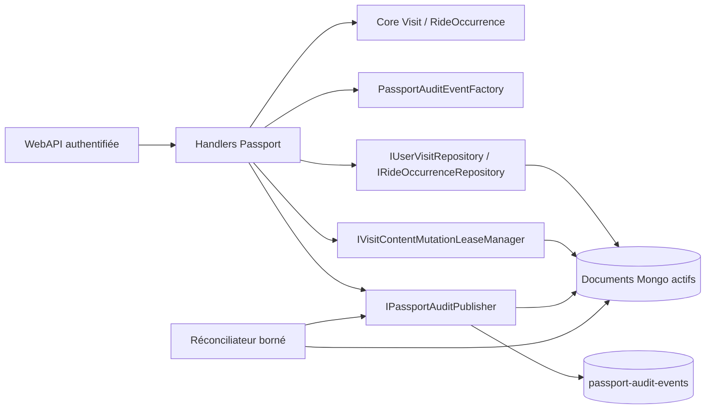
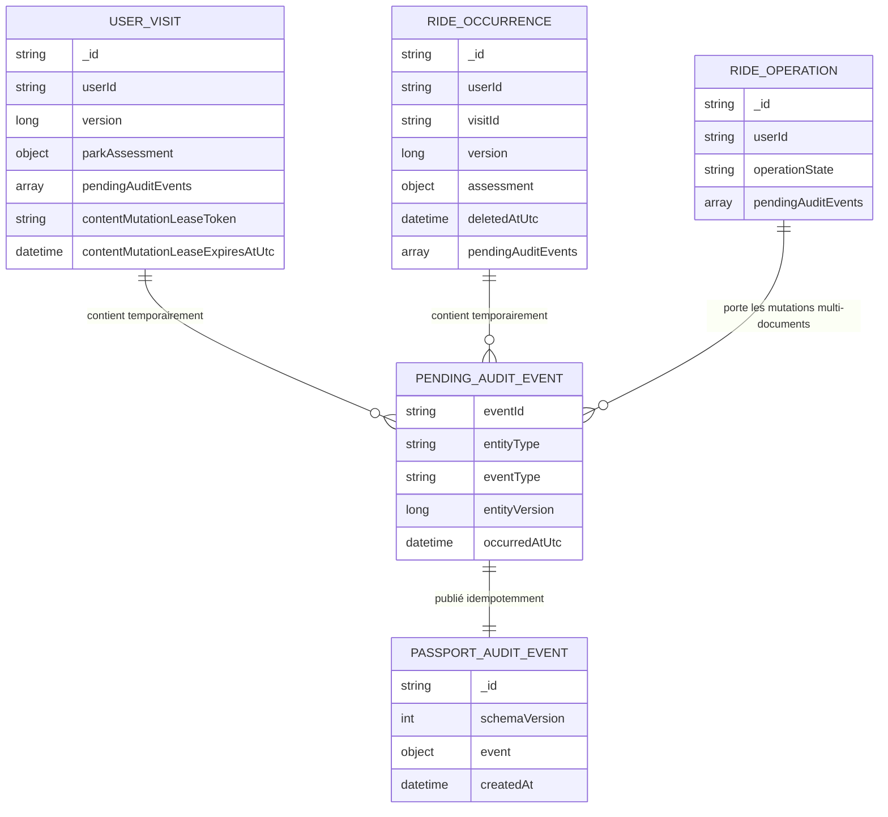
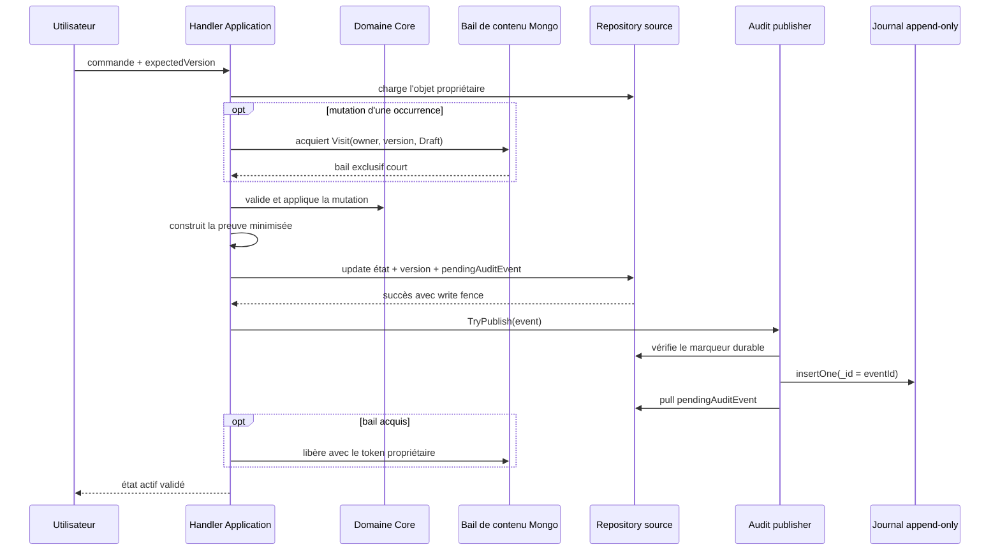
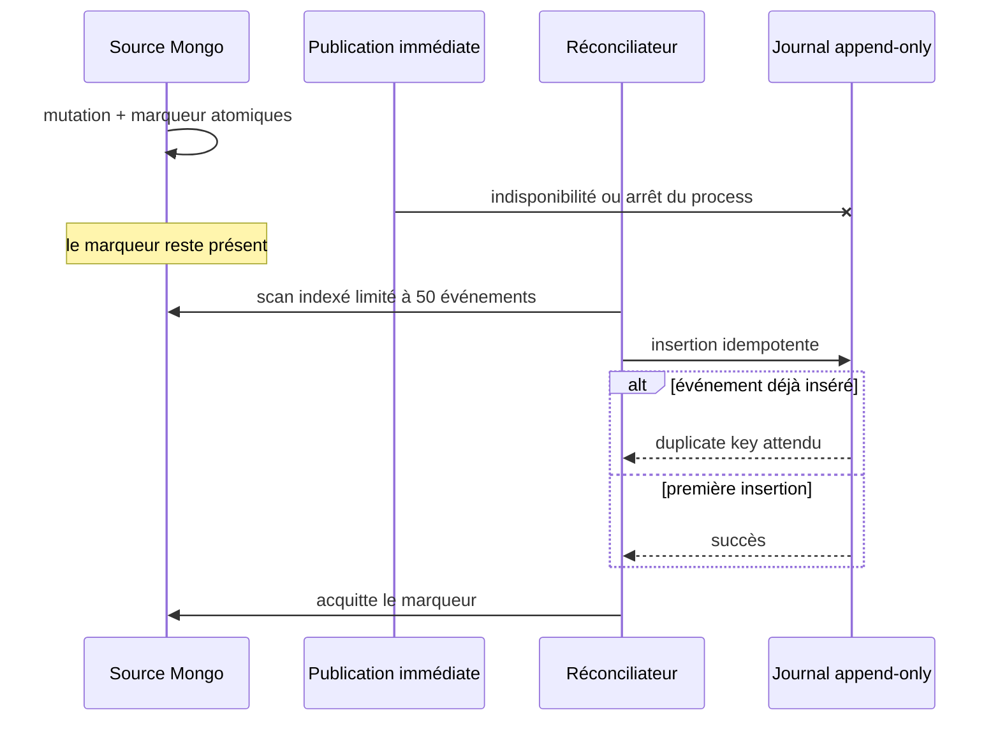
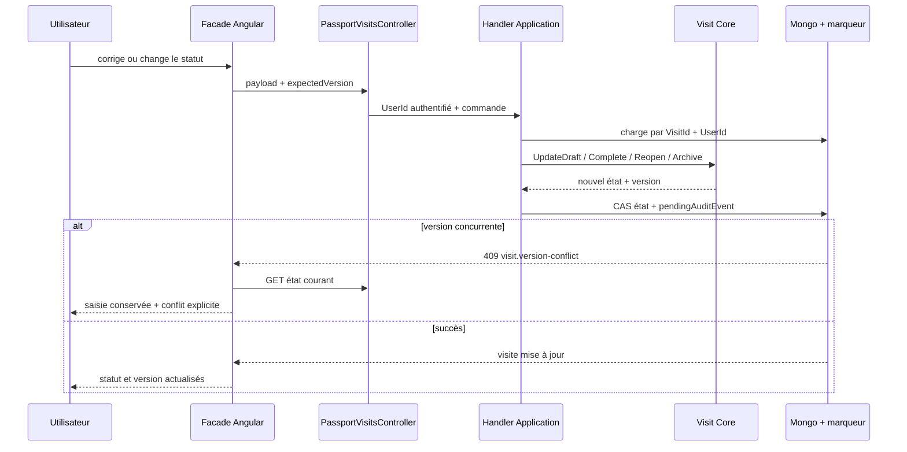

# PASS-11 — Audit privé des corrections du passeport

## 1. Résultat livré

PASS-11 rend traçables les mutations déjà disponibles sur les visites privées :

- création d'une visite ;
- correction de sa date, de son fuseau, de son titre et de sa note privée ;
- transitions explicites `Draft -> Completed`, `Completed -> Draft`, `Draft|Completed -> Archived` et `Archived -> Draft` ;
- création, modification et suppression de l'évaluation d'un parc pendant une visite ;
- ajout, modification, réordonnancement et suppression logique d'une occurrence de ride ;
- création, modification et suppression de l'évaluation d'une occurrence ;
- normalisation interne de l'ordre des occurrences.

Le journal est append-only et séparé de l'état actif. Aucune lecture du passeport ne reconstruit une visite, une occurrence ou une évaluation depuis l'audit. Le journal ne crée donc pas un système d'Event Sourcing.

Les quatre commandes de correction prévues par la roadmap sont exposées sous des routes propriétaires : `PATCH /me/passport/visits/{visitId}`, puis `POST .../complete`, `.../reopen` et `.../archive`. Elles exigent toutes `expectedVersion`. La suppression intégrale de visite et l'événement `VisitDeleted` restent réservés à PASS-17, où tombstone, purge et garanties RGPD seront livrés ensemble.

Le frontend place ces actions dans l'éditeur existant. Les formulaires et mutations de contenu ne sont disponibles qu'en brouillon ; une visite terminée ou archivée reste lisible et doit être rouverte volontairement. La grille passe à une colonne sous 620 px, chaque conteneur possède `min-width: 0`, les textes longs peuvent se couper et aucun champ ou bouton ne peut élargir le viewport.

## 2. Frontières d'architecture

- `AmusementPark.Core` définit la preuve minimisée et ses invariants.
- `AmusementPark.Application` reconnaît la mutation métier, compare l'ancien et le nouvel état, puis dépend uniquement de ports.
- `AmusementPark.Infrastructure` persiste atomiquement le marqueur avec la mutation, publie le journal et réconcilie les marqueurs restants.
- `AmusementPark.WebAPI` ne contient aucune règle d'audit et n'expose aucune route de lecture publique ou privée du journal dans cette tranche.

Les constructeurs publics des handlers de mutation exigent `IPassportAuditPublisher`. Les surcharges sans publisher sont internes à l'assembly et servent uniquement aux tests unitaires isolés : la composition de production ne peut pas omettre silencieusement l'audit.

Les mutations d'occurrence exigent aussi `IVisitContentMutationLeaseManager`. Son bail Mongo est acquis sur l'identité propriétaire, la version et le statut `Draft` de la visite. Toute mutation directe de la visite exige en retour l'absence d'un bail actif. Cette exclusion distribuée ferme la course entre une écriture de contenu et `Complete`/`Archive`, y compris avec plusieurs processus API. Un bail abandonné devient récupérable après cinq minutes ; les commandes normales sont bornées très en dessous de cette durée.

L'acquisition et la validation `Draft` précèdent aussi toute reprise d'une opération idempotente de création ou de réordonnancement : un retry ne peut donc pas relancer une écriture réservée après la clôture de la visite. Une correction de date, précision, fuseau ou convention de journée acquiert le même bail avant de vérifier l'absence d'occurrences, puis écrit la visite avec un filtre exigeant le token exact de ce bail. Aucune création ne peut donc se glisser entre le contrôle et l'écriture. La correction est refusée lorsque des occurrences existent : c'est la barrière conservatrice retenue tant qu'une opération dédiée de revalidation atomique des enfants n'existe pas. Le titre, la note privée et le caractère approximatif restent corrigeables sans altérer leur chronologie.

## 3. Modèle MongoDB

### 3.1 État actif et marqueur réparable

Une mutation simple ajoute son événement à `pendingAuditEvents` dans le même `insertOne` ou `updateOne` que l'état actif et sa nouvelle version.

Les créations batch, suppressions et réordonnancements s'appuient déjà sur un document d'opération durable. Leurs preuves y restent attachées et ne deviennent publiables que lorsque `operationState == completed`. Cela empêche le réconciliateur de journaliser une étape intermédiaire qui pourrait encore être compensée.

### 3.2 Contenu d'une preuve

Le sous-document `event` conserve :

- un `eventId` déterministe fondé sur le type d'entité, son identifiant, sa version et le type d'événement ;
- `userId`, `entityType`, `entityId`, `visitId`, `parkId` et éventuellement `parkItemId` ;
- `eventType`, `entityVersion` et éventuellement `assessmentRevision` ;
- la liste typée des champs modifiés ;
- l'ancienne et la nouvelle date structurée uniquement lorsqu'elle change, en conservant exactement sa précision (`Year`, `Month` ou `Day`) et son caractère approximatif ;
- les anciennes et nouvelles notes en demi-points ;
- les anciens et nouveaux statuts ou rangs lorsqu'ils sont utiles ;
- un booléen `privateTextChanged` ;
- une corrélation SHA-256, l'origine et l'horodatage UTC.

Les titres, notes privées, commentaires privés et heures locales ne sont jamais copiés dans l'audit. Pour ces textes, seule l'indication de changement est conservée. Les changements de fuseau et de convention sont également identifiés sans dupliquer leur valeur. La corrélation brute fournie par le client n'est pas stockée : seule son empreinte est conservée.

### 3.3 Index

- index de timeline privée : `(event.userId, event.occurredAtUtc desc, _id)` ;
- index de preuve par source : `(event.entityType, event.entityId, event.entityVersion)` ;
- index partiel `pendingAuditEvents.eventId` sur les visites, occurrences et opérations.

L'identifiant Mongo du journal est l'identifiant déterministe de l'événement. Une reprise après insertion réussie mais avant acquittement rencontre donc un doublon attendu, puis retire le marqueur sans ajouter une seconde preuve.

## 4. Séquences de cohérence

### 4.1 Mutation simple

Si l'écriture de l'état échoue sur la version attendue, aucun marqueur n'est créé et aucun audit n'est publié.
Une transition de cycle de vie utilise le filtre inverse et échoue si un bail de contenu est actif. Si la transition gagne la course, l'acquisition exige encore `Draft` et la version observée : l'occurrence ne peut alors plus être modifiée. Si le contenu gagne, `Complete` ou `Archive` ne peut pas franchir son write fence avant la libération. Une correction temporelle est la seule mutation de visite autorisée sous bail, et uniquement avec son token exact ; l'écriture incrémente la version avant de libérer le bail.

### 4.2 Reprise après incident

Le service exécute un premier lot au démarrage puis au maximum un lot de 50 événements par minute. Chaque recherche s'appuie directement sur l'index multikey partiel `pendingAuditEvents.eventId`, sans tri Mongo non couvert, puis l'ordre de publication du lot borné est stabilisé en mémoire. Il ne parcourt donc pas les documents dépourvus de marqueur et traite les événements séquentiellement pour préserver le budget du VPS.

### 4.3 Correction d'une visite depuis l'interface

`CompleteVisitCommand` compare la première date possible de la visite au jour courant calculé dans son fuseau par `IPassportLocalDateResolver`. Le contrôleur ne calcule aucune règle calendaire et le frontend ne peut pas contourner l'invariant Core.

## 5. Propriétés garanties

| Incident | État métier | Preuve |
|---|---|---|
| conflit optimiste | inchangé | aucune preuve produite |
| arrêt avant l'écriture Mongo | inchangé | aucune preuve attendue |
| arrêt après la mutation | valide | marqueur durable repris |
| journal indisponible | valide | marqueur conservé |
| arrêt après insertion du journal | valide | doublon absorbé, marqueur acquitté à la reprise |
| compensation d'un réordonnancement | restauré | opération non `completed`, donc aucune fausse preuve publiée |
| contenu et changement de statut concurrents | une seule mutation franchit son write fence | preuve produite uniquement pour la mutation gagnante |
| arrêt avec bail de contenu | état déjà écrit ou inchangé | bail récupérable après cinq minutes, marqueur d'audit repris séparément |

L'audit ne modifie ni les notes communautaires, ni les agrégats, ni les classements. Il reste une preuve privée de correction, pas une source de calcul produit.

## 6. Vérifications automatisées

- invariants Core : UTC, version positive, champs modifiés obligatoires, identité et corrélation déterministes ;
- factory Application : ancien/nouveau rating, statut et rang, détection de texte privé modifié, absence de valeurs privées ;
- handlers : marqueur persisté avant tentative de publication ;
- corrections de visite : validation de date, fuseau, version, état, réouverture d'archive et date locale de complétion ;
- exclusion distribuée : statut `Draft`, propriétaire et version exigés à l'acquisition, mutations de visite bloquées pendant un bail actif ;
- cohérence temporelle : reprise idempotente sous bail, contrôle d'absence et écriture sous le même token, refus des changements temporels d'une visite qui contient déjà des occurrences ;
- repositories Mongo : `version` et `$push pendingAuditEvents` dans la même écriture ;
- mapper : aller-retour des preuves minimisées sans `privateComment` ni `privateNote` ;
- publisher : existence obligatoire d'un marqueur avant insertion, append puis acquittement ;
- indexes : parcours privés et scan partiel des seuls marqueurs ;
- background service : lancement immédiat et taille de lot fixée à 50 ;
- non-régression : suites Passport Application et persistance Mongo existantes ;
- frontend : mapper sans précision ou convention de journée inventée, saisie conservée après conflit, ports HTTP, réconciliation après réponse réseau perdue, template Angular compilé et tests Passport ciblés ;

## 7. Hors périmètre de PASS-11

- interface de consultation de l'audit ;
- exposition publique du journal ;
- statistiques personnelles, livrées à partir de PASS-12 ;
- export, purge RGPD et politique de rétention, traités par PASS-16 et PASS-17 ;
- lecture utilisateur ou administration du journal : la preuve demeure interne tant qu'un besoin support encadré n'est pas spécifié.
