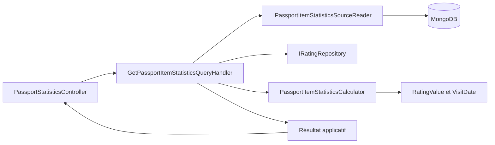
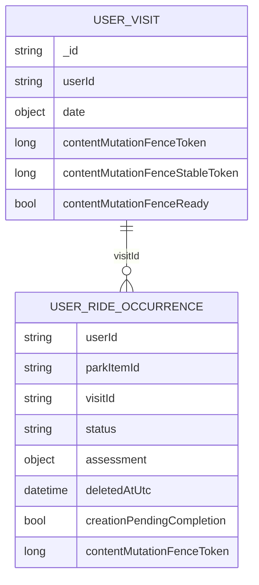
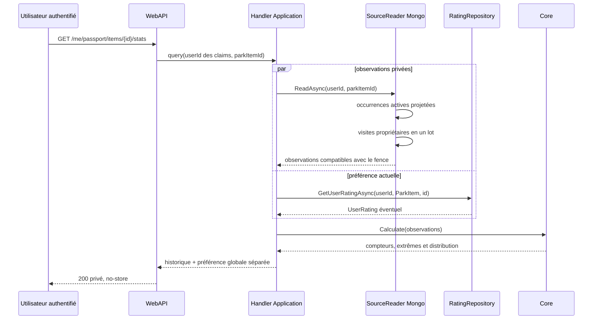

# PASS-12 — Statistiques privées de base par attraction

## 1. Résultat livré

PASS-12 calcule, pour un utilisateur authentifié et une attraction donnée :

- le nombre de tours terminés et le nombre de visites distinctes ;
- le nombre de tours notés, son dénominateur explicite et le taux de couverture ;
- la première et la dernière expérience connues, sans compléter une date partielle ;
- la moyenne, la médiane, le minimum, le maximum et l'écart-type des notes par tour ;
- la note globale actuelle issue de `UserRating`, présentée séparément de l'historique ;
- l'écart signé entre cette préférence actuelle et la moyenne des notes historiques.

Le contrat privé additif est `GET /me/passport/items/{parkItemId}/stats`. L'identité du propriétaire vient exclusivement du jeton authentifié. Une attraction sans historique renvoie des compteurs et un dénominateur à zéro ; les statistiques de notes et les expériences absentes restent `null`.

Les moyennes par visite et par année, la série chronologique et la tendance ne sont pas simulées dans cette tranche. Elles appartiennent aux agrégations de PASS-13, puis à la restitution accessible de PASS-14.

## 2. Frontières d'architecture



- `AmusementPark.Core` possède les règles de calcul pures et travaille sur `RatingValue` en demi-points ainsi que sur `VisitDate`.
- `AmusementPark.Application` orchestre en parallèle la lecture des observations privées et celle de la préférence globale actuelle au travers de ports.
- `AmusementPark.Infrastructure` sélectionne uniquement les champs Mongo nécessaires et applique les barrières de cohérence de PASS-11.
- `AmusementPark.WebAPI` authentifie, prend l'utilisateur dans ses claims et mappe le résultat sans recalculer une statistique.

Le contrôleur porte `Authorize(UserModeratorAdmin)`, `RequireActivatedUnblockedUser` et `ResponseCache(NoStore = true)`. Aucune route publique, identité de tiers ou donnée de commentaire privé n'est introduite.

## 3. Source MongoDB et coût de lecture



La lecture effectue deux requêtes bornées par le propriétaire :

1. les occurrences sont cherchées par `(userId, parkItemId)` grâce à l'index existant `idx_user_ride_occurrences_user_item_visit`, puis filtrées sur `Completed`, non supprimées et non provisoires ; la projection contient seulement `visitId`, la note en demi-points et le token de fence ;
2. les visites correspondantes sont chargées en un seul lot par `(userId, _id in [...])`, avec seulement leur date et leurs champs de fence.

Il n'existe donc ni lecture N+1, ni scan global, ni chargement de titre, de note privée de visite ou de commentaire d'évaluation. Une occurrence dont la visite manque ou dont la génération n'appartient pas à l'intervalle sûr de PASS-11 est ignorée. La première version reste calculée à la demande : matérialiser un snapshot avant d'avoir mesuré la volumétrie ajouterait un chemin de cohérence et un coût d'écriture prématurés.

## 4. Preuve du calcul

Une note persistée vaut un nombre entier `h` de demi-points et sa valeur utilisateur vaut `h / 2`. Pour `n` tours notés :

```text
rideCount       = nombre d'occurrences actives Completed
visitCount      = nombre de visitId distincts parmi ces occurrences
ratedRideCount  = nombre d'occurrences possédant une évaluation
coverageRate    = ratedRideCount / rideCount
average         = somme(h) / (2 × n)
median          = valeur centrale, ou moyenne exacte des deux valeurs centrales
populationStdDev = sqrt(somme((h - moyenne(h))²) / n) / 2
```

L'écart-type de population est retenu, car les observations lues constituent toute la population privée enregistrée pour le couple utilisateur-attraction et non un échantillon estimant une population cachée. Le Core conserve la somme entière des demi-points. Il n'applique aucun arrondi de présentation ; l'interface de PASS-14 décidera seule du nombre de décimales affiché.

La fixture indépendante `[1 ; 3,5 ; 5]` donne une somme de `19` demi-points, une moyenne de `19/6`, une médiane de `3,5`, un minimum de `1` et un maximum de `5`. Les tests comparent aussi l'écart-type à la formule calculée séparément. Une médiane de deux notes peut légitimement produire un quart de point, par exemple `3,75` pour `[3,5 ; 4]`, sans altérer les observations sources.

## 5. Dates partielles

La première et la dernière expérience restent des `VisitDateResult` avec `year`, `month`, `day`, `precision` et `isApproximate`. Aucun premier janvier, premier jour du mois, minuit ou fuseau fictif n'est renvoyé.

Pour rendre les extrêmes déterministes, le Core réutilise la convention de PASS-01 : ordre par composants calendaires réellement connus, puis par identifiant de visite en cas d'égalité. Dans une même année, l'année seule précède le mois connu en ordre croissant ; dans un même mois, le mois seul précède le jour connu. L'ordre inverse détermine la dernière expérience. Cette convention ordonne les données sans augmenter leur précision et sera conservée dans les tableaux et séries ultérieurs.

## 6. Séquence



## 7. Vérifications automatisées

- Core : jeu vide, dénominateurs, demi-points, moyenne, médiane paire, extrêmes, écart-type population et dates partielles ;
- Application : séparation historique/préférence actuelle, écart signé, résultat vide et validation des identifiants avant toute lecture ;
- Infrastructure : forme des filtres indexés, lecture des visites en lot et dix cas de fence stable, prêt ou en récupération ;
- WebAPI : identité authentifiée, mapping de la preuve, absence de `UserId` dans le DTO, route privée et interdiction de cache ;
- architecture : cas d'usage référencé dans le catalogue `Passport` et dépendances respectant les ports.

PASS-12 n'ajoute aucun composant visuel. Le contrôle responsive s'appliquera à PASS-14, avec tableaux utilisables sans graphique, conteneurs réductibles et vérification explicite de l'absence de dépassement horizontal sur les petits viewports.
