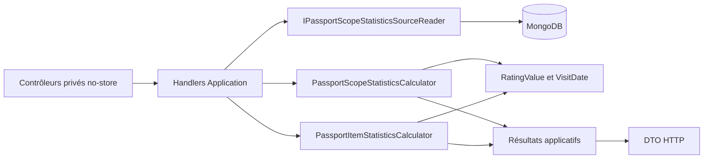
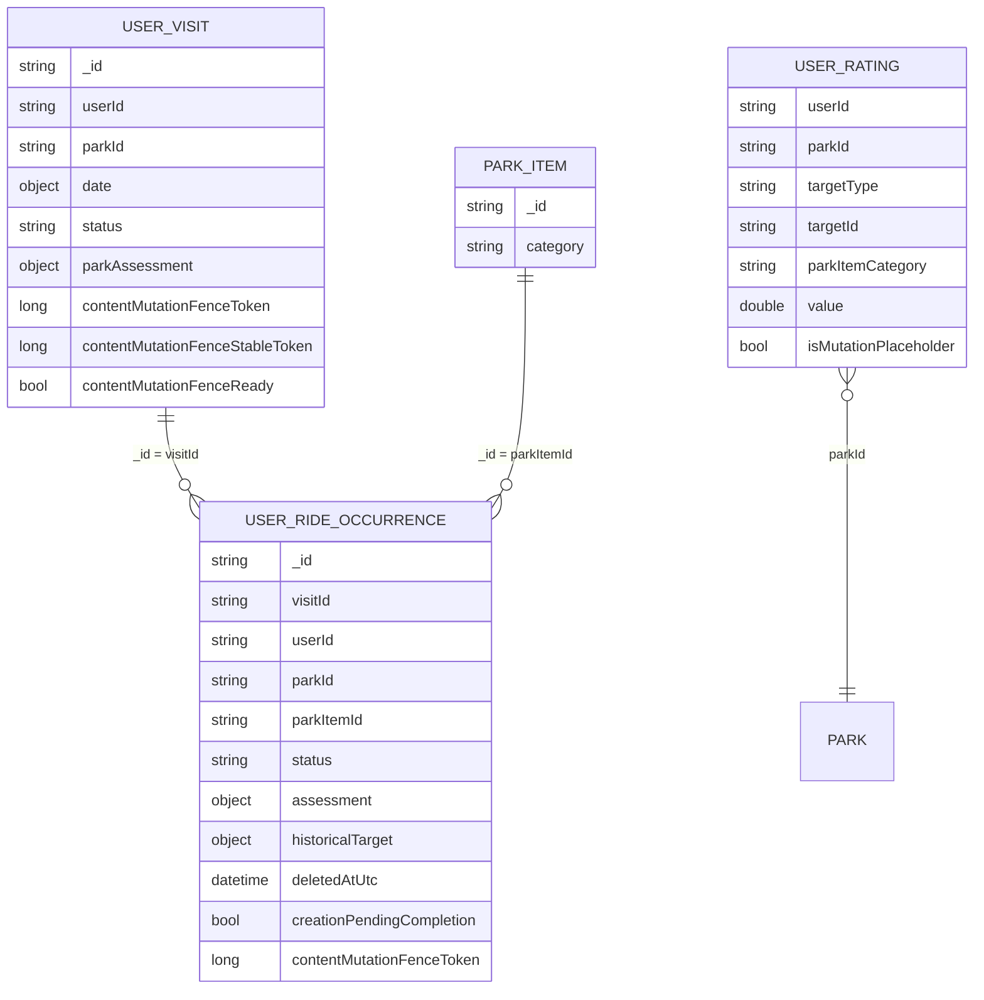
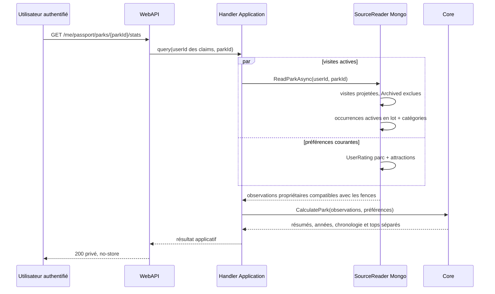
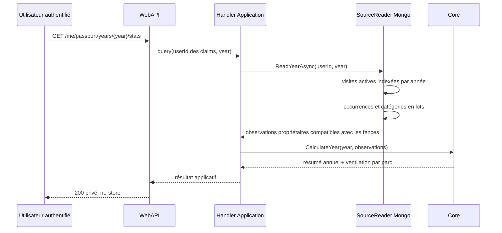

# PASS-13 — Statistiques privées par parc et par année

## 1. Résultat livré

PASS-13 complète le socle statistique du passeport avec deux lectures privées additives :

- `GET /me/passport/parks/{parkId}/stats` agrège l'historique d'un parc ;
- `GET /me/passport/years/{year}/stats` agrège une année et la ventile par parc.

Le résultat d'un parc expose les visites, les dates approximatives, la première et la dernière visite, la chronologie des notes de visite, les distributions de notes, les tours terminés, les tentatives et passages manqués, les attractions distinctes et refaites, la couverture par catégorie et le détail annuel. Le top fondé sur les `UserRating` actuels reste volontairement séparé du top calculé sur les évaluations historiques de tours.

Le contrat par attraction de PASS-12 est aussi complété avec :

- les moyennes et distributions par visite ;
- les moyennes et distributions par année ;
- tous les points notés dans leur ordre chronologique déterministe ;
- une tendance prudente, absente lorsque les preuves sont insuffisantes.

Les visites `Archived`, les occurrences supprimées et les créations provisoires sont exclues de toutes les vues courantes. Les occurrences qui ne sont pas `Completed` restent visibles uniquement dans les compteurs d'issue ; elles ne gonflent jamais le nombre de tours ni les distributions de notes.

PASS-13 ne livre aucun écran. La restitution accessible, les tableaux utilisables sans graphique et les contrôles responsive appartiennent à PASS-14.

## 2. Frontières d'architecture



- `AmusementPark.Core` possède les dénominateurs, distributions, regroupements, classements historiques et règle de tendance.
- `AmusementPark.Application` valide le périmètre, orchestre le port et mappe les résultats sans recalcul métier.
- `AmusementPark.Infrastructure` applique le périmètre propriétaire, les filtres d'activité et les fences de PASS-11, puis projette seulement les champs nécessaires.
- `AmusementPark.WebAPI` prend l'identité dans les claims, impose `Authorize(UserModeratorAdmin)`, `RequireActivatedUnblockedUser` et `ResponseCache(NoStore = true)`.

Aucune route publique, lecture d'un autre compte, note privée textuelle ou commentaire d'évaluation n'est ajouté.

## 3. Modèle Mongo lu



Le parcours de lecture réutilise les index existants :

1. parc : `(userId, parkId, date.year)` ; année : `(userId, date.year, date.month, date.day)` ;
2. occurrences : `(visitId, userId, contentMutationFenceToken, sortPosition, createdAt, _id)` après chargement en lot des identifiants de visite ;
3. catégories actuelles : un seul `$in` sur les identifiants d'attraction ;
4. préférences actuelles d'un parc : `(userId, parkId)`.

Les projections n'incluent ni titre, ni note privée, ni commentaire d'évaluation. Il n'existe pas de lecture N+1. La catégorie historique embarquée dans l'occurrence est prioritaire ; à défaut, la catégorie actuelle est utilisée. Le résultat indique, pour chaque catégorie, combien de tours reposent sur une référence historique, actuelle ou inconnue afin qu'une recatégorisation ne soit jamais invisible.

Un cache ou un snapshot n'est pas introduit avant mesure réelle : le calcul à la demande conserve une seule source de vérité et évite, sur le VPS, des écritures et invalidations permanentes prématurées. Les réponses HTTP privées restent explicitement non stockables par les intermédiaires.

## 4. Dénominateurs et formules

Pour un périmètre parc ou année :

```text
visitCount = visites actives du périmètre
approximateVisitCount = visites dont isApproximate = true
parkRatingCoverage = visites avec parkAssessment / visitCount

recordedOutcomeCount = toutes les occurrences actives du périmètre
completedRideCount = occurrences dont status = Completed
rideRatingCoverage = occurrences Completed avec assessment / completedRideCount

distinctCompletedItemCount = parkItemId distincts parmi les Completed
repeatedCompletedItemCount = parkItemId ayant plus d'un Completed
categoryCompletedRideRate = Completed de la catégorie / tous les Completed
```

Chaque taux renvoie aussi son numérateur et son dénominateur. Un dénominateur nul produit le taux `0`, jamais `NaN` ou une division implicite trompeuse.

Les distributions de notes réutilisent le calcul générique en demi-points de PASS-12 : moyenne arithmétique, médiane, minimum, maximum et écart-type de population. Aucun arrondi de présentation n'est appliqué par le backend.

La tendance d'une attraction est `null` avec moins de trois notes ou moins de deux visites distinctes. Sinon, les points ordonnés sont divisés en deux fenêtres non chevauchantes de taille `floor(n / 2)` ; le point central d'une série impaire est ignoré pour éviter de contaminer les deux fenêtres. La différence vaut `moyenne récente - moyenne ancienne` :

- supérieure à `0,5` : `Rising` ;
- inférieure à `-0,5` : `Falling` ;
- sinon : `Stable`.

Cette valeur décrit uniquement l'évolution de l'appréciation enregistrée. Elle ne prétend jamais que l'attraction elle-même s'est améliorée ou dégradée. Les points bruts sont toujours renvoyés avec la tendance.

## 5. Dates et ordre

Toutes les dates restent des `VisitDate` composées de `year`, `month`, `day`, `precision` et `isApproximate`. Une année ou un mois partiel n'est jamais transformé en faux jour exact.

Les chronologies suivent l'ordre métier déjà défini : composants calendaires connus, puis identifiant de visite, position du tour et identifiant d'occurrence. Cet ordre rend les séries reproductibles même lorsque deux visites partagent la même précision temporelle.

## 6. Séquences





## 7. Preuves automatisées

- Core : dénominateurs nuls, distributions, dates partielles, regroupements parc/année, issues manquées, catégories historique/actuelle/inconnue, tops séparés, ordre des points et seuil minimal de tendance ;
- Application : normalisation des identifiants, validation de l'année avant lecture, orchestration par port et mapping de toutes les preuves ;
- Infrastructure : forme des filtres indexés, exclusion `Archived`, suppression/provisoire, fence de contenu, rejet d'une incohérence de parc, fallback de catégorie et séparation des `UserRating` ;
- WebAPI : identité issue du jeton, mappings parc/année/attraction, absence de `UserId`, routes authentifiées et `no-store` ;
- injection et architecture : nouveaux handlers et port enregistrés, cas d'usage présents dans le catalogue `Passport`.

## 8. Limites assumées et suite

- pas de cache ou matérialisation avant métriques de latence et volumétrie réelles ;
- pas d'inférence causale à partir des tendances ;
- pas encore d'agrégats par type ou constructeur : ces axes transverses restent conditionnés à la couverture de référence ;
- pas encore d'interface : PASS-14 doit fournir des tableaux accessibles, une alternative textuelle aux graphiques, des états vides et une validation responsive sans dépassement horizontal.
