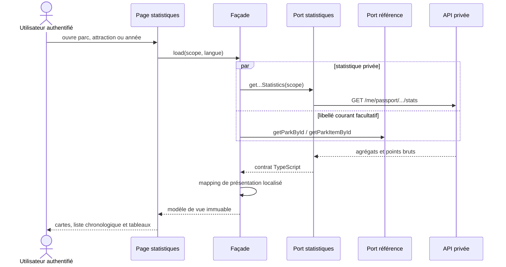

# PASS-14 — Chronologies et tableaux accessibles du passeport

Date : 2026-09-04  
Version : 5.0.16

## Résultat livré

PASS-14 rend consultables les statistiques privées produites par PASS-12 et PASS-13. Trois routes Angular paresseuses et authentifiées couvrent les scopes disponibles :

- `/[lang]/profile/passport/items/{parkItemId}` pour une attraction ;
- `/[lang]/profile/passport/parks/{parkId}` pour un parc ;
- `/[lang]/profile/passport/years/{year}` pour une année.

Le journal d'une visite fournit les points d'entrée contextuels : bilan du parc, bilan de l'année et historique de chaque attraction. Les routes restent dans le layout compte, sont rendues côté client et héritent de la politique `noindex,nofollow` des routes privées.

## Architecture Angular

```text
page privée lazy
  └─ PassportStatisticsStateFacade
       ├─ PASSPORT_STATISTICS_API_PORT
       │    └─ PassportStatisticsApiService
       ├─ PASSPORT_STATISTICS_PARKS_PORT
       │    └─ ParksApiService
       ├─ PASSPORT_STATISTICS_ITEMS_PORT
       │    └─ ParkItemsApiService
       └─ mappers de présentation
            ├─ cartes synthétiques
            ├─ chronologie brute
            └─ lignes et cellules des tableaux
```

La façade orchestre les appels, protège l'écran contre une réponse devenue obsolète après un changement de route, conserve une erreur réessayable et remappe les nombres et dates lors d'un changement de langue sans rappeler l'API. Les services concrets restent derrière des ports d'injection. Le composant de page ne calcule aucune moyenne, médiane, couverture ou tendance.

Les contrats statistiques privés utilisent systématiquement `transferCache: false`. Une recherche facultative du nom courant de la cible améliore le titre ; son échec ne masque jamais des statistiques valides. Les identifiants immuables restent affichés dans les ventilations lorsque le contrat d'agrégation ne fournit aucun libellé de référence, ce qui évite une rafale de requêtes N+1 sur un VPS modeste.

## Données affichées

### Attraction

- passages, visites, première et dernière expérience ;
- nombre et taux de passages notés avec dénominateur ;
- moyenne, médiane, minimum, maximum et écart-type de population ;
- préférence globale actuelle et différence avec la moyenne historique, explicitement séparées ;
- points bruts de la chronologie, chacun relié à sa visite ;
- tendance prudente ou message expliquant le seuil minimal ;
- ventilations accessibles par visite et par année.

### Parc

- visites exactes ou approximatives, premières et dernières visites ;
- passages effectués, attractions distinctes et refaites ;
- couvertures et distributions des notes de parc et de passage ;
- résultats effectués, tentés, manqués ou volontairement ignorés ;
- couverture par catégorie et origine de la référence historique, actuelle ou inconnue ;
- chronologie des notes privées du parc ;
- ventilation annuelle ;
- top global actuel et top historique moyen dans deux tableaux différents.

### Année

- nombre de parcs et de visites, dont dates approximatives ;
- passages, attractions distinctes et refaites ;
- distributions et couvertures des notes ;
- résultats et catégories ;
- ventilation par parc avec navigation vers le bilan correspondant.

## Accessibilité

La chronologie est un véritable `<ol>` et conserve les valeurs brutes même lorsqu'aucune tendance n'est autorisée. Chaque point propose un bouton explicite vers la visite concernée. Les agrégations sont des tableaux HTML avec en-têtes `scope="col"`, libellés de cellule et actions clavier ; aucun résultat n'exige un graphique, un survol ou un geste de balayage.

Les états de chargement, d'erreur et d'absence de données sont distincts. Une erreur réseau conserve le scope et permet une reprise locale. Les huit langues disposent des mêmes clés avec une copie éditoriale naturelle.

## Contrat responsive

- chaque hôte, panneau, grille, carte, tableau et enfant flexible accepte `min-width: 0` et reste borné par `max-width: 100%` ;
- les identifiants et libellés longs utilisent `overflow-wrap: anywhere` ;
- les cartes passent de trois à deux puis une colonne ;
- sous 640 px, chaque ligne de tableau devient une carte verticale portant les libellés de ses colonnes ;
- sous 520 px, l'action d'une chronologie passe sous le contenu et occupe la largeur disponible ;
- sous 360 px, les cellules passent en une colonne ;
- la zone sûre de la navigation mobile fixe est réservée avec `env(safe-area-inset-bottom)` ;
- `overflow-x: clip` sur la page et les tests de styles empêchent qu'un descendant élargisse le viewport.

Le conteneur de tableau garde un défilement horizontal de secours sur les écrans larges intermédiaires, mais le mode mobile en cartes n'en dépend pas.

## Séquence de consultation



## Vérifications de la tranche

- tests du service HTTP et de l'encodage des routes ;
- tests du mapper sur les dénominateurs, les dates partielles, les tops séparés et la représentation numérique de l'enum HTTP ;
- tests de façade sur les trois scopes, les erreurs, le rechargement et le changement de langue ;
- tests sémantiques des tableaux et de la chronologie ;
- contrats responsive dédiés à 900, 640, 620, 520 et 360 px ;
- contrôle des ports de façade et parité i18n sur huit langues.

PASS-14 ne modifie aucune formule métier. Toute valeur statistique provient des endpoints déjà couverts par les fixtures indépendantes de PASS-12 et PASS-13 ; le front applique uniquement l'arrondi de présentation.
