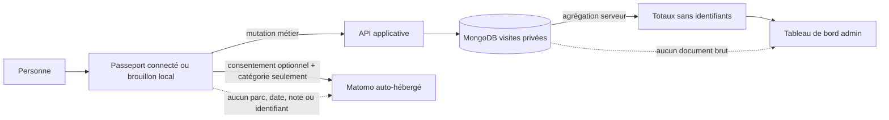

# PASS 19 — Cohorte bêta et mesure du passeport

## Enjeu métier

Le passeport n'est pas validé parce que ses écrans existent. Il doit aider une personne à conserver son vécu puis lui donner envie de revenir spontanément. Le signal principal est donc le nombre de membres qui terminent au moins une deuxième visite.

Cette mesure prépare le suivi `PASS-G`. Elle ne le valide pas seule : des tests qualitatifs doivent encore montrer que les personnes comprennent les notes, préfèrent ce parcours à leur ancien outil et reviennent sans assistance.

> Avenant produit du 5 septembre 2026 : ces tests qualitatifs restent à mener et ne
> seront jamais réputés réussis sans preuves. Leur disponibilité ne bloque cependant
> plus l'implémentation ou le déploiement des roadmaps suivantes.

## Décision

Deux sources complémentaires sont utilisées :

1. MongoDB calcule, pour les comptes connectés, des agrégats fondés sur les visites réellement persistées et terminées. C'est la source de vérité du signal de deuxième visite.
2. Matomo reçoit, uniquement après consentement aux cookies optionnels, des événements produit typés et catégoriels. Ils servent à comprendre où le parcours est utilisé ou abandonné, y compris pour le brouillon local anonyme.

Ni le client ni l'administration ne peuvent transformer ces mesures en liste de personnes ou de visites.

## Flux de données

## Contrat serveur

L'endpoint `GET /admin/passport-beta/metrics` est réservé au rôle `Admin`, sans cache, et accepte une période maximale de 180 jours. La période par défaut couvre les 30 derniers jours.

Il expose uniquement :

- les visites créées et terminées sur la période ;
- le nombre de membres ayant au moins une visite terminée ;
- le nombre de membres ayant au moins deux visites terminées ;
- le taux agrégé de retour ;
- les totaux quotidiens des premières et deuxièmes visites terminées ;
- un signal `NotObserved`, `Emerging` ou `Candidate` qui reste explicitement soumis à validation qualitative.

Les identifiants sont utilisés uniquement à l'intérieur du regroupement MongoDB. Ils sont retirés avant le résultat de l'agrégation et n'appartiennent ni au résultat Application, ni au DTO HTTP.

La requête filtre d'abord les documents utiles à la période ou à la cohorte, effectue une seule lecture agrégée et possède une limite serveur de dix secondes. Deux index dédiés couvrent la création et la cohorte des visites terminées. L'écran admin ne réalise aucun rafraîchissement automatique.

## Événements produit autorisés

| Événement | Propriétés autorisées | Preuve métier |
|---|---|---|
| `passport_opened` | source connectée ou brouillon local | le passeport a été chargé |
| `visit_creation_started` | source, précision jour/mois/année | une saisie valide a été engagée |
| `visit_created` | source, précision jour/mois/année | la visite a réellement été persistée |
| `visit_completed` | source connectée | le serveur a accepté la transition |
| `visit_reopened` | source connectée | le serveur a accepté la réouverture |
| `second_visit_recorded` | brouillon local uniquement | un deuxième brouillon a réellement été persisté sur l'appareil |
| `ride_occurrence_added` | source, quantité regroupée | un ou plusieurs passages ont été persistés |
| `temporal_rating_added` | type parc/attraction uniquement | une note privée temporelle a été persistée |
| `passport_statistics_opened` | portée globale/parc/attraction/année | des statistiques ont été chargées |
| `passport_export_requested` | source et format JSON/CSV | un export a été accepté ou produit localement |
| `passport_deletion_started` | source uniquement | l'aperçu de suppression est disponible |
| `passport_deletion_completed` | source uniquement | la suppression a abouti |

`second_visit_recorded` n'est pas envoyé par le navigateur pour un compte connecté : le tableau de bord le déduit des visites terminées en base, afin d'éviter de confondre un clic avec un retour réel. Pour le parcours anonyme, IndexedDB revendique atomiquement un jalon persistant dès qu'au moins deux brouillons sont effectivement enregistrés. Deux onglets ne peuvent pas revendiquer ce jalon ensemble et une suppression suivie d'une nouvelle création ne le réémet pas ; aucun contenu des brouillons n'est transmis.

## Confidentialité

- Aucun événement Matomo n'accepte d'identifiant, de texte libre, de note ou de date exacte dans son type TypeScript.
- Les événements ne partent pas pendant le rendu serveur, lorsque Matomo est désactivé ou lorsque les cookies optionnels sont refusés.
- L'URL Matomo des pages du passeport, des visites connectées et des brouillons locaux est remplacée par `/{langue}/product/passport`, avec un titre générique.
- Les paramètres de requête et fragments sont retirés de toutes les pages suivies afin d'éviter la fuite d'un jeton ou d'une saisie.
- La politique de confidentialité explique les catégories mesurées et les données expressément exclues dans les huit langues.
- Les brouillons anonymes restent intégralement dans IndexedDB. Leur contenu ne devient jamais un agrégat serveur sans import explicite.

## Interface d'administration

Le tableau de bord présente le signal de retour, quatre indicateurs, une évolution quotidienne et un tableau accessible équivalent au graphique. Il rappelle que le signal quantitatif n'est pas une validation automatique du suivi qualitatif `PASS-G`.

Les grilles passent de quatre à deux puis une colonne. Les champs, cartes et conteneurs ont `min-width: 0` et `max-width: 100%`; seuls le graphique et le tableau possèdent leur propre défilement horizontal contenu. Les contrats couvrent 320, 360, 390 et 768 pixels ainsi que le paysage de faible hauteur.

## Limites et suite

- La cohorte anonyme ne peut pas être rapprochée entre appareils sans créer un identifiant de suivi contraire au choix de confidentialité. Matomo ne donne donc qu'une tendance volontaire pour ce parcours.
- Le seuil technique `Candidate` évite de présenter un cas isolé comme une tendance, mais ne constitue pas une conclusion statistique.
- Les entretiens, scénarios guidés et tests d'accessibilité terrain restent attendus pour conclure le suivi qualitatif `PASS-G`, sans bloquer les implémentations suivantes.
- Les contrôles de charge compatibles avec le VPS restent, eux, une condition technique de chaque livraison concernée.
- Si la requête atteint sa limite de temps ou pèse sur le VPS, le tableau de bord doit rester désactivable et l'agrégat devra être matérialisé par tâche de fond avant élargissement de la bêta.
