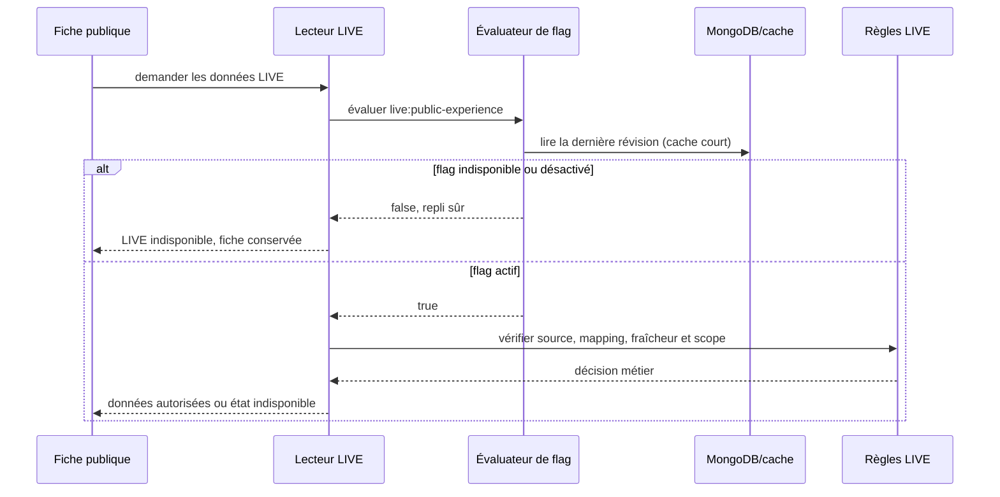

# QUAL-02 — Autorité commune des feature flags

Date : 29 septembre 2026

Version : 5.4.21

Statut : implémenté

## 1. Finalité métier

Le produit dispose désormais d'un tableau électrique commun pour les fonctions
qui doivent pouvoir être ouvertes progressivement ou coupées pendant un incident.
Une coupure ne supprime aucune donnée : elle masque seulement la capacité concernée
et laisse le reste du parcours disponible.

Le premier branchement est `live:public-experience`. Il contrôle les attentes en
direct, leur historique et leur prévision. Une indisponibilité du moteur de flags
fait revenir vers les fiches parc et attraction sans information LIVE ; elle ne
rend jamais une fonction active par erreur.

## 2. Règles d'architecture

- le catalogue versionné dans l'Application décrit la décision produit ;
- l'Application évalue le défaut, les dépendances et le repli sûr ;
- Infrastructure persiste uniquement les révisions opérationnelles MongoDB ;
- WebAPI expose un contrat administrateur audité et un contrat public minimal ;
- les lecteurs LIVE interrogent un port dédié, sans dépendre de MongoDB ;
- l'interface ne reçoit qu'une clé et un booléen, jamais l'auteur, la raison ou
  l'historique d'un changement ;
- un flag complète les autorisations, droits de source et règles métier : il ne
  les remplace pas.

```mermaid
flowchart LR
    Admin[Administrateur] -->|override motivé + révision attendue| API[API admin]
    API --> App[Service Application]
    App --> Catalog[Catalogue versionné]
    App --> Store[(Révisions Mongo)]
    Public[Lecteur LIVE] --> Gate[Port de capacité LIVE]
    Gate --> Eval[Évaluateur commun]
    Eval --> Catalog
    Eval --> Cache[Cache 15 secondes]
    Cache --> Store
    Eval -->|désactivé en cas de panne| Public
    Front[Client public] -->|capacités minimales| Capabilities[/public/capabilities]
    Capabilities --> Eval
```

## 3. Contrat d'un flag

Chaque définition possède :

- une clé stable, une description et un propriétaire ;
- une date de création et une date cible de retrait ;
- un type, une valeur par défaut et une valeur de repli sûr ;
- ses environnements, cohortes et dépendances ;
- les métriques attendues ;
- le comportement de repli et la procédure de nettoyage ;
- l'indication explicite qu'une capacité peut être transmise au client.

Le catalogue refuse au démarrage une dépendance inconnue ou cyclique. Les cohortes
ne sont pas encore utilisées : aucun pseudo A/B test n'est introduit sans volume ni
protocole.

## 4. Évaluation et ordre des autorités

Pour LIVE, l'accès public est autorisé seulement si toutes les autorités répondent
positivement :

1. `live:public-experience` est actif ;
2. la configuration de la source autorise la lecture publique ;
3. les droits, la fraîcheur et le mapping de la source sont valides ;
4. le contrôle opérationnel source/parc/cible autorise la lecture ;
5. les critères propres à l'historique ou à la prévision sont satisfaits.

Le flag n'est donc ni une permission utilisateur ni une règle de qualité des
données. Une activation ne contourne jamais les contrôles existants.



## 5. Persistance MongoDB

Collection : `feature-flag-states`.

Chaque changement ajoute une révision immuable avec :

- `featureFlagId`, `key`, `environment` ;
- `enabledOverride` nullable — `null` rend la main à la valeur versionnée ;
- `revision` et `supersedesRevision` ;
- `changedByUserId`, `reason`, `recordedAtUtc` ;
- les métadonnées techniques communes du document.

Deux index uniques protègent respectivement
`(environment, key, revision)` et `(environment, featureFlagId, revision)`.
L'écriture utilise une révision attendue : deux écrans administrateur ne peuvent
pas s'écraser silencieusement.

La collection et ses index sont créés de façon additive au démarrage. Aucun
backfill ni changement des données métier existantes n'est requis.

## 6. API et sécurité

- `GET /admin/feature-flags` : diagnostic complet réservé aux administrateurs ;
- `PUT /admin/feature-flags/{key}` : ajout d'une révision avec motif obligatoire,
  contrôle optimiste, rate limit et audit administrateur ;
- `GET /public/capabilities` : clés explicitement publiques et état booléen
  uniquement, réponse non stockée par les caches HTTP.

Les contrôleurs administrateur exigent un compte activé, non bloqué et le rôle
Admin. L'API publique ne révèle ni identifiant interne, ni auteur, ni motif, ni
environnement.

## 7. Cache, panne et rollback

- cache mémoire par environnement et clé : 15 secondes ;
- invalidation locale immédiatement après une écriture réussie ;
- convergence des autres instances au plus tard à l'expiration du cache ;
- exception de stockage : valeur de repli sûre embarquée ;
- clé inconnue : désactivée ;
- remise à `null` de l'override : retour au défaut versionné sans effacer
  l'historique.

Pour arrêter LIVE, l'administrateur positionne l'override à `false`. Pour rétablir
le comportement versionné, il crée une nouvelle révision avec un override `null`.
Ces opérations ne purgent ni observations, ni historiques, ni alertes.

## 8. Preuves automatisées

- défaut versionné sans override ;
- override et numéro de révision respectés ;
- panne et clé inconnue fermées par le repli sûr ;
- conflit optimiste retournant la révision courante ;
- lecteur LIVE court-circuité avant toute lecture métier ;
- noms et unicité des index MongoDB ;
- protection, audit, rate limit et contrat public des contrôleurs.

## 9. Dette bornée

`live:public-experience` doit être revu au plus tard le 31 mars 2027. Il sera
supprimé quand la capacité LIVE sera définitivement acceptée, sauf décision
documentée de le conserver comme kill switch opérationnel. Tout nouveau flag doit
être ajouté au catalogue commun ; aucun second moteur local ne doit être créé.
