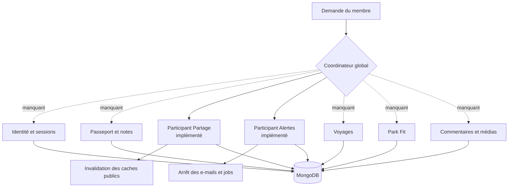

# QUAL-04 — Matrice confidentialité, export et suppression

> Date : 29 septembre 2026  
> Version : 5.4.23  
> Portée : inventaire transverse des données personnelles persistées et garde-fou CI  
> Effet sur MongoDB : aucun changement de schéma, aucune migration et aucune donnée modifiée

## 1. Résultat métier

QUAL-04 établit enfin un contrat commun pour les données personnelles. Il ne crée
pas un faux bouton « supprimer mon compte » : il distingue ce qui fonctionne déjà,
ce qui n'est que partiellement raccordé et ce qui manque réellement.

Le catalogue versionné couvre actuellement :

- 8 surfaces métier ;
- 116 documents MongoDB ou documents imbriqués ;
- 1 105 champs persistés déclarés dans le code ;
- les champs techniques hérités `Id`, `CreatedAt` et `UpdatedAt`, qui suivent la
  politique de rétention et de suppression de leur document ;
- les 12 dimensions exigées par la roadmap pour chaque champ : finalité,
  nécessité, visibilité, base ou consentement, rétention, export, suppression,
  sous-traitant, analytics, chiffrement, accès support et journal.

Le fichier de référence est
[`docs/privacy/personal-data-catalog.json`](../privacy/personal-data-catalog.json).
Chaque champ d'un document recensé hérite de la politique explicite de sa surface.
L'empreinte de la forme persistée empêche l'ajout silencieux d'un champ après la
revue.

## 2. Matrice de couverture actuelle

| Surface | Visibilité par défaut | Export actuel | Suppression actuelle | Écart principal |
| --- | --- | --- | --- | --- |
| Compte et accès | privée | passeport seulement, pas d'export global du compte | sessions et ressources locales, sans orchestration globale | export et suppression transversaux absents |
| Passeport et notes | privée | JSON/CSV canonique, sans identifiants internes | suppression unitaire des visites | purge de compte non coordonnée |
| Partages et comparaisons | désactivée, projection explicite | partages du passeport inclus ; comparaisons partielles | participant idempotent prêt | coordinateur global absent |
| Favoris et alertes | privée | inclus dans l'export du passeport | participant avec fence prêt | coordinateur global absent |
| Voyages | privée aux membres admis | export portable par voyage | suppression par voyage | export et purge de compte non globaux |
| Profils Park Fit | privée | export dédié | suppression dédiée | raccordement global absent |
| Contributions et support | brouillon privé, publication explicite | non regroupé | suppressions locales selon la ressource | contrat de rétention et export transverse incomplets |
| Administration et audit | rôles habilités uniquement | exclusion justifiée ou remise séparée | rétention/anonymisation selon obligation | durées chiffrées à formaliser |

## 3. Fonctionnement réel de la suppression

Le projet possède déjà deux participants solides : Partage et Alertes. Ils savent
couper leurs traitements, purger leurs collections et invalider leurs caches. Le
problème est l'absence du chef d'orchestre qui doit verrouiller le compte puis
appeler **tous** les participants, notamment identité, passeport, notes,
commentaires, voyages, Park Fit, exports et médias.



Les flèches en pointillés sont des responsabilités à construire. Tant qu'elles ne
sont pas toutes raccordées et testées, l'interface ne doit pas présenter une
suppression partielle comme une suppression complète du compte.

## 4. Garde-fou automatisé

Le contrôle `privacy:catalog` est exécuté dans la CI de production avant les tests
Angular. Il :

1. charge le catalogue ;
2. vérifie les 12 dimensions de chaque surface ;
3. lit les propriétés persistées des documents C# ;
4. recalcule une empreinte stable par surface à partir du nom sérialisé BSON, du
   type, de la nullabilité, du caractère requis et des attributs de persistance ;
5. échoue si un document ou un champ a changé sans nouvelle revue ;
6. recherche dans tous les documents MongoDB les marqueurs probables de données
   personnelles (tout suffixe `UserId` ou `UserEmail`, e-mail, IP, jeton, texte
   privé, etc.) ;
7. échoue si un document détecté n'est ni classé ni exclu avec une justification.

Les tests prouvent aussi qu'une dimension supprimée ou une empreinte non revue est
refusée. Une actualisation volontaire se fait après revue humaine avec :

```bash
node tools/privacy/check-personal-data-catalog.mjs --refresh-reviewed-shapes
```

Le changement d'empreinte reste visible dans la PR et doit être accompagné de la
mise à jour de la politique lorsque la finalité ou la visibilité évolue.

## 5. Ce que QUAL-04 ne prétend pas avoir livré

- pas de nouvel écran de confidentialité ;
- pas de nouvel endpoint de suppression de compte ;
- pas de migration MongoDB ;
- pas d'export global unifié ;
- pas de durée légale inventée pour les audits ou demandes de support ;
- pas de modification de la visibilité d'une visite, d'un voyage ou d'un profil ;
- pas de suppression ou de réécriture des données existantes.

Le prochain travail de cycle de vie doit partir de cette matrice : construire un
coordinateur de suppression complet, ajouter un export de compte fédéré et définir
des durées chiffrées validées pour le support et l'audit. Ces travaux doivent rester
des PR dédiées, avec tests de graphe, ordre de purge, idempotence, reprise après
échec et invalidation des caches.

## 6. Exploitation

- aucun déploiement ordonné API/front n'est requis ;
- aucun rollback de données n'est nécessaire ;
- le rollback applicatif consiste à revenir sur le contrôle CI et le catalogue ;
- toute nouvelle collection personnelle doit rejoindre une surface existante ou
  créer une surface avec les 12 dimensions avant fusion ;
- une exclusion de découverte est réservée aux faux positifs démontrés et doit
  rester explicitement justifiée.
